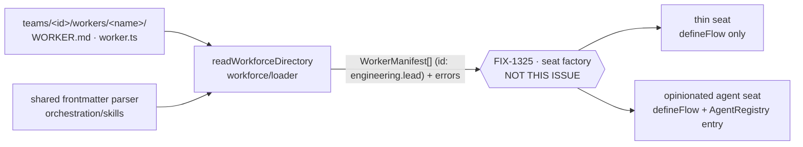

# FIX-1335: Convention loader — scan `teams/<id>/workers/<name>/` into neutral per-worker manifests — Implementation Spec

## Part I — The Case *(for the human)*

### 1. Problem — why it matters, why now

Someone building an app with several collaborating AI workers — an engineering manager, an
API designer, a copy editor — has to wire each one in by hand, in code, one at a time. There
is no place to *put* a worker. Every team that has tried has invented its own folder layout
and its own loading code, and none of them agree.

The stakes are the objective this epic serves: nobody has built a real multi-seat
application on FSD yet, and the first thing everyone hits is that the framework has no
opinion about where a worker lives. The workaround is real but bad — you write the wiring
yourself, and it works, so nothing forces the question. What it costs is that no two apps
look alike, no worker can be moved between them, and the layout we eventually want has
no head start.

**Why now:** the file shape was locked this week (the Workforce atlas, merged 2026-09-08).
The shape is decided; nothing reads it.

### 2. Solution in plain terms

Put workers in folders. One folder per worker, grouped under the team it belongs to. Each
folder holds one Markdown file that says who the worker is: a few settings at the top
(which model, which tools) and the worker's instructions as the body. Point the app at the
root of that tree at startup and it comes back with **one plain record per worker** —
everything the folder said, read but not acted on.

**That is where this issue stops.** Turning a record into a running seat — a flow for every
worker, and an entry in the agent registry only for the opinionated ones — is the seat
factory's job (FIX-1325). The split is not bookkeeping. A workforce has thin seats in it: an
intake worker, a coordinator. Those are workers, but they are not *agents*, and a loader that
handed back agents could not describe them at all. So the loader answers one question — *what
seats exist, and what did each one declare?* — and answers it the same way for every seat,
thin or opinionated.

**Philosophy** — tenet 2 (composition over features): the loader adds no runtime concept, it
reads files and returns data. Tenet 3 (earn every addition): one new function, and it copies
an established reader rather than inventing a second convention for the same job. Tenet 5
(one convergence point): a worker's identity is minted in exactly one place, so every later
reference to it can never disagree.

### 6. Decisions & rules — the sign-off surface

1. **A worker is a folder with a `WORKER.md` in it: settings at the top, the worker's
   instructions as the body. Where the seat's shape is custom code instead, that door is
   `worker.ts` — the loader records it and does not import it.**
   *Rejected:* a TypeScript file per worker that the loader imports. It reads as tidier and
   it is strictly worse — importing code at startup is the hand-wiring we are replacing,
   just moved to a different line, and it puts every worker behind a build step.
   *Locks in:* the worker file is a document, not code, so a non-engineer can write and
   edit one — which is the whole reason to have a convention. The cost is that a worker
   can only be described by things that can be named in text (a model name, a tool name);
   anything that needs real code stays in the app, behind the `worker.ts` door.
   **`WORKER.md`, not `AGENT.md`:** seat = roster slot, worker = any flow on the one
   contract (thin intake and coordinator seats included), agent = the opinionated case. A
   Markdown document has the same breadth as the `.ts` door, so naming it for the narrow
   case would teach that every worker is an agent. **This also corrects the issue as
   written:** there is no "persona registry" in the framework to populate. A worker's
   instructions are the file body, and nothing in this issue turns them into a persona.

   **This supersedes a proposal; it does not contradict a lock.** The Atlas's five
   per-worker files — `role.md` / `personality.md` / `tools.md` / `skills/` / `resources/`
   (`docs/atlas/workforce.html:845-849`) — carry the tag **`FACTORY INPUTS · PROPOSED`**
   (`:850`) and are the argument names of `createWorkerFlow`, itself marked *"PROPOSED V1 —
   thin factory helper. Not an export on main"* (`:803`). None of it shipped, and the scan
   that would read it is still a named gap (*"NO LOADER ON MAIN"*, `:874`). The seat row
   itself is singular — *"THE SEAT. ADD A FILE TO ADD A SEAT."* One document per seat is
   this epic's call over that proposal (epic
   [#1664](https://github.com/fixpoint-labs/flow-state-dev/pull/1664) theme 1), which is why
   the Atlas owes an update before the epic wraps — an obligation the epic carries, not a
   conflict this spec creates.

2. **A worker's identity is its team and its name joined by a dot — `engineering.lead`,
   not `lead`, and not `engineering/lead`.**
   *Rejected:* bare names, with a startup error if two teams collide. *Also rejected, on
   run evidence:* `/` as the joiner.
   *Locks in:* two things, for two different reasons.

   **Team-qualified, so names don't have to be coordinated org-wide.** Every team can have
   a "lead" and a "reviewer" without checking what other teams called theirs. The bill for
   bare names arrives late and lands on the wrong person: adding a *second* team would
   break the *first* team's startup, and the fix would be renaming workers that were fine.

   **Joined by `.`, because a `/` in an identity is not addressable.** This is substrate,
   not taste. FIX-1325's POC
   (`spec-poc/FIX-1325-seat-addressing/NOTES.md`, on the `spec/FIX-1325` branch — run it
   with `./node_modules/.bin/tsx spec-poc/FIX-1325-seat-addressing/run.mts`) ran a slashed
   id down the real path:

   - `defineFlow` factory, id with a `/` → **ACCEPTED**, `id=engineering/lead`
   - `registry.register`, then `registry.get("engineering/lead")` → **ADMITTED**, then
     **RESOLVED**
   - `POST …/engineering/lead/sessions` (two path segments) → **404** `Route not found`
   - `POST …/<the same id as one escaped segment>` → **404** `Route not found`
   - `POST …/engineering.lead/sessions` → **201 created**

   `parseFlowRoute` rejoins the incoming path segments into one pathname before matching,
   so an escaped `/` is indistinguishable from a real separator by the time matching
   happens — the two 404s are the same string failing the same way. Confirmed independently
   by reading the code: `packages/engine/src/routes/parseFlowRoute.ts` matches the rejoined
   pathname, and `defineFlow`'s `resolveInstanceId` has no character restriction that would
   have refused the mint.

   **The failure shape is why this is decided rather than weighed.** Legs 1 and 2 are the
   dangerous half: the id mints, the registry admits it, and nothing complains at boot. It
   breaks the first time anybody tries to talk to the seat. That is invisible drift
   arriving through the front door — the exact collapse epic
   [#1664](https://github.com/fixpoint-labs/flow-state-dev/pull/1664) theme 3 exists to
   prevent.

   *Cost:* this identity is the string anything referring to a worker has to use — an
   `agent-ref` value, a flow instance id, a board key. Changing its shape after adoption
   breaks every reference in every app that took it up, which is the reason it is being
   settled now, on evidence, rather than after.

   **The disk layout does not change.** Worker folders stay
   `teams/<teamId>/workers/<workerName>/`, slashes and all — that is a filesystem path,
   which the filesystem addresses perfectly well. Only the *minted identity string* is
   joined with a dot. Nothing in this decision renames a folder.

3. **The loader reads what a worker folder declared and interprets none of it. Producing
   an `Agent`, a flow, or a registry entry is out of scope — that is the seat factory's
   job.**
   *Rejected:* returning `Agent[]` ready for `createAgentRegistry`, which is what an
   earlier draft of this spec did.
   *Locks in:* the lock reads *"defineFlow EVERY SEAT · AgentRegistry ONLY IF AGENT"*
   (`docs/atlas/workforce.html:876-877`), with the figcaption at `:886`: *"A scan that
   feeds `defineFlow` from this tree is a named gap. It adds a registry entry only when
   that seat is an opinionated agent."* An `Agent`-shaped return cannot express a thin
   seat, so it would quietly teach that every scanned worker is an agent — the exact
   collapse epic [#1664](https://github.com/fixpoint-labs/flow-state-dev/pull/1664)
   theme 3 exists to prevent. The cost is that this issue ships nothing runnable on its
   own: until FIX-1325 lands, the manifests have no consumer but a test.

4. **Only worker slots are loaded, and a slot that cannot produce a manifest is reported
   by name.** A directory directly under `teams/<id>/workers/` with neither `WORKER.md`
   nor `worker.ts` lands in `errors`. Everything outside `teams/*/workers/*` — a team's
   `resources/` / `skills/` / `tools/` siblings, an org-level shared `workers/`, anything
   else on the locked tree — is passed over silently.
   *Rejected:* reporting every unloaded directory on the tree.
   *Locks in:* silence *inside* `workers/` is the failure mode a convention cannot recover
   from — an author adds a seat, mistypes the filename, and the app boots one worker short
   with nothing said. Outside `workers/`, the same report is noise about folders this
   issue never claimed and a later one (FIX-1310) will. The cost is one asymmetry an
   implementer has to hold: the rule is *the path occupies a worker slot*, not *the path
   looks like a worker*.

**Non-goals** — **materializing an `Agent`, constructing a flow, or building a registry**
(the seat factory, FIX-1325); importing or executing `worker.ts`; a `.json` / `.yaml` seat
format (fenced out — flow kind and instance params are create-time config bound by
FIX-1325, not a second loader format; a follow-up after the spine lands); resolving tool or
capability names against a catalog (FIX-1327); team addressability and board scoping
(FIX-1310); registering a worker at runtime, after startup (ruled out at epic level,
theme 4).

**Size:** Small–Medium — 4 production files · 10 test behaviours · 2 doc surfaces ·
1 changeset · 1 PR.

---

### 3. Tradeoffs & alternatives

**Alternative: the loader builds and returns the registry itself.** One call, nothing for
the author to wire. Rejected twice over. It makes the loader the only way in — the registry
is also fed by hand-written definitions today, and a loader that owns construction quietly
turns the TypeScript path into a second-class one, against theme 1 ("files and hand-written
definitions produce the same entries"). And it cannot represent a thin seat at all, per
decision 3. The Atlas says the same thing in its own words: *"DO NOT INVENT
`loadWorkforce()`"* (`workforce.html:874`).

**The simpler approach: no file format at all — a folder per worker whose whole contents
are the instructions.** Genuinely tempting; it removes the settings block and everything
that can go wrong parsing it. Insufficient because a worker that cannot say which model it
runs on or which tools it may call is not a worker, it is a prompt — and the app would be
back to declaring those in code, which is the wiring we are removing.

**Where the complexity is:** not the walk, and — since the rewrite — not the settings keys
either. Interpreting nothing dissolved that problem: there is no recognised-key list, so
there is no unrecognised key to drop. What is left is the near-miss rule in decision 4,
which is the one place the loader has to make a judgement about a path it is not loading.

### 4. Focus practices (1–5)

1. **BP-030 (tolerate the shape you don't own yet) — satisfied structurally, not by a
   rule.** The manifest carries the frontmatter exactly as written, uninterpreted, so a key
   FIX-1325 adds tomorrow arrives at the factory today with nothing to change here. The
   earlier draft made this a preservation rule over a known-key list; interpreting nothing
   removes the list and the rule with it.
2. **One convergence point for a worker's identity (tenet 5)** — team and name are joined
   in exactly one helper, and the record carries only the joined result. Two places that
   build the same id is how a registry key and a future reference to it drift apart with
   nothing failing — and a `teamId` or `name` sitting beside the id is that same second
   place, one the type itself would hand to every consumer (§7).
3. **No second frontmatter dialect (CLAUDE.md → §6, surface conflicts).** `SKILL.md` and
   `WORKER.md` are the two convention files an author writes by hand. They must accept the
   same frontmatter or learning one teaches the wrong thing about the other. Share the
   `SKILL.md` parser; do not reach for a different one (§7).
4. **Report what you skipped, inside the slot only (decision 4, epic theme 3).** Honesty
   about a seat that did not load; silence about paths this issue never claimed.
5. **BP-022 (changeset).** `@flow-state-dev/workforce` is a published `0.1.0` package with
   `publishConfig.access: public`. A new subpath export is a release-note-worthy addition
   (§11).

### 5. What using it looks like (1–5 examples)

**The tree an author writes** *(what this spec proposes; nothing reads this layout today)*:

```
workforce/
  teams/
    engineering/
      workers/
        lead/WORKER.md
        api-designer/WORKER.md
        intake/WORKER.md          # a thin seat — same file, no persona claim
    marketing/
      workers/
        lead/WORKER.md
```

**One worker file:**

```md
---
description: Holds the engineering board and breaks work into tasks.
model: openai/gpt-5.4-mini
allowed-tools: [board, search]
---

You are the engineering lead. You do not write code yourself — you break
the request into tasks, assign them, and report what came back.
```

**Reading the tree at startup** *(the whole change at the call site)*:

```ts
import { readWorkforceDirectory } from "@flow-state-dev/workforce/loader";

const { workers, errors } = await readWorkforceDirectory("./workforce");
for (const { path, error } of errors) console.warn(`[workforce] ${path}:`, error.message);

// workers[0].id        === "engineering.lead"   // folder is teams/engineering/workers/lead/
// workers[0].declared  === { description: "...", model: "openai/gpt-5.4-mini",
//                            "allowed-tools": ["board", "search"] }
// workers[0].body      === "You are the engineering lead. …"
```

**What happens next — deliberately not here.** FIX-1325 takes that array and gives every
worker a flow; the ones that declare a persona also get a registry entry:

```ts
// FIX-1325, not this issue:
// const seats = await hireWorkforce(workers);                   // defineFlow for each
// const agentRegistry = createAgentRegistry(seats.opinionated); // only these
```

**Referring to a worker from a skill** *(before / after)*:

```
before  agent-ref: eng-manager        — the name a hand-written defineAgent chose
after   agent-ref: engineering.lead   — the name its folder gives it
```

The folder is still `teams/engineering/workers/lead/`. The *path* keeps its slashes; the
*identity minted from it* joins with a dot, because that is the form that stays addressable
over HTTP (decision 2).

---

## Part II — The Build Plan *(for the implementing agent)*

### 7. Technical design

The loader is a Node-only directory walk that produces plain data. It talks to nothing at
runtime: it reads files, validates their shape, and returns. It constructs no `Agent`, no
flow, and no registry — every downstream concept stays FIX-1325's.



**The manifest.** One record per worker, carrying what the folder said and nothing
restated from what the folder is called:

```ts
export interface WorkerManifest {
  /**
   * Team-qualified identity, "<teamId>.<name>" — e.g. "engineering.lead".
   * Dot-joined, not slash-joined: a "/" here is unroutable (decision 2).
   * Minted once, in one helper — and the record's only identity field.
   */
  id: string;
  /** Frontmatter exactly as written: kebab-case keys, values uninterpreted. */
  declared: Record<string, unknown>;
  /** Markdown body verbatim, frontmatter removed. */
  body: string;
  /** Present when the folder holds a `worker.ts`. Recorded, never imported. */
  codePath?: string;
}
```

**Four fields, and the three that are not there.** The record carried `teamId`, `name` and
`dir` until FIX-1325 settled the shared type (its §6 decision 7,
[#1676](https://github.com/fixpoint-labs/flow-state-dev/pull/1676)). All three are gone, for
one reason stated twice.

*`teamId` and `name`:* the segment allowlist below is `/^[a-z0-9]+(?:-[a-z0-9]+)*$/`, which
excludes the `.` this id joins on — so `id` splits back into team and name unambiguously.
That makes the two fields **provably derived**, and derived data on a record is a drift
surface with no rule for which side wins when they disagree. It bites hardest on a
hand-built roster, which FIX-1325 treats as a first-class input: two more fields an app keeps
consistent by hand, with nothing checking it. Nothing reads them — the factory uses
`manifest.id` verbatim and declines to re-derive an address from it (§12).
**The escape hatch, recorded as the answer rather than built:** if a consumer ever genuinely
needs the segments, that is **one exported `parseWorkerId`** beside the minting helper — not
two fields back on the record. Nothing calls it today, so it is not in this issue.

*`dir`:* dropped, and the interesting part is that its old justification was false. It read
*"FIX-1325 resolves relative refs against it"*; that factory opens no files at all (§7 of
[#1676](https://github.com/fixpoint-labs/flow-state-dev/pull/1676) makes it a pure
synchronous map). Re-asked from **this** loader's own side, it earns nothing either: every
path this loader reports travels on `errors[].path`, built during the walk, and a manifest
exists only for a worker that already loaded — so no error key, no near-miss path and no §9
row ever reads a manifest's folder. And it is derivable by the same split that removed the
other two: `<root>/teams/<teamId>/workers/<name>/`, from an id that splits cleanly and the
root the caller passed in. A field that is both unused here and derived there is the drift
surface again, and on a hand-built roster it is a folder that need not exist.

*Why `codePath` is not the same case, and stays.* It is not derived from `id` — it records
something only the walk could know, whether that folder holds a `worker.ts`. An observation,
not a restatement. That is the line between the two, and §9's two `worker.ts` rows consume
it.

`readWorkforceDirectory(root)` returns `{ workers: WorkerManifest[]; errors: Array<{ path:
string; error: Error }> }`. Errors are keyed by the worker **path** — the slash-separated
`teams/engineering/workers/intake` on disk, deliberately not the dot-joined identity — rather
than a bare name, because a near-miss may have no valid identity to report under. That is the
whole reason the error key is a path: a folder that fails the segment rules has no `id` to be
reported as.

**Interpreting nothing is the point.** The loader does not know that `model` means a model or
that `allowed-tools` means tools. It checks that a `WORKER.md` has parseable frontmatter with
a `description` — the one field that makes a seat legible to a human reading the roster — and
hands the rest over untouched. This is what makes the manifest *neutral*, and it is why
FIX-1325 can add `flow-kind` or instance params without a format change or a second door.

**Package layout.**

- **`@flow-state-dev/orchestration`** — `splitFrontmatter` and `parseFrontmatterYaml` (with
  their scalar/mapping helpers) are private inside `skills/skill-md.ts` today. Move them to
  their own module and export it from the skills index. Pure move; `parseSkillMd` keeps its
  behaviour and its tests.
  *Why orchestration and not core* (Cursor raised this): core already has a frontmatter path
  — `gray-matter`, behind `parseRoleTaggedMarkdown` and the prompt-file loader. Using it here
  would give `WORKER.md` full YAML while `SKILL.md` keeps its deliberate subset, so
  frontmatter an author learned to write in one file would be rejected by the other. The goal
  is not one parser in the repo; it is **one dialect across the two convention files an author
  writes by hand**, and that dialect lives in orchestration. Core's gray-matter path serves a
  different job and stays as it is.
- **`@flow-state-dev/workforce`** — gains a **`./loader` subpath export** carrying the walk,
  the `WORKER.md` reader, and the identity helper. `WorkerManifest` itself is **not** in that
  subpath: the type lands alone in `packages/workforce/src/manifest.ts`, a node-free module
  exported from the workforce **root** as well as re-exported from `./loader`, so FIX-1325 —
  which opens no files — imports the shared type without being pulled onto Node. One
  declaration, one name, both issues (§12). The root export stays free of `node:fs`,
  so a consumer that only wants `defineAgent` is not pulled onto Node. (The skills reader
  ships from orchestration's *root* export; that is the pattern we are deliberately not
  copying — core/engine split node-only code at a boundary and that is the more established
  rule. CLAUDE.md → §6: surface the conflict rather than average it.)
- **Untouched:** `createAgentRegistry`, `materializeAgent`, `defineAgent`, `definePersona`,
  the core `Agent` type, and every existing caller. This issue adds no import of any of them.

**The walk: copy it, do not extract it.** The implementer will otherwise have to choose
mid-PR. The two walks look similar and are not: `readSkillsDirectory` is a single-level scan
(`<root>/<name>/SKILL.md`) that also bundles every file under the folder into `SkillFile[]`;
this one is two levels (`teams/<id>/workers/<name>/`), single-file, and carries decision 4's
near-miss rule, which the skills reader has no equivalent of. A shared walker would need a
depth parameter, a file-bundling toggle, and a near-miss classifier hook — an interface about
as complex as the two implementations combined, for two dissimilar callers. Share the parser,
where the shapes are genuinely identical; copy the ~40 lines of symlink-safe directory
iteration. If a third caller appears, that is when the seam is real.

**Identity and segment naming — the rules, stated.** The folder
`teams/<teamId>/workers/<workerName>/` yields `id = "<teamId>.<workerName>"`, minted by one
internal helper. The path keeps its slashes; the identity joins with a dot. Both segments
must be:

- lowercase letters and digits, separated by single hyphens — `/^[a-z0-9]+(?:-[a-z0-9]+)*$/`
- at most 64 characters
- not `_meta`

**`.` is the joiner and is therefore not legal inside a segment.** The regex above already
excludes it — it is an allowlist of `[a-z0-9]` and single hyphens, so a dot never matched and
no rule has to be added. But it was written when the joiner was `/`, where the exclusion was
incidental; now it is load-bearing, so it is stated rather than left to be inferred. A folder
named `a.b` stays illegal, and it stays illegal *for a new reason*: with a dot joiner, an id
built from a dotted segment could not be split back into team and name unambiguously —
`a.b.lead` would be readable as either team `a.b` / worker `lead` or team `a` / worker
`b.lead`. **Whoever implements the validator must not relax the segment regex to admit `.`,
and must not "helpfully" accept a dotted folder name.** The rule and the joiner are one
decision.

These are the skill-name rules, **adopted deliberately rather than by reference** (Cursor
raised this). The reason is the identity's blast radius: the minted `team.name` becomes an
`agent-ref` value, a flow instance id, and a board key, while each *segment* is separately a
path segment on disk. Lowercase-hyphen is the one shape safe in all of those, and it is the
shape an author already learned from `SKILL.md`. The cost is real and worth naming: no
underscores, no capitals, no non-ASCII team names — `Platform_Eng` is rejected at startup
with the rule in the message. Implement it as the loader's own validator with worker-worded
errors rather than calling `validateSkillName`, whose messages say "Skill name".

Duplicate identities cannot occur on one filesystem. Across two roots merged by a caller,
uniqueness is the caller's to enforce — the loader takes one root and asserts nothing about
another.

*No solution sketch.* The parse-and-walk shape is close enough to
`packages/orchestration/src/skills/read-directory.ts` that pointing at it says more than
re-drawing it; the parts that differ are specified above.

### 8. Implementation sequence

Three steps. An earlier draft had six; identity minting and `WORKER.md` parsing are single
helpers used only by the walk, and giving each its own step was ceremony (Cursor's call,
taken).

1. **Extract the frontmatter parser** in orchestration — `splitFrontmatter`,
   `parseFrontmatterYaml` and their scalar/mapping helpers out of `skill-md.ts` into their
   own module, exported from the skills index. Pure move, no behaviour change.
   *Test:* the existing `skill-md` suite stays green, unmodified. *Depends on:* nothing.
2. **The loader module** in `packages/workforce/src/loader/` — `WORKER.md` read, identity
   minting with the §7 segment rules, the two-level symlink-safe walk, and decision 4's
   near-miss reporting. One module, its own file, everything internal except
   `readWorkforceDirectory` and `WorkerManifest`. *Test:* every §10 behaviour.
   *Depends on:* 1.
3. **Ship it** — the `./loader` subpath in `package.json` `exports` *and* `publishConfig`,
   the goal fixture tree, the changeset, the docs. *Test:* the §10 goal.
   *Depends on:* 2.

*No removals.* Nothing on `main` does this job today, so there is nothing this subtracts —
the subtraction in this change is the parser that does **not** get written twice (step 1).

### 9. Edge cases & error handling

**The one rule behind the table:** a path is reported only when it **occupies a worker slot**
— a directory directly under `teams/<id>/workers/` — and cannot produce a manifest. A path
outside `teams/*/workers/*` is never reported, however worker-shaped it looks. Layout
placeholders are not mistakes.

| Case | Expected |
|---|---|
| `teams/` absent under the root | Empty result, no error — an app may have no file-defined workers |
| Root path unreadable | Throw. A configured root that does not exist is a wiring mistake, not a per-worker one (matches the skills reader) |
| Worker folder with neither `WORKER.md` nor `worker.ts` | Reported in `errors` by path; the rest still load |
| Worker folder with `worker.ts` only | A valid seat. `declared` empty, `body` empty, `codePath` set. Not an error — this is theme 1's second door |
| Worker folder with both | `WORKER.md` supplies `declared` / `body`; `codePath` also set |
| `WORKER.md` with no frontmatter, or no `description` | Reported in `errors`; the file is unusable, not partially usable |
| Team or worker segment breaking the §7 name rules | Reported in `errors`, with the rule in the message — the identity would be unaddressable |
| Team or worker folder name containing a `.` (e.g. `teams/a.b/workers/lead/`) | Reported in `errors` like any other segment-rule break. `.` is the identity joiner, so a dotted segment would make the minted id impossible to split back into team and name (§7) |
| Symlinked team or worker folder | Refused and reported, exactly as the skills reader refuses one |
| Frontmatter key the loader has never heard of | Carried on `declared` verbatim. There is no known-key list, so this is not a case so much as the default |
| A team's `resources/` / `skills/` / `tools/`, an org-level `workers/`, any other tree path | Passed over silently — outside a worker slot |
| A file, not a directory, under `workers/` | Skipped quietly |
| `allowed-tools` naming a tool no catalog has | Not this loader's call, and not resolvable here — the loader has no catalog. Resolution and its current dishonesty are FIX-1327's |

**On the `.` in an identity — checked, not assumed.** A skill's `agents:` map restricts the
*assignee key* to `/^[a-zA-Z0-9][a-zA-Z0-9_-]*$/`. It does **not** restrict the `agent-ref`
*value*, which is the identity this loader mints (`skill-md.ts` applies `isValidAgentKey` to
the key only, in `parseAgentsField`). So `analyzer: { agent-ref: engineering.lead }` is legal
today with no change to that parser.

*(The earlier version of this note made the same check for a slash-joined
`engineering/lead`. That claim was correct about the `agents:` parser and beside the point:
the identity passed that parser and then 404'd on every HTTP flow route. See decision 2 —
clearing one consumer is not the same as being addressable.)*

**Taxonomy:** every per-worker problem is non-fatal and collected, so one bad folder never
costs an app its other workers. The single fatal path is an unreadable root.

### 10. Testing strategy

**Goal — kept, and model-free.** A loader has an observable outcome, so a goal on the real
path applies; it needs no live model, because a model would exercise materialization and
provider wiring, which is FIX-1325's surface, not this one. The goal: a realistic `teams/`
tree on disk — two teams, a same-named worker in each, one thin seat, one near-miss —
produces the exact manifest set an app would boot with, from files alone, with no
programmatic registration anywhere in the path. Each worker's body carries a held-out marker
that only that folder could have supplied, so the goal cannot pass on a default.
`goals/workforce-conventions/files-alone-produce-the-roster/`, no model.

*(Cursor proposed dropping to vitest-only. Rejected: the vitest suite proves the function,
the goal proves the convention — that a tree an author actually writes yields the roster,
end to end. That is the objective's claim, and it is the one thing a unit test over a
hand-built fixture cannot state.)*

**CI specs** (behaviours, not test names):

- one behaviour per §6 decision, in observable terms — a folder produces a manifest; two
  teams' same-named workers both load and are distinct; a `worker.ts`-only folder is a valid
  seat, not an error; a worker slot with nothing in it is named in `errors`
- **the minted id is dot-joined, and contains no `/`.** `teams/engineering/workers/lead/`
  yields exactly `"engineering.lead"`. Assert the literal string *and* assert that no
  manifest `id` contains a `/` — the second one is the regression guard, because the failure
  this closes was a slashed id passing registration and only breaking at the HTTP boundary
  (decision 2). A folder whose name contains a `.` is rejected, so the split back to team and
  name is unambiguous. **The manifest carries that id and no second spelling of it** — assert
  the record's key set, because `teamId` / `name` / `dir` are exactly the fields a helpful
  implementer adds back (§7)
- **nothing returns an `Agent`.** The loader module imports neither `createAgentRegistry` nor
  the core `Agent` type, and `WorkerManifest` has no field that is one. This is the defect
  the rewrite exists to close, so it gets its own assertion rather than living in prose
- **the second path (BP-035):** every error case in §9 exercised alongside a *good* worker in
  the same tree, proving the good one still loads. A suite that tests failures on their own
  proves nothing about isolation
- **the near-miss asymmetry:** a tree carrying the full locked layout — `resources/`,
  `skills/`, `tools/` siblings and an org-level `workers/` — produces zero errors, while an
  empty folder under `teams/<id>/workers/` produces exactly one
- **what must not change:** `parseSkillMd` behaves identically after step 1 — the existing
  skills suite runs unmodified
- **the one easy to state wrongly:** a frontmatter key with no meaning to anything today must
  be *retrievable from the manifest* — `manifest.declared["flow-kind"]` — not merely "does not
  throw". A parser that silently discards it also does not throw. **The manifest is the
  assertion target** (Cursor asked where it was); there is no serializer in this issue and no
  round trip to write one for

**Discipline:** `tdd`. The seam is `readWorkforceDirectory` itself — it takes a path and
returns data, so every behaviour above is a vitest spec over a fixture tree with no flow, no
engine, and no model.

### 11. Documentation plan

- **NEW PAGE** `apps/docs/docs/orchestration/workers-on-disk.md` (`sidebar_label: Workers on
  disk`), placed directly after **Agents**. Covers the folder layout, the `WORKER.md` shape,
  the two doors, the identity and segment-naming rules, and the reading call. One example:
  the §5 startup snippet.
  *Why a new page rather than a section under Agents* — an earlier draft put it there, when
  the loader returned agents. It no longer does, and a manifest reader documented under
  "Agents" would teach the reader that a scanned worker is an agent, which is the collapse
  decision 3 exists to prevent. Cross-links: → `docs/skills/overview.md` (the same folder
  convention for skills), ← Agents' *Current limits* bullet about static registration, which
  now has a partial file answer; update that bullet in the same pass to say the roster can
  come from files while the wiring is still by hand.
  *Voice risks:* "seamless" and "just works" both suit this topic; neither is allowed. Say
  plainly that this reads the tree and stops there. No internal issue IDs on the page.
- **EXTEND** `packages/workforce/README.md` — the loader in the API table plus a short
  section naming the `./loader` subpath, the manifest fields, and the boundary (no registry).
- **CHANGESET — required.** `@flow-state-dev/workforce` is version `0.1.0` with
  `publishConfig.access: public` and no `private` field, so a new subpath is an additive
  public API change on a published package (BP-022). `minor`, not `patch`: it adds a surface
  rather than fixing one. One user-facing sentence, e.g. *"New
  `@flow-state-dev/workforce/loader` subpath: `readWorkforceDirectory(root)` scans
  `teams/<id>/workers/<name>/` and returns one neutral manifest per worker, so a workforce
  can be declared in files instead of wired by hand (FIX-1335)."* The earlier draft's "no
  changeset, `0.0.0` package with no external consumer" was factually wrong.

### 12. Dependencies, open questions & follow-ups

**Dependencies: none, and the ordering hazard is gone.** Epic
[#1664](https://github.com/fixpoint-labs/flow-state-dev/pull/1664) theme 4 dissolved the
"loader must land against a settled factory contract" sequencing: **a manifest walker depends
on no seat contract at all.** It commits to nothing about flows, seats, agents or registries
— it reads files and returns what they said. There is therefore nothing in FIX-1325 for it to
be wrong about, and the two may land in either order or in parallel. (Carrying unknown keys
verbatim helps the *format* stay open, but it is not the reason the dependency is gone; the
reason is that this issue never touches the contract.) The seam between the two issues
survives — only the ordering it implied is gone.

**One thing does cross the seam, and it is not a dependency: the joiner.** Decision 2's dot
was settled by FIX-1325's POC (`spec-poc/FIX-1325-seat-addressing/`), because FIX-1325 is
where the identity meets a router and the question could be answered by running it. That is
evidence flowing between issues, not a contract: this loader mints a string, and it now mints
the string that survives the substrate. There is nothing to wait for — the POC has already
run, and its verdict is folded into decision 2 above. **What it does create is an obligation
in the other direction:** FIX-1325 must use this id as-is and must not translate it at hire
time. A factory that mints `engineering.lead` here and re-derives some other address there is
the dual-name fork decision 2 exists to close, and it would be a tenet-5 break in FIX-1325,
not here.

**A second thing crosses the seam, and it is a declaration rather than evidence: the
manifest type itself.** `WorkerManifest` is declared **once**, in
`packages/workforce/src/manifest.ts`, and both issues import that one name. There is no
`SeatManifest` — FIX-1325 used that spelling for the same record and dropped it (its decision
7), because an alias is the second name the decision exists to remove. Its field list is
settled there and mirrored in §7 here; the two specs agree on the shape rather than each
declaring one. **Whichever issue lands second imports the module the first one created** — a
pure import, not a rename, and no re-declaration in either direction. The ordering freedom
above is unaffected: agreeing on a type is not depending on a contract.

**Open questions:** none.

**Follow-ups (flagged, not built):**

- **A `.json` / `.yaml` seat file.** Raised on the spec PR and fenced out: flow kind and
  instance params are create-time config bound by FIX-1325, not a second loader format. Two
  doors, one contract. Revisit after the spine lands.
- **Deepening:** `readSkillsDirectory` ships from orchestration's *root* export while
  importing `node:fs`, which makes the whole package Node-only for anyone importing
  `createSkillsLibrary`. This spec does not copy that; moving the skills reader behind a
  subpath is a separate, breaking-ish change. Follow up via `improve-codebase-architecture`.
- **Later consumers:** the seat factory that turns these manifests into flows and, where the
  seat is opinionated, registry entries (FIX-1325); team-level knowledge folders and
  org-level shared workers (FIX-1310).

### 13. Implementer notes *(review feedback recorded, not folded)*

- **Cursor, on the `./loader` subpath choice:** flagged approval, no change asked. Recorded
  so it is not re-litigated as an inconsistency with `readSkillsDirectory` — §7 says why.
- **Cursor, on a `serializeWorkerMd`:** not written. There is no writer in this issue, so
  nothing needs to round-trip; the manifest is the assertion target (§10).

## Spec evolution

- **Spec drafted** — framed as "workers have nowhere to live"; chose a document-per-worker
  folder read by a copy of the established skills-directory reader over a code-per-worker
  import; team-qualified identities so a second team cannot break the first; scope held to
  worker folders with everything else named-and-skipped. Corrected the issue's premise that
  a persona registry exists to populate.
- **Rewritten — loader output is a neutral manifest, not an `Agent`.** Three reviewers hit
  the same defect: the draft returned `Agent[]` into `createAgentRegistry`, which cannot
  express a thin seat and teaches that every scanned worker is an agent. The lock says
  otherwise (`docs/atlas/workforce.html:876-877`, figcaption `:886`), and epic
  [#1664](https://github.com/fixpoint-labs/flow-state-dev/pull/1664) theme 2 now draws the
  line: FIX-1335 stops at manifests, FIX-1325 owns the flow per seat and the conditional
  registry entry. Title, §1–§2, §5, §6 decision 3, §7 and the mermaid all moved. Interpreting
  nothing simplified BP-030 from a preservation rule into a property of the return type.
- **Same pass, from review:** `WORKER.md` confirmed over `AGENT.md` and `.json`/`.yaml`
  fenced out (Architect); the Atlas five-file split named as superseding a **proposal**
  (`FACTORY INPUTS · PROPOSED`, `:850`; `createWorkerFlow` marked *"PROPOSED V1 … Not an
  export on main"*, `:803`), not a lock; near-miss reporting narrowed to worker slots, which
  reconciles the Architect's ruling with Cursor's defer-atlas-skips note; segment-naming
  rules stated instead of referenced; walker strategy chosen (copy, with the reason); parser
  location justified; steps 2–4 collapsed; the goal kept but made model-free; and the
  changeset corrected from "not required" to required, `minor`.
- **Correction after approval — decision 2's joiner changed from `/` to `.`.** This
  **supersedes a decision the owner had already approved**, which is why it is recorded here
  rather than folded silently. The approved form minted `engineering/lead`. FIX-1325's POC
  (`spec-poc/FIX-1325-seat-addressing/`, PR
  [#1676](https://github.com/fixpoint-labs/flow-state-dev/pull/1676)) then ran a slashed id
  on the real router: it is accepted by `defineFlow`, admitted and resolved by the registry,
  and **404s on every HTTP flow route**, because `parseFlowRoute` rejoins path segments into
  one pathname before matching and cannot tell an escaped `/` from a separator. A reviewer
  confirmed the mechanism independently from the code. Boot-clean, break-on-first-use is the
  worst available failure shape, so the correction was made rather than deferred to the
  implementer. The FSD Architect ratified it on
  [#1676](https://github.com/fixpoint-labs/flow-state-dev/pull/1676) and on this PR
  ([issuecomment-5606357586](https://github.com/fixpoint-labs/flow-state-dev/pull/1665#issuecomment-5606357586)).
  **What changed:** the joiner only. The team-qualified *reason* for the identity is
  untouched, the **disk layout is untouched** (`teams/<id>/workers/<name>/` keeps its
  slashes — it is a path, not an id), and no other decision moved. Segment rules gained no
  new restriction: the existing lowercase-hyphen allowlist already excluded `.`, and §7 now
  says so explicitly because the exclusion went from incidental to load-bearing. Touched:
  §5, §6 decision 2, §7 (manifest comment, mermaid label, error-key note, segment rules), §9
  (table row, `agent-ref` note), §10 (a new id-shape behaviour), §12.
- **Second correction after approval — `WorkerManifest` drops `teamId`, `name` and `dir`.**
  Like the one above this **changes an approved spec**, and unlike it the driver is not this
  spec's own review: FIX-1325 settled the shared record in its §6 decision 7
  ([#1676](https://github.com/fixpoint-labs/flow-state-dev/pull/1676) at `1f4bcf88`), and the
  FSD Architect cleared it onto this head
  ([issuecomment-5606768283](https://github.com/fixpoint-labs/flow-state-dev/pull/1665#issuecomment-5606768283),
  routed at
  [issuecomment-5606984116](https://github.com/fixpoint-labs/flow-state-dev/pull/1665#issuecomment-5606984116)).
  Two specs declaring different shapes for one shared type is a conflict that would surface at
  implementation as a rename in whichever PR landed second, so it was corrected here rather
  than left for an implementer to discover. **The reasoning:** §7's segment allowlist excludes
  the `.` joiner, so `id` splits back unambiguously — `teamId` and `name` are derived data
  that can only ever disagree with `id`, with no rule for which wins, and worst on a
  hand-built roster; the factory never reads them. `dir`'s only stated justification (that
  FIX-1325 resolves relative refs against it) was **false** — that factory opens nothing — and
  re-asked from this loader's own reporting it earns nothing either, since every reported path
  travels on `errors[].path` and never on a manifest. Same tenet-5 move as decision 2's single
  mint. **`codePath` stays,** upheld explicitly: recording the second door without importing it
  is the honest door, not foreshadowing, and it records what the walk saw rather than restating
  the id. **What did not change:** decision 2 is not re-opened — the joiner is still `.`, the
  id is still minted once and here, and the disk layout `teams/<id>/workers/<name>/` is
  untouched. Only the record's fields moved. Touched: §4 practice 2, §7 (the type, its
  comments, the package layout), §10 (one added assertion), §12 (the shared declaration).
