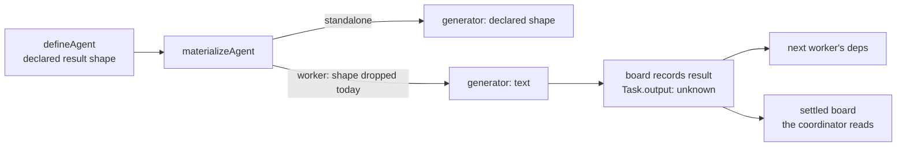

# FIX-1337: Delegated agents silently drop a declared outputSchema — Implementation Spec

## Part I — The Case *(for the human)*

### 1. Problem — why it matters, why now

An agent definition means two different things depending on who runs it. Mounted directly,
an agent that declares a typed result returns typed data. Hand the *same* definition to a
team of agents to run as a delegated task and it returns prose instead. Nothing says so:
the definition looks complete, and what actually executes quietly ignores half of it.

**Why now** — the Workforce foundation epic's whole premise is that a seat runs what its
files declare. We just shipped that guarantee for capabilities (FIX-1327): declare one that
can't be resolved and materialization refuses by name instead of running degraded. Output
shape is the same drift one field over, and it is the last clause on this epic's finish
line.

There is a workaround, and it is the tell. Skip the agent layer, write the worker as a
plain generator with your own declared result shape, and register it on the board directly
— that works today, and our own published guide teaches it. So the restriction isn't the
system's; it costs an author the persona, the registry entry, and the seat identity to get
back a result shape that a hand-written worker never lost.

### 2. Solution in plain terms

Remove the restriction. A delegated agent returns the result shape it declared, exactly as
a directly-mounted one does. And a result shape that can never work — one the model
provider will reject — is refused **where the author wrote it**, when the agent is defined,
rather than failing partway through a running job or being silently downgraded to prose.

Nothing new is added. A task's result is already carried as untyped data everywhere it
travels: onto the task record, into the next worker's inputs, out through the settled board
the coordinator reads. The restriction lives in one branch of one expression.

**Philosophy** — tenet 3 (earn every addition): this is a subtraction, and the public
surface grows by zero options. Tenet 5 (fix at the owning layer): one place decides an
agent's result shape, for both ways of running it, instead of two — and the correction
includes every surface still carrying the old answer, which is three documents and one
test.

### 6. Decisions & rules — the sign-off surface

1. **A delegated agent honours its declared result shape starting with the next release —
   no opt-in switch, no deprecation window.**
   *Rejected:* an opt-in field, and a release where we warn before flipping. Both keep the
   silent drop alive for longer, and the field version keeps it alive permanently.
   *Locks in:* anyone outside this repository who read the published promise and wrote a
   coordinator that treats a delegated agent's result as prose gets an object instead, with
   no flag to turn it off; their fix is to read the field they declared. Nothing in this
   repository is affected — no agent definition here declares a result shape — but that is
   evidence about us, not about them.

2. **A declared result shape is checked when the agent is defined, not only when a block is
   built.**
   *Rejected:* leaving the check where it is. *Locks in:* an author whose shape the provider
   can't accept now fails as soon as their definition loads — including an agent that has
   never been run, which used to load fine and fail later or not at all. That's the trade:
   a failure that arrives earlier and cannot be reached only by the unlucky path.

**Non-goals** — inline `prompt` / `prompt-ref` agents and tool seats (they carry no
agent-level declaration and are untouched); the additive tool-resolution policy, which
FIX-1327 fenced out by name and this does not reopen; and giving the coordinator a rendered
prose view of a structured result — it reads the shape it was given, and inventing a second
rendering is the drift this change exists to remove.

**Size:** Small — 3 production files · 7 test behaviours · 2 doc surfaces (+1 in-code
contract, +1 changeset) · 1 PR.

### 3. Tradeoffs & alternatives

**Alternative: an opt-in switch** — honour the declared shape only when the author asks
for it. Rejected. It grows the shared agent type with a field whose only job is to preserve
behaviour we've decided is wrong, it leaves both behaviours alive indefinitely, and an
author who declares a result shape has already said what they want; making them say it
twice is the surprise, restated.

**The simpler approach: leave it and document it better.** Genuinely tempting, and it costs
nothing. Insufficient because it is what we already did — the behaviour is documented in
three places today, and it still reads as a bug every time someone meets it. Documenting a
surprise doesn't stop it being one.

**Where the complexity is:** not the change. It's the migration. Someone read the published
promise that delegated agents return text and built a coordinator that treats the result as
prose. Nobody in this repository did, and we can check that; we can't check theirs. §6
decision 1 is that call, and it's the one thing on this spec worth a real opinion.

### 4. Focus practices (1–5)

1. **BP-030 (tolerate the old shape)** — a board that was persisted mid-run holds task
   results written as strings. They must still read fine after the change; nothing
   re-validates a stored result against the new shape.
2. **BP-035 (second path)** — the second path here is the *delegated* one. The existing
   suite covers directly-mounted agents thoroughly, and that coverage says nothing about
   this change. Every behaviour gets exercised on delegation.
3. **One place decides the result shape** (tenet 5) — after this there is a single
   expression that answers "what does this agent emit?", not one per way of running it. A
   fix that adds a second branch has recreated the defect facing the other way.

### 5. What using it looks like (1–5 examples)

**One definition, both ways of running it** *(what this spec proposes — today the second
call returns prose):*

```ts
const sizer = defineAgent({
  name: "position-sizer",
  description: "Sizes a position into a typed decision.",
  persona: { path: "personas/pm" },
  outputSchema: z.object({ ticker: z.string(), sizePct: z.number() }),
});

// Mounted directly — typed today, typed after.
const block = agentBlock(sizer, { catalog });

// Delegated to a board by name — prose today, the declared shape after.
// The coordinator reads it off the settled board:
//   before   task.output === "I'd size NVDA at about 4%…"
//   after    task.output === { ticker: "NVDA", sizePct: 4 }
```

**A downstream task reads it as data, not as text:**

```ts
// A task that depends on the sizer's task gets its result on `input.deps`.
// before   deps["t1"] is prose the worker has to re-parse out of its prompt
// after    deps["t1"].sizePct is a number
```

**A result shape the provider will reject:**

```
before  defineAgent(...) succeeds; the failure surfaces when the block is built —
        at import for a directly-mounted agent, mid-job for a delegated one
after   defineAgent(...) throws, naming the agent and the offending field path
```

---

## Part II — The Build Plan *(for the implementing agent)*

### 7. Technical design

One branch in `@flow-state-dev/workforce`'s agent materializer decides the result shape,
and it currently answers differently for the two shapes it builds. Everything downstream of
it already carries an untyped result, so nothing below the materializer changes.



- **`@flow-state-dev/workforce`** — the materializer stops discriminating on shape. The
  definition builder gains the same strict-schema check the generator already performs, so
  an unusable shape is refused at definition rather than at block construction.
- **`@flow-state-dev/core`** — the agent type's own documentation currently states the
  behaviour being removed. Text only; no type changes, and specifically no new field
  (theme 3 of the epic-spec fences that).
- **Untouched, and verified so:** the task record's result field and the dependency map are
  already untyped (`packages/orchestration/src/tasks/workers/types.ts`,
  `.../tasks/schema/task.ts`); the worker's user-turn builder already renders a non-string
  upstream result as JSON (`buildUserMessage`); the settled-board projection the delegation
  surface returns declares the result untyped (`delegation-surface.ts`). Inline
  `prompt` / `prompt-ref` agents and tool seats declare no agent-level shape and are not on
  this path.

**No POC, and the premise is settled by existing coverage rather than by argument.** The
load-bearing claim — that the board carries a structured worker result end to end — is
pinned today by `packages/orchestration/test/task-board/task-board-research-demo.test.ts`,
where board workers declare object result shapes and a downstream worker reads typed fields
off its dependencies. The published guide `apps/docs/guides/building-a-research-team.md`
teaches the same thing. A POC would re-demonstrate a green test.

**No sketch.** The change is the removal of one condition; a sketch of it would be longer
than the diff.

### 8. Implementation sequence

1. **Honour the declared shape on the delegated path.** Remove the shape discrimination in
   the materializer so one expression answers for both. *Test:* a declared shape is honoured
   on both shapes; no declaration still yields text on both. *Depends on:* nothing.
2. **Refuse an unusable shape at definition** (decision 2), reusing core's existing
   strict-compatibility assertion rather than a second rule — the generator keeps its own
   check, so this is the earlier of two gates on one rule, not a competing one. *Test:* an
   offending shape throws from the definition builder and names the agent; a compatible one
   passes through untouched. *Depends on:* nothing.
3. **Remove the test that pins the old behaviour** —
   `packages/workforce/test/materialize-agent.test.ts` currently asserts *"workers ignore
   outputSchema and stay z.string()"*. It is inverted, not deleted: the same case now
   asserts the shape survives. Subtraction is part of the change (tenet 3).
4. **Correct every surface still stating the old contract** (§11) — the agent type's doc
   comment, the package README, the published concepts page. Tenet 5's second half: the
   change is the edit plus each restatement, or the old answer survives somewhere.
   *Depends on:* 1.
5. **Changeset** — `minor` on `@flow-state-dev/workforce`; this is a behaviour change to a
   published contract, which is exactly the case BP-022 says a downstream consumer needs to
   be told about.

### 9. Edge cases & error handling

| Case | Expected |
|---|---|
| Delegated agent with no declared shape | Text, byte for byte as today — the common case and the whole first release for most callers (BP-030) |
| Inline `prompt` / `prompt-ref` agent, or a tool seat | Unchanged; neither carries an agent-level declaration, so neither is on this path |
| Declared shape the provider rejects | Refused at definition, naming the agent and the field path (decision 2). The generator's own check remains as the backstop for a directly-constructed generator |
| Delegated agent with tools **and** a declared shape | Tools still run — the non-streaming generation path receives the tool blocks and the run flag, same as the streaming one |
| Same, watched by a client | **No token-by-token streaming.** A structured result can't stream, so the worker's answer lands as one completed item instead of typing out. Identical to a directly-mounted agent with a declared shape today, and the reason it is a row here rather than a decision: it isn't a new tradeoff, it's an existing one reaching a new caller |
| A board persisted before this change, resumed after | Reads fine — the stored result was already untyped, and nothing re-validates it |
| Structured result flowing to a downstream task | Already handled: the user-turn builder JSON-renders a non-string dependency result |
| Structured result crossing a hand-off to another flow | The hand-off's JSON-safety gate applies to the dispatched payload, not to a recorded result — unchanged. A shape producing non-JSON values (dates, class instances) is already excluded by the strict-compatibility rule decision 2 moves earlier |

**Taxonomy:** one fatal path — an unusable declared shape, refused at definition, not
retryable and not degradable, which is the point. Everything else is unchanged behaviour or
a shape difference the substrate already carries.

### 10. Testing strategy

**Goal:** an agent that declares a typed result is delegated as a task on a real board with
a real model; the coordinator reads typed fields off the settled board, and a dependent task
reads the same fields off its dependency map. This is the epic's own finish-line clause
(*"the opinionated seat's declared `outputSchema` survives delegation or fails by name"*),
so it is a goal check and not only a spec.

**CI specs** (the behaviours, not the test names):

- **One behaviour per decision in §6**, in observable terms — what a caller gets back, not
  how it was computed.
- **The second path** (BP-035): every case exercised on the *delegated* shape, not only the
  directly-mounted one. A suite that passes only because standalone coverage is thorough
  would pass before the change too.
- **What must not change:** an agent with no declared shape returns text, on both shapes;
  an inline prompt agent and a tool seat are untouched.
- **The refusal is by name, not by exception type.** The failure has to identify the agent
  and the offending field path — a test asserting only that something throws would pass
  against a generic error and teach the implementer that the message is decoration.
- **The end-to-end reach**, which is the assertion the unit-level ones can't make: the
  structured result is what a *dependent task* and the *settled board* actually see, not
  just what the generator was configured with. Configuration-level assertions are a
  neighbour of the claim (tenet 7).

**Discipline:** `tdd`. Two seams, both reachable from vitest with no model: the workforce
package's materializer and definition builder for the unit behaviours, and orchestration's
existing board harness (the research-demo test's shape) for the end-to-end reach.

### 11. Documentation plan

- **EXTEND** `apps/docs/docs/orchestration/agents.md` — the *"Structured output and
  capabilities"* section. One sentence currently says the opposite of what will be true
  (*"Delegation agents stay `z.string()` regardless"*) and the code sample's comment
  (`// standalone only`) repeats it. Replace both with the new rule, and keep the sentence
  that follows — where a delegated result is *read* (off the completed task, not returned
  inline) is still correct and is the part authors get wrong.
  *Voice risk:* this is a correction, and the outsider rule applies — the page says what
  the thing does, never that it used to do something else or which issue changed it.
- **EXTEND** `packages/workforce/README.md` — the *"Structured Output & Capabilities"*
  section: same sentence, plus the `// standalone only; workers stay string` comment in the
  sample.
- **EXTEND** `packages/core/src/types/agent.ts` — the `outputSchema` doc comment, which
  states the removed rule and gives a reason for it (*"skills pattern machinery builds
  follow-on actions from text"*) that the research-demo coverage contradicts. Not a
  published docs surface, but it is the declaration's own contract and the first thing an
  author reads in an editor (BP-007).
- **No new page.** This corrects one rule inside an existing concept; a page for it would
  fragment the sidebar for a sentence.
- **Changeset:** required, `minor`, on `@flow-state-dev/workforce` (BP-022 — a published
  behaviour a downstream consumer may have built on).

### 12. Dependencies, open questions & follow-ups

**Dependencies:** none outstanding. FIX-1327 (PR #1666) is merged; this builds on the
refusal convention it established (`packages/workforce/src/errors.ts`) rather than inventing
a second one.

**Open questions:** none. The migration call is §6 decision 1 — it is asked in full on the
spec PR because the fact that decides it is one the owner has and this research can't reach,
but it is a decision with a recommendation, not an unanswered question.

**Follow-ups (flagged, not built):**

- **Docs gap, not this change's scope:** nothing on the concepts page tells an author that
  declaring a result shape costs them token streaming for that agent. It is true today for
  directly-mounted agents and will be true for delegated ones; worth a sentence on the
  generator/streaming page, not worth widening this change set.

---

## Spec evolution

- **Spec drafted** — framed as one honesty defect rather than a feature: the delegated path
  drops a declared result shape, and the substrate that was cited as the reason turns out to
  carry structured results already, pinned by existing board coverage. Chose the straight
  behaviour change over a flag or a deprecation window, and moved the schema check to
  definition time so the author learns where they wrote it.
