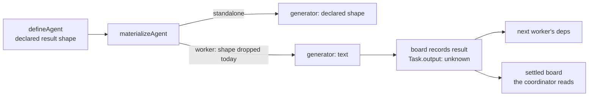

# FIX-1337: Delegated agents silently drop a declared outputSchema — Implementation Spec

## Part I — The Case *(for the human)*

### 1. Problem — why it matters, why now

An agent definition means two different things depending on who runs it. Mounted directly,
an agent that declares a typed result returns typed data. Hand the *same* definition to a
team of agents to run as a delegated task and it returns prose instead. Nothing says so:
the definition looks complete, and what actually executes quietly ignores half of it.

**Why now** — the Workforce foundation epic's whole premise is that a seat runs what its
files declare. We just shipped that guarantee for capabilities (FIX-1327): declare one that
can't be resolved and materialization refuses by name instead of running degraded. Output
shape is the same drift one field over, and it is the last clause on this epic's finish
line.

There is a workaround, and it is the tell. Skip the agent layer, write the worker as a
plain generator with your own declared result shape, and register it on the board directly
— that works today, and our own published guide teaches it. So the restriction isn't the
system's; it costs an author the persona, the registry entry, and the seat identity to get
back a result shape that a hand-written worker never lost.

### 2. Solution in plain terms

Remove the restriction. A delegated agent returns the result shape it declared, exactly as
a directly-mounted one does. And a result shape that can never work — one the model
provider will reject — is refused **by name, before any job runs**, on every route into an
agent, rather than failing partway through a running job or being silently downgraded to
prose.

Nothing new is added. A task's result is already carried as untyped data everywhere it
travels: onto the task record, into the next worker's inputs, out through the settled board
the coordinator reads. The restriction lives in one branch of one expression.

**Philosophy** — tenet 3 (earn every addition): this is a subtraction, and the public
surface grows by zero options. Tenet 5 (fix at the owning layer): one place decides an
agent's result shape, for both ways of running it, instead of two — and the correction
includes every surface still carrying the old answer, which is three documents and one
test.

### 6. Decisions & rules — the sign-off surface

1. **A delegated agent honours its declared result shape starting with the next release —
   no opt-in switch, no deprecation window.**
   **Settled by the product owner**, in one call covering this and decision 3 together.
   *Declined, and named in the ask:* a **warn-first release** that shipped a deprecation
   cycle before the flip. Also weighed and declined earlier, in engineering: an opt-in
   field. Both keep the silent drop alive for longer, and the field version keeps it alive
   permanently.
   *Locks in:* anyone outside this repository who read the published promise and wrote a
   coordinator that treats a delegated agent's result as prose gets an object instead, with
   no flag to turn it off; their fix is to read the field they declared. Nothing in this
   repository is affected — no agent definition here declares a result shape — but that is
   evidence about us, not about them.

2. **A declared result shape the provider can never accept is refused before it can reach a
   running job — at a point on the path that nothing bypasses.**
   **This is not severable from decision 1; it is what stops decision 1 introducing a
   regression.** Today the worker branch hands `generator()` a `z.string()`, so an unusable
   declared shape is *inert* — it never reaches a validator. Decision 1 removes that branch,
   and the same shape then reaches the generator's strict check lazily, when
   `materializeAgent` builds that worker: on first delegation, inside a running job.
   Two constraints the check must satisfy — neither is met by dropping the existing
   assertion into the definition builder:
   - **Nothing may bypass it.** `createAgentRegistry` takes plain `Agent` objects and
     validates only duplicate names; nothing routes through `defineAgent`. A check that
     lives only in the definition builder is opt-in by construction.
   - **It must cover non-object roots.** Core's `assertStrictCompatible` treats primitives
     as strict-safe and returns a non-object root unchanged, so `z.number()` passes it
     silently — while the generator special-cases `z.string()` only and forwards everything
     else to the provider as a structured-output root, which must be an object. A declared
     root that is neither text nor an object has to be refused by name, not passed.
   *Rejected:* leaving the check where it is (decision 1 turns it into a first-delegation
   failure); and a definition-time-only check, which reads as a guarantee it cannot make.
   *Locks in:* an author whose shape the provider can't accept fails by name before the job
   runs, on every route into an agent — including one that has never been run and used to
   load fine. The failure arrives earlier and cannot be reached only by the unlucky path.
   *The precise call site and the widened predicate are the implementer's* — the constraint
   is that both holes are closed, not which line closes them.

3. **A declared result shape may not carry an output transform.** A shape whose fields
   transform on parse (`z.string().transform(v => new Date(v))`) is refused by the same
   check, uniformly, on both ways of running an agent.
   **Settled by the product owner**, in the same call as decision 1 — the two contract
   changes were put as one question and both were flipped outright.
   *Why this is a decision and not an edge case:* strict-compatibility does not exclude it.
   `makeSchemaStrict` deliberately unwraps `ZodEffects`, so the shape passes, and final
   generator validation returns a `Date`. A durable board stores the task record through
   `JSON.stringify` and reads that field back as a string — so a downstream task observes a
   different shape before and after persistence or resume. That is this spec's own defect,
   one declared shape meaning two things depending on who reads it, reappearing one layer
   down.
   *Declined, and named in the ask:* a **narrower break that kept transforms working for
   directly-mounted agents** — a JSON-safety gate at the delegated-result boundary only. It
   was the migration-sparing option and it was not taken: it puts the rule in a second place
   and makes it conditional on how the agent is run — the shape discrimination decision 1
   exists to remove (§4, practice 3). Because it was declined, *"what may I declare?"* has
   one answer no matter how the agent is run.
   *Locks in:* an author transforming an output field on a *directly-mounted* agent is
   refused after this, though nothing serializes their result today. That is a real break on
   a path this issue didn't set out to touch; it was named in the ask and accepted with it.
   It is also the honest one: the transform runs client-side after parse, so the declared
   shape and the transported shape were already two different answers. Persistence is only
   where it becomes visible.

**Non-goals** — inline `prompt` / `prompt-ref` agents and tool seats (they carry no
agent-level declaration and are untouched); the additive tool-resolution policy, which
FIX-1327 fenced out by name and this does not reopen; and giving the coordinator a rendered
prose view of a structured result — it reads the shape it was given, and inventing a second
rendering is the drift this change exists to remove.

**Size:** Small — 3 production files · 6 test behaviours · 2 doc surfaces (+1 in-code
contract, +1 changeset) · 1 PR.

### 3. Tradeoffs & alternatives

**Alternatives weighed and declined** — an opt-in switch, a **warn-first release** with a
deprecation cycle, and a **narrower break** that kept output transforms working for
directly-mounted agents. All three are carried in full at §6 decisions 1 and 3, where the
last two were declined by the product owner. Not restated here.

**The simpler approach: leave it and document it better.** Genuinely tempting, and it costs
nothing. Insufficient because it is what we already did — the behaviour is documented in
three places today, and it still reads as a bug every time someone meets it. Documenting a
surprise doesn't stop it being one.

**Where the complexity is:** not the change. It's the migration. Someone read the published
promise that delegated agents return text and built a coordinator that treats the result as
prose. Nobody in this repository did, and we can check that; we can't check theirs. That was
§6 decision 1, and the product owner made the call: flip outright, no deprecation cycle. The
migration cost is accepted, and the only thing carrying it to anyone outside this repository
is the release note — which is why §11 pins its wording.

### 4. Focus practices (1–5)

1. **BP-030 (tolerate the old shape)** — a board that was persisted mid-run holds task
   results written as strings. They must still read fine after the change; nothing
   re-validates a stored result against the new shape.
2. **BP-035 (second path)** — the second path here is the *delegated* one. The existing
   suite covers directly-mounted agents thoroughly, and that coverage says nothing about
   this change. Every behaviour gets exercised on delegation.
3. **One place decides the result shape** (tenet 5) — after this there is a single
   expression that answers "what does this agent emit?", not one per way of running it. A
   fix that adds a second branch has recreated the defect facing the other way.

### 5. What using it looks like (1–5 examples)

**One definition, both ways of running it** *(what this spec proposes — today the second
call returns prose):*

```ts
const sizer = defineAgent({
  name: "position-sizer",
  description: "Sizes a position into a typed decision.",
  persona: { path: "personas/pm" },
  outputSchema: z.object({ ticker: z.string(), sizePct: z.number() }),
});

// Mounted directly — typed today, typed after.
const block = agentBlock(sizer, { catalog });

// Delegated to a board by name — prose today, the declared shape after.
// The coordinator reads it off the settled board:
//   before   task.output === "I'd size NVDA at about 4%…"
//   after    task.output === { ticker: "NVDA", sizePct: 4 }
```

**A downstream task reads it as data, not as text:**

```ts
// A task that depends on the sizer's task gets its result on `input.deps`.
// before   deps["t1"] is prose the worker has to re-parse out of its prompt
// after    deps["t1"].sizePct is a number
```

**A result shape the provider will reject:**

```
before  the definition loads fine; the failure surfaces when the block is built —
        at import for a directly-mounted agent, and at worker materialization
        (first delegation, inside a running job) for a delegated one
after   the shape is refused by name and offending field path before the job runs
```

---

## Part II — The Build Plan *(for the implementing agent)*

### 7. Technical design

One branch in `@flow-state-dev/workforce`'s agent materializer decides the result shape,
and it currently answers differently for the two shapes it builds. Everything downstream of
it already carries an untyped result, so nothing below the materializer changes.



- **`@flow-state-dev/workforce`** — the materializer stops discriminating on shape, and
  gains the refusal from §6 decisions 2–3 on a call site nothing bypasses. It is core's
  existing strict-compatibility assertion (and its `StrictSchemaError`) widened at the two
  points that assertion does not cover on its own — a non-object, non-text root, and an
  output shape carrying a transform. No second error class: FIX-1327's `AgentCapabilityError`
  is a posture precedent, not an API one.
- **`@flow-state-dev/core`** — the agent type's own documentation currently states the
  behaviour being removed. Text only; no type changes, and specifically no new field
  (theme 3 of the epic-spec fences that).
- **Untouched, and verified so:** the task record's result field and the dependency map are
  already untyped (`packages/orchestration/src/tasks/workers/types.ts`,
  `.../tasks/schema/task.ts`); the worker's user-turn builder already renders a non-string
  upstream result as JSON (`buildUserMessage`); the settled-board projection the delegation
  surface returns declares the result untyped (`delegation-surface.ts`). Inline
  `prompt` / `prompt-ref` agents and tool seats declare no agent-level shape and are not on
  this path.

**No POC; the substrate half of the premise is settled by existing coverage, and the agent
half is not.** `packages/orchestration/test/task-board/task-board-research-demo.test.ts`
pins that the *board substrate* carries a structured worker result end to end — but its
workers are plain `handler` blocks, with no `defineAgent`, `materializeAgent` or `agent-ref`
anywhere on the path. It proves the substrate is ready; it says nothing about the agent
route this change opens, and the guide
`apps/docs/guides/building-a-research-team.md` teaches the same plain-generator workaround
§1 names as the tell. The agent-delegation half is covered instead by the
`materializeWorker` → `agent-ref` seam that `packages/workforce/test/skill-forced-worker.test.ts`
already exercises (§10). A POC would add nothing that seam doesn't.

**No sketch.** The change is the removal of one condition; a sketch of it would be longer
than the diff.

### 8. Implementation sequence

1. **Honour the declared shape on the delegated path.** Remove the shape discrimination in
   the materializer so one expression answers for both. *Test:* a declared shape is honoured
   on both shapes; no declaration still yields text on both. *Depends on:* nothing.
2. **Refuse an unusable shape where nothing bypasses the check** (decisions 2–3), reusing
   core's `assertStrictCompatible` and its `StrictSchemaError` rather than a second rule or
   a parallel error class — the generator keeps its own check, so this is the earlier of two
   gates on one rule, not a competing one. The assertion is widened at the two points it
   does not cover: a declared root that is neither text nor an object, and an output shape
   carrying a transform. *Test:* each of those, plus a plainly incompatible shape, is
   refused by agent name and field path; a compatible one passes through untouched.
   *Depends on:* 1 — before it, an unusable worker shape is inert and this check has nothing
   to catch.
3. **Remove the test that pins the old behaviour** —
   `packages/workforce/test/materialize-agent.test.ts` currently asserts *"workers ignore
   outputSchema and stay z.string()"*. It is inverted, not deleted: the same case now
   asserts the shape survives. Subtraction is part of the change (tenet 3).
4. **Correct every surface still stating the old contract** (§11) — the agent type's doc
   comment, the package README, the published concepts page. Tenet 5's second half: the
   change is the edit plus each restatement, or the old answer survives somewhere.
   *Depends on:* 1.
5. **Changeset** — `minor` on `@flow-state-dev/workforce`, in the exact wording §11 pins.
   It names **both** user-facing changes, not just the delegation fix: the honoured result
   shape *and* the refusal of output transforms. The second is the one that gets dropped,
   because it breaks nothing in this repository — the release note is the only thing that
   tells anyone outside it. Two behaviour changes to a published contract, which is exactly
   the case BP-022 says a downstream consumer needs to be told about.

### 9. Edge cases & error handling

| Case | Expected |
|---|---|
| Delegated agent with no declared shape | Text, byte for byte as today — the common case and the whole first release for most callers (BP-030) |
| Inline `prompt` / `prompt-ref` agent, or a tool seat | Unchanged; neither carries an agent-level declaration, so neither is on this path |
| Declared shape the provider rejects | Refused by name and field path before the job runs (decision 2), on every route into an agent. The generator's own check remains as the backstop for a directly-constructed generator |
| Declared root that is neither text nor an object (`z.number()`, `z.array(...)`) | Refused by the same check (decision 2). Core's strict assertion passes these silently today, so this is the widened half, not the existing one |
| Delegated agent with tools **and** a declared shape | Tools still run — the non-streaming generation path receives the tool blocks and the run flag, same as the streaming one |
| A board persisted before this change, resumed after | Reads fine — the stored result was already untyped, and nothing re-validates it |
| Structured result flowing to a downstream task | Already handled: the user-turn builder JSON-renders a non-string dependency result |
| Structured result on a **durable** board, persisted and resumed | Reads back as the same shape it was written as. This holds only because decision 3 refuses output transforms: the store round-trips the task record through `JSON.stringify`, so a field that parsed to a `Date` would return as a string. Without decision 3 the declared shape and the resumed shape disagree |
| Structured result crossing a hand-off to another flow | The hand-off's JSON-safety gate applies to the dispatched payload, not to a recorded result — unchanged. Non-JSON values are excluded by decision 3, **not** by strict-compatibility, which unwraps `ZodEffects` and lets them through |

**Taxonomy:** one fatal path — an unusable declared shape (incompatible, a non-object root,
or transform-bearing), refused by name before the job runs, not
retryable and not degradable, which is the point. Everything else is unchanged behaviour or
a shape difference the substrate already carries.

### 10. Testing strategy

**Goal:** an agent that declares a typed result is delegated as a task on a real board with
a real model; the coordinator reads typed fields off the settled board, and a dependent task
reads the same fields off its dependency map. This is the epic's own finish-line clause
(*"the opinionated seat's declared `outputSchema` survives delegation or fails by name"*),
so it is a goal check and not only a spec.

**Six behaviours**, in observable terms — what a caller gets back, not how it was computed:

1. **A delegated worker honours a declared shape.** The delegated path, not the mounted one
   (BP-035) — a suite that passes on standalone coverage alone would pass before the change.
2. **No declared shape still returns text**, on both shapes, byte for byte.
3. **A plainly incompatible shape is refused by agent name and field path** — not merely
   "throws". A test asserting only that something throws passes against a generic error and
   teaches the implementer that the message is decoration.
4. **A non-object, non-text root is refused** (`z.number()`). Distinct from 3: core's strict
   assertion passes this one silently today, so 3 can be green while the promise is false.
5. **Delegation through the real seam** — `materializeWorker` → `agent-ref`, the shape
   `packages/workforce/test/skill-forced-worker.test.ts` already exercises. This is the
   assertion the configuration-level ones can't make: what a *delegated* worker actually
   emits, not what the generator was handed (tenet 7).
6. **A structured result survives a durable board's persist-and-resume as the same shape.**
   Decision 3's coverage, and the only place its failure is visible — an output transform
   parses to a `Date` in memory and returns from the store as a string.

**On the count.** Review proposed cutting from seven to about four. Four of the seven did
collapse: the per-decision inflation and the full board end-to-end with generator mocking
fold into 5. But the Codex transform finding adds 6, and the non-object-root hole adds 4 —
neither existed when seven was written, and neither is optional, because each is a case
where every *other* test is green and the spec's promise is still false. Net six. Cutting
4 or 6 would restore exactly the silent pass this change exists to remove.

**What must not change:** an inline prompt agent and a tool seat are untouched.

**Discipline:** `tdd`. Two seams, both reachable from vitest with no model: the workforce
package's materializer and its refusal call site for 1–4, and the existing
`skill-forced-worker` delegation seam for 5, with 6 on orchestration's board harness against
a durable store.

### 11. Documentation plan

- **EXTEND** `apps/docs/docs/orchestration/agents.md` — the *"Structured output and
  capabilities"* section. One sentence currently says the opposite of what will be true
  (*"Delegation agents stay `z.string()` regardless"*) and the code sample's comment
  (`// standalone only`) repeats it. Replace both with the new rule, and keep the sentence
  that follows — where a delegated result is *read* (off the completed task, not returned
  inline) is still correct and is the part authors get wrong.
  *Voice risk:* this is a correction, and the outsider rule applies — the page says what
  the thing does, never that it used to do something else or which issue changed it.
- **EXTEND** `packages/workforce/README.md` — the *"Structured Output & Capabilities"*
  section: same sentence, plus the `// standalone only; workers stay string` comment in the
  sample.
- **EXTEND** `packages/core/src/types/agent.ts` — the `outputSchema` doc comment, which
  states the removed rule and gives a reason for it (*"skills pattern machinery builds
  follow-on actions from text"*) that the research-demo coverage contradicts. Not a
  published docs surface, but it is the declaration's own contract and the first thing an
  author reads in an editor (BP-007).
- **No new page.** This corrects one rule inside an existing concept; a page for it would
  fragment the sidebar for a sentence.
- **Changeset:** required, `minor`, on `@flow-state-dev/workforce` (BP-022 — two published
  behaviours a downstream consumer may have built on). It names **both**, one plain sentence
  each. The second is the one most easily missed: in this repository it breaks nothing, so
  nothing but the release note will surface it.

  > A delegated agent now returns the result shape it declared on its `outputSchema`, where
  > it previously always returned text (FIX-1337).
  >
  > An agent whose declared `outputSchema` contains an output transform (for example
  > `z.string().transform(...)`) is now refused by name, where it previously loaded
  > (FIX-1337).

### 12. Dependencies, open questions & follow-ups

**Dependencies:** none outstanding. FIX-1327 (PR #1666) is merged; this builds on the
refusal convention it established (`packages/workforce/src/errors.ts`) rather than inventing
a second one.

**Open questions:** none, and none pending. The two contract calls — §6 decision 1 (flip the
delegated result shape outright) and §6 decision 3 (refuse output transforms uniformly) —
were put to the product owner as one question and answered: flip both. The warn-first release
and the narrower, delegated-only transform gate were declined explicitly. §6 is the sign-off
surface and it carries no live fork.

**Follow-ups (flagged, not built):**

- **Declaring a result shape costs token streaming, and nothing says so.** A structured
  result can't stream, so a delegated agent with a declared shape lands as one completed
  item instead of typing out. This is **pre-existing standalone behaviour** reaching a new
  caller, not new behaviour — which is why it sits here rather than in §9's table of what
  this change alters. Worth a sentence on the generator/streaming page and on the concepts
  page; not worth widening this change set.

### 13. Implementer notes *(recorded from review, not folded into the design)*

Below-the-bar review feedback, verbatim, for the implementer to weigh against real code. It
is not part of the design and was not argued with.

- **cursor, on §6 decision 2:** *"Simpler: `assertStrictCompatible` in `materializeAgent`
  when `agent.outputSchema` is set — one call site, full coverage, reuses `StrictSchemaError`.
  Defer define-time unless import-time failure is an explicit epic requirement."* — the
  bypass half is folded into decision 2. The specific call site is left to the implementer,
  and this is the leading candidate: it is the one point every route into a delegated agent
  passes through. Weigh it against whether a directly-mounted agent should be covered there
  too.
- **cursor, on §10:** *"(4) delegation via `skill-forced-worker.test.ts` (FIX-1327's
  `materializeWorker` → `agent-ref` seam). Full board E2E with generator mocking is optional
  reach."* — the seam is now §10 behaviour 5. Whether behaviour 6 needs a full board harness
  or a narrower store round-trip is the implementer's call; only the persist-and-resume
  assertion is required.
- **chatgpt-codex-connector, on §8:** *"Either constrain agent outputs to text/object roots
  or extend the validation and cover these roots."* — decision 2 takes the second option and
  leaves the predicate open. If constraining the declared root to text-or-object proves
  simpler than widening the violation walk, take it; the spec requires the outcome, not the
  mechanism.

---

## Spec evolution

- **Spec drafted** — framed as one honesty defect rather than a feature: the delegated path
  drops a declared result shape, and the substrate that was cited as the reason turns out to
  carry structured results already, pinned by existing board coverage. Chose the straight
  behaviour change over a flag or a deprecation window, and moved the schema check to
  definition time so the author learns where they wrote it.
- **Review round 1** — three reviewers converged on §6 decision 2 from three directions and
  each was right about a different half, so the decision stayed and its mechanism changed.
  It is no longer severable: decision 1 removes the branch that makes an unusable worker
  shape inert, so without decision 2 this change *introduces* a first-delegation failure.
  And define-time-only was the wrong promise — `createAgentRegistry` bypasses `defineAgent`,
  and core's strict assertion passes a non-object root silently, so the guarantee had two
  holes in it. Added decision 3 (no output transforms): strict-compatibility unwraps
  `ZodEffects`, and a durable board's `JSON.stringify` round-trip then returns a parsed
  `Date` as a string — the spec's own defect one layer down. Corrected the research-demo
  evidence, which pins the board substrate but not the agent path, and re-anchored the
  end-to-end reach on the `skill-forced-worker` seam. Test behaviours went seven to six —
  the collapse review asked for, minus two new cases the findings made mandatory.
- **Decision folded** — the product owner answered the one open fork, which covered both
  contract changes at once (§6 decisions 1 and 3): **flip both outright.** Declined, by
  name, a warn-first release with a deprecation cycle, and a narrower break that would have
  kept output transforms working for directly-mounted agents. So there is no migration
  shim, no opt-in switch, and no carve-out by how the agent is run — which is what keeps
  *"what may I declare?"* one answer. The design is untouched: decision 2's mechanism, the
  six §10 behaviours and §13's implementer notes stand exactly as round 1 left them. The
  release note (§11) now names both user-facing consequences rather than the delegation fix
  alone.
