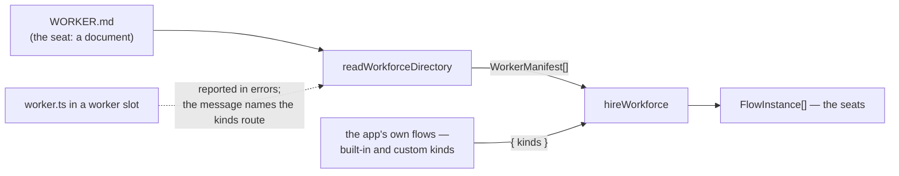

# FIX-1342: A custom worker is a new kind, not a richer folder — Implementation Spec

## Part I — The Case *(for the human)*

### 1. Problem — why it matters, why now

An author has a worker that is not only instructions and settings. It makes a decision their
prose cannot describe — which desk a request belongs to, say. They reach for the folder
convention they just learned, drop a `worker.ts` in beside their other workers, and their app
stops booting:

```
workforce: 1 worker(s) failed to load
  teams/engineering/workers/router: Worker folder "router" has no WORKER.md
```

The refusal is right. A worker folder describes a seat, and a seat is a document. What is
wrong is that the message names nothing to do instead — while the supported route already
exists, already works end to end, and is one line of app startup away. The author is standing
next to the door being told only that the wall is a wall.

**Why now.** The folder convention shipped days ago, and W3 adds four more beside it — rooms,
channels, resources, skills. An author who concludes from this refusal that code belongs in
*some* folder we have not documented yet learns a rule we are about to contradict four more
times. Silence here is not neutral; it teaches.

### 2. Solution in plain terms

Say the missing thing in the two places that are silent: the loader's refusal, and the
workers-on-disk docs. A worker whose **behaviour** differs is a different *kind* of worker —
one of the flows your app defines and hands to the hire by name — not a folder with more in
it. Seats stay documents.

Nothing in the framework changes except the sentence it prints. The framework still imports
no app code, at hire time or ever.

**The fence this is written to**, set by the owner after the previous draft:

| | |
|---|---|
| **Seats** | `WORKER.md` → `WorkerManifest`. The document door. `flow:` names a kind |
| **Kinds** | `defineFlow` factories — the built-ins plus the app's own — passed as `hireWorkforce(manifests, { kinds })` |
| **A seat never invents a kind** | `flow:` must name something already on the kinds map |
| **Killed** | The framework importing a seat's `worker.ts` at hire time; a TypeScript-authored manifest as a second door |

**What the previous draft recommended, and why it is gone.** It proposed that an app export a
`WorkerManifest` from its own `worker.ts` and compose it into the roster. That is dynamic
config in a `.ts` file — the same record the loader already produces, authored twice. Not a
second door worth teaching. The reframing that replaces it is the useful part: the old draft
asked how a code worker becomes a *record*, and the interesting case was never a record at
all. A custom worker's difference lives in its **graph**, and a graph is a kind.

**Philosophy** — tenet 3: a second authoring route for a record we already have is an addition
that earns nothing. Tenet 1: a refusal that names no route is the code saying one thing while
we say another.

### 6. Decisions & rules — the sign-off surface

**1. `WorkerManifest` is one record shape with one authoring route — the document.**
*Ratified.* `hireWorkforce` keeps taking an array of records and will not police where they
came from; an app assembling a roster from its own database is its own business, and the
function cannot tell the difference anyway. What changes is what we *teach*: nothing in the
docs offers a TypeScript-authored record as the way to express a custom worker. *Locks in:*
the last draft used this decision's own publicness ("records may be hand-built") to justify a
second door. It is not that, and saying so here is the point of the decision surviving.

**2. The refusal names the route; the loader never learns what a `worker.ts` is.**
*Ratified.* One sentence joins the existing "has no `WORKER.md`" message, on the existing
path. *Rejected:* sniffing the slot for a `.ts`/`.js` file to tailor the wording. *Locks in:*
the framework recognizes exactly one filename inside a worker slot. A loader that special-cases
`worker.ts` in order to say something kinder about it has learned that `worker.ts` means
something — the killed door, wearing a message.

**3. Live fork — see below.** Delivery: the signpost now, or the kind file-convention in this
issue?

> #### Delivery: fix the signpost now, or build the file convention for custom kinds here?
>
> **Plain terms.** An author with a custom worker has a working route today: write the flow in
> your app's code, hand it to the hire under a name, and point a worker's document at that
> name. What they do not have is anything telling them so. The small version fixes what we
> say — the error message and one docs section. The large version also invents a folder
> convention so the framework discovers your custom flow the way it discovers worker
> documents, and the author writes no startup line at all.
>
> **The trade-off.** The large version is the better story and it is the same class of work as
> the four conventions W3 is about to define beside it. Building it here, alone, means this
> issue picks the rule the other four then have to match — or be reconciled against later,
> which is the same work paid twice. Building it small means one line of app startup per
> custom kind, which is honest, works identically on every host we deploy to, and is what the
> docs already show for the built-in kinds.
>
> **My recommendation: the signpost now.** The route already works end to end — I ran it
> (§7), including a document naming a kind the app defined itself. So the large version buys
> ergonomics, not capability, and ergonomics invented ahead of its four siblings is the
> expensive kind of guess. The thin version is a message and a docs paragraph: if the
> convention lands next month and makes them stale, we rewrite two paragraphs.
>
> **What would change my mind:** if W3's pentest lab Proof is meant to demonstrate an app with
> *no* startup wiring — a tree that boots a whole workforce from files alone, custom kinds
> included. Then kind registration is on W3's critical path rather than a follow-up, and it
> should be scoped **with** the other four conventions. It still would not belong inside this
> issue, but this issue would shrink to a pointer at that one.
>
> **Cost of being wrong: low, and reversible in both directions.** Nothing here persists,
> nothing is published, no shape migrates. The expensive error is the opposite one: inventing
> a kinds-folder convention in this issue that the four siblings then copy before anyone
> compared them.

**News, not a decision:** no issue owns kind registration from files today. W3's children are
rooms, channels, resources, skills, the lab Proof, and this one; the nearest home is FIX-912
(Layer 2 file-based conventions), which is backlog and broader. If the fork goes thin, that
follow-up needs filing or it falls through (§12).

**Non-goals** — the framework importing anything at hire time, a build step that generates
imports, and a folder convention for kinds invented here.

**Size:** Extra small — 1 production file (one error message) · 1 test behaviour · 2 doc
surfaces · 1 PR. Conditional on the fork above.

---

### 3. Tradeoffs & alternatives

**A. Close it as works-as-designed.** The route exists; the author just has to find it.
Rejected: the loader *actively reports* their folder as broken, and the documented startup
guard turns that into a failed boot (§7). "Works, if you already knew" is the gap tenet 1
exists to close.

**B. Fix the signpost — the refusal names the route, the docs say it once.** Recommended.
Nothing shipped changes shape.

**C. Build kind registration from files in this issue.** The real ergonomic, and the reason to
say no is sequencing rather than soundness: it is one of five file conventions W3 is defining,
and it is the only one that would be designed alone. Priced in the fork above, and filed as a
follow-up in §12.

**Where the complexity is:** not in the change. It is in one sentence of wording having to
teach a distinction — settings versus graph — that the framework enforces but has never stated.

### 4. Focus practices (1–5)

1. **BP-003, in the form the last round taught it.** The previous draft claimed a POC
   directory held "commands and full transcripts" when it held a script and a README, and let
   a weak measurement travel beside a decisive one. So: every claim here names the command
   that produces it, and where a claim is not cheaply runnable it is narrowed rather than
   asserted (§7).
2. **Tenet 3 (earn every addition).** The deliverable is a sentence and a docs section. If the
   implementation grows an export, a config key, or a file-name constant, the spec was wrong.
3. **The outsider rule.** The docs must describe how to build a worker whose behaviour
   differs. They must never mention that a different door was proposed, or removed, or that
   this wording replaced a worse one.

### 5. What using it looks like

The author's custom worker, in three pieces. **The routing decision lives in the kind's graph**
— that is the whole reframing, and it is why the seat stays a document: what the folder
declares is data, and the behaviour it cannot express is a flow.

```ts
// flows/router.ts — the app's own flow kind
export const routerFlow = defineFlow({
  kind: "router",
  cardinality: "collection",
  configSchema: z.object({ persona: z.string(), desks: z.array(z.string()) }),
  actions: { route: { inputSchema, block: chooseDesk } }  // the decision lives here
});
```

```md
<!-- teams/engineering/workers/router/WORKER.md — still a document -->
---
description: Sends each request to the desk that owns it.
flow: router
desks: [billing, accounts, abuse]
---
You route requests. You never answer them yourself.
```

```ts
// app startup — the custom kind joins the built-ins
const { workers, errors } = await readWorkforceDirectory("./workforce");
const seats = hireWorkforce(workers, {
  kinds: { "worker-agent": workerAgentFlow, router: routerFlow }
});
```

**What the loader says about a folder holding only code (before / after):**

```
before  teams/engineering/workers/router: Worker folder "router" has no WORKER.md
after   teams/engineering/workers/router: Worker folder "router" has no WORKER.md.
        A worker folder describes a seat, and every seat is a WORKER.md. A worker
        whose behaviour differs is a different flow kind: define the flow in your
        app, pass it to hireWorkforce in `kinds`, and name it in this worker's
        `flow:`.
```

---

## Part II — The Build Plan *(for the implementing agent)*

### 7. Technical design

Nothing moves. One `throw` gains a sentence:



Two arrows arrive at the hire and only one comes off disk. The kinds arrow is app code the app
imported itself, statically, which is why no host's bundler is involved and why the killed
door was a door onto a problem.

**Surface change:** none. **Seam:** `readWorkerSlot`'s `has no ${WORKER_MD}` throw in
`packages/workforce/src/loader/read-workforce-directory.ts`.

#### Evidence

Three claims, each with the command that produces it. Run on this branch, 2026-09-11.

| Claim | Command | Result |
|---|---|---|
| A document naming a kind **the app defined itself** loads, hires, runs, and is addressable by its own id; a document naming a kind the app did not pass refuses at the hire | `pnpm tsx goals/workforce-seats/two-seats-run-their-own-configuration/run.mts` | PASS, on its loader path — *"roster source: `readWorkforceDirectory(fixtures/teams)`"*. Both kinds in that goal's fixtures are ordinary `defineFlow` results written by the fixture app, not framework built-ins |
| A worker slot holding only a `worker.ts` is reported under its own path rather than skipped, and a seat naming an unregistered kind is refused naming the kinds that were passed | `pnpm --filter @flow-state-dev/workforce test` | 130 pass. The two behaviours are `read-workforce-directory.test.ts` → "reports a folder holding only a worker.ts, rather than skipping it" and `hire.test.ts` → "refuses a record naming a kind the app did not pass, listing the kinds it did" |
| An app following the documented startup guard **refuses to boot** over that folder, with a message naming no route | `pnpm tsx spec-poc/FIX-1342-worker-ts-slot/run.mts` | PASS. Prints the real refusal: `workforce: 1 worker(s) failed to load / teams/engineering/workers/router: Worker folder "router" has no WORKER.md` |

**What is checked in, precisely:** the two test files and the goal check are on `main`; the
third row is one script plus a README on this branch, and nothing else — no transcripts. Its
last assertion is the live one (`assert.doesNotMatch(refusal, /kind|flow factory|
hireWorkforce/i)`), so it is **red the moment Decision 2 lands** — a green run means the
problem still exists.

**Two claims deliberately narrowed rather than argued.** The fence settles them, so neither
needs evidence here and neither gets any: that the framework must not import a seat's
`worker.ts` (the decisive reason is bundled hosts — the repo's own runtime-import site,
`packages/core/src/models/createModelResolver.ts`, carries `webpackIgnore`/`turbopackIgnore`
for exactly this, and a traced serverless bundle does not promise the file is there), and that
a TypeScript-authored manifest is a second door. The previous draft also measured Node's
type-stripping limits; that measurement is **removed**, not relegated. One of its rows —
`import { z } from "zod"` failing — did not support the conclusion drawn from it, since bare
specifiers resolve from the importing file's own ancestor `node_modules`. A weak measurement
travelling beside a strong one weakens the strong one.

#### Nothing here teaches `worker.ts` as an escape hatch today

Checked: `grep -rn "worker\.ts" --include=*.md apps/docs packages/*/README.md docs/` returns
one hit, an unrelated BullMQ filename. The fence's "docs stop offering it" is already true of
the docs; it was true only of the previous draft.

### 8. Implementation sequence

1. **Sharpen the refusal.** The `has no WORKER.md` throw gains a second sentence naming the
   kinds route (§5). Nothing else about classification, walking, or `errors` moves.
   *Verify:* a slot holding only a `worker.ts` is still reported under its own path, and the
   message names both the document and the kind. *Depends on:* nothing.
2. **Say it once in the docs**, per §11. *Depends on:* 1, for the wording it quotes.
3. **File the follow-up** for kind registration from files (§12) — not code, and the reason
   the thin version is honest rather than merely small.

No changeset (BP-022): no published surface changes.

### 9. Edge cases & error handling

| Case | Expected |
|---|---|
| Slot holds only `worker.ts` | Reported under its own path, as today, with the new message. Never loaded |
| Slot holds `WORKER.md` **and** `worker.ts` | The document loads exactly as today and the `.ts` is invisible — the loader does not look. Where a kind's file *should* live is the follow-up's question, not this one's |

Everything else already refuses correctly and is untouched: a seat naming an unregistered
kind, a flow passed under someone else's kind name, a duplicate id, and a settings bag the
flow's own `configSchema` rejects. This change adds no failure mode, which is the argument for
its size.

**Second path (BP-035):** the new sentence appears on the *existing* error path, so the path
that must not regress is the one where a slot is broken for an ordinary reason — a `WORKER.md`
with no `description` must not start advertising flow kinds at an author who wrote a document.

### 10. Testing strategy

**Goal check:** `goals/workforce-seats/two-seats-run-their-own-configuration` covers the
document door and the kinds map and must not change. No new goal check: the deliverable is a
message.

**CI spec** (one behaviour, in `packages/workforce/test/read-workforce-directory.test.ts`): a
worker slot that produces no manifest is reported under its own path with a message that names
both the document and the kinds route. The existing `worker.ts` case and the ordinary
no-`WORKER.md` case are the same code path and already have specs — extend the assertion,
don't add a file.

**What must not change:** the loader's classification, which folders are reported and which
are passed over in silence, and every other error's wording.

**Discipline:** `tdd`. Reachable from a plain vitest spec over a temp directory — no host, no
model.

### 11. Documentation plan

- **EXTEND** `apps/docs/docs/orchestration/workers-on-disk.md` — a short section, **"When a
  worker needs more than settings"**, after "Hiring the roster" (it only makes sense once the
  reader has met `kinds`) and before "What this does not do". Says: a document declares data,
  a flow kind decides behaviour; a worker your prose cannot describe is a flow you define and
  pass in `kinds`, named by that worker's `flow:`. One example — the three pieces from §5.
  Also update the "What lands in `errors`" bullet about a folder with no `WORKER.md` to point
  at the new section.
  *Voice risks:* the outsider rule, hardest here — never mention that another route was
  proposed or removed. Do not call this "the code door" (internal vocabulary). No
  "first-class"/"seamless".
- **EXTEND** `packages/workforce/README.md` — two sentences under "Hiring a workforce" making
  the same distinction, with the `kinds` line. No table row: nothing about `WorkerManifest`
  changes.
- **No new page, no architecture change.** A separate page would imply a separate mechanism,
  which is exactly what this says it isn't.

### 12. Dependencies, open questions & follow-ups

**Dependencies:**

- **FIX-1344 part 1 (`persona` → `instructions`)** — the setting a worker's body arrives as.
  The examples here are written against `persona`, which is what ships today and what the
  evidence in §7 actually printed; if FIX-1344 lands first, the two doc surfaces this
  commissions say `instructions` instead. Neither blocks the other. Sequence this **after**
  FIX-1344 so the docs are written once.
- Nothing else. The loader and the hire are both on `main`.

**Open questions:** one, and it is the fork in §6.

**Follow-ups (flagged, not built):**

- **A file convention for custom kinds** — how an app's own flow kinds reach the kinds map
  without a startup line. Same class as the block/flow file conventions and as W3's other
  four, and explicitly a **boot-scan / static-graph** problem, not hot-dynamic kinds after
  boot. No issue owns it today (W3's children are FIX-1352/1353/1354/1355/1356 and this one;
  FIX-912 is the nearest and is broader). Needs filing as a W3 sibling — §8 step 3.
- **Singletons as kinds.** The fence names singletons among the kinds a map may carry. Today
  `hireWorkforce` mints one instance per record with no cardinality check: two records naming
  one singleton-cardinality flow both hire, each with its own id, each still carrying
  `cardinality: "singleton"` — so the bare kind stays an address alongside them. I ran this;
  it is a fact, not a complaint. Whether one seat per singleton kind should be enforced, and
  where, is worth a decision somewhere — it is not this issue's, unless the fork goes wide.

### 13. Review notes for the implementer

- **The wording of the new sentence is yours.** §5 fixes what it must convey — seat means
  document, different behaviour means different kind, and the three things the author does —
  not its phrasing.
- **The trap in Decision 2** is the tempting improvement: detecting a `.ts` in the slot so the
  message can be specific. Don't. One message on the existing path; the loader knows one
  filename.
- The previous round's below-bar notes (duplicate findings across §3/§7, a test list
  re-proving existing coverage, unchanged-behaviour rows in §9, a "remove nothing" build step)
  were applied as cuts in this draft rather than recorded — there is nothing left of those
  sections for them to apply to.

---

## Spec evolution *(the change story, not an audit log)*

- **Drafted** as "code-defined workers have no path to hire": recommended that an app export a
  `WorkerManifest` from its own `worker.ts` and compose it into the roster.
- **Rewritten to the owner's fence.** That recommendation was dynamic config in a `.ts` file —
  the same record the loader already produces, and a second door. Seats stay documents; a
  custom worker's difference is its **graph**, so it is a **kind**, and kinds are `defineFlow`
  factories the app passes in. The issue thins to honesty: the refusal names the route, the
  docs say it once, and kind registration from files is filed as the file-convention work it
  belongs to. The evidence section shrank with it — the retired direction's measurements went
  with the direction, including one whose conclusion its own measurement did not support.
