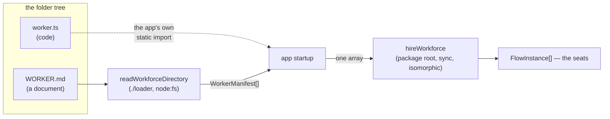

# FIX-1342: Code-defined workers (`worker.ts`) have no path to hire — Implementation Spec

## Part I — The Case *(for the human)*

### 1. Problem — why it matters, why now

Someone building a multi-seat app describes each worker in a folder. Most workers are a
document: a few settings and some instructions. A few are not — they need a decision made in
code, and no document can hold one.

Today that author drops a `worker.ts` into the folder and the app refuses to boot, reporting
their folder as broken. The framework *can* run that worker. Nothing says so. The gap is not
capability, it is that we say "no" where the answer is "yes, like this."

**Why now** — the folder convention just shipped, so the first person to try this hits it in
the first hour, and an error reads as *unsupported* rather than *undocumented*.

### 2. Solution in plain terms

Say yes properly, in the two places that say no.

A worker whose shape needs code is written as code the app imports itself, and handed to the
hire beside the ones read off disk. That works today, on the shipped API — I built it and ran
it (§7). What is missing is that nobody wrote it down, and that the refusal points at no door.
So: document the code route, and change the refusal to name it. No new framework surface, and
the framework still never imports an app's code.

**Philosophy** — tenet 2: the hire already takes worker records from any source. Tenet 3: a
framework-side importer would be a second route to a job already served. Tenet 4: which module
systems and bundlers can load a computed path is the host's business, and absorbing it would
put that knowledge inside an isomorphic package.

### 6. Decisions & rules — the sign-off surface

1. **The app imports its own code worker and passes it to the hire; the framework never
   imports a worker file.** *Rejected:* a `worker.ts` the loader, or a new async entry point,
   imports for you.
   *Locks in:* we are not promising "drop a folder in and it runs" for code workers — adding
   one costs a line in the app's startup. In exchange it behaves the same on every host we
   support. The alternative works under our CLI and fails on a bundled deploy, which is a
   promise we would have to walk back.

2. **A code-defined worker is a named export of the very same record a `WORKER.md` produces —
   the settings bag and the instructions, under the same names.** *Rejected:* a bespoke
   code-only shape, and a default export.
   *Locks in:* one record, two authoring routes, so moving a worker between them rewrites
   nothing. This is what we teach, and changing it costs the docs and every app that copied
   them. The default export is rejected on measured grounds, not taste (§7).

3. **A folder holding only code is still refused, and the message names the route.**
   *Rejected:* loading it into a partial record — what was removed before merge.
   *Locks in:* an author doing it wrong is told where to go, and an app never boots a worker
   short in silence.

**Non-goals** — a build step that generates worker imports, watching the tree, and any
framework-side module loading. §12 says when the first becomes worth revisiting.


**Size:** Small — 1 production file · 3 test behaviours · 2 doc surfaces · 1 PR.

---

### 3. Tradeoffs & alternatives

The issue asks how an async module load reconciles with a synchronous, isomorphic
`hireWorkforce`. Four ways, priced:

**A. A separate async entry point** (`loadWorkforce(root, { kinds })` on `./loader`).
Reads the tree, imports each `worker.ts`, hires. Rejected: it does not solve the problem, it
relocates it. The import still has to work, and §7 shows it mostly doesn't. It also splits
the hire surface in two, so every reader now asks which one they want.

**B. A build-time step** (`fsdev workforce build` emits a module of static imports).
This is the only *correct* way to build a code door — static imports are bundler-safe and
host-neutral. Rejected for now on cost, not on soundness: a new CLI command, a generated file
in the app's tree, a step in every app's build, and a stale-generation failure mode, all to
save one import line. Named in §12 as the upgrade path if demand appears.

**C. The loader records the path; the caller imports it.** What was built and removed.
Rejected: it is worse than nothing. It hands the author a string whose most obvious use —
`import(thatString)` — fails (§7, experiment A), and it buys no capability, since the app
already knows its own folder layout.

**D. The app imports its own worker and composes the roster.** Recommended. Zero new surface,
works everywhere, and it already works.

**The simpler approach considered — close the issue as "already possible."** Genuinely
tempting, and it is half right. Insufficient because the loader *actively reports* the
author's folder as broken. Leaving that in place while claiming the case is served is the
kind of gap between what the code says and what we say that tenet 1 exists to prevent.

**Where the complexity is:** not in the change, which is small. It is in the claim underneath
it — that framework-side importing is a trap rather than merely unbuilt. §7 is mostly that.

### 4. Focus practices (1–5)

1. **BP-003 (execute the claim, don't read it)** — this spec argues *against* a build on the
   strength of runtime behaviour. Every such claim is measured in §7, not asserted.
2. **Tenet 3 (earn every addition)** — the deliverable is documentation and one error
   message. If the implementation grows an export, the spec was wrong.
3. **BP-039 / the outsider rule** — the docs page must describe the code route as a way to
   define a worker, never as the thing that was removed before merge.

### 5. What using it looks like

**Defining a worker in code** — the file the author writes, in the same folder:

```ts
// teams/engineering/workers/router/worker.ts
import type { WorkerManifest } from "@flow-state-dev/workforce";

export const routerWorker: WorkerManifest = {
  id: "engineering.router",
  // `declared` is what a WORKER.md writes between the `---` fences.
  declared: {
    description: "Sends each request to the desk that owns it.",
    flow: "router",
    route: (subject) => desks.find((d) => subject.includes(d)) ?? "billing",
  },
  // `body` is what a WORKER.md writes below them. It reaches the flow as
  // `instructions`, by the same rule, whichever route the record came from.
  body: "You route requests. You never answer them yourself.",
};
```

`route` is the point: it is a function, so no `WORKER.md` could have carried it. Everything
else is the document's own two halves, written out instead of parsed.

**Hiring both kinds together** — the app's startup, before and after:

```ts
// before — only the workers a document could describe
const { workers } = await readWorkforceDirectory("./workforce");
const seats = hireWorkforce(workers, { kinds });

// after — the code worker joins the roster
import { routerWorker } from "./workforce/teams/engineering/workers/router/worker";
const seats = hireWorkforce([...workers, routerWorker], { kinds });
```

**What the loader says about that folder (before / after):**

```
before  teams/engineering/workers/router: Worker folder "router" has no WORKER.md
after   teams/engineering/workers/router: Worker folder "router" has no WORKER.md.
        A worker defined in code is imported by your app and passed to hireWorkforce
        alongside the workers read from disk — it is not loaded from this folder.
```

---

## Part II — The Build Plan *(for the implementing agent)*

### 7. Technical design

Nothing changes about how the pieces fit. The point of this section is the evidence for
Decision 1, because the design is "don't build the other thing."



The loader's arrow stops at records. The code worker's arrow never touches the framework.
Both arrive at the hire as the same type, which is why one call takes both.

**Surface change:** none. `WorkerManifest` is already exported from the package root, and
`hireWorkforce` already documents its input as "from the loader, or hand-built."

#### The evidence — why the framework must not import a `worker.ts`

Run on Node v22.22.2. Commands and full transcripts are in the POC directory (below).

- **A recorded path is not an importable specifier.** `import("impt/teams/w.mjs")` →
  `ERR_MODULE_NOT_FOUND: Cannot find package 'impt'`. Node reads a bare relative path as a
  package name. Reproduces the finding from the epic. `./`-prefixed and `pathToFileURL()`
  forms both resolve — so the fix is knowable, which is exactly what makes the recorded path
  a trap: it looks usable and the obvious use fails.

- **Node's native TypeScript support does not reach a real `worker.ts`.** Type-stripping
  carries erasable syntax only, and only with no imports:

  | the file contains | result |
  |---|---|
  | types and an `interface` | loads |
  | an `enum` | `ERR_UNSUPPORTED_TYPESCRIPT_SYNTAX` |
  | `import { z } from "zod"` | `ERR_MODULE_NOT_FOUND` |
  | `import { x } from "./sibling"` (no extension) | `ERR_MODULE_NOT_FOUND` |

  A worker complex enough to need code is a worker that imports something. All three
  realistic shapes fail. Making them work means giving the framework the app's module
  resolution — a TS runtime, `tsconfig` paths, and the app's `node_modules`.

- **"Default export" is not one shape.** The same module's default export arrives bare under
  ESM and double-wrapped as `{ default: { default: … } }` under CJS interop. A framework-side
  loader would have to unwrap that by guessing about a module it did not write. A named
  export is the same object either way — which is Decision 2.

- **A bundled host cannot be relied on for a computed import.** The repo's own runtime-import
  site (`packages/core/src/models/createModelResolver.ts`) carries
  `/* webpackIgnore: true */ /* turbopackIgnore: true */` precisely because a bundler cannot
  resolve a computed specifier. An ignored import then needs the file present on the deployed
  filesystem, which a traced serverless bundle does not promise. `@flow-state-dev/next` and
  `@flow-state-dev/vercel` are supported hosts, so a door that works under `fsdev` and fails
  on deploy is a promise we would have to walk back.

There is also a grounding hook, not just a technical one: the epic's own invent-kill list
(FIX-1332) says **no hot-dynamic kinds.** A `worker.ts` the framework imports at hire time to
produce a seat is one.

#### POC — built, run, and it holds

`spec-poc/FIX-1342-code-door/` on this PR. `pnpm tsx spec-poc/FIX-1342-code-door/run.mts`.

A worker whose distinguishing setting is a live routing function is hired beside two
document workers, in one synchronous `hireWorkforce` call, with no framework change. Graded by
**calling** the function against held-out inputs, not by checking the key exists. It passes,
and it was controlled three ways, each failing as predicted: the function hard-coded to one
answer, the code worker left out of the roster, and the value written as a string the way YAML
would have to (refused by the flow's own `configSchema`, which is the framework already
policing this boundary at the right seam).

The premise held. The composition needed no change to be recommended.

### 8. Implementation sequence

1. **Sharpen the refusal.** In the loader's worker-slot read, the "no `WORKER.md`" error gains
   a second sentence naming the code route (§5). Nothing else about classification, walking, or
   `errors` changes. *Test:* a folder holding only a `worker.ts` is still reported, under its
   own path, with a message that names the route. *Depends on:* nothing.
2. **Document the code route** on the workers-on-disk page and the package README, per §11.
   *Depends on:* 1, for the message it quotes.
3. **Remove nothing.** There is no superseded path here — the code route is not new, it was
   only unwritten. Named explicitly because tenet 3 asks the question.

No changeset (BP-022): no published surface changes.

### 9. Edge cases & error handling

| Case | Expected |
|---|---|
| Folder holds only `worker.ts` | Reported, as today, with the new message. Never loaded |
| Folder holds `WORKER.md` **and** `worker.ts` | The document loads, exactly as today; the `.ts` is invisible to the loader |
| Hand-built record collides with a file worker's id | Already refused by the hire, naming the id — two workers, one address |
| Hand-built record omits `flow` | Already refused, naming the worker |
| Hand-built record's settings fail the flow's `configSchema` | Already refused by the flow, naming the setting |

**Taxonomy:** unchanged. Loader problems stay collected in `errors`; hire problems stay
collected and thrown together. This change adds no new failure mode, which is the argument
for it.

**Second path (BP-035):** the second path here is a roster whose records came from two
sources. It is already covered by the hire's existing id-collision and schema refusals,
because the hire never knew where a record came from. Worth one test that a mixed roster
hires, so that stays true.

### 10. Testing strategy

**Goal check:** the existing `goals/workforce-conventions/files-alone-produce-the-roster`
covers the document door and should not change. No new goal check applies — the deliverable
is a message and documentation, and the behavioural claim underneath it is settled by the
POC in §7 rather than by a goal.

**CI specs** (behaviours, not test names), in `packages/workforce/test/`:

- a worker folder holding only a `worker.ts` is reported under its own path, and the message
  names the route an author should take (Decision 3)
- a roster mixing loader records with a hand-built record hires in one call, and each seat
  carries its own settings (Decision 1) — the mixed-source path
- a hand-built record whose id collides with a loaded one is refused naming the id, so
  composing a roster cannot silently shadow a file worker

**What must not change:** the loader's classification, which folders are reported and which
are passed over in silence, and every existing error path. A code-only folder is still an
error; only its wording moves.

**Discipline:** `tdd`. The seam is the loader's slot read and `hireWorkforce`, both reachable
from a plain vitest spec with a temp directory — no host, no model.

### 11. Documentation plan

- **EXTEND** `apps/docs/docs/orchestration/workers-on-disk.md` — a new section, **"A worker
  written in code"**, placed after "Hiring the roster" and before "What this does not do".
  It belongs after hiring because it only makes sense once the reader knows a record is what
  gets hired. Covers: when a document isn't enough (a setting that is a function is the clear
  case), the record a code file exports, composing it into the roster, and what the loader does
  with the folder. One minimal example — the `[...workers, routerWorker]` line from §5, which is
  the whole idea. Cross-link → `../fundamentals/flows.md#copies-that-differ-by-settings` for the
  settings bag; ← from "When a folder is wrong", whose bullet about a folder with no `WORKER.md`
  should point here.
  *Voice risks:* the outsider rule is the one to watch — this section must never mention that a
  `codePath` field once existed or that a door was removed. Also: don't call it "the second
  door" in user docs, which is our internal word; and no "seamless"/"first-class".
- **EXTEND** `packages/workforce/README.md` — one short subsection under "Hiring a workforce",
  since the README already says records may be hand-built. Say what a code-defined worker is
  and show the compose line. No new table row: nothing about `WorkerManifest` changes.
- **No new page.** This is one section under a concept that already has a page. A separate page
  would imply a separate mechanism, which is precisely the thing this spec says it isn't.
- **No architecture-doc change.** No locked contract moves.

### 12. Dependencies, open questions & follow-ups

**Dependencies:**

- **FIX-1344 part 1 (`persona` → `instructions`)** — the setting a worker's body arrives as.
  It is not a field on the record (that is `body`, unchanged), so the rename touches only the
  prose and the examples this spec commissions. Written here against `instructions`. If
  FIX-1344 lands first, the docs are written once; if this lands first, the same sentences are
  rewritten by that issue. Neither blocks the other — but sequence this **after** FIX-1344 so
  the docs are not written twice.
- Nothing else. The loader and the hire are both on `main`.

**Open questions:** none. The one live fork is Decision 1, put to the owner in the PR
description rather than left open here.

**Follow-ups (flagged, not built):**

- **The build-time step (alternative B, §3)** becomes worth revisiting if two things happen
  together: apps report the per-worker import line as real friction, *and* the wanted
  behaviour is genuinely "drop a folder in, deploy, done" rather than "define my worker in
  code." Only a static-import generator can deliver that safely. Recording the condition here
  so a future ask doesn't restart from "make `hireWorkforce` async."
- **The docs page's error list** (`apps/docs/docs/orchestration/workers-on-disk.md`, "What
  lands in `errors`") will carry a bullet whose wording now lives in two places, the page and
  the loader. Small, and worth watching rather than fixing now.

---

## Spec evolution *(the change story, not an audit log)*

- **Spec drafted** — framed as a documentation and honesty gap rather than a missing feature,
  after a POC showed a code-defined worker already hires on the shipped synchronous API, and
  four measured runtime findings showed that a framework-side `worker.ts` import cannot work
  reliably on the hosts we support. Recommends documenting the composition and sharpening the
  loader's refusal, and names a build-time generator as the priced upgrade path if the "drop
  a folder in" ergonomic is later wanted for real.
