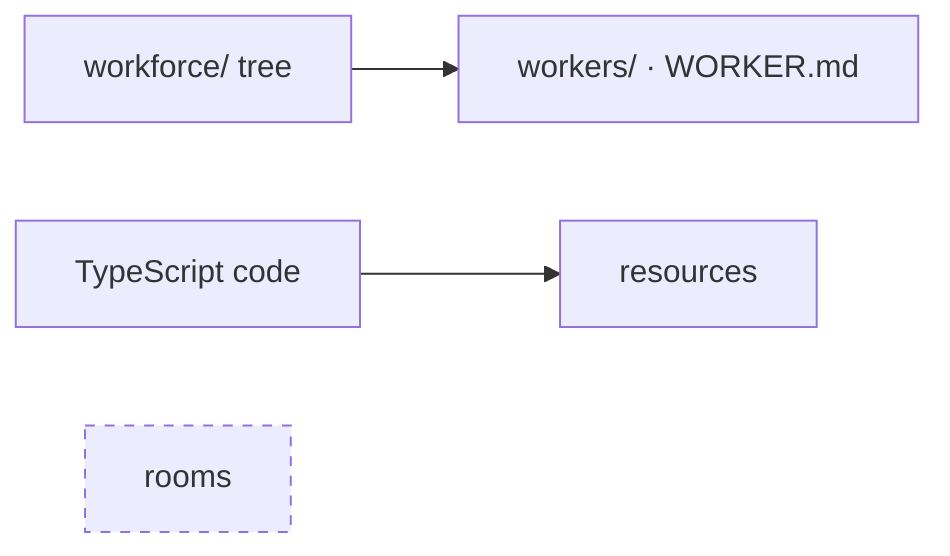
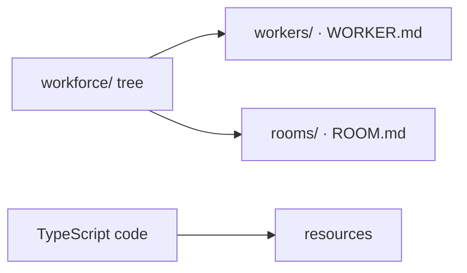
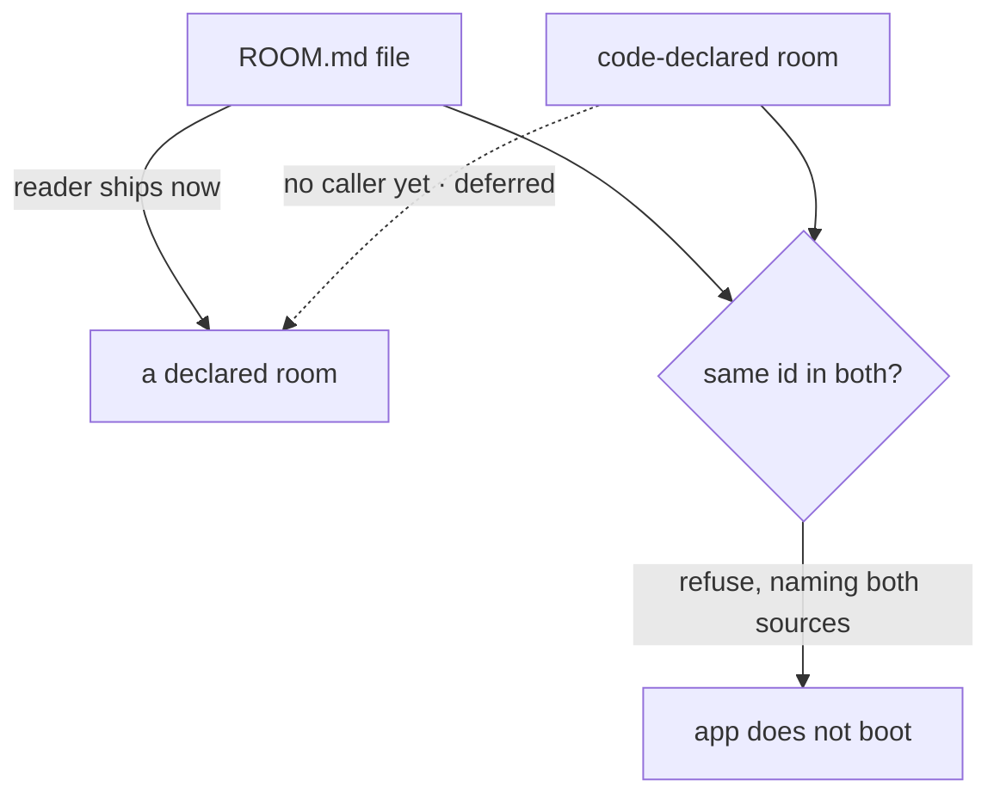

# FIX-1352 — explainer

*Three pictures of one decision. The full case is in [`FIX-1352.md`](FIX-1352.md); the sign-off
is on the PR. Nothing here asks you for anything.*

---

## 1. Today — a worker is a folder; a room is nothing at all

An author adds a worker by adding a folder. There is no way to add a room — not in code, not
in files. Resources are the code-declared case; rooms are the empty one. The tree describes
who you employ and nothing else about the team.

---

## 2. After — a room is a folder too

Same shape, deliberately: a folder with a manifest inside it. One header key is required
(`description`), one is refused by name, and every other key an author writes is carried
through untouched for whoever claims it later.

**This is the shape the epic's other three conventions copy.** Getting it wrong is paid for
three more times inside this epic, then once per convention by every app author.

---

## 3. Two sources, one built — and no winner

The FIX-1341 lock says a room may be declared in a file **or** in code. This issue settles
both rules and builds only the half that has a caller.

**There is no precedence rule, and that is the decision.** File-wins and code-wins both let
an app run a room nobody can point to the declaration of. Refusing is also the reversible
order: adding an explicit override later breaks nobody, while loosening a precedence rule
later breaks every app that came to depend on it.

`system` status is derived from where a room was declared, never typed. A `ROOM.md` that
writes `system:` is refused by name, so no author and no file-writing helper can mint an
undeletable room.

**What ships:** 5 production files, 2 test behaviours, 1 doc surface. The reconciler, the
provenance stamp, and the roster all wait for their first caller.
