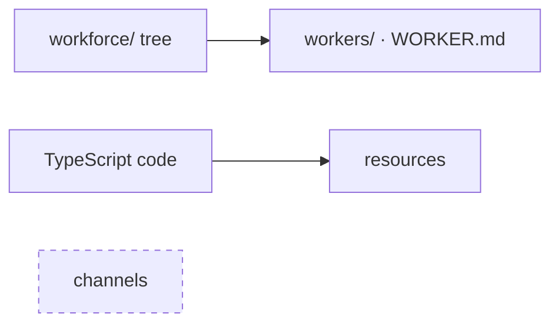
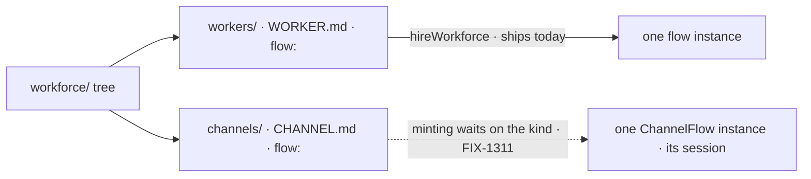
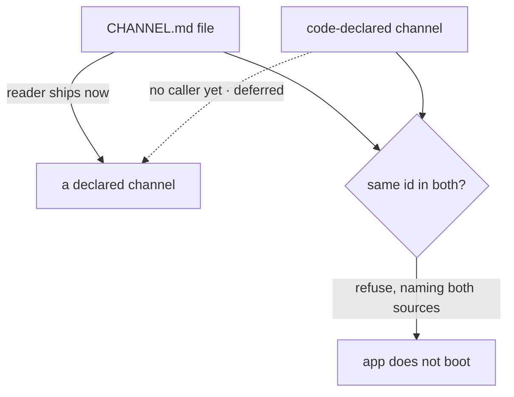

# FIX-1352 — explainer

*Three pictures of one decision. The full case is in [`FIX-1352.md`](FIX-1352.md); the sign-off
is on the PR. Nothing here asks you for anything.*

---

## 1. Today — a worker is a folder; a channel is nothing at all

An author adds a worker by adding a folder. There is no way to add a channel — not in code,
not in files. Resources are the code-declared case; channels are the empty one.

---

## 2. After (proposed) — a channel is a flow instance, not a name on a board

A channel is a replaceable flow kind, default **ChannelFlow**. Each declared channel is one
instance with its own session. `flow:` picks the kind exactly as on `WORKER.md`: the reader
carries it verbatim, the minter resolves it.

---

## 3. Two sources, one built — and no winner

**No precedence rule — that is the decision.** Either winner lets an app run a channel nobody
can point to the declaration of. And `system` is derived from where a channel was declared,
never typed.

---

**What ships:** 5 production files, 2 test behaviours, 1 doc surface, sequenced behind the
default ChannelFlow kind. The reconciler and its provenance stamp wait for a second
declaration source. The Collab roster is out of W3 entirely.
