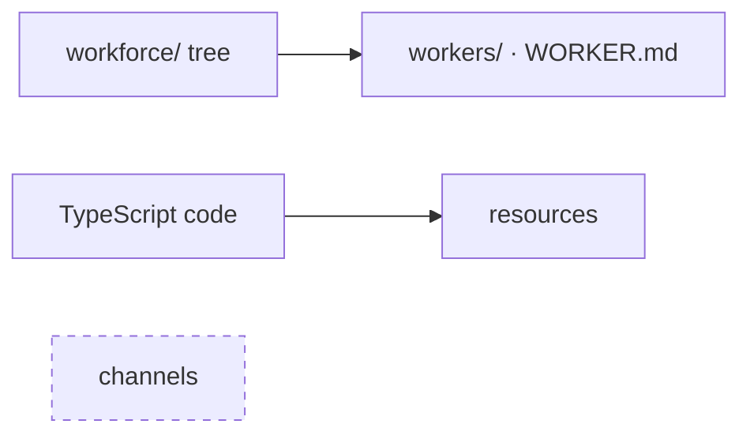
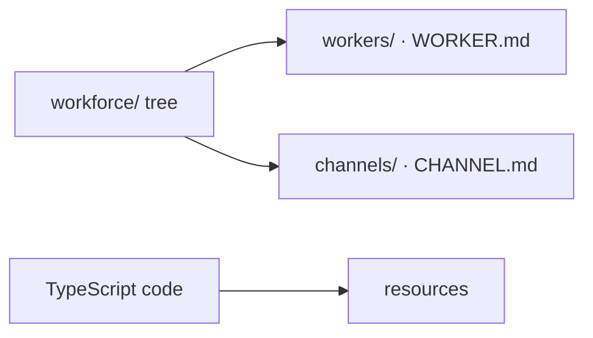
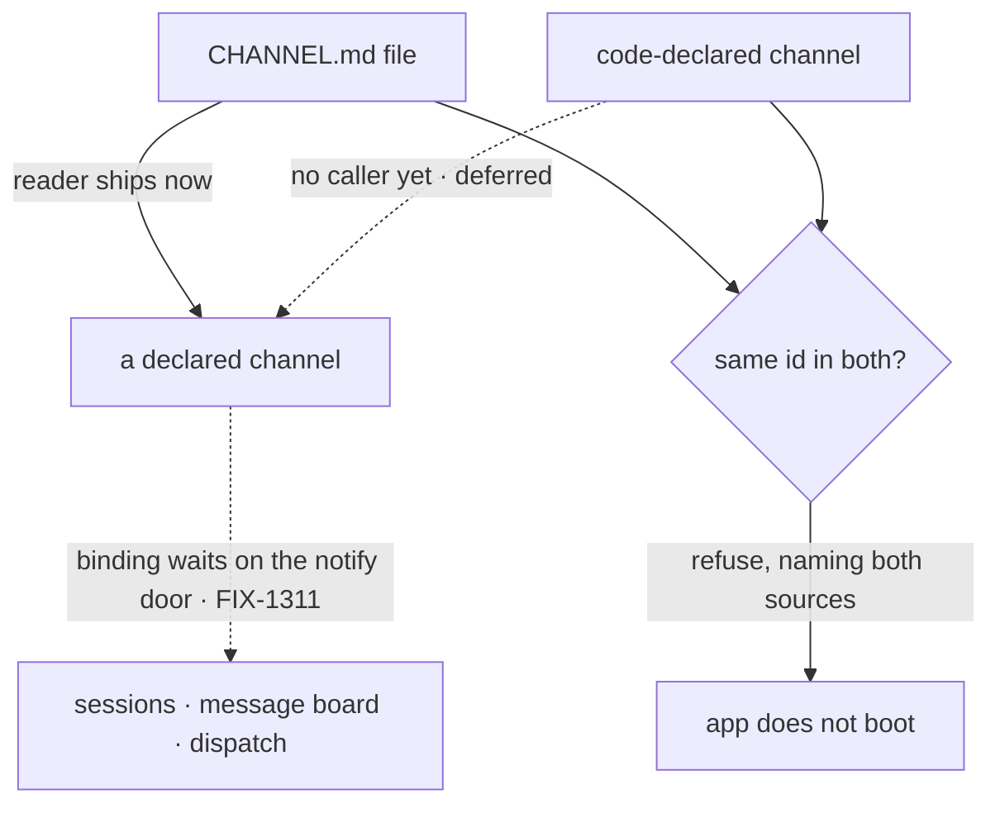

# FIX-1352 — explainer

*Three pictures of one decision. The full case is in [`FIX-1352.md`](FIX-1352.md); the sign-off
is on the PR. Nothing here asks you for anything.*

---

## 1. Today — a worker is a folder; a channel is nothing at all

An author adds a worker by adding a folder. There is no way to add a channel — not in code,
not in files. Resources are the code-declared case; channels are the empty one. The tree
describes who you employ and nothing else about the team.

---

## 2. After (proposed) — a channel is a folder too

This is the shape under approval, not a shape that ships. Same shape as a worker, deliberately:
a folder with a manifest inside it. One header key is required (`description`), one is refused
by name, and every other key an author writes is carried through untouched.

**This is the epic's one communication file type** — there is no second tree beside it — **and
the shape its other two conventions copy.** Getting it wrong is paid for twice more inside this
epic, then once per convention by every app author.

---

## 3. Two sources, one built — and no winner

The FIX-1341 lock says a channel may be declared in a file **or** in code. This issue settles
both rules and builds only the half that has a caller.

**There is no precedence rule, and that is the decision.** File-wins and code-wins both let an
app run a channel nobody can point to the declaration of. Refusing is also the reversible
order: adding an explicit override later breaks nobody, while loosening a precedence rule later
breaks every app that came to depend on it.

`system` status is derived from where a channel was declared, never typed. A `CHANNEL.md` that
writes `system:` is refused by name, so no author and no file-writing helper can mint an
undeletable channel.

**What ships:** 5 production files, 2 test behaviours, 1 doc surface, sequenced behind the
message board's minimal notify door. The reconciler, the provenance stamp and the roster all
wait for their first caller.
