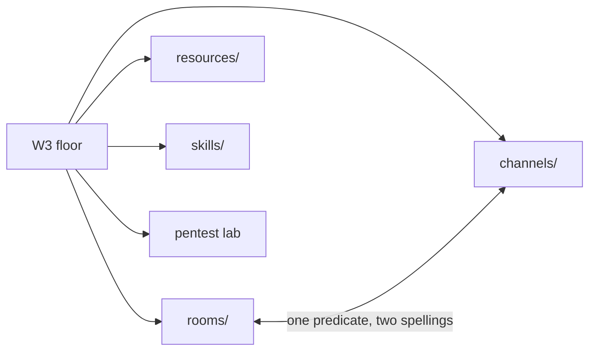
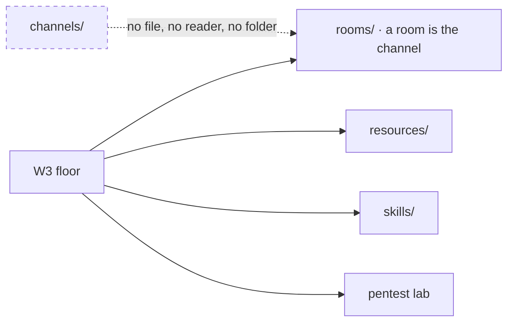
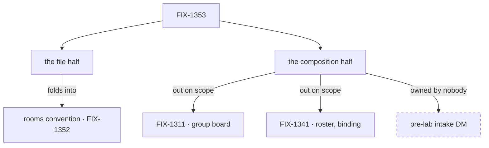

# FIX-1353 — explainer

*Three pictures of one decision. The full case is in [`FIX-1353.md`](FIX-1353.md); the sign-off
is on the PR. Nothing here asks you for anything.*

---

## 1. Today — the floor names four things, and two of them are one thing



A room *binds* sessions and boards. A channel *composes as* sessions and boards. Nothing
distinguishes them: membership, binding kind, and declared-versus-minted all collapse back
into rooms.

---

## 2. After (proposed) — the channel is the room



This is the fold under approval, not a settled floor. W3 finishes as **three** conventions plus the lab. "Channel" survives as a word for what a
room is *for* — it stops being a second declared thing.

---

## 3. Where each half went

This issue had two halves. Only one of them folds.



The composition half is out of W3 on **scope, not capability** — the group board and the DM
helper are both buildable on today's APIs. The dashed node is the one thing this spec found
and could not place: **do not close FIX-1353 while it is unowned.**

---

## What an author writes

One folder, not two:

```
workforce/teams/pentest/rooms/findings/ROOM.md
```

```md
---
description: Where the pentest team posts findings.
kind: group
members: [pentest.scanner, pentest.analyst]
---
```

`kind: group` is carried verbatim — no code reads it yet, and none needs to.

**What ships:** zero production code. Six recordings — one comment, four Linear edits, one
filed follow-up (FIX-1358, the atlas reconciliation).
