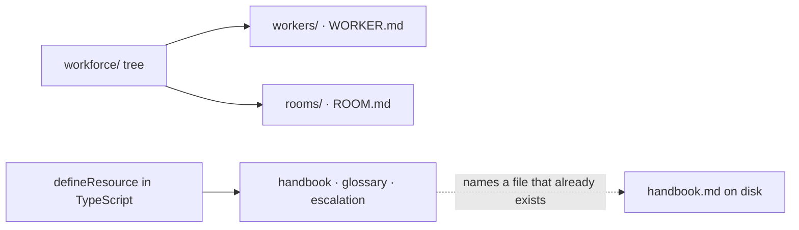
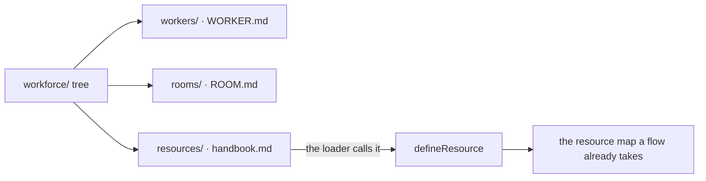
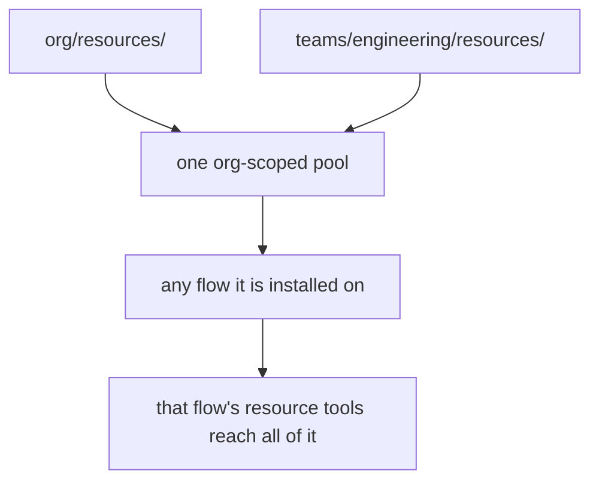

# FIX-1354 — explainer

*Three pictures of one decision. The full case is in [`FIX-1354.md`](FIX-1354.md); the sign-off
is on the PR. Nothing here asks you for anything.*

---

## 1. Today — the documents are files; the list of them is not

An author who learned to add a worker by adding a folder adds a document by editing a source
file and redeploying — to register a document that is already sitting on disk.

---

## 2. After (proposed) — a document is a file in `resources/`

This is the shape under approval, not a shape that ships. **`defineResource` stays, and the new loader is what calls it.** A file is a second way to
declare a document, not a replacement — telling authors to write `defineResource({ contentFile })`
was the *rejected* alternative, and resources carrying a state schema or a render function stay
in code, because a Markdown file cannot honestly hold a function.

**A resource is a file, not a folder — and that breaks the shape its two siblings set.**
Deliberately. A worker folder and a room folder are containers; the atlas draws
`workers/NAME/skills/` inside a worker. A resource folder would contain nothing, because
anything you would put beside a document *is* a document.

So the epic ships three folder-conventions and one file-convention, on the record as a
considered break rather than an inconsistency someone later "fixes".

---

## 3. Two levels — a namespace, not a boundary

Where a file sits decides its identity and storage key, so the file does not get to say.
**What the team level does not do is fence anything off.** Every file-declared document is
org-scoped; a flow that has them installed can reach them all.

Partitioning by team is the app's job — install only that team's documents. A convention
that *reads* as isolation and isn't would be worse than one making no claim, which is why
the file is also refused if it tries to declare its own scope.

**What ships:** one reader and one pure function that calls `defineResource` — the same
function an author calls by hand today. No second registry; L1 already has one. This buys
layout consistency and a keying rule, not capability, and the spec prices that trade rather
than selling it.
