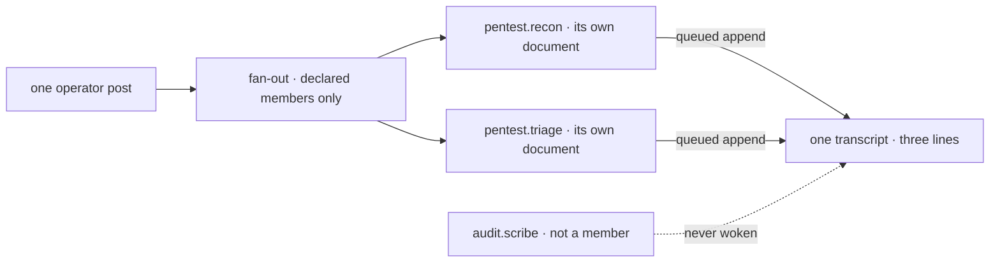

# FIX-1355 · Business rules

[Spec](SPEC.md) · [Decisions](DECISIONS.md) · **Rules** · [Plan](PLAN.md)

This issue builds a Proof, so its rules are the properties one run must demonstrate. **G** is the
model-free gate; **M** is the model-backed check. Review this page for a property the proof is
missing; the plan turns each row into a leg.

## What the files produce

| # | When | Then | Proved by |
|---|---|---|---|
| BR-1 | The lab is pointed at its tree and nothing is registered by hand | Three seats, one channel, three documents and each seat's own skill set come back. No file is named anywhere in the lab's code except the root | G |
| BR-2 | A seat runs | Its `instructions` are its own `WORKER.md` body — carrying that file's held-out token, and no sibling's | G · M |
| BR-3 | A seat's skills are read | Exactly its org ∪ team ∪ own union, by name: `recon` holds three, `triage` two, `scribe` two. The two `port-scan` folders carry different tokens, and each seat holds its own team's | G |
| BR-4 | A seat reads its document | It arrives through the resource surface at the ref the convention mints — bare at org level, `teams/<id>/<name>` for a team's — with its body intact | G · M |
| BR-5 | The channel opens | At the id its two folder names mint, carrying the declared members and the `CHANNEL.md` body as its charter | G |

## The fan-out

| # | When | Then | Proved by |
|---|---|---|---|
| BR-6 | An operator posts one line, with no `author` | The line is appended, and the framework's fan-out wakes **exactly** the two declared members | G |
| BR-7 | A woken seat posts back under its own id | Accepted, because that id is a declared member, and stored with `authorVerified: false` | G · M |
| BR-8 | A seat's own line reaches the router | Nobody is dispatched. The transcript settles at three lines and stays there | G |
| BR-9 | A declared member has no address in the lab's router | Recorded and skipped. The other member still runs, and membership is unchanged | G |
| BR-10 | A `CHANNEL.md` names a member that is no hired seat | The channel still opens. Membership is a declared list, not a roster check — it lands on BR-9 | G |

## Under contention · what a single seat cannot show

Follow the two lanes into the one session. Everything a single-seat run would also show sits on
one lane; the rules below only exist where the lanes meet. The seat outside the fence is the probe
a shared register would fail.

| # | When | Then | Proved by |
|---|---|---|---|
| BR-11 | Both member seats answer one post at the same time | Both lines are present in the final transcript. Neither append overwrites the other | G |
| BR-12 | Each seat's line is read | It carries its own instructions token, its own document's token and its own skill names — and none of its sibling's | G · M |
| BR-13 | The non-member seat in the other team is looked for | It was never woken, and its token appears nowhere in the transcript | G |
| BR-14 | The transcript is graded | On presence and attribution, never on index. Two concurrent appends have no guaranteed order, and asserting one is how a correct implementation fails | G · M |
| BR-15 | The store is closed and a fresh host is built over the same file | The transcript reads the same, line for line | G |

## Refusals, and what a run does with them

| # | When | Then | Proved by |
|---|---|---|---|
| BR-16 | A request carries no org | Refused at the door by the reading block's `requireOrg`, rather than arriving with every document missing | G |
| BR-17 | A post claims an `author` the channel's roster does not hold | Refused `author-not-a-member`; nothing is written | G |
| BR-18 | A `WORKER.md` names a kind the lab never passed | The whole hire refuses, naming the worker. The run reports that and stops rather than running a short roster | G |
| BR-19 | The fan-out does not complete inside the run's bound | The run fails loudly, naming how many lines it saw. Delivery is best-effort by design, so a silent short transcript must never read as a pass | G · M |

## With a real model

| # | When | Then | Proved by |
|---|---|---|---|
| BR-20 | The same tree runs with a generator in the answering slot | Each member's answer names something only its own document says, and both land in the one transcript by the same path | M |

## Failure taxonomy

Two things are fatal and stop the run: a roster that will not hire (BR-18), and a channel that
will not open. Everything on the delivery path is best-effort by the framework's own design — a
refused hand-off, a member with no address, a slow seat — which is why BR-19 makes an incomplete
transcript a loud failure rather than the quiet one it would be. Nothing retries.

## Acceptance criteria this issue owns

A tree of Markdown files, pointed at once, ends as a transcript in which two file-declared seats
each answered a post using the document, the skills and the instructions their own folders gave
them, with a third seat silent — read back after a restart. That is the gate (G): the epic's
ER-19, ER-20 and ER-21 in one run. The model-backed check (M) is the same claim with a model in
the answering slot, which is what ER-19 asks for by name
([the epic's rules](https://github.com/fixpoint-labs/flow-state-dev/pull/1718)).
