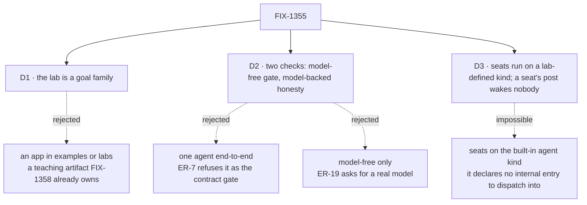

# FIX-1355 · Decisions

[Spec](SPEC.md) · **Decisions** · [Rules](BUSINESS-RULES.md) · [Plan](PLAN.md)

Three decisions are the sign-off surface; the settled claims are what the design rests on.

## The tree

Solid edges are what you're signing. Dashed edges lost, and the label says why.

## D1 · The lab is a goal family, `goals/pentest-lab/`, not an app under `examples/` or `labs/`

| | |
|---|---|
| **Instead of** | An application an author opens and runs — `examples/pentest-lab/`, or a `labs/` entry |
| **Because** | The epic asks for evidence, re-run a year from now against the same verdict log. An app teaches, and teaching the tree is **FIX-1358's**, already spec-approved. `labs/` sets a bar — real data, durable state, domain requirements — this thin thing does not meet |
| **Locks in** | The conventions' only consumer is something authors read, not something they clone. A runnable sample later is a new issue, with FIX-1358's teach as its brief |

**What would change my mind:** an owner who wants the lab demonstrable in a browser. The tree and
both kinds move to `examples/` unchanged; only the driver is rewritten.

## D2 · Two checks — a model-free one is the contract gate, a model-backed one is the honesty check

| | |
|---|---|
| **Instead of** | One agent end-to-end · or a model-free check alone |
| **Because** | The epic means different things by them. [ER-7](https://github.com/fixpoint-labs/flow-state-dev/pull/1718) refuses an agent run as the contract gate — a model improvising around a missing document still reads as a pass. [ER-19](https://github.com/fixpoint-labs/flow-state-dev/pull/1718) asks for a real model, because a handler printing its own config proves plumbing, not usefulness |
| **Locks in** | The **gate** is the model-free one: it is what a regression is measured against. The model-backed one is still **required at completion**, on `goals/README.md`'s terms — a red BR-20 is the claim failing, and only an unavailable inference credential is recorded **blocked** and surfaced. Neither reads as done |

Both drive the **same** tree and wiring: the kind takes its answering block as a slot, so the two
runs differ by one block and nothing else.

## D3 · The seats run on a kind the lab defines, and a seat's own post wakes nobody

| | |
|---|---|
| **Instead of** | Seats on the built-in `agent` kind, woken by the channel's fan-out |
| **Because** | It is not available: a dispatch resolves `flow.internal.actions[action]` and never falls through to a public one, and the built-in kind declares `actions.run` with no internal map, so a delivery refuses `no-entry`. And a fan-out routing **every** post routes a seat's answer too — two seats replying to each other without end |
| **Locks in** | The lab proves the *convention* surface on a kind it wrote, and **not** the built-in kind under fan-out, because no such path exists. The cycle break is the lab's own rule, so anyone copying the wiring copies the rule |

The router the lab writes is the **notify slot** of `defineChannelFlow` — one block, run once per
declared member. The member walk stays in `channel-flow.ts`; the lab supplies addresses and the
author gate ([PLAN → S3](PLAN.md)). That a channel can wake anything **except** the framework's
own worker kind is a finding, filed as a follow-up.

## Decided, not asked

- **Three seats, not two.** Two are members; the third sits in another team holding a skill of the
  same name and must stay silent. A two-seat lab cannot fail the isolation checks.
- **The lab wraps its session client to bind an org.** `openChannels` has nowhere to put an
  `orgId`, and every file-declared document is org-scoped — so an unwrapped lab opens a channel
  its own seats are refused delivery into. Two lines; reported up as
  [ER-14](https://github.com/fixpoint-labs/flow-state-dev/pull/1718).
- **Each delivery targets a child session, not an existing one.** `session: { id }` is *never*
  created, so an address to a seat that has no session yet refuses `session-not-found`; a `key`
  child is derived, created on first delivery, and inherits the sender's `orgId`
  (`engine/src/context/create-request-host.ts`). The mechanics are [PLAN → S3](PLAN.md).
- **The host is `createFlowState` — for the store lifecycle, not for dispatch.** A bare
  `createFlowApiRouter` *does* dispatch: it installs `createDispatchOperation({ host })` and
  `resolveFlow` as a last resort when no owner has (`engine/src/routes/http-handlers.ts`). What it
  has no owner for is the `dispose()` BR-15 needs to close the store and rebuild.
- **Held-out markers, as the sibling goals do.** Each token appears in exactly one convention
  file, and nowhere in the lab's code or in the post.

## Considered and dropped

| Alternative | Why not |
|---|---|
| A pentest lab with real scanning tools | Domain theatre. A port scanner adds a dependency, a network and a flake, and proves nothing about files |
| Driving the seats over HTTP instead of through the channel | Skips the fan-out, the one half nothing has ever run ([ER-20](https://github.com/fixpoint-labs/flow-state-dev/pull/1718)) |
| A company-wide channel under `org/channels/` | Declarable and unread. The proof would wait on unbuilt, unowned work |
| One check with the model mocked | A mock feeds the assertion its answer. The goal library exists to remove that crutch |
| A third `it` under `goals/workforce-seats/` | That family is about seats; this is four conventions meeting, and would be hidden there |

## Settled

**Every premise below is run, not read** — `bash spec-poc/FIX-1355-runtime-premises/check-all.sh`,
sixteen assertions, each with a control that makes it able to go red.

The draft settled all of these by reading merged code, because this worktree carried no install.
**Round 1 found one of them false that way** (the bare router does dispatch — corrected above),
which is the argument against the method rather than a detail. The install cost seven seconds.

A first pass ran only the two where being wrong moved the *shape* and argued the rest could stay
read because being wrong about them was cheap. Review upheld against that and was right on the
text: BP-003 says *execute or parse it, don't read it* about **every claim the change rests on**
and grants no exemption for a cheap one. So the cost boundary is gone, not restated.

- **A dispatcher can address one hired seat** — **CONFIRMED, run**
  (`check-key-child-created-and-inherits-org.mts`): a dispatcher naming a seat's exact instance id
  reached that seat and no other — `pentest.recon` ran on instance `pentest.recon`, `pentest.triage`
  on its own.
- **The built-in `agent` kind cannot be dispatched into** — **CONFIRMED, run**
  (`check-agent-kind-has-no-internal-entry.mts`): the kind declares `actions: { run }` and no
  `internal` map, so an `internal` dispatch resolves nothing under `run` or any other name, and
  `resolveEntry` does not fall through from `internal` to a public action of the same name. The
  run's controls show the probe resolving both a public entry and a real internal one, so the
  green is the absent map and not a blind check. D3.
- **A seat's skills reach a custom kind that declares the key** — **CONFIRMED, run**
  (`check-seat-skills-reach-a-custom-kind.mts`): a kind declaring `seatSkills` received the seat's
  union; a kind that does not declare it was left alone and still hired. Both halves, because the
  claim is conditional — imposing the key unconditionally would break every custom kind on a
  roster that has one shared `org/skills/` folder. The lab does not wait on FIX-1367 and stays
  valid once it lands.
- **A delivery never crosses an org boundary** — **CONFIRMED, run**
  (`check-org-boundary-refusal.mts`): a cross-org delivery into an existing session is refused
  `session-not-addressable`, naming both orgs, and the seat never runs; the same-org control
  lands. A file-declared document is org-scoped (`resourcesFromDocs` sets `scope: "org"`), which
  is what makes that boundary the lab's problem and forces the client wrap.
- **A `{ key }` delivery creates the seat's session and inherits the sender's org** —
  **CONFIRMED, run** (`check-key-child-created-and-inherits-org.mts`): both declared members were
  woken by the framework's fan-out, each ran in its own created child carrying the lab's org, and
  the record persisted with it. The control runs the same wiring with `session: { id }` — the
  shape this plan carried before round 1 — and is refused `session-not-found` by name. This is the
  premise S3 rests on, and the one round 1's own P1 fix turned on, so it is checked hardest.
- **`openChannels` has nowhere to put an `orgId`** — **CONFIRMED, run**
  (`check-no-org-door.sh`). An absent field is not observable at runtime, so the evidence is a
  compile that must fail: a probe passing `orgId` to `openChannels` and to its `createSession`
  is refused at both doors with `TS2353`, and the check asserts those two diagnostics
  specifically rather than accepting any red `tsc`. This is what makes the client wrap
  load-bearing rather than cargo, and it is why ER-14 is filed.
- **The lab needs no durable intake DM** — **SETTLED; it closes the epic's open question.** A DM
  is a one-participant channel under epic D2, and one participant cannot show a fan-out — the
  thing being proved. The lab opens a declared team channel, which `openChannels` opens and names.
  The DM opener stays unowned, for whoever wants an *undeclared* session later.

**Open: none.**

## How it got here

- **Draft** — a goal family over one shared lab, every premise read off merged code first.
- **Round 1** — no decision changed; one false premise corrected, the session target pinned,
  duplicated narrative cut to one home each. Every premise then moved from read to **run**
  (`spec-poc/FIX-1355-runtime-premises/`); all held.
- **Owner expand** — a tool leg folded into the model-backed check: a seat calls a block its
  `tools:` names, graded on the call, not the setting. No decision changed; D1–D3 stand. Where the
  block's file lives is a soft sequence, in [PLAN → At implement time](PLAN.md).
