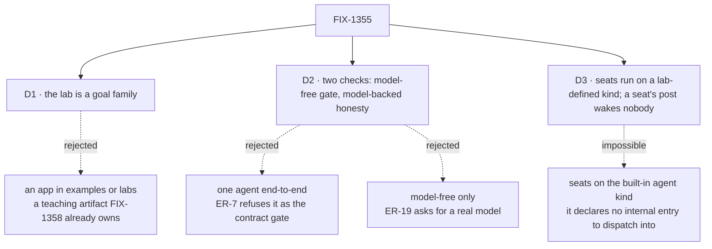

# FIX-1355 · Decisions

[Spec](SPEC.md) · **Decisions** · [Rules](BUSINESS-RULES.md) · [Plan](PLAN.md)

What was considered, chosen, and locked in. Three decisions are the sign-off surface; the settled
claims below them are what the design rests on, each read off merged code rather than assumed.

## The tree

Solid edges are what you're signing. Dashed edges lost, and the label says why.

## D1 · The lab is a goal family, `goals/pentest-lab/`, not an app under `examples/` or `labs/`

| | |
|---|---|
| **Instead of** | A small application an author opens and runs — `examples/pentest-lab/`, or a `labs/` entry |
| **Because** | The epic asks for evidence, re-run a year from now against the same verdict log. An app is a teaching artifact, and teaching the tree is **FIX-1358's**, already spec-approved; a second teach drifts from it. `labs/` sets a bar — real data, durable state, domain requirements — this deliberately thin thing does not meet |
| **Locks in** | The conventions' only consumer is something authors read, not something they clone. A runnable sample later is a new issue with FIX-1358's teach as its brief, not a rewrite of this |

**What would change my mind:** an owner who wants the lab demonstrable in a browser. The tree and
the two flow kinds move to `examples/` unchanged; only the driver is rewritten.

## D2 · Two checks — a model-free one is the contract gate, a model-backed one is the honesty check

| | |
|---|---|
| **Instead of** | One agent end-to-end · or a model-free check alone |
| **Because** | The epic asks for both and means different things by them. [ER-7](https://github.com/fixpoint-labs/flow-state-dev/pull/1718) refuses an agent run as a contract gate — a model improvising around a missing document still reads as a pass. [ER-19](https://github.com/fixpoint-labs/flow-state-dev/pull/1718) asks for a real model, because a handler printing its own config proves plumbing, not usefulness |
| **Locks in** | The gate is the model-free one: it is what a regression is measured against. The model-backed check may be red for a model reason without the epic being unfinished, and its verdict log says which |

Both drive the **same** tree and the same wiring; the kind takes its answering block as a slot, so
the difference between the two runs is one block — a handler or a generator — and nothing else.

## D3 · The seats run on a kind the lab defines, and a seat's own post wakes nobody

| | |
|---|---|
| **Instead of** | Seats on the built-in `agent` kind, woken by the channel's fan-out |
| **Because** | It is not available. A dispatch resolves `flow.internal.actions[action]` and never falls through to a public action; the built-in kind declares `actions.run` and no internal map, so a delivery refuses `no-entry`. And a fan-out routing **every** post routes a seat's answer too — two seats replying to each other without end |
| **Locks in** | The lab proves the *convention* surface on a kind the lab wrote. It does **not** prove the built-in kind under fan-out, because no such path exists to prove. The cycle break is the lab's own rule, so anyone copying the wiring copies the rule with it |

The first half is a finding, not a preference: a channel can wake anything **except** the one
worker kind the framework ships. Filing that is a follow-up, not this issue's work.

## Decided, not asked

- **Three seats, not two.** Two are members; the third is in another team, holds a skill of the
  same name, and must stay silent. A two-seat lab cannot fail the isolation checks.
- **The lab wraps its session client to bind an org.** `openChannels` has nowhere to put an
  `orgId`, while every file-declared document is org-scoped — so an unwrapped lab opens an
  org-unbound channel its own seats are then refused delivery into. Two lines here; reported up as
  a gap ([ER-14](https://github.com/fixpoint-labs/flow-state-dev/pull/1718)).
- **The host is `createFlowState`, not a bare `createFlowApiRouter`.** The bare router carries no
  dispatch operation, so the fan-out is refused and rescued — a lab that passes while waking nobody.
- **Held-out markers, as the sibling goals do.** Each file's token appears in one place on disk.

## Considered and dropped

| Alternative | Why not |
|---|---|
| A pentest lab with real scanning tools | Domain theatre. A port scanner adds a dependency, a network and a flake, and proves nothing about files |
| Driving the seats over HTTP instead of through the channel | Skips the fan-out, the one half nothing has ever run ([ER-20](https://github.com/fixpoint-labs/flow-state-dev/pull/1718)) |
| A company-wide channel under `org/channels/` | Declarable and unread. It would make the proof wait on unbuilt, unowned work |
| One check with the model mocked | A mock feeds the assertion its answer. The goal library exists to remove that crutch |
| A third `it` under `goals/workforce-seats/` | That family is about seats; this is about four conventions meeting, and it would be hidden there |

## Settled

Checked by reading merged code on `main`, not by running it — this worktree has no install. An
implementer who finds one false has found a spec defect, not a detail.

- **A dispatcher can address one hired seat** — **CONFIRMED**: the address is an exact instance
  id, resolved through the registry (`packages/core/src/blocks/dispatcher.ts`,
  `packages/engine/src/context/create-request-host.ts`).
- **The built-in `agent` kind cannot be dispatched into** — **CONFIRMED**: it declares
  `actions: { run }` and no `internal` map (`packages/workforce/src/agent-worker-flow.ts`). D3.
- **A seat's skills reach a custom kind that declares the key today** — **CONFIRMED**:
  `hireWorkforce` imposes `seatSkills` on any kind whose probed config declares it
  (`packages/workforce/src/hire.ts`). **So the lab does not wait on FIX-1367**, and a kind that
  composes the contract now stays valid when FIX-1367 makes it mandatory.
- **A delivery never crosses an org boundary, and a file-declared document is org-scoped** —
  **CONFIRMED**: `resolveExistingSession` refuses a mismatch by name; `resourcesFromDocs` sets
  `scope: "org"`. This is what forces the client wrap above.
- **The lab needs no durable intake DM** — **SETTLED, and it closes the epic's open question.**
  A DM is a one-participant channel under epic D2, and every line of any channel already carries
  the same principal, so a DM isolates nothing a team channel doesn't. One participant also cannot
  show a fan-out, which is the thing being proved. The lab opens with a declared team channel, and
  `openChannels` opens and names it. **Nobody needs to own the DM opener for this lab.** It stays
  unowned for whoever later wants an *undeclared* session — a want without a claimant, not a
  blocker on the proof.

**Open: none.**

## How it got here

- **Draft** — shaped as a goal family over one shared lab; the four conventions' seam picked as
  the subject, and every premise the wiring rests on read off merged code before it was written
  down.
