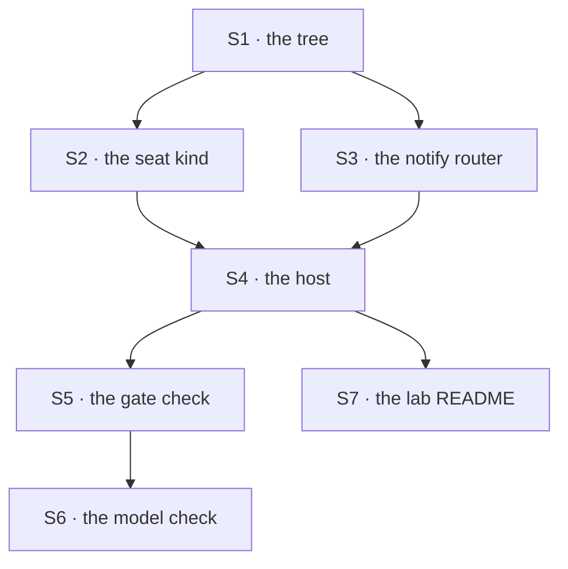

# FIX-1355 · Plan

[Spec](SPEC.md) · [Decisions](DECISIONS.md) · [Rules](BUSINESS-RULES.md) · **Plan**

Written for the implementing agent. IDs cross-reference [BUSINESS-RULES.md](BUSINESS-RULES.md)
(BR-n) and [DECISIONS.md](DECISIONS.md) (D-n). `tdd`, with the goal checks as the outer loop. One
PR. No package changes.

## Surfaces

| ID | Role | Change | Rules |
|---|---|---|---|
| S1 | The tree · `goals/pentest-lab/lab/workforce/` | The ten files in [SPEC.md](SPEC.md). One held-out token per file, each appearing in exactly one place on disk | BR-1 BR-3 BR-4 BR-5 |
| S2 | The seat kind · the lab's own flow | `kind: "probe"`, `cardinality: "collection"`. `configSchema` declares `instructions?`, `seatSkills` and one lab setting naming the document this seat reads. `internal.actions.brief` is a sequencer: the **answer slot**, then a dispatcher posting into the channel the delivery named. The reading block carries `requireOrg: true` | BR-2 BR-3 BR-4 BR-7 BR-16 |
| S3 | The notify router · the lab's own block | A static member-id → dispatcher map, each on one seat's exact instance id. Routes **only** a post whose `author` is absent; a member with no address is recorded and skipped | BR-6 BR-8 BR-9 BR-10 |
| S4 | The host · one module both checks import | Read the tree, build the kinds, hire, `channelInstances`, `createFlowState`, then `openChannels` through a session client wrapped to carry the lab's `orgId` | BR-1 BR-5 BR-15 BR-18 |
| S5 | The gate · `goals/pentest-lab/a-post-reaches-both-declared-seats/` | `goal.md`, `run.mts`, `fixtures/input.json` — every id, token and expected skill name lives in the fixture and is graded against the transcript | BR-1 – BR-19 |
| S6 | The honesty check · `goals/pentest-lab/a-seat-answers-from-its-own-document/` | The same host with a generator in the answer slot, driven as `goals/workforce-seats/the-built-in-kind-answers-from-a-file-alone/` drives its model run | BR-20 |
| S7 | `goals/pentest-lab/lab/README.md` | What the lab wires, and why each piece is the lab's rather than the framework's | — |

## Sequence



## Checks

Every leg has a **control** that must fail first: a check nobody has seen fail has proved nothing
(BP-003).

| ID | Runs after | Passes when |
|---|---|---|
| V1 | S2 | A seat hired from the tree reads its own instructions, its own skill names and its own document from inside a **nested** block. *Control:* one settings bag shared across the roster — must refuse or cross-wire |
| V2 | S3 | One operator post dispatches to exactly the two members; a seat's own post dispatches to nobody. *Control:* route every post — the transcript grows without bound |
| V3 | S4 | The channel opens and a seat's post-back lands. *Control:* drop the org wrap — the delivery is refused by name, proving the wrap is load-bearing rather than cargo |
| VG | S5 | **The gate.** BR-1 to BR-19 in one run, graded after closing the store and rebuilding the host. *Controls:* the two seats' documents swapped (each line carries the other's token); the transcript graded by index (a correct implementation fails); the restart skipped (a live context serves what the file does not hold) |
| VM | S6 | BR-20 on a real model: each member's answer names something only its own document says. Logged with its model and date |
| V4 | S5 | Second path (BP-035): a member with no router address, and a post claiming a non-member author, both behave as BR-9 and BR-17 say — neither takes the run down |

## Pinned names · the few that are public to the tree

| Where | Name | Why pinned |
|---|---|---|
| The kind each `WORKER.md` names | `probe` | Written in the files; the hire maps it |
| The channel's session id | `pentest.findings` | Minted from the two folder names; the post address |
| The seats | `pentest.recon` · `pentest.triage` · `audit.scribe` | Minted from folders; the dispatch addresses and the transcript's authors |
| The family | `goals/pentest-lab/`, with the shared lab at `lab/` beside the two `it` folders | D1 |

Everything else — block names, file layout inside `lab/`, the shape of the fixture JSON — is
yours.

## Guardrails

| Rule | Because |
|---|---|
| Read every value back through the real route, never off a returned object | The question is whether a file reached a running block, and the thing under test will happily agree with itself |
| Assert each seat's sibling value is **absent**, not merely different | One shared bag is always right for somebody |
| Never assert transcript order | Two concurrent appends have no order. BR-14, and the fastest way to write a check that fails on correct code |
| No token in the lab's code — only in the files | A marker the driver could have produced proves nothing was read |
| The lab consumes shipped surfaces and patches none | A convention it has to work around is a finding to report up (ER-14), not a local fix |
| Three seats, no more | The smallest roster that can fail an isolation check. A fourth costs a reader and buys nothing |

## Docs

- **No `apps/docs` page and no package README change.** Teaching the tree is FIX-1358's, already
  spec-approved; a second teach drifts from it (ER-18, ER-22).
- **No changeset.** Nothing published changes (BP-022).
- `goals/pentest-lab/lab/README.md` is the one written surface, and it is internal.

## Sketch · pseudocode, illustrative, react to the shape

```
the notify router, run once per declared member per post:
    if the post carries an author:        ← a seat's own line. The cycle break.
        do nothing
    else if this member has a declared address:
        dispatch → that seat's `brief` entry, carrying the channel id and the line
    else:
        record the member and move on

the seat kind's `brief` entry:
    read its own document from ctx.resources, at the ref its config names
    answer  ← the SLOT: a handler for the gate, a generator for the model check
    post the answer back into the channel the delivery named, author = its own id
```

**POC:** none built. The premises this shape rests on are load-bearing, so they were settled
before the prose was written — by reading merged code, not by running it, because this worktree
carries no install. Each one, with the file it was read from, is in
[DECISIONS.md → Settled](DECISIONS.md#settled). Treat a false one as a spec defect and say so
rather than working around it.

## At implement time

- **FIX-1367 may have landed**, making the `WorkerConfig` contract mandatory on every kind. The
  lab's kind already declares `instructions?` and `seatSkills` — confirm, don't redesign.
- **FIX-1357 may have landed.** Its generated maps could replace the hand-passed ones. Optional,
  and only if strictly less code; the hand-passed map stays valid by epic D6.
- **`org/channels/` may have gained a reader.** Nothing here changes: the lab declares at team
  scope on purpose, and widening it needs a new decision.
- **Re-check the built-in `agent` kind's entries.** If it has gained an internal one, D3's first
  half is stale and the lab may be simpler.

## Follow-ups

- **`openChannels` has no org door.** Its `createSession` call has nowhere to put an `orgId`, so
  an app whose seats read file-declared documents must wrap its client. File it, with the lab's
  wrap as the reproduction.
- **A channel fan-out cannot wake the one worker kind the framework ships.** The built-in `agent`
  kind declares no internal entry. File it as a gap.
- **The fan-out cycle break is every app's to write.** Nothing in the framework stops a channel
  whose members post back from running forever. Worth a documented pattern, or a guard.
