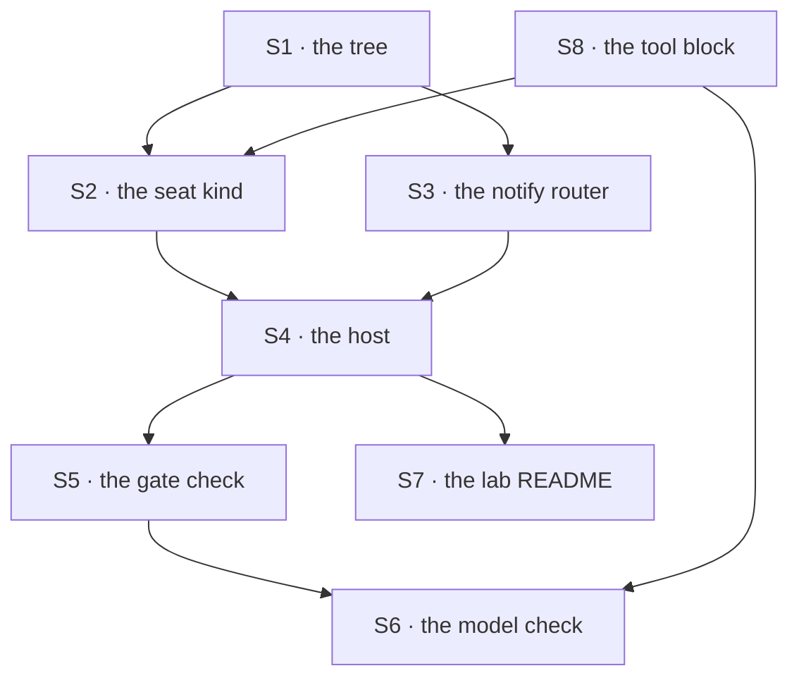

# FIX-1355 · Plan

[Spec](SPEC.md) · [Decisions](DECISIONS.md) · [Rules](BUSINESS-RULES.md) · **Plan**

For the implementing agent. IDs cross-reference [BUSINESS-RULES.md](BUSINESS-RULES.md) (BR-n) and
[DECISIONS.md](DECISIONS.md) (D-n). `tdd`, with the goal checks as the outer loop. One PR, no
package changes.

## Surfaces

| ID | Role | Change | Rules |
|---|---|---|---|
| S1 | The tree · `goals/pentest-lab/lab/workforce/` | The ten files in [SPEC.md](SPEC.md). One held-out token per file, each in exactly one **convention** file and nowhere in the lab's code or the post. The fixture holds the *expected* values, as the sibling goals do. `recon`'s frontmatter alone names the tool key in `tools:` | BR-1 BR-3 BR-4 BR-5 |
| S2 | The seat kind · the lab's own flow | `kind: "probe"`, `cardinality: "collection"`. `configSchema` declares `instructions?`, `seatSkills` and one lab setting naming the document this seat reads. `internal.actions.brief` is a sequencer: the **answer slot**, then a dispatcher posting into the channel the delivery named. The reading block carries `requireOrg: true`. `configSchema` also declares `tools`, refused **at the mint** against the lab's catalog exactly as `defineAgentWorkerFlow` does, and the answer slot's generator maps `tools:` names through it. A `GeneratorTool` *is* a `BlockDefinition`, so the block goes in unwrapped. Note what this proves: the *convention*, on the lab's re-implementation of the fence — D3's kind is not the built-in | BR-2 BR-3 BR-4 BR-7 BR-16 BR-18 BR-21 |
| S3 | The notify router · the lab's `notify` block | **Not a second fan-out**: it is the block passed to `defineChannelFlow({ notify })`, and `channel-flow.ts` keeps the member walk and runs this once per member. Thin policy only — route **only** a post with no `author`, look the member up in a static id → dispatcher map, record and skip one with no address. Each dispatcher targets the seat's instance id with `session: { key }`: a child, created on first delivery, inheriting the org. `{ id }` is never created and would refuse `session-not-found`. Reuse: `apps/kitchen-sink/flows/channel/flow.ts`, `packages/workforce/test/channel-fan-out.test.ts` | BR-6 BR-8 BR-9 BR-10 |
| S4 | The host · one module both checks import | Read the tree, build the kinds, hire, `channelInstances`, `createFlowState` (for the `dispose()` BR-15 needs — **not** for dispatch, which a bare router installs too), then `openChannels` through a session client wrapped with the lab's `orgId` | BR-1 BR-5 BR-15 BR-18 |
| S5 | The gate · `goals/pentest-lab/a-post-reaches-both-declared-seats/` | `goal.md`, `run.mts`, `fixtures/input.json` — every id, token and expected skill name lives in the fixture. **Two grading surfaces, not one.** The transcript grades what the two *members* produced. **Each seat's skill union is graded off the seat itself** — read inside a running block through the seat's own config (`seatSkillsOf(ctx)`'s route), never off the hire's return value. That second surface is not optional: BR-13 requires `audit.scribe` to put nothing in the transcript, so the transcript **cannot** prove its union, and a rule with no evidence path is what this epic exists to refuse. `goal.md` pins one shared bounded-wait helper with explicit `timeoutMs` / `pollMs` (BR-19); no ad-hoc spin | BR-1 – BR-19 |
| S6 | The honesty check · `goals/pentest-lab/a-seat-answers-from-its-own-document/` | The same host with a generator in the answer slot, driven as `goals/workforce-seats/the-built-in-kind-answers-from-a-file-alone/` drives its model run | BR-20 |
| S7 | `goals/pentest-lab/lab/README.md` | What the lab wires, and why each piece is the lab's rather than the framework's | — |
| S8 | The tool · one custom block, key `scope-check` | A handler taking one argument and returning a value **minted per run in the lab's code** — in no convention file and no prompt. It records the call, so a missing line can be told apart from a missing call. Defined **inline** by default; see *At implement time* | BR-21 |

## Sequence



## Checks

Every leg has a **control** that must fail first (BP-003), and each control is a **deterministic**
mutation — red every run, never dependent on how concurrent appends happened to land.

**Six rows, not six hosts.** V1–V3 each build the smallest host their leg needs; none closes and
reopens the store or runs the contention rules (BR-11–15), which are VG's alone. V4 adds scenarios
to **VG's** run rather than standing up a second gate. Controls are env-gated on the same command
(`GOAL_CONTROL=…`), as `goals/workforce-seats/the-built-in-kind-answers-from-a-file-alone` does.

| ID | Runs after | Passes when |
|---|---|---|
| V1 | S2 | A seat hired from the tree reads its own instructions, skill names and document from inside a **nested** block. *Control:* one settings bag shared across the roster — must refuse or cross-wire |
| V2 | S3 | One operator post dispatches to exactly the two members; a seat's own post dispatches to nobody. *Control:* drop the author gate and post **one** already-authored line, with the seats' post-back suppressed — the router must be seen dispatching that line to both members, which the gate forbids. **Observed on the dispatch, not on transcript growth:** `channel-flow.ts` taps the hand-off for *every* post and passes `author` straight through, so an ungated router with live post-backs is 1→2→4→8 detached dispatch with nothing to stop it. That exhausts or hangs; it does not go red. A control whose failure state is "the run never ends" has no failure state |
| V3 | S4 | The channel opens and a seat's post-back lands. *Control:* drop the org wrap — the delivery is refused by name, proving the wrap load-bearing rather than cargo |
| VG | S5 | **The gate.** BR-1 to BR-19 in one run, graded after closing the store and rebuilding the host — **across both of S5's surfaces**, since the silent seat's union has no evidence path in the transcript. *Control for the seat-side read:* give one seat the other team's same-named skill, which must go red on the exclusion rather than pass on the name. **BR-18 needs its own two scenarios** — the ten-file tree is valid, so nothing else on this run can make a refusal happen: one seat's `WORKER.md` naming a kind the lab never passed, and one naming a `tools:` key the catalog does not carry. Each asserts the hire **aborts naming that worker**, and that **no seat is hired** — a short roster that still runs is the failure being excluded. *Controls:* the seats' documents swapped (each line carries the other's token); **index grading with one append held until the other lands**, so the asserted order is wrong every run, not sometimes; **the restart skipped with the store write suppressed**, so the live context serves what the file does not hold — skipping the restart alone changes nothing; and for BR-18, the same two trees **corrected**, which must hire cleanly — otherwise the refusal proves only that the run is broken |
| V4 | VG | Second path (BP-035), as extra scenarios on VG's host: a member with no router address, and a post claiming a non-member author, behave as BR-9 and BR-17 say — neither takes the run down. **Each carries its opposite state**, or a blanket no-op passes both: *give* the formerly unmapped member an address — the delivery must now land; post as a *declared* member — it must be accepted and appear. The pair is the check; either alone is satisfied by a router that does nothing |
| VM | S6 | **Every property marked M, and every one of them graded on both halves.** The rule: *where a rule's text says a value must be absent, the absent half is asserted — a presence-only check passes a seat that carries both.* Applied across all of M, not rule by rule: **BR-2** its own `WORKER.md` token, and **not its sibling's**. **BR-4** its own document at the minted ref, body intact. **BR-12** its own instructions, document and skill-name tokens, and **none of its sibling's**. **BR-20** each answer names something **only** its own document says — so the sibling's document token must be **absent** from that line, which is what makes "only" mean anything. **BR-21** `recon`'s line carries what only a real `scope-check` call returns, and **`triage` — which declares no tool — carries none of it**, with the recorded calls attributed to `recon` alone. A leak of the catalog or of per-seat config to the sibling is the failure this half exists to catch, and presence-only grading is blind to it. Logged with its model and date. It **shares the gate's grader and bounded-wait helper**, so BR-14 and BR-19 hold here too: presence and attribution, never index, and a short transcript fails loudly rather than quietly. Required at completion (D2). *Controls, all red every run:* the tool dropped from `recon`'s `tools:`, so the value cannot appear; the two seats' documents swapped, so each line carries the other's token; and — **the one this leg exists for** — the settings bag left exactly as it is with the gate's handler in the answer slot, so the config still reads right, the tool is never called, and the check must still fail. A green run there would be BP-003's neighbour-of-the-claim |

## Pinned names · the few that are public to the tree

| Where | Name | Why pinned |
|---|---|---|
| The kind each `WORKER.md` names | `probe` | Written in the files; the hire maps it |
| The channel's session id | `pentest.findings` | Minted from the two folder names; the post address |
| The tool key `recon`'s `tools:` names | `scope-check` | Written in a convention file; the lab's catalog maps it |
| The seats | `pentest.recon` · `pentest.triage` · `audit.scribe` | Minted from folders; the dispatch addresses and transcript authors |
| The family | `goals/pentest-lab/`, the shared lab at `lab/` beside the two `it` folders | D1 |

Everything else — block names, the layout inside `lab/`, the fixture's shape — is yours.

## Guardrails

| Rule | Because |
|---|---|
| Read every value back through the real route, never off a returned object | The question is whether a file reached a running block, and the thing under test will agree with itself |
| Assert each seat's sibling value is **absent**, not merely different. **This is a checklist item, not advice: walk every rule whose text contains an exclusion ("no sibling's", "carries none", "only its own") and confirm the check asserts the absent half.** It applies to the tool's minted value exactly as it applies to tokens | One shared bag is always right for somebody — and a presence-only check passes a seat carrying both. This guardrail existed while three M-marked rules were still graded on presence alone (BR-2, BR-20, BR-21), which is why it is now a sweep with a trigger rather than a principle to remember |
| Never assert transcript order | Two concurrent appends have no order. BR-14, and the fastest way to write a check that fails on correct code |
| No token in the lab's code — only in the convention files. **The tool's minted value is the exact inverse, and the only one:** it must live nowhere a seat can read | A marker the driver could have produced proves nothing was read; a marker a *file* could have supplied proves nothing was called |
| One bounded wait, with named bounds | BR-19. Sibling goals show how fast an unbounded poll becomes a spin |
| The lab consumes shipped surfaces and patches none | A convention it must work around is a finding to report up (ER-14), not a local fix |
| Three seats, no more | The smallest roster that can fail an isolation check; a fourth costs a reader and buys nothing |
| One tool door: `workforce/blocks/` plus the `tools:` fence. No parallel `tools/` folder, no capability route | Owner invent-kill. Capabilities and `uses` are the multi-tool package door (FIX-1388), not a third scan for this lab to invent |

## Docs

- **No `apps/docs` page and no package README change.** Teaching the tree is FIX-1358's, already
  spec-approved; a second teach drifts from it (ER-18, ER-22).
- **No changeset** — nothing published changes (BP-022).
- `goals/pentest-lab/lab/README.md` is the one written surface, and it is internal.

## Sketch · pseudocode, illustrative, react to the shape

```
the lab's notify block — the slot, run BY channel-flow.ts once per declared member:
    if the post carries an author:        ← a seat's own line. The cycle break.
        do nothing
    else if this member has a declared address:
        dispatch → that seat's `brief` entry, session: { key: member },
                   carrying the channel id and the line
    else:
        record the member and move on

the seat kind's `brief` entry:
    read its own document from ctx.resources, at the ref its config names
    answer  ← the SLOT: a handler for the gate, a generator for the model check
              the generator's tools: = this seat's tools: names, through the lab's catalog
    post the answer back into the channel the delivery named, author = its own id
```

**POC:** `spec-poc/FIX-1355-runtime-premises/` — every premise the spec rests on, **run** rather
than read. Sixteen assertions, each with a control that makes it able to go red:

```bash
bash spec-poc/FIX-1355-runtime-premises/check-all.sh
```

Its README carries the prerequisites (a bare worktree needs an install and an engine build first,
in that order) and what makes each check fail. Worth reading before S3 and S4: the `{ key }`
child, its org inheritance, and the `session: { id }` refusal it replaced are all exercised there
against the real dispatch path. Every premise, how it was settled and the one round 1 found false
are in [DECISIONS → Settled](DECISIONS.md#settled).

## At implement time

- **FIX-1367 may have landed**, making `WorkerConfig` mandatory on every kind. The lab's kind
  already declares `instructions?` and `seatSkills` — confirm, don't redesign.
- **FIX-1357 may have landed.** Its generated maps could replace the hand-passed ones — only if
  strictly less code; the hand-passed map stays valid by epic D6. **Same call for S8's block:** if
  its `workforce/blocks/` scan has landed, put the block there and consume the catalog it
  generates; otherwise define it inline, as D3 already does for the kind. A **soft** sequence, never
  a dependency — FIX-1357 is Spec Approved but held short of implementation, and the `tools:` line
  in `WORKER.md` is identical either way.
- **`org/channels/` may have gained a reader.** Nothing changes: team scope is deliberate, and
  widening it needs a new decision.
- **Re-check the built-in `agent` kind's entries.** If it gained an internal one, D3's first half
  is stale and the lab may be simpler.

## Notes from review

Recorded verbatim for the implementer to weigh against real code, per this PR's review
contract. Below the direction bar — a scenario to add, not a decision that moves — so it is
noted rather than folded, and **not argued with**.

- **Exercise the non-hired channel member case** (Codex, round 4, on V4):

  > BR-10 specifically requires a `CHANNEL.md` member that is not a hired seat to leave channel
  > opening successful, but V4 only specifies a member missing from the router map and then
  > requires that same member's delivery to land once an address is added, which exercises a
  > hired-but-unmapped seat. The gate can therefore remain green if channel binding starts
  > rejecting roster entries with no corresponding worker; add a distinct unknown-worker member
  > scenario that asserts opening succeeds and delivery is skipped.

  Reads correct on the distinction — a hired-but-unmapped seat and a roster entry with no worker
  at all are different inputs to `openChannels`, and only the second is BR-10.

## Follow-ups

- **`openChannels` does not thread an `orgId` through**, though `CreateSessionOptions` accepts
  one — so an app whose seats read file-declared documents must wrap its client to inject what
  the binder won't pass. Filed, with the lab's wrap as the reproduction. Narrow by design: the
  ask is a parameter on `openChannels`, not an org door on the client.
- **A channel fan-out cannot wake the one worker kind the framework ships** — the built-in `agent`
  kind declares no internal entry. Filed as a gap.
- **Worker-colocated tool auto-register** — a tool discovered beside the worker that holds it,
  catalogued but still fenced behind `tools:`, because colocated skills are held-not-always-on and
  tools should mirror that. Owner-filed as exploration; nothing here invents it.
- **The fan-out cycle break is every app's to write.** Nothing stops a channel whose members post
  back from running forever. Worth a documented pattern or a guard.
