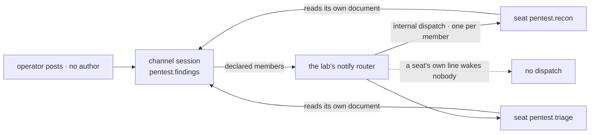

# FIX-1355 · The pentest lab: the conventions, proved together

**Spec** · [Decisions](DECISIONS.md) · [Rules](BUSINESS-RULES.md) · [Plan](PLAN.md)

Feature · `goals/` only — no package changes · medium · 1 PR · epic [FIX-1351](https://github.com/fixpoint-labs/flow-state-dev/pull/1718)

## Five people, before and after

| Someone who… | Today | After |
|---|---|---|
| **asks whether a team really is describable in files** | Four conventions, four green suites, nothing that runs them together. The claim is an argument | One run turns a folder tree into a hired roster, an open channel and a transcript two seats wrote |
| **asks whether a post reaches a channel's members** | The binder proves one instance and one named session. Nothing has ever woken a seat from a post | Both declared members are woken by the framework's own fan-out, answer, and land in the one transcript |
| **wonders whether two seats interfere** | Nothing has run two file-declared seats at once. A shared settings bag, a leaked skill, a dropped line — none of it is visible to a single-seat run | Two seats answer one post at once. Each line carries its own document, skills and instructions, and a third seat in another team stays silent |
| **changes a convention next month** | Each convention's own tests pass while the seam between them breaks quietly | This check fails. It is the only one crossing all four |
| **wants the epic closed** | ER-19, ER-20 and ER-21 have no runnable evidence | Two commands and a verdict log, re-runnable a year from now |

Every convention shipped ahead of its consumer. This is the consumer, and it is deliberately not a
product: three seats, one channel, one post.

## What changes

![Left: the workforce folder tree with an org level and two teams, holding a channel, two documents, five skill folders and three worker files. A dashed seam marks what is declared in files from what the lab writes in code: one worker kind, one notify router and a host. Right: the run — one operator post into the open channel session, the framework's fan-out waking both declared members, each seat reading its own document and posting back, and one transcript of three lines. Below, a fenced strip of what the lab does not touch: org slash channels, which nothing reads, MCP, and the Collab roster.](figures/what-changes.svg)

The seam is the point. Left of it is what somebody wrote; right of it is the framework's own path,
unchanged. The three boxes on the seam are the lab's whole code, and each is there because the
framework has no opinion at that spot, not because a convention was missing.

**What an author writes, and nothing else:**

```diff
+ workforce/org/resources/rules-of-engagement.md          # every team reads it
+ workforce/org/skills/report-format/SKILL.md             # every seat holds it
+ workforce/teams/pentest/resources/scope.md              # this team's target list
+ workforce/teams/pentest/skills/port-scan/SKILL.md
+ workforce/teams/pentest/channels/findings/CHANNEL.md    # members: recon, triage
+ workforce/teams/pentest/workers/recon/WORKER.md
+ workforce/teams/pentest/workers/recon/skills/sweep/SKILL.md
+ workforce/teams/pentest/workers/triage/WORKER.md
+ workforce/teams/audit/workers/scribe/WORKER.md          # not a member — the silent probe
+ workforce/teams/audit/skills/port-scan/SKILL.md         # the same NAME, another team
```

```diff
  # teams/pentest/channels/findings/CHANNEL.md
+ ---
+ description: Where the pentest team reports what it found.
+ members: [pentest.recon, pentest.triage]
+ ---
+ Report one finding per line. Name the rule you checked it against.
```

## How a post reaches a seat



The fan-out is the framework's; the addresses are the lab's, because the dispatch seam will not
take a target out of stored data. A seat's own post is not routed on ([D3](DECISIONS.md#d3)) —
without that the two seats answer each other forever.

## What stays as it is

- **Every package.** The lab consumes shipped surfaces and changes none. What it cannot do is
  reported up, not patched here.
- **`org/channels/`.** Declarable and unread ([epic D3](https://github.com/fixpoint-labs/flow-state-dev/pull/1718)).
  The lab declares at **team** scope and waits on no unbuilt reader.
- **The built-in `agent` kind.** Already proved from a file alone, and it carries no internal
  entry, so a fan-out cannot reach it ([D3](DECISIONS.md#d3)).
- **MCP, the Collab roster, brief / housekeeper / retirement.** Named out by the epic.

## Sign off

1. **[D1](DECISIONS.md#d1) · The lab lives in the goal library, not in `examples/` or `labs/`.**
   If wrong: the only consumer of the conventions is something an author never opens, and the
   epic's headline claim is proved where nobody reads it.
2. **[D2](DECISIONS.md#d2) · Two checks: a model-free one is the contract gate, a model-backed
   one is the honesty check.** If wrong: the gate we actually run is either flaky or hollow.
3. **[D3](DECISIONS.md#d3) · The lab's seats run on a kind the lab defines, and a seat's own post
   wakes nobody.** If wrong: the lab proves a shape no built-in kind has, and the cycle it breaks
   by rule is a trap the next author walks into.

**The epic's open question is answered here, and closes: the lab needs no durable intake DM.** It
opens with a declared team channel, which `openChannels` already opens and names; a DM would be a
one-participant channel, and one participant cannot show a fan-out. Nobody needs to own the DM
opener for this lab to run ([Settled](DECISIONS.md#settled)).

**Open: none.** Number 1 is the one to weigh. What lost, and why: [DECISIONS.md](DECISIONS.md).
The cases: [BUSINESS-RULES.md](BUSINESS-RULES.md).
