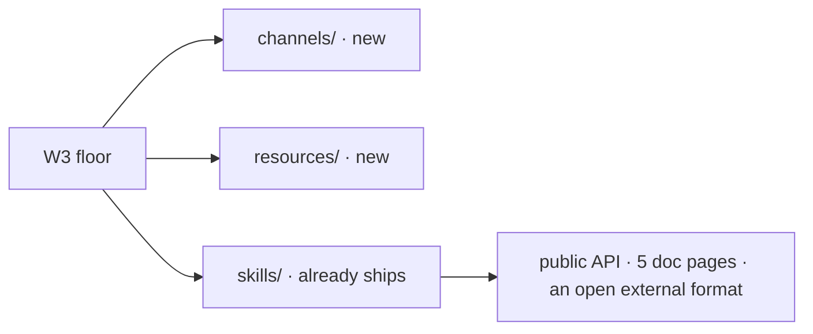
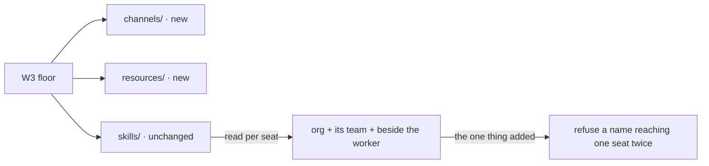
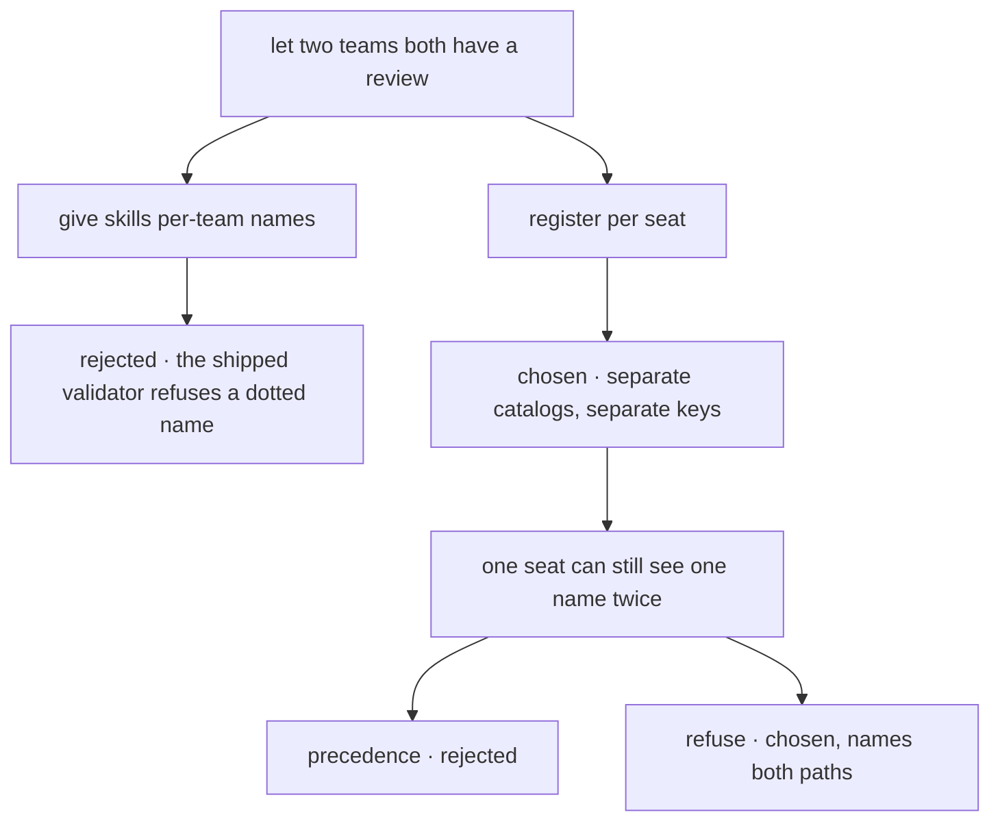

# FIX-1356 — explainer

*Three pictures of one decision. The full case is in [`FIX-1356.md`](FIX-1356.md); the sign-off
is on the PR. Nothing here asks you for anything.*

---

## 1. Today — two of the three start from nothing. Skills don't.

So the question this issue actually faces is not what convention skills should have. It is:
**the one they have doesn't look like its new siblings — does that matter?**

---

## 2. After (proposed) — ratified, and read per seat

This is the shape being gated; nothing here has been approved yet. The file format, the folder
layout and the skill-name rules are untouched — that is what *ratified* means.

A seat gets the union of three levels. Skills sitting beside the worker are available without
being listed in `skills:`. Because each seat reads its own union, two teams can both have a
`review` and neither can see the other's — executed, not assumed.

Aligning skills to the sibling shape was rejected on four measured counts: it breaks every
existing skills folder including this repo's own 38, re-keys a published package's errors for
cosmetic symmetry, mints an identity the shipped name validator refuses, and edits a format
that is not ours.

---

## 3. Where the decision fell

Isolation comes from **where a catalog is registered**, not from what a skill is called. That is
what leaves the external format alone.

An earlier draft argued the opposite — one app-wide catalog, so skill names globally unique
across teams. That premise was assumed rather than established, and running it dissolved the
cross-team half.

What survives is narrower: org and the team both declaring `triage` for the *same* seat. There
one catalog really does hold one name twice. Precedence would settle it silently, and silence is
the defect this issue exists to remove.

**Deliberately not here:** creating each seat's catalog at hire. This issue ships the reading;
the wiring belongs to a separate ticket, and the spec says so rather than implying it exists.
