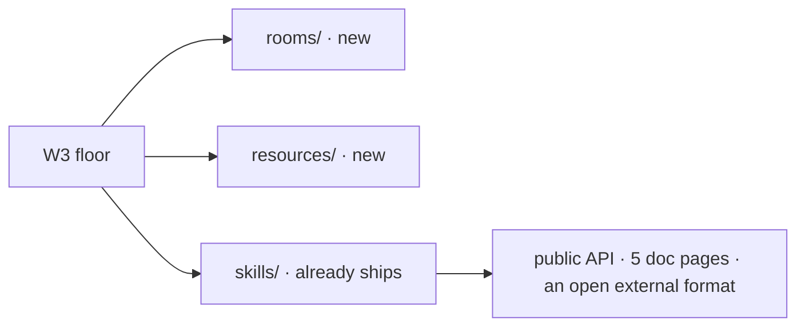
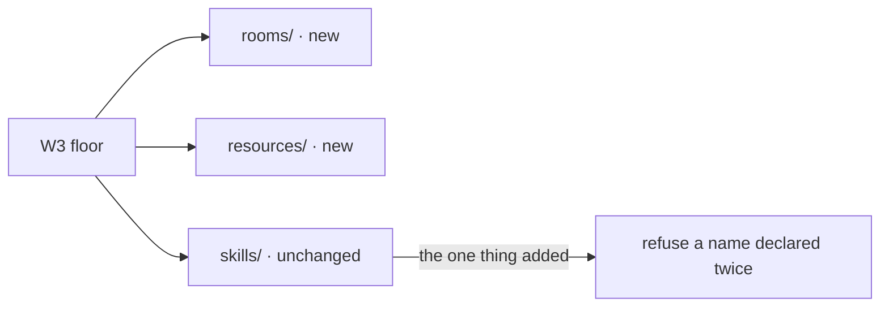
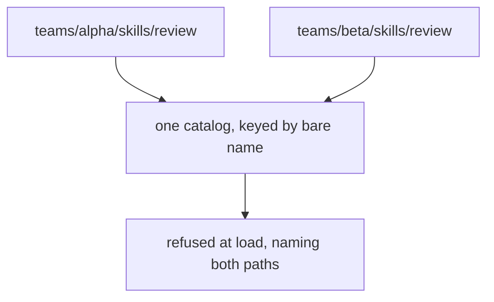

# FIX-1356 — explainer

*Three pictures of one decision. The full case is in [`FIX-1356.md`](FIX-1356.md); the sign-off
is on the PR. Nothing here asks you for anything.*

---

## 1. Today — three of the four start from nothing. Skills don't.

So the question this issue actually faces is not what convention skills should have. It is:
**the one they have doesn't look like its new siblings — does that matter?**

---

## 2. After — ratified, not aligned

Aligning skills to the sibling shape loses on four independent counts, each measured rather
than argued: it breaks every existing skills folder including this repo's own 38, it re-keys
the errors of a published package for cosmetic symmetry, its dot-joined identity is rejected
by the shipped skill-name validator, and the format is not ours to change.

A skills folder can already sit at any level — the existing reader takes a root. A
`WORKER.md` can already say `skills: [port-scan, triage]` and hire. Both facts were executed,
not assumed.

**What was genuinely missing:** the same skill name declared at two levels. Today the second
silently overwrites the first and nothing is said.

---

## 3. The limit that comes with it

A team folder says who owns a skill and lets an app load one team's worth. **It does not give
that team a namespace.** Two teams cannot each have a `review`.

That is user-visible, so the spec states it as a decision rather than leaving it to be
discovered. Today's silent overwrite is the alternative, and it is worse: the app runs one of
them and says nothing.

**What ships:** 2 production files, 3 test behaviours, 2 doc surfaces — the levels written
down, one thin load through the existing reader, and one defect fix. A `SKILL.md` that exists
but cannot be read is currently reported as *missing*, which sends an author to the wrong fix.

Strip the refusal and what remains is documentation. The spec says so plainly, because that
is what the sign-off is buying.
