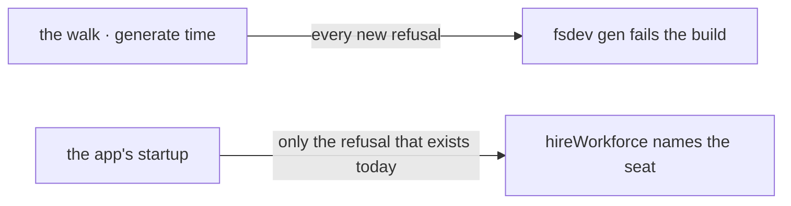

# FIX-1357 · Business rules

[Spec](SPEC.md) · [Decisions](DECISIONS.md) · **Rules** · [Plan](PLAN.md)

The cases, written as rules. Each says what an author or the system does and what happens. The
*proved by* column is the check the plan runs. A human reviews this page for a case that is
missing; the plan turns it into work.

## What the walk finds

| # | When | Then | Proved by |
|---|---|---|---|
| BR-1 | A file sits directly under `workforce/flows/workers/` or `workforce/flows/channels/` and default-exports a flow factory | It is registered on `kinds` under the file's basename | CI · goal check |
| BR-2 | A file sits directly under `workforce/blocks/` and default-exports a `BlockDefinition` | It is registered on `blocks` under the file's basename | CI |
| BR-3 | None of the three folders exists | Both maps generate empty. Not an error — an app with no custom code is an ordinary app | CI |
| BR-4 | A folder exists and holds nothing the walk recognises | Empty maps, and the command says which folders it looked in and found nothing | CI |
| BR-5 | A file that is not TypeScript sits in a locked folder (a README, a fixture) | Skipped silently. The folders hold code, and a note beside it is not a declaration | CI |
| BR-6 | A **directory** sits inside a locked folder | Refused by name. Not skipped — a folder an author created and the tool ignored is the silence class this convention exists to avoid | CI |
| BR-7 | Any path on the way in is a symlink | Not followed, and reported, in the same wording the shipped readers use | CI |

## What the walk refuses

Every refusal below happens when `fsdev gen` runs, never at boot, and they are **collected** so
one run names all of them.

| # | When | Then | Proved by |
|---|---|---|---|
| BR-8 | A file's basename is not a legal segment (uppercase, dots, underscores, over-long) | Refused, naming the file and the rule. The basename becomes a kind name and a flow instance id, so it obeys the same rule every other segment in this tree obeys | CI |
| BR-9 | A flow file's default export declares a `kind` that is not its basename | Refused, naming the file, the basename, and the declared kind. One name, two places, made to agree here rather than at boot | CI |
| BR-10 | A file has no default export, or exports something that is not a flow factory / `BlockDefinition` | Refused, naming the file and what was expected there | CI |
| BR-11 | `workforce/flows/workers/x.ts` and `workforce/flows/channels/x.ts` both exist | Refused. One scan produces one kinds map, so the two folders share one namespace | CI |
| BR-12 | A locked folder is present but unreadable | Refused, naming the path. Never folded into "absent": absent means no custom code, unreadable means code we failed to see | CI |

## Staying in step

| # | When | Then | Proved by |
|---|---|---|---|
| BR-13 | An author adds a file and does not re-run `fsdev gen` | `fsdev gen --check` exits non-zero and names what changed. At run time, unchanged: `hireWorkforce` refuses the seat exactly as it does today | CI · the existing hire suite |
| BR-14 | `fsdev gen` runs twice with nothing changed | Byte-identical output, and `--check` passes. Ordering is by path, so a directory listing's order never moves a line | CI |
| BR-15 | An app passes `{ kinds }` by hand and never runs `fsdev gen` | Byte for byte as today, forever. This is a second door, not a replacement (BP-030) | Existing hire suite, unchanged |
| BR-16 | An app passes a hand-written map **and** imports the generated one | Whatever the app composes is what hires. The framework is not told which came from where, and there is no precedence rule to learn | CI |
| BR-17 | The app is built for Vercel or Next | Identical maps. The generated module is static imports, so the bundler resolves it like any other app module and nothing is looked up at run time | Goal check, run against the built app |

Read the right-hand column, and read how little is in it. Every refusal this convention adds
fires while `fsdev gen` runs; run time gains none, and the single entry there is the refusal
`hireWorkforce` already throws today. That emptiness is what [D2](DECISIONS.md#d2) buys, and it
is what makes BR-15 and BR-17 true rather than hopeful. The same two moments by name:

## Failure taxonomy

Everything in "What the walk refuses" is **fatal at generate time**, collected first so one run
names every problem and an author fixes them in one pass — the same discipline `hireWorkforce`
already applies to a bad roster. Nothing degrades and nothing retries. At run time nothing is
new: a stale registry surfaces as the refusal that exists today, naming the seat and the kind it
could not find.

## Acceptance criteria this issue owns

An app whose only statement of a custom kind is a file in the tree hires a seat on that kind and
runs it, with no kinds map written anywhere in the app's source. Proved by the goal check the
plan runs last, which reads the seat's own settings bag to confirm *which* flow answered — not
that a seat came back — and asserts the app source contains no hand-written kinds literal.
