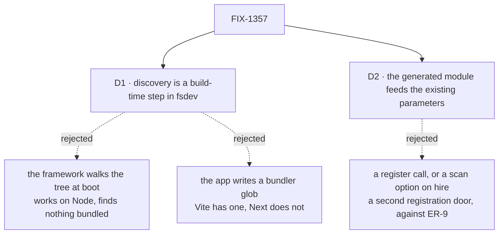

# FIX-1357 · Decisions

[Spec](SPEC.md) · **Decisions** · [Rules](BUSINESS-RULES.md) · [Plan](PLAN.md)

Two decisions are the sign-off surface, and one question is open. The epic's own locks — the
folder paths, one door for kinds and blocks together — are D6 and D3 on
[FIX-1351](https://github.com/fixpoint-labs/flow-state-dev/pull/1718) and are not reopened here.

## The tree

Solid edges are what you're signing. Dashed edges lost, and the label says why.

## D1 · Discovery is a build-time step in `fsdev`; the framework never imports a path it discovered

| | |
|---|---|
| **Instead of** | `hireWorkforce` walking `workforce/flows/` at boot and importing what it finds — the literal reading of "boot scan" |
| **Because** | That version works on a Node host and returns an empty map on a bundled one, since those files are not separate modules after a Vercel or Next build. An API whose result depends on the host fails where nobody is testing, and fails quietly. The toolchain has no such constraint, and what it emits is static imports every bundler already handles |
| **Locks in** | An app with custom kinds acquires a build step. `fsdev gen` must run before `tsc` and the bundler, and an author who skips it ships a registry missing their newest file. We are choosing loud, checkable staleness over silent host-dependent emptiness, and `--check` in CI is what keeps it loud |

**What would change my mind:** a portable way for a running framework to enumerate app modules
across Vercel, Next, Node and Bun. `import.meta.glob` is Vite's; `require.context` is webpack's
and does not survive Turbopack. If one appears, the build step is pure cost.

The framework already draws this line; this spec follows it. Only `packages/cli` computes an
`import()` argument. Every other package names its specifier — a literal, or a package resolved
from `node_modules` — and none imports a path found by walking the app's tree. Checked, not
asserted: `checks/no-runtime-app-import.mjs` on this branch classifies all 72 `import()`
expressions in `packages/*/src` and fails on anything it cannot place.

## D2 · The generated module feeds the parameters that already exist; the framework gains no registration API

| | |
|---|---|
| **Instead of** | A `registerWorkforceCode(modules)` entry point, or a `scan:` option on `hireWorkforce` taking a directory |
| **Because** | The maps `fsdev gen` produces are the shapes `hireWorkforce({ kinds })` and `taskBoard({ workers })` already accept. A new entry point is a second way to register one thing, which ER-9 forbids, and it moves the convention's refusals to run time where they are expensive |
| **Locks in** | This issue changes **no framework run-time surface at all**; the generated file is app code the app imports. So the convention is a contract about a *file*, not a function: anything that can emit `{ kinds, blocks }` is a valid producer, and a second producer later needs no framework change. The bill is that the contract lives in docs and a generator rather than in a signature |

## Decided, not asked

- **The convention lives in `@flow-state-dev/workforce`; `fsdev gen` is a thin command over it.**
  Every other reader of this tree is there, and so are ER-10's walk primitives.
- **The path is the name.** `flows/workers/researcher.ts` registers `researcher`; a flow whose own
  `kind` disagrees is refused by name at generate time — ER-4's **explicit refusal** mechanism,
  since the flow carries a real name of its own and the two must agree rather than one being
  hidden.
- **One level, one file, one default export.** A directory inside a locked path is refused by
  name, not ignored: nesting makes the basename ambiguous, and silently skipping a folder is the
  silence class FIX-1342 closed. **Reopen condition:** grouping means path-derived names, not a
  second scan.
- **The generated file is committed, and `--check` fails CI when stale.** A fresh clone must
  typecheck before anything has been generated.
- **A block's `name` is left alone.** The basename is its registration key; assignment address
  and trace identity are different jobs.

## Considered and dropped

| Alternative | Why not |
|---|---|
| **An array instead of a map** — `kinds: [researcher, standup]`, keyed off each flow's own `kind` | Cheaper, and it does kill the redundant key and the mismatch failure — but it removes the map literal, not the import line, so the tree is still not the description. Worth doing; filed as a follow-up rather than smuggled in here |
| **The app writes a bundler glob** (`import.meta.glob`, eager) | No import line, no build step, and Vite-only. Next is a first-class target with no equivalent that survives Turbopack |
| **A hand-written barrel** re-exporting each file | Portable and free, and it moves the per-kind line rather than removing it |
| **Register kinds through the flow registry** | It admits flow *instances* and explicitly refuses a definition. A kind is an uncalled factory |
| **Generate into a gitignored path** | A fresh clone would not typecheck until someone ran a command nobody had told them about |

## Open

### Is this the right moment to build it, or does it wait for a consumer?

**In plain terms.** Everything this removes is a line **nobody has ever written**.
`hireWorkforce` is called from four goal checks and nowhere else — no app, no package, no
example — and there is no `workforce/flows/` or `workforce/blocks/` folder anywhere. We would
ship the convenience before anyone has felt the inconvenience, which is the condition ER-15 names
as the signal a convention was built too early. FIX-1351 says a hand-passed map stays valid until
this ships, so nothing is waiting on it.

**The trade-off.** Building now costs a generator, a command and a file convention, and risks
locking a generated artifact's shape before a real app has pushed back on it. Waiting leaves the
author story half-told — three conventions read from the tree, the fourth hand-wired — and
FIX-1358's atlas teach would have to present that seam as permanent.

**Recommendation: build it now, with a real consumer in the same PR.** The plan puts a custom
kind and a custom block into `apps/kitchen-sink` — a Next app, the host that makes a build step
necessary rather than optional. That discharges ER-15 with a non-lab consumer and tests the
generated file against a real bundler before it is taught anywhere. The generator without that
slice is the version I would not ship.

**What would change my mind:** FIX-1355's lab needing a custom kind. Then the lab is the honest
first consumer, this sits behind it, and kitchen-sink would be an app built to justify a
convention rather than to use one.

**What being wrong costs:** one command and one documented convention that a single app uses.
Cheap to carry and cheap to delete — the framework's run-time surface is unchanged either way
([D2](#d2)), so withdrawing it breaks nothing that was not generated.

## How it got here

- **Draft** — framed as the one half of a Workforce that files cannot describe; "boot scan" read
  honestly against the epic's no-runtime-import fence, which puts the walk in `fsdev` and leaves
  the framework's run-time surface untouched; one PR, with its consumer inside it.
