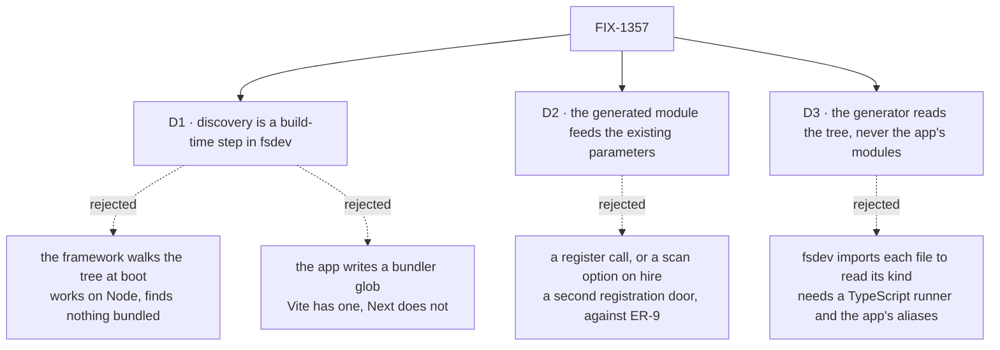

# FIX-1357 · Decisions

[Spec](SPEC.md) · **Decisions** · [Rules](BUSINESS-RULES.md) · [Plan](PLAN.md)

Three decisions are the sign-off surface. The epic's own locks — the folder paths, one door for
kinds and blocks together — are D6 and D3 on
[FIX-1351](https://github.com/fixpoint-labs/flow-state-dev/pull/1718) and are not reopened here.

## The tree

Solid edges are what you're signing. Dashed edges lost, and the label says why.

## D1 · Discovery is a build-time step in `fsdev`; the framework never imports a path it discovered

| | |
|---|---|
| **Instead of** | `hireWorkforce` walking `workforce/flows/` at boot and importing what it finds — the literal reading of "boot scan" |
| **Because** | That version works on a Node host and returns an empty map on a bundled one: after a Vercel or Next build those files are not separate modules. An API whose result depends on the host fails where nobody is testing, and fails quietly. The toolchain has no such constraint, and what it emits is static imports every bundler already handles |
| **Locks in** | An app with custom kinds acquires a build step. `fsdev gen` runs before `tsc` and the bundler, and an author who skips it ships a registry missing their newest file. We choose loud, checkable staleness over silent host-dependent emptiness, and `--check` in CI keeps it loud |

**What would change my mind:** a portable way for a running framework to enumerate app modules
across Vercel, Next, Node and Bun. `import.meta.glob` is Vite's; `require.context` is webpack's
and does not survive Turbopack. If one appears, the build step is pure cost.

The framework already draws this line, and it is checked rather than asserted:
`checks/no-runtime-app-import.mjs` on this branch classifies all 72 `import()` expressions in
`packages/*/src` and fails on anything it cannot place. Only `packages/cli` computes one.

## D2 · The generated module feeds the parameters that already exist; the framework gains no registration API

| | |
|---|---|
| **Instead of** | A `registerWorkforceCode(modules)` entry point, or a `scan:` option on `hireWorkforce` taking a directory |
| **Because** | The maps `fsdev gen` produces are the shapes `hireWorkforce({ kinds })`, `channelInstances({ kinds })` and `taskBoard({ workers })` already accept. A new entry point is a second way to register one thing, which ER-9 forbids, and it moves refusals to run time where they are expensive |
| **Locks in** | **No framework run-time surface changes at all**; the generated file is app code the app imports. The convention is a contract about a *file*, not a function: anything that emits those maps is a valid producer, and a second producer later needs no framework change. The bill is that the contract lives in docs and a generator rather than in a signature |

## D3 · The generator reads the tree; it never loads the app's modules

| | |
|---|---|
| **Instead of** | `fsdev gen` importing each discovered file to read the `kind` and `cardinality` its default export declares — what the first draft assumed |
| **Because** | The published `fsdev` is compiled JavaScript run by plain Node. It declares `node >=22` and its TypeScript runner is a dev dependency, so on 22.0–22.17 importing a discovered `.ts` throws `ERR_UNKNOWN_FILE_EXTENSION` — a floor `load-config.ts` already documents and escapes. Raising it rescues nothing: a real app's convention file imports its neighbours through the app's own resolution, and kitchen-sink resolves `@/*` under `moduleResolution: "bundler"`, which no Node version resolves. Loading app source means rebuilding the app's resolver seconds before the bundler does it properly |
| **Locks in** | Two checks change hands and one lands later; none disappears. **Export shape** is checked by the app's typecheck, because the generated maps are typed and a file exporting the wrong thing fails to assign. **A `kind` disagreeing with its basename** is refused by `hireWorkforce`, which already names both kinds when a factory sits under someone else's key. **Cardinality** — `collection` for a worker, `singleton` for a channel — is documented, tested, and refused by the registry. The build still refuses a broken file; what the *generator* refuses is what a walker can see |

**What would change my mind:** `FlowType` carrying `kind` as a literal type and cardinality per
slot. Both are widened today, so the generated file can assert neither at typecheck. Narrow them
and every check above moves back to build time with no loader — the cheapest version of this
decision, and a follow-up worth filing.

**What being wrong costs:** a kind rename that misses its file is caught one stage later than
advertised — a named refusal at startup rather than at generate time. That refusal exists today,
so nothing regresses; the promise narrows.

## D4 · Workers and channels generate two maps, because two parameters take them

| | |
|---|---|
| **Instead of** | One `kinds` export spanning both folders, as epic D6's *locks in* cell describes |
| **Because** | There is no single parameter to hand it to. `hireWorkforce({ kinds })` takes worker kinds; `channelInstances({ kinds })` is a different map on a different function, and the shipped channels reader already tells authors to "pass it to `channelInstances`". One export feeding both call sites would hand each the other's kinds — and a `WORKER.md` naming a channel kind would mint a singleton with a seat id, which the registry refuses |
| **Locks in** | One scan and one door for the author; three exports, each feeding a parameter that already exists (D2). Epic D6's *decision* stands; its claim that one scan produces one `{ kinds }` map does not, and wants the correction the epic just applied to `org/channels/` — the lock holds, the claim was written against code that reads otherwise |

## Decided, not asked

- **Build now, with a non-lab consumer in the same PR.** ER-15 requires one before the lab lands
  and the set was approved on that check — which also rules out waiting for FIX-1355, since the
  lab may not be a convention's first consumer. The plan puts a custom worker kind and block into
  `apps/kitchen-sink`, a Next app: the host that makes the build step necessary rather than
  optional. `workforce/flows/channels/` is scanned and exported with no in-repo consumer this PR
  — unlike `org/channels/`, its door is shipped and public, so the export is usable the day an
  app wants it.
- **The convention lives in `@flow-state-dev/workforce`; `fsdev gen` is a thin command over it.**
  Every other reader of this tree is there, and so are ER-10's walk primitives.
- **The path is the name.** `flows/workers/researcher.ts` registers `researcher`; the flow's own
  `kind` must agree, and D3 settles where a disagreement is caught.
- **One level, one file, one default export.** A directory inside a locked path is refused by
  name: nesting makes the basename ambiguous, and silently skipping a folder is the silence class
  FIX-1342 closed. **Reopen condition:** grouping means path-derived names, not a second scan.
- **The generated file is committed, and `--check` fails CI when stale.** A fresh clone must
  typecheck before anything has been generated.
- **A block's `name` is left alone.** The basename is its registration key; assignment address and
  trace identity are different jobs.

## Considered and dropped

| Alternative | Why not |
|---|---|
| **An array instead of a map** — keyed off each flow's own `kind` | Kills the redundant key, but removes the map literal rather than the import line, so the tree is still not the description. Filed as a follow-up |
| **The app writes a bundler glob** (`import.meta.glob`) | No import line, no build step, Vite-only. Next is a first-class target with no equivalent that survives Turbopack |
| **A hand-written barrel** re-exporting each file | Portable and free, and it moves the per-kind line rather than removing it |
| **Register kinds through the flow registry** | It admits flow *instances* and refuses a definition. A kind is an uncalled factory |
| **Generate into a gitignored path** | A fresh clone would not typecheck until someone ran a command nobody had mentioned |
| **Read `kind` from source with ts-morph** instead of importing | It cannot see through a wrapper: a worker written as `defineAgentWorkerFlow({...})` declares its cardinality inside the helper, not at the call site. The check would pass on files it never really read — a silent partial, worse than an honest one (D3) |

## How it got here

- **Draft** — "boot scan" read against the epic's no-runtime-import fence, which puts the walk in
  `fsdev` and leaves the framework's run-time surface untouched.
- **Spec review, round 1** — reviewers converged on one hole: the generator could not load what it
  proposed to inspect. D3 answers it, D4 corrects a map shape the code contradicted, and timing
  closed on ER-15 rather than going to the owner.
