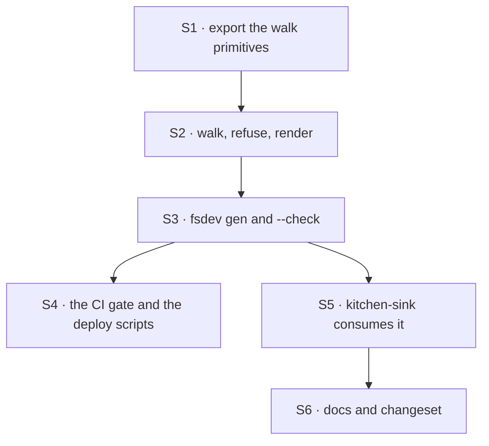

# FIX-1357 · Plan

[Spec](SPEC.md) · [Decisions](DECISIONS.md) · [Rules](BUSINESS-RULES.md) · **Plan**

Written for the implementing agent. IDs cross-reference [BUSINESS-RULES.md](BUSINESS-RULES.md)
(BR-n) and [DECISIONS.md](DECISIONS.md) (D-n). `tdd`. One PR.

## Surfaces

| ID | Package · role | Change | Rules |
|---|---|---|---|
| S1 | `workforce` · `loader` subpath | **Export the walk primitives** the loader keeps private — `classify`, `openStructuralDirectory`, the symlink and unreadable wordings, `IGNORED_ENTRIES`, `validateSegment`. ER-10 says a convention consumes these; today there is no way to. `IGNORED_ENTRIES` is three local copies, so this is a net subtraction | BR-7 BR-8 BR-12 |
| S2 | `workforce` · a new `codegen` role beside the readers | Walk the three locked folders one level deep, name each entry from its basename, collect every refusal — then render a module of static imports ordered by path, three typed maps, a do-not-edit header. **Opens nothing it found** (D3) | BR-1 → BR-6, BR-8, BR-11, BR-12, BR-14 |
| S3 | `fsdev` · a new `gen` command | Thin: resolve the workforce root, call S2, write the file, print what it found. `--check` renders and compares without writing, exiting non-zero on a difference | BR-13 BR-14 |
| S4 | CI · the gate | `fsdev gen --check` as **its own step**, not inside a build script that would regenerate and pass. Kitchen-sink's `vercel-build` calls `next build` directly today; it goes through the same gate | BR-13 |
| S5 | `apps/kitchen-sink` · the consumer | One custom worker kind, one custom block, a `WORKER.md` naming the kind, `fsdev gen` in the build script, generated file committed. **Kitchen-sink has no workforce usage today** — no roster, no `teams/`, no `hireWorkforce` call — so this stands one up, and that is most of its cost | BR-16 BR-17 |
| S6 | Docs | `apps/docs` Workforce section EXTEND · `packages/workforce/README.md` · `packages/cli/README.md` · one **`patch`** changeset: additive, and it preserves hand-written registration, which `AGENTS.md` puts at patch pre-1.0 | BR-20 |

**Removed: nothing.** The hand-passed map stays (BR-15): this adds a door and closes none. If you
find yourself deprecating `HireOptions.kinds`, stop — that is a different decision.

## Sequence



**Build S5 early enough to steer S2.** A generated file no bundler has seen is the risk the
timing decision accepted; if writing the consumer makes the emitted shape feel wrong, that is the
signal, not a nuisance.

## Checks

| ID | Runs after | Passes when |
|---|---|---|
| V1 | S1 | The primitives are reachable from outside the package and the existing readers still use the same ones. No second copy of the walk exists |
| V2 | S2 | BR-1 to BR-7 on a fixture tree; BR-8, BR-11, BR-12 each refuse, and a tree with several problems reports **all** of them in one run. BR-14: render twice and compare bytes; shuffle the fixture's creation order and confirm the output is unchanged |
| V3 | S2 | **The D3 boundary, as a test.** The generator produces output for a fixture tree whose files import a bare specifier that does not resolve — proving it never loaded them. Write this first; it is the decision |
| V4 | S3 | `--check` passes on a current file and fails naming the difference on a stale one. Write the failure path first |
| V5 | S4 | The step fails on a CI run where the fixture is stale. Verify by making it stale, not by reading the workflow file |
| V6 | S5 | BR-10: a fixture app exporting the wrong shape fails `tsc`, naming the generated module. BR-16: hand-written and generated maps compose with no precedence rule. BR-18: a worker kind omitting `cardinality` is refused, with the message an author will actually see |
| VG | S5 | **Goal, no model.** `goals/workforce-conventions/code-comes-from-files-alone/`. A custom kind declared only as a file, named by a `WORKER.md`, hires a seat that registers and runs one action over the real route, against the app **as built for Next** (BR-17, D1). Graded by reading a setting only that flow declares, plus an assertion that the app source holds no hand-written kinds literal |

**The second path (BP-035):** every rule has an off-state — no folders (BR-3), empty folders
(BR-4), the hand-passed map (BR-15), the stale file (BR-13). A suite that only generates from a
well-formed tree proves little here.

## Pinned names · public, so the spec fixes them

| Where | Name | Why pinned |
|---|---|---|
| Folders | `workforce/flows/workers/`, `workforce/flows/channels/`, `workforce/blocks/` | Owner-locked 2026-09-12; epic D6 |
| Command | `fsdev gen`, with `--check` | Public. An author types it and a build script contains it |
| Generated file | `workforce/workforce.gen.ts` | Public. The author imports it |
| Its exports | `kinds`, `channelKinds`, `blocks` | Public, and each must read as the parameter it feeds (D4) |

Everything else — module layout, function names, the emitted file's internals, error wording — is
yours.

## Guardrails

| Rule | Because |
|---|---|
| Nothing in a shipped package imports a path it discovered, and **`fsdev gen` imports nothing it walked** (D1, D3) | The first is the decision; `node spec/FIX-1357/checks/no-runtime-app-import.mjs` keeps it honest. The second is why: the published CLI is compiled JS on plain Node with no TypeScript runner, and an app's files resolve through the app's aliases. A loader here is a resolver we maintain forever, beside the bundler that already has one |
| The walk consumes S1's primitives; it grows no `readdir` of its own (ER-10, tenet 5) | Four readers already agree on what a symlink and an unreadable folder mean. A fifth that agrees by coincidence is the drift FIX-1389 exists to undo |
| Refusals are collected, then thrown together | One run names every problem, as `hireWorkforce` already does for a bad roster |
| `fsdev gen` decides nothing about registration | It walks, refuses, writes. The moment it merges built-ins or reorders precedence it is a second registration path (D2, ER-9) |
| The emitted file is deterministic and diffable | It is committed. A file that churns makes every PR noisy and `--check` useless |

## Docs

- **EXTEND** `apps/docs` Workforce section, behind the reader that now exists (ER-18): the three
  folders, what each file exports, the cardinality each folder needs (BR-18), the build-script
  line, that regeneration is a command and not a watcher (BR-20), and that a hand-passed map still
  works. *Voice risk:* "automatically" and "magically" want to appear here. It is a build step.
- **EXTEND** `packages/workforce/README.md` and `packages/cli/README.md` — the convention beside
  the loader entries, one `gen` entry matching the other commands' shape.
- **No new page.** It is one section under a concept that already has one.

## Sketch · pseudocode, illustrative, react to the shape

```
for each of the three locked folders:
    open it structurally            ← absent is silent, unreadable is fatal (BR-3, BR-12)
    for each entry, one level only:
        a directory          → refuse by name                    (BR-6)
        not a TypeScript file→ skip                              (BR-5)
        otherwise:
            name ← the basename
            check the name is a legal segment                    (BR-8)
            record { name, path, slot }

collect the records from all three folders
    a name in both flow folders → refuse, naming both paths      (BR-11)
    any refusal at all          → throw them together, none rendered

render, ordered by path:
    one static import per record
    three maps, keyed by name, typed so the app's tsc reads each file (BR-10)
```

Nothing above opens a discovered file. The two checks needing a file's *value* — its declared
`kind` (BR-9) and its cardinality (BR-18) — are absent by decision; [D3](DECISIONS.md#d3) says
who catches them instead.

**POC:** none. `checks/no-runtime-app-import.mjs` classifies all 72 `import()` expressions in
`packages/*/src` and fails on anything it cannot place — D1's premise, made falsifiable. Review
found a hole: an `import()` inside a template substitution was blanked as string content, so the
check printed PASS for exactly the call it exists to catch. Fixed this round and re-watched red
against two planted violations before being trusted again.

## At implement time

- **Re-read `packages/workforce/src/loader/index.ts` before S1.** FIX-1389 may have landed and
  already exported what S1 asks for, in which case S1 deletes itself rather than writing anything.
- **Check whether FIX-1367 is in `hire.ts`.** It is the ready sibling and edits that file. This
  issue should not need to; if it does, sequence behind it.
- **Confirm the folder paths against the epic.** They were owner-locked, not derived.
- **D4 contradicts a sentence in the epic-spec.** Epic D6's *locks in* cell says one scan produces
  one `{ kinds }` map; the code has two parameters on two functions. The decision holds, the claim
  does not. Flagged to the epic; do not fix it from this branch.

## Notes from review

Round 1, below the bar. Inputs, not instructions — adopt, adapt or discard. One that turns out to
reveal a design problem is a spec blind spot: surface it and fold it back.

- "The H1 says 'boot scan' but D1 explicitly rejects walking the tree at boot." — cursor
  ([thread](https://github.com/fixpoint-labs/flow-state-dev/pull/1804#discussion_r4031176985)).
  Left so the title still matches the Linear issue's; worth raising at the issue.
- "S2 + S3 are one codegen module; six surfaces reads like six parallel tracks." — cursor
  ([thread](https://github.com/fixpoint-labs/flow-state-dev/pull/1804#discussion_r4031177001)).
  Partly folded; collapse further if it helps.
- "`blocks` feeds `taskBoard({ workers })` — consider `export { blocks as workers }`." — cursor
  ([thread](https://github.com/fixpoint-labs/flow-state-dev/pull/1804#discussion_r4031177007))
- "The totality `exit(1)` branch looks unreachable — safe to drop." — cursor
  ([thread](https://github.com/fixpoint-labs/flow-state-dev/pull/1804#discussion_r4031177049))
- "ts-morph `ImportExpression` visitation would avoid `blankNonCode` + regex drift." — cursor
  ([thread](https://github.com/fixpoint-labs/flow-state-dev/pull/1804#discussion_r4031177035),
  [rule encoding](https://github.com/fixpoint-labs/flow-state-dev/pull/1804#discussion_r4031177044)).
  The script is spec-branch-only and never merges; this is how to build a permanent guard.

## Follow-ups

- **Narrow `FlowType`'s `kind` to a literal** and carry cardinality per slot. Both are widened
  today, which is the only reason the generated file cannot assert BR-9 and BR-18 at typecheck.
  Narrowing them moves both back to build time with no loader — the cheapest version of
  [D3](DECISIONS.md#d3), and the condition that reopens it.
- **Accept an array of kinds**, keyed off each flow's own `kind`. Hire already refuses a key that
  disagrees with `factory.kind`, so the key is redundant. Independent and cheaper than this issue.
- **`taskBoard`'s worker keys are assignees, not block names.** The docs distinguish the two
  nowhere. Not in scope.
