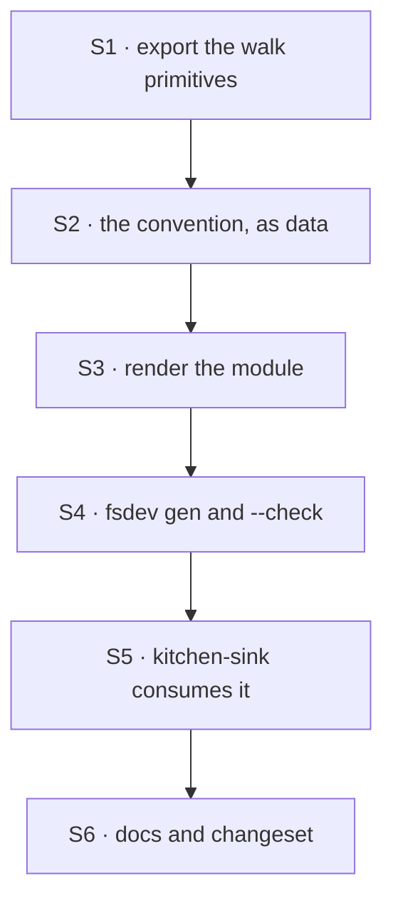

# FIX-1357 · Plan

[Spec](SPEC.md) · [Decisions](DECISIONS.md) · [Rules](BUSINESS-RULES.md) · **Plan**

Written for the implementing agent. IDs cross-reference [BUSINESS-RULES.md](BUSINESS-RULES.md)
(BR-n) and [DECISIONS.md](DECISIONS.md) (D-n). `tdd`. One PR.

## Surfaces

| ID | Package · role | Change | Rules |
|---|---|---|---|
| S1 | `workforce` · `loader` subpath | **Export the walk primitives** the loader keeps private — `classify`, `openStructuralDirectory`, the symlink and unreadable wordings, `IGNORED_ENTRIES`, `validateSegment`. ER-10 says a convention consumes these; today there is no way to | BR-7 BR-8 BR-12 |
| S2 | `workforce` · a new `codegen` role beside the readers | The convention itself: walk the three locked folders one level deep, classify each entry, derive the name from the basename, collect every refusal, and return what was found. **Returns data; writes nothing** | BR-1 → BR-12 |
| S3 | `workforce` · the same role | Render that result as a module: static imports ordered by path, two exported maps, a do-not-edit header. Deterministic — same tree, same bytes (D1) | BR-14 |
| S4 | `fsdev` · a new `gen` command | Thin: resolve the workforce root, call S2/S3, write the file, print what it found. `--check` renders and compares without writing, exiting non-zero on a difference | BR-13 BR-14 |
| S5 | `apps/kitchen-sink` · the consumer | One custom worker kind, one custom block, a `WORKER.md` naming the kind, `fsdev gen` in the build script, generated file committed. The ER-15 consumer, and a Next app on purpose (D1) | BR-16 BR-17 |
| S6 | Docs | `apps/docs` Workforce section EXTEND · `packages/workforce/README.md` · `packages/cli/README.md` · one `minor` changeset for `fsdev` and `workforce` | — |

**Removed: nothing.** The hand-passed map stays (BR-15): this adds a door and closes none. If you
find yourself deprecating `HireOptions.kinds`, stop — that is a different decision.

## Sequence



One PR. **Build S5 early enough to steer S2 and S3.** A generated file no bundler has seen is
what the open question warns about; if writing the consumer makes the emitted shape feel wrong,
that is the signal, not a nuisance.

## Checks

| ID | Runs after | Passes when |
|---|---|---|
| V1 | S1 | The primitives are reachable from outside the package and the existing readers still use the same ones. No second copy of the walk exists |
| V2 | S2 | BR-1 to BR-7 on a fixture tree; BR-8 to BR-12 each refuse, and a tree with several problems reports **all** of them in one run, not the first |
| V3 | S3 | BR-14: render twice, compare bytes. Shuffle the fixture directory's creation order and confirm the output is unchanged |
| V4 | S4 | `--check` passes on a current file and fails naming the difference on a stale one (BR-13). The failure path is the one to write first |
| V5 | S5 | BR-16: a hand-written map and the generated one compose with no precedence rule. BR-15: an app that never generates is unaffected — the existing hire suite, unchanged |
| VG | S5 | **Goal, no model.** `goals/workforce-conventions/code-comes-from-files-alone/`. A custom kind declared only as a file, named by a `WORKER.md`, hires a seat that registers and runs one action over the real route, against the app **as built for Next** (BR-17, D1). Graded by reading a setting only that flow declares — so "a seat came back" cannot pass it — plus an assertion that the app source holds no hand-written kinds literal |

**The second path (BP-035):** every rule has an off-state — no folders (BR-3), empty folders
(BR-4), the hand-passed map (BR-15), the stale file (BR-13). A suite that only ever generates
from a well-formed tree proves very little here.

## Pinned names · public, so the spec fixes them

| Where | Name | Why pinned |
|---|---|---|
| Folders | `workforce/flows/workers/`, `workforce/flows/channels/`, `workforce/blocks/` | Owner-locked 2026-09-12; epic D6 |
| Command | `fsdev gen`, with `--check` | Public. An author types it and a build script contains it |
| Generated file | `workforce/workforce.gen.ts` | Public. The author imports it |
| Its exports | `kinds`, `blocks` | Public, and they must read as the parameters they feed |

Everything else — module layout, function names, the emitted file's internals, error wording — is
yours.

## Guardrails

| Rule | Because |
|---|---|
| Nothing you add to a shipped package imports a path it discovered (D1) | It is the decision. `node spec/FIX-1357/checks/no-runtime-app-import.mjs` is on this branch and still passes; keep it passing |
| The walk consumes S1's primitives; it grows no `readdir` of its own (ER-10, tenet 5) | Four readers already agree on what a symlink and an unreadable folder mean. A fifth that agrees by coincidence is the drift FIX-1389 exists to undo |
| Refusals are collected, then thrown together | One run names every problem, as `hireWorkforce` already does for a bad roster |
| `fsdev gen` decides nothing about registration | It walks, refuses, writes. The moment it merges built-ins or reorders precedence it is a second registration path (D2, ER-9) |
| The emitted file is deterministic and diffable | It is committed. A file that churns makes every PR noisy and `--check` useless |

## Docs

- **EXTEND** `apps/docs` Workforce section, behind the reader that now exists (ER-18): the three
  folders, what each file must export, the build-script line, and that a hand-passed map still
  works. *Voice risk:* "automatically" and "magically" want to appear here. It is a build step;
  say so.
- **EXTEND** `packages/workforce/README.md` — the convention, terse, beside the loader entries.
- **EXTEND** `packages/cli/README.md` — one entry for `gen`, matching the other commands' shape.
- **No new page.** It is one section under a concept that already has one.

## Sketch · pseudocode, illustrative, react to the shape

```
for each of the three locked folders:
    open it structurally            ← absent is silent, unreadable is fatal (BR-3, BR-12)
    for each entry, one level only:
        a directory          → refuse by name                    (BR-6)
        not a TypeScript file→ skip                              (BR-5)
        otherwise:
            name ← the basename
            check the name is a legal segment                    (BR-8)
            record { name, path, slot }

collect the records from all three folders
    a name claimed twice  → refuse, naming both paths            (BR-11)
    any refusal at all    → throw them together, none rendered

render, ordered by path:
    one static import per record
    two maps, keyed by name
```

Two checks the walk cannot make — *does this file default-export the right kind of thing* (BR-10)
and *does a flow's own kind match its basename* (BR-9) — need the module's value, so they happen
in the generator's own process, where importing app source is what the toolchain is for. That
split is the part worth settling before writing much.

**POC:** none. The one premise worth checking was D1's, and
`checks/no-runtime-app-import.mjs` on this branch checks it instead — 72 `import()` expressions
in `packages/*/src`, all classified, nothing unplaced, watched red against two planted violations
before being trusted.

## At implement time

- **Re-read `packages/workforce/src/loader/index.ts` before S1.** FIX-1389 (loader primitives
  extract) may have landed and already exported what S1 asks for, in which case S1 is deleting
  itself, not writing anything.
- **Check whether FIX-1367 is in `hire.ts`.** It is the ready sibling and it edits that file. This
  issue should not need to, but if it does, sequence behind it.
- **Confirm the folder paths against the epic** before building. They were owner-locked, not
  derived, and an epic-level move would land there first.

## Follow-ups

- **Accept an array of kinds** — `hireWorkforce(records, { kinds: [a, b] })`, keyed off each
  flow's own `kind`. Hire already refuses a key that disagrees with `factory.kind`, so the key is
  redundant and its refusal exists only because callers can get it wrong. Independent of this
  issue and cheaper than it; file it.
- **`taskBoard`'s worker keys are assignees, not block names.** The convention makes the basename
  the assignee, which is right, but the docs distinguish the two nowhere. Not in scope.
