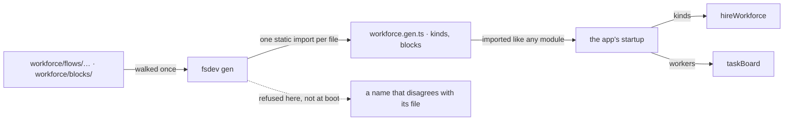

# FIX-1357 · Kinds + blocks boot scan (file-convention registration)

**Spec** · [Decisions](DECISIONS.md) · [Rules](BUSINESS-RULES.md) · [Plan](PLAN.md)

Feature · `workforce` + `fsdev` · medium · 1 PR · epic [FIX-1351](https://github.com/fixpoint-labs/flow-state-dev/pull/1718)

## Five people, before and after

| Someone who… | Today | After |
|---|---|---|
| **adds a custom worker kind** | Writes the flow, then has to remember a second place: import it at startup and put it on `hireWorkforce`'s kinds map under exactly the right key. Forget, and every seat naming it fails at boot | Puts the file under `workforce/flows/workers/`. The seat that names it hires |
| **adds a custom channel kind** | The same second place again, for a different kind of thing | The same one place, `workforce/flows/channels/` |
| **adds a block a task board or a skill assigns by name** | A third place: import it and add it to the board's worker map | Puts the file under `workforce/blocks/` |
| **renames a kind and misses the wiring** | The app boots, then refuses the seat — at run time, naming a seat rather than the rename | The build refuses, naming the file and both names |
| **deploys to Vercel or Next** | n/a | Byte for byte as today. Nothing is discovered while the app is running, so a bundled deploy behaves like a local one |
| **already passes a kinds map by hand** | The only way | Still works, untouched, forever |

Everything else about a team is already declared in files — its workers, its channels, its documents, its skills. Its **code** is the one half that still has to be wired by hand at startup, and the wiring is a third copy of a name that already exists twice: once as the file, once inside the flow. Three copies of one name is three chances to disagree, and the disagreement surfaces at boot.

## What changes


The fence is the whole design. Discovery happens **above** it, in the toolchain, where walking a
folder and importing what is in it is ordinary. Below it — the framework doing the same thing
while the app is running — is what this spec refuses, because it works on a Node host and finds
nothing on a bundled one ([D1](DECISIONS.md#d1)).

**What an author writes today:**

```diff
- import { researcher } from "./workforce/flows/workers/researcher";
- import { standup }    from "./workforce/flows/channels/standup";
- import { triage }     from "./workforce/blocks/triage";
-
- const seats = hireWorkforce(records, { kinds: { researcher, standup } });
- const board = taskBoard({ workers: { triage } });
+ import { kinds, blocks } from "./workforce/workforce.gen";
+
+ const seats = hireWorkforce(records, { kinds });
+ const board = taskBoard({ workers: blocks });
```

**And in the app's build script:**

```diff
- "build": "next build"
+ "build": "fsdev gen && next build"
```

## How a file becomes a registered kind



The generated module is ordinary TypeScript with static imports, so every bundler already knows
what to do with it. `hireWorkforce` and `taskBoard` are unchanged: they receive the same maps
they receive today, from a different author.

## What stays as it is

- **A hand-passed kinds map.** It is not deprecated and not second-class. An app that never runs
  `fsdev gen` behaves exactly as it does now ([ER-6](https://github.com/fixpoint-labs/flow-state-dev/pull/1718)).
- **Seats stay documents.** `WORKER.md` is untouched, and `flow:` still only names a kind
  already on the map. This issue changes who fills the map, not what it means.
- **The framework's run-time behaviour.** No new option, no new call, no new failure at boot.
  `hireWorkforce`'s existing refusal for an unregistered kind stays exactly where it is, as the
  backstop for an app whose generated file is stale.
- **The Markdown readers.** `readWorkforce`, `readChannelsDirectory`, `readResourcesDirectory`
  and `readSeatSkills` still read the tree at run time. Markdown is data; a kind is code.

## Sign off

1. **[D1](DECISIONS.md#d1) · The scan runs at build time, in `fsdev`; the framework never
   imports a path it discovered.** If wrong: the convention is portable but needs a build step,
   so an author who skips it gets a stale registry — a class of confusion we are choosing over
   a feature that silently does nothing on the host most apps deploy to.
2. **[D2](DECISIONS.md#d2) · The generated module feeds the parameters that already exist; the
   framework gains no registration API.** If wrong: the convention is locked to whatever
   `fsdev` emits, and a future producer that is not `fsdev` has to match that file's shape
   rather than a declared contract.

**Open: [is this the right moment to build it?](DECISIONS.md#open)** Nothing in the repo has
ever written the startup line this removes, and the epic says a hand-passed map stays valid
until this ships. Number 1 is the one to weigh. What lost and why:
[DECISIONS.md](DECISIONS.md). The cases: [BUSINESS-RULES.md](BUSINESS-RULES.md).
