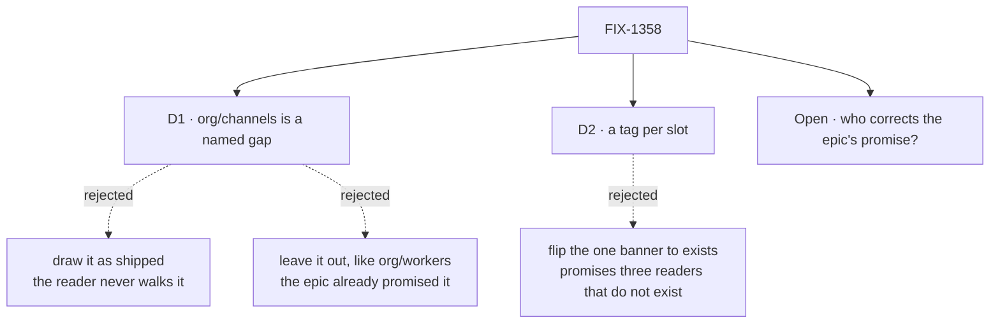

# FIX-1358 · Decisions

[Spec](SPEC.md) · **Decisions** · [Rules](BUSINESS-RULES.md) · [Plan](PLAN.md)

Two decisions are the sign-off surface, and one question is open. Everything else here is context
for them. The epic's own locks — D1 (a channel is L2 opinion), D2 (kind → one instance, channel →
a named session), D3 (path level is scope), D7 (`org/workers/` untaught), D8 (`TEAM.md`) — are
consumed here, not re-decided ([ER-14](https://github.com/fixpoint-labs/flow-state-dev/pull/1703)).

## The tree

Solid edges are what you are signing. Dashed edges lost, and the label says why.

## D1 · `org/channels/` is drawn as a named gap — not as shipped, and not left out

| | |
|---|---|
| **Instead of** | Drawing it as something that exists, which is what the epic's set table and people table say today · or leaving it off the figure entirely, the way `org/workers/` is left off |
| **Because** | It was run, not argued. A `CHANNEL.md` planted under `org/channels/` comes back in neither the results nor the errors, while the resources reader in the same run returns both scopes ([the POC](../../spec-poc/FIX-1358-atlas-honesty/)) — so the asymmetry is real, and drawing the door as shipped is the exact dishonesty this issue exists to remove. Silence is not available either: `org/workers/` is a door nobody claims, this one is claimed in writing by the epic, so an author who hits it has been told twice that it works |
| **Locks in** | The atlas and the epic spec disagree in public until one moves, and the atlas is what a person reads first. The tree's asymmetry — org scope for resources and skills, team scope only for channels — becomes a documented fact rather than a surprise |

Read the bottom row. Two of the three readings put the author in the same place — a file nothing
loads and no error to search for. Only the third spends the one sentence that saves the afternoon.

**What would change my mind:** someone shipping the `org/channels/` reader before this lands. Then
it is an ordinary `exists` row and the decision evaporates. That is a small change to a merged
reader, not a new issue, so it is worth asking before approving this.

## D2 · The tree figure carries a tag per slot, not one banner over the whole tree

| | |
|---|---|
| **Instead of** | Flipping the figure's single `TREE · PROPOSED CONVENTION` banner to `EXISTS` |
| **Because** | Five of the epic's thirteen issues have merged and eight have not, so one banner is wrong whichever way it points: as `proposed` it denies five merged readers, as `exists` it promises three that do not exist. The honesty tags — `exists`, `proposed`, `named gap`, `cut` — are the atlas's own vocabulary, used on every other table in the page. The tree is the one figure that never adopted them, which is why it is the one that rotted |
| **Locks in** | The figure gains a per-slot maintenance cost: a tag moves every time a reader lands. That bill is paid by whoever ships the reader, and it is the reason the check on this branch exists — it names the stale row instead of leaving someone to notice |

## Decided, not asked

- **This ships as a tree-teach pass, not the issue's ten-restatement fold.** Nine of the ten were
  rewritten on `main` after the issue was pinned and the check re-derives the count as zero, so
  executing the list is a no-op. The outcome it aimed at is still the target.
- **`TEAM.md` is drawn, tagged `proposed · FIX-1377`**, per the owner + Architect stamp on the
  issue. The atlas is internal and tags unshipped things routinely. ER-18's *behind the reader*
  rule governs `apps/docs/`; D7's *untaught* rule is about a door nobody owns. This one is owned.
- **§08 and §14 are not merged**, as the issue says. What they lacked is the line saying they are
  one noun, and §06 is where a reader starts.
- **No `apps/docs/` change.** The published Workforce section is the epic's wrap pass, which owes
  sentences this issue does not — the coordination seam the epic plan names for this pair.

## Considered and dropped

| Alternative | Why not |
|---|---|
| Fix the epic spec's `org/channels/` claim in this PR | It lives on a never-merged epic PR (BP-037) and is not this issue's to edit. ER-14 says comment up, and that is what happens |
| A legend beside the tree instead of tags on it | A second thing to keep in step with the first |
| Wait for FIX-1357 (the boot scan) so the tree is complete | The scan is the *code* door; it does not change where a `CHANNEL.md` goes. The tree has been wrong for three merged readers already |

## Open

**Who corrects the epic's promise that `org/channels/` ships?** *(Decides: the owner, with the
epic's coordinator. Blocks: nothing here — this spec is honest either way.)*

- **The fork.** Fix the epic spec to match the code, or ship the `org/channels/` reader so the
  epic spec comes true.
- **In plain terms.** The epic's own description tells a reader that a company-wide channel is a
  file you drop in one place. Today it is a file you drop in one place *per team*. Either the
  sentence is wrong, or the product is.
- **The trade-off.** Correcting the sentence costs a paragraph, and leaves apps without a
  company-wide channel until someone asks for one. Shipping the reader costs a small change to a
  merged convention — but it re-opens an issue marked Done, which is how a set stops converging.
- **My recommendation.** Correct the sentence. The epic's own tripwire (ER-15 — a convention earns
  a non-lab consumer before the lab lands) says the org door waits for someone who wants it, and
  nobody has asked. The asymmetry is cheap to document and expensive to guess at.
- **What would change my mind.** The lab (FIX-1355) needing a channel that is not a team's. Its
  intake DM is exactly that shape and has fallen between issues twice already.
- **If wrong.** Small and slow either way: one more issue later, or a door nobody walks through —
  which is the thing D7 exists to prevent.

**Commented up on the epic PR** per ER-14, non-blocking, with the POC's output attached.

## How it got here

- **Draft** — framed as a tree-teach honesty pass rather than the issue's ten-line fold, after the
  check re-derived that count as zero; the tree gains `channels/` and a tag per slot, and
  `org/channels/` is drawn as the gap the reader proved it to be.

## Settled

- **`org/channels/` is not read by anything** — **CONFIRMED** by
  [`spec-poc/FIX-1358-atlas-honesty/scope-reach.mjs`](../../spec-poc/FIX-1358-atlas-honesty/scope-reach.mjs):
  a planted `org/channels/general/CHANNEL.md` appears in neither `channels` nor `errors`, while its
  team-scope sibling arrives as `eng.standup` and both resource scopes return. Resolved — do not
  reopen on prose.
