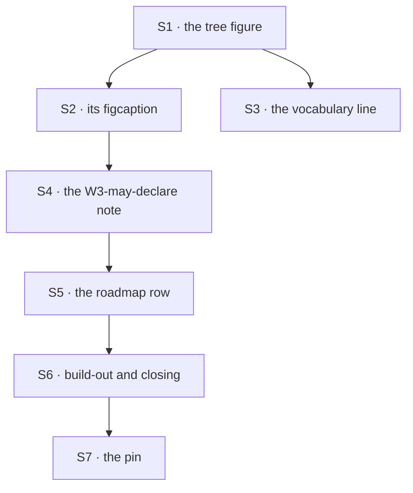

# FIX-1358 · Plan

[Spec](SPEC.md) · [Decisions](DECISIONS.md) · [Rules](BUSINESS-RULES.md) · **Plan**

Written for the implementing agent. IDs cross-reference
[BUSINESS-RULES.md](BUSINESS-RULES.md) (BR-n) and [DECISIONS.md](DECISIONS.md) (D-n). Not `tdd` —
there is no code. One PR, one file.

## Surfaces

Every surface is in `docs/atlas/workforce.html`. Line numbers rot, so each is pinned by a string
you can grep for; all of them existed at `fe4c9f76a`.

| ID | Where · grep for | Change | Rules |
|---|---|---|---|
| S1 | §06's tree figure — the `<svg>` whose `aria-label` starts `Proposed file tree` | Add `channels/<name>/` + `CHANNEL.md` under the team, `channels/` under `org/`, `TEAM.md` at team level. Tag every slot. **Remove** the `TREE · PROPOSED CONVENTION` banner rect and its label — what D2 replaces. Rewrite the `aria-label` for the tree it now draws | BR-1 BR-2 BR-3 BR-4 BR-5 BR-6 |
| S2 | §06's figcaption — `The tree is the scope story.` | What shipped, and what the tags mean. Drop `W3 grows kinds + blocks scan and the rest of the tree (…)` — now the figure's job | BR-4 BR-9 |
| S3 | §06's lede — `The product folders are` | One vocabulary line: a channel is one noun read from three places — declared here, delivered in §08, rostered later in §14 | BR-11 |
| S4 | §06's note — `W3 may declare channels. Collab RC is still later` and its `
` | Present tense; name the path that ships and the kind it binds to. Keep the Collab fence and the `No Channel / MessageBoard L1` line | BR-9 BR-13 |
| S5 | §03's roadmap row `W3 &#8212; File-convention surface` | Split shipped from not: three conventions and the kinds fence are done; scan, admission, `TEAM.md`, worker resources, Door B, extract and lab are not. Keep the *what this is not* cell whole | BR-8 |
| S6 | The build-out row `Build-out (W2 / W3 / lab` and the closing summary `Workforce is the Layer&nbsp;2 product` | Same correction, shorter. Neither may still read *W3 next* | BR-10 |
| S7 | The pin line — `Pinned to <code>origin/main</code> at` | Move it to this PR's base commit and today's date. A page that states a pin and is edited without moving it is its own small lie | — |

**Not touched, and check that they aren't:** §08, §14, anything under `packages/`, anything under
`apps/docs/`. BR-12 is one `git diff --stat` line.

## Sequence

S1 first because the tags it invents are the vocabulary every later surface uses. S7 last because
it names the commit.

## Checks

| ID | Runs after | Passes when |
|---|---|---|
| V1 | S1 | `node spec-poc/FIX-1358-atlas-honesty/tree-teach-check.mjs` exits 0. Both totality directions hold and `org/workers` is absent (BR-1 BR-2 BR-3 BR-5) |
| V2 | S1 | The same command with `--plant` exits **non-zero** and names the planted slot. A check nobody has watched fail is not evidence (BR-7, tenet 7) |
| V3 | S6 | The checker's claim A still reports zero rooms-and-L2-channels lines (BR-14). It passes today; the job is not to break it |
| V4 | S1 | The page renders at both OS colour schemes and §06's tree reads without a label crossing a tag. Inline SVG, no build step — open the file, don't infer |
| V5 | S6 | `git diff --stat` names exactly one file (BR-12) |
| VG | S7 | **Goal, on the real path.** Read the rendered page as someone with no epic context and answer three questions from §06 alone: which slots can I declare today, which are coming and under which issue, which door is locked with nothing behind it. All three answerable without opening `packages/`. Judgment, not a script |

**The second path (BP-035)** is a tag's *off* state — a slot whose reader has not shipped. Check
both of them: `channels/` under `org/` and `resources/` under a worker are the two rows that must
read as gaps, and the two a reader skims past.

## Pinned names

| Where | Name | Why pinned |
|---|---|---|
| Tag vocabulary | `exists` · `proposed · FIX-n` · `named gap` | The page's own honesty tags. Inventing a fourth for this figure is how the vocabulary drifts (BR-4) |
| Channel path | `teams/<teamId>/channels/<name>/CHANNEL.md` | It is what an author types, and the reader's own segment |
| The gap's label | `named gap · no reader` | D1's whole content is in those three words |

Everything else — box geometry, label order, which colour class a tag uses — is yours.

## Guardrails

| Rule | Because |
|---|---|
| Every tag points at a merged PR or an open issue you checked | The defect this issue fixes is a tag nobody re-derived. The checker enforces the slots; the provenance is on you |
| `org/workers/` appears nowhere you touch | D7 · ER-13. The tree looks incomplete without it, and completing it teaches a door that reports nothing |
| Don't widen into §08 or §14 | They are right, and a docs PR that grows to the whole page can't be reviewed for what it changed |
| Keep the `<svg>` on the page's own CSS classes | Atlas figures inherit their styling from the page; one that brings its own `<style>` renders unlike its siblings |
| The aria-label describes the tree, not the change | It is what a reader who can't see the figure gets, and it outlives this PR |

## Docs

- **No `apps/docs/` change.** The atlas is internal (`docs/atlas/README.md`) and may cite issue
  identifiers; the published Workforce section is the epic's own wrap pass, and it owes two
  sentences this issue does not (the epic plan's *Wrap*). Landing a second teach now collides with
  it — the coordination seam the epic plan names for exactly this pair.
- **No package README, no changeset.** Nothing published changes (BP-022).

## POC

[`spec-poc/FIX-1358-atlas-honesty/`](../../spec-poc/FIX-1358-atlas-honesty/) on this branch, two
files, both throwaway and both runnable with no workspace install:

- **`scope-reach.mjs`** — plants a `CHANNEL.md` and a resource document at each scope, runs the
  real readers. It **refuted** the premise: the epic promises `org/channels/` opens a channel; the
  reader walks team scope only, silently. The resources reader returns both scopes in the same
  run, which rules out a fixture mistake. That result is D1.
  `node --experimental-strip-types --import ./spec-poc/FIX-1358-atlas-honesty/register.mjs spec-poc/FIX-1358-atlas-honesty/scope-reach.mjs`
- **`tree-teach-check.mjs`** — the factual base. Derives the slot list from the four loader sources
  and from §06's figure, asserts they match both ways, exceptions needing a reason each. Red on
  `main` today, naming `teams/<id>/channels` as shipped and untaught; `--plant` is the negative
  control, run. `node spec-poc/FIX-1358-atlas-honesty/tree-teach-check.mjs`

Neither ships. The checker is the thing to argue with: if its exceptions table is wrong, so is the
spec's factual base.

## At implement time

- **Re-run the POC first.** If the `org/channels/` reader has shipped since, D1 evaporates and that
  row is an ordinary `exists`. Nothing else moves.
- **Re-read the epic's set table** for tag provenance. A tag naming an issue that has since merged
  is the same defect in a smaller box.
- **Re-check the exceptions table against the four loader files.** FIX-1389 will extract the shared
  walk, and the checker reads those files by shape.

## Follow-ups

- `IGNORED_ENTRIES` is declared identically in three loader files. Out of scope; flagged for
  FIX-1389's extract.
- The checker is throwaway by construction. If this tag rot recurs, the durable version belongs in
  `scripts/` beside the other validators — not proposed now; one occurrence is not a pattern.
