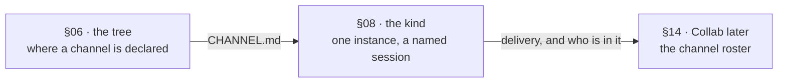

# FIX-1358 · Atlas: the ChannelFlow teach and the full tree

**Spec** · [Decisions](DECISIONS.md) · [Rules](BUSINESS-RULES.md) · [Plan](PLAN.md)

Docs · `docs/atlas/workforce.html` · small · 1 PR · epic
[FIX-1351](https://github.com/fixpoint-labs/flow-state-dev/pull/1703)

## Four people, before and after

| Someone who… | Today | After |
|---|---|---|
| **wants to know where a channel is declared** | The tree figure has no `channels/` in it at all. They read §08, which explains how a post is delivered, and never learn the file exists | The tree shows `teams/<teamId>/channels/<name>/CHANNEL.md` as something that ships today |
| **drops a `CHANNEL.md` under `org/channels/`** | The epic spec says it opens as a channel. Nothing loads it, nothing errors, and they spend the afternoon debugging their own tree | The tree marks that door a **named gap** — locked open, no reader yet. They declare it on the team instead |
| **reads the tree to learn what W3 gave them** | One banner over the whole figure says `PROPOSED`, five merged readers later | A tag per slot: five say what exists, two name the issue that is still coming |
| **writes the next thing on this surface** — the lab, resources Door B | Copies a figure that is wrong in both directions: missing what shipped, promising what didn't | Copies a figure whose every row is checkable, and a check that fails when one stops being true |

**Why now.** The epic's proof ([ER-22](https://github.com/fixpoint-labs/flow-state-dev/pull/1703))
is that the docs teach the tree as something an author writes. Three conventions have merged and
the lab is the next thing to start, so the atlas is about to be read by the person with the least
context in the set — and it is at its least honest right now, because everything moved and the
figure didn't.

**One correction to the issue.** It was written against `7aa5ad4b0` and lists ten W3-facing lines
that call rooms and L2 channels two declared things. Nine were rewritten on `main` in the weeks
since; the count today is **zero**, re-derived by
[a check on this branch](../../spec-poc/FIX-1358-atlas-honesty/). The desired outcome it names —
*the atlas says one thing about what a team declares in files* — is still unmet, but the work is
in §06's tree, not in those ten lines.

## What changes


The left panel is the figure on `main`. Read the right panel's third column: it is the only new
information, and it is the whole change. The tree gains one slot and eleven tags.

**The tree, as the atlas draws it** (the figure's own text, which is what a reader copies):

```diff
  org/
    resources/
    skills/
+   channels/                      ← named gap · locked open, no reader
  teams/<teamId>/
+   TEAM.md                        ← proposed · FIX-1377
+   channels/<name>/CHANNEL.md     ← exists · #1793
    resources/
    skills/
    workers/<name>/
      WORKER.md
      skills/
      resources/                   ← proposed · FIX-1368
- TREE · PROPOSED CONVENTION       ← one banner for thirteen issues
+ a tag per slot
```

## How a reader gets from the tree to the kind



Three sections, one noun. §08 and §14 already say the right thing and are not touched; §06 is the
one that never learned a channel has a file. The link between them is the sentence this adds.

## What stays as it is

- **Everything under `packages/`.** No reader moves, none is widened. This is the atlas only.
- **§08 (Channels) and §14 (Collab).** They describe delivery topology and the later roster, which
  are two views of one noun — the fold's own point. They are not merged away.
- **`org/workers/`.** Locked open, unowned, and **taught nowhere**
  ([D7](https://github.com/fixpoint-labs/flow-state-dev/pull/1703) · ER-13). The fence strip in the
  figure is there so the next editor does not "complete" the tree by adding it.
- **The `proposed` tag on the boot scan** (FIX-1357) and on the admission work (FIX-1367). Those
  genuinely have not shipped.

## Sign off

1. **[D1](DECISIONS.md#d1) · `org/channels/` is drawn as a named gap — not as shipped, and not
   left out.** If wrong: the atlas takes a position the epic spec contradicts, in public, and one
   of the two has to move. *If wrong the other way:* every author who trusts the epic loses an
   afternoon to a file nothing reads.
2. **[D2](DECISIONS.md#d2) · The tree carries a tag per slot, not one banner.** If wrong: the
   figure gains a maintenance cost every time a reader lands, forever — paid by whoever ships the
   reader, not by whoever reads the figure.

**Open: one.** [Who fixes the epic's own promise?](DECISIONS.md#open) — the epic spec tells a
reader that `org/channels/` works, and it does not. Number 1 is the one to weigh; it is the same
fact seen from this issue's side. What lost, and why: [DECISIONS.md](DECISIONS.md). The cases:
[BUSINESS-RULES.md](BUSINESS-RULES.md).
