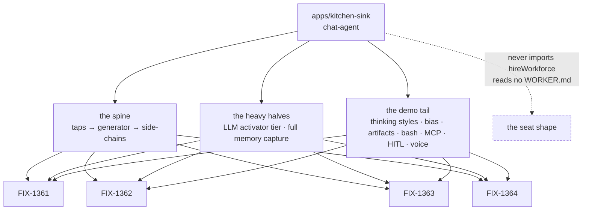
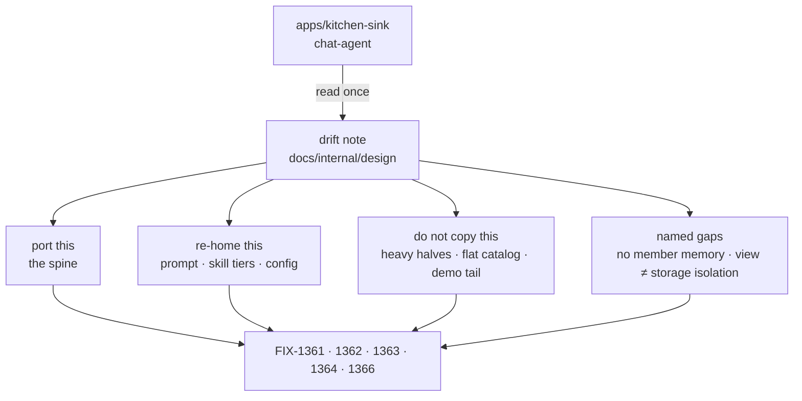
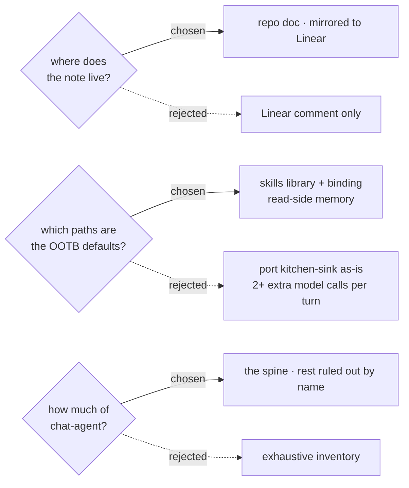

# FIX-1360 — Kitchen-sink drift audit (explainer)

Companion to [`FIX-1360.md`](./FIX-1360.md). Diagrams and captions only: it decides nothing and
asks nothing.

**The words.** A **seat** is a roster slot resolving to one flow instance, declared as
`WORKER.md`. A **kind** is a flow factory on hire's `kinds` map. The **agent kind** is the
opinionated default FIX-1359 adds. **Kitchen-sink** is the app holding the closest working
composition of the agent shape we own.

## 1. Today

Four sibling specs each read the same app independently, and each reads all of it — spine, heavy
halves and demo tail alike, with nothing marking which is which. The dashed edge is the fact none
of them would find on their own: kitchen-sink proves the flow shape and proves nothing about the
seat.

## 2. After (proposed)

One reading, sorted into four buckets, cited by everything downstream. The note's third bucket is
the one that earns it: the expensive mistake is copying, not omitting.

## 3. Where the decision fell

Four agent authors work in separate checkouts and grep, so the note lives in the repo. Kitchen-sink
runs the heavy skills and memory paths; defaults are where that cost becomes everyone's, so the
light ones are the recommendation and the heavy halves become one config line each. And the demo
tail is ruled out by name, because "present in kitchen-sink" is not evidence of belonging in a
default.

**Left to their owners, with evidence attached:** the kind's id and admission rule and which
package exports it (FIX-1361), the skill merge and isolation rule (FIX-1362), the member-memory
gap (FIX-1364), and the twelve reachable places that still teach the deleted agent surface
(FIX-1366).
