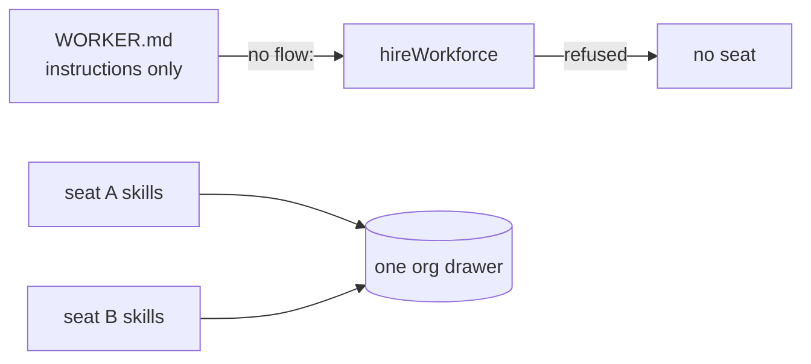
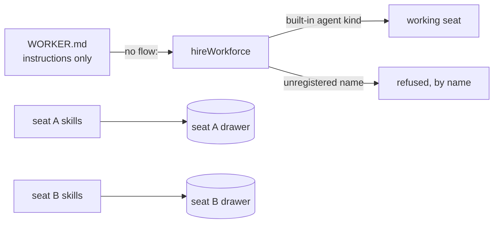
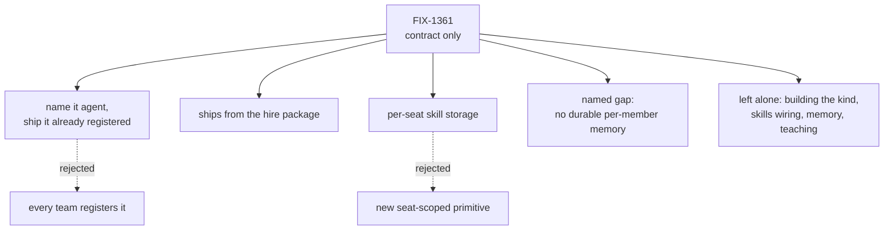

# FIX-1361 — Default agent kind contract · explainer

## 1. Today

A worker file that carries only instructions is refused at hire — the zero-config seat is a
locked door. And every seat's skills land in one company-wide drawer, so the per-seat privacy
we describe is a view, not storage.

## 2. After (proposed)

Absent means default; wrong still means a loud error. Each seat's skills key on that seat's own
id, using separation the storage layer already has. This is the shape being gated.

## 3. Where the decision fell

Three calls, each with its rejected alternative on a dashed edge. The gap node is what this
contract names rather than fills — memory is durable per end user, not per seat member; the
memory issue carries it onward.

_Panel 4 lands once the first implementation merges._
