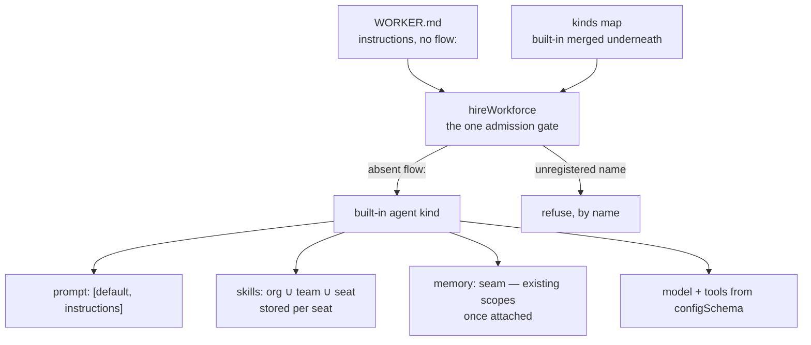

# FIX-1361: Default agent kind contract — Implementation Spec

## Part I — The Case *(for the human)*

### 1. Problem — why it matters, why now

We are about to promise something the product cannot currently do, in four places at once.

The epic's headline is that a team describes a worker in a file — a name, a description, and
some instructions — and gets a working agent that talks, remembers, and can use the skills
that team gave it. Four separate pieces of work build toward that: the agent itself, its
skills, its memory, and the teaching material. Each is a different author, in a different
checkout, working at the same time.

Two things make that promise false today, and neither is a detail.

**A worker file that only carries instructions is refused.** The hire step requires the file
to name which kind of worker it is, and refuses anything that doesn't. So the zero-config
seat the epic leads with is not a shortcut nobody has taken — it is a door that is currently
locked.

**A worker's skills are not actually that worker's.** Skills are filed in one shared
company-wide drawer. Two workers in the same company that each have a skill by the same name
are reaching into the same slot. The per-worker view we describe is real at the level of
*what each worker can see*, and not real at the level of *where the thing is stored* — which
is the level that matters the moment anyone edits one.

Nobody has written down the answers, so four authors would each invent one. The most likely
outcome is not that one of them is wrong; it is that all four are subtly different, and the
disagreement only surfaces when the pieces are put together at the end.

**Why now** — this is the head of the chain. Everything else in the epic waits on it, and
every day it is unwritten is a day the set is stopped.

### 2. Solution in plain terms

Write the contract down once, at an address the four authors already read, and make it
answer the questions that would otherwise be answered four different ways:

- **What the default worker is made of** — instructions, a model, tools, its skills, its
  memory — and that it is assembled from parts we already ship rather than being a new kind
  of thing in its own right.
- **How a worker file reaches it, and what happens when someone mistypes.** A file that names
  no kind gets the default. A file that names a kind nobody registered is refused, loudly, by
  name. Absent means default; wrong means error — never a silent substitution.
- **Where a worker's skills actually live, and how that worker's own skills get into that
  place** — two different things, and the second one was missing until a reviewer found it.
- **What memory it gets, and what it honestly cannot do yet** — named as a gap rather than
  papered over with something that looks durable and isn't.
- **How a team replaces it** with their own, in one line, without us having to anticipate
  what they wanted.

It also says what it deliberately does *not* decide, so the four authors know which calls are
still theirs.

**This is a contract, not a design.** It fixes what the pieces owe each other. It does not
build the worker, wire its skills, attach its memory, or write the teaching material — those
are the four issues that read it.

**Philosophy** — tenet 2 (*composition over features*): the default worker is a composition
of primitives we already ship, not a second agent type beside the one we are deleting.
Tenet 5 (*fix at the owning layer*): the rule about which worker file gets which kind has
exactly one gate — the hire step every seat passes through — rather than a check repeated per
caller. Tenet 3 (*earn every addition*): the contract's job is as much to name what must
**not** be invented as to name what ships.

### 6. Decisions & rules — the sign-off surface

1. **The default kind is called `agent`, it is already on the roster without anyone adding
   it, and a team that registers their own `agent` replaces ours outright.**
   *Rejected:* making every team name and register it themselves — that is the same small tax
   the old agent factory charged, and removing it is the point of the epic.
   *Locks in:* `agent` becomes a reserved word in every worker file anyone writes from now on.
   Renaming it later is a break we cannot fix for customers — the word is in files on their
   disks, not in our code — so this is the cheapest moment to be unhappy with it.

2. **The default worker ships from the package that already does hiring, and anything heavier
   than a plain talking worker arrives as a setting rather than as a second thing to install.**
   *Rejected:* a new package of its own — it would split the hire surface in two and make
   "install this to get a working worker" a two-step answer.
   *Locks in:* one install gets a working worker. In exchange we owe it that the default never
   forces memory machinery on a team that doesn't want any, which constrains how the memory
   work is allowed to attach.

3. **Each seat's skills are stored in that seat's own drawer, using the per-copy
   separation the storage layer already has — not a new mechanism built for this.**
   *Rejected:* keeping one shared drawer and filtering per worker, which is today's shape and
   is exactly the privacy-in-name-only problem in §1; also rejected: inventing a worker-scoped
   storage concept, when an existing flag already carries the worker's identity into the key.
   *Locks in:* a company-wide skill is **copied into** each worker when that worker first
   runs, not shared live. Editing the company copy afterwards does not reach into workers
   already running — refreshing them is a deliberate act, not something that happens quietly
   underneath a team.
   *Named after review, not re-decided:* separating the drawers and filling each one are two
   pieces of work, and only the first falls out of the existing flag. The storage layer already
   separates them (run, not read). Getting *that worker's* skills into *that worker's* drawer
   is a handoff that has to be built, and C3 now says so rather than leaving it implied.

**Non-goals** — building the worker, wiring its skills, attaching its memory, or rewriting
the teaching material; those are the four issues that consume this. Not re-opening whether a
file with no kind gets the default (the epic settled that). Not a persona builder. Not a new
way to keep one team's memory away from another's — where that is still missing, this
contract names it and stops.

**Size:** Small — 0 production files · 2 documentation surfaces · 7 acceptance criteria handed
to four issues · 1 PR.

---

### 3. Tradeoffs & alternatives

**Alternative: skip this and let the worker's own spec carry the contract.** Three reviewers
made that case at the epic gate, and the epic kept this issue with a named trigger for folding
it later. The research settles it in favour of keeping it: two of the three decisions above
are not the worker-builder's to make. Decision 1 changes the hire step's public behaviour,
which the worker consumes but does not own. Decision 3 belongs to the skills work, which is a
different issue again. A contract that lives inside one of the four consumers is a contract the
other three have to read a stranger's build plan to find.

**The simpler approach: write it as a comment on the epic.** Genuinely tempting — it is three
paragraphs of rules. Insufficient because the four authors work in separate checkouts and read
the repository, not the ticket thread; and because the drift audit that precedes this one
established the pattern that works here — one file, at a stable address, cited by everyone. A
rule that lives only in a comment is a rule that gets re-litigated.

**Where the complexity is:** not the writing. It is decision 3, which is the only place this
contract contradicts something the epic asserted. The epic assumed per-worker privacy would
need a new storage identity. It does not — the identity already exists and is already keyed
on the worker. Getting that wrong in either direction is expensive: inventing a primitive we
did not need, or shipping a privacy promise the storage does not keep.

### 4. Focus practices (1–5)

1. **Tenet 5 — one convergence point for the admission rule.** Every seat is minted through
   one function. The rule about which file gets which kind belongs there and nowhere else; a
   second check anywhere downstream is how "absent means default" and "wrong means error"
   drift apart.
2. **Tenet 3 — name the removals.** A contract that only lists what to build is the failure
   mode the drift audit already hit. Half of this document's value is the list of things that
   must not be invented.
3. **BP-030 (tolerate the old shape)** — worker files that already name a kind must behave
   byte for byte as they do today. This change adds a door; it does not move one.
4. **BP-003 (verification evidence)** — every behavioural claim in this contract names the
   file it was read from, and the three that decisions rest on were *run*, not read (§7). The
   first draft ran one of them and asserted the other two; the review found both.

### 5. What using it looks like (1–5 examples)

*What this spec proposes. Today the first example is refused — that is §1's first problem.*

**A worker with nothing but instructions:**

```
workforce/teams/support/workers/triage/WORKER.md
```

```md
---
description: First-line support triage.
---
You answer support questions. If you cannot resolve one in two replies, hand it to a human.
```

```ts
const seats = hireWorkforce(workers, { kinds: {} });
// before  throws: worker "support.triage" — declares no `flow:`, so there is no flow
//         kind to hire it into
// after   hires the built-in agent kind; the body arrives as its instructions
```

**Replacing it — one line in the file, or one key on the roster:**

```md
---
flow: myCustomAgent      # this worker only
---
```

```ts
hireWorkforce(workers, { kinds: { myCustomAgent: myFlow } })  // that worker's kind
hireWorkforce(workers, { kinds: { agent: myFlow } })          // replaces the default for everyone
```

**A typo is refused, never silently defaulted:**

```
---
flow: myCustomAgnet
---

hireWorkforce refused 1 of 3 workers; nothing was hired:
  - worker "support.triage" — names flow kind "myCustomAgnet", which was not passed to
    hireWorkforce. Kinds passed: "agent", "myCustomAgent"
```

---

## Part II — The Build Plan *(for the implementing agent)*

### 7. Technical design

The deliverable is one document. **Its content is the six clauses below** — they are the
contract, written here so the spec PR is where they get argued with, before four issues are
built against them.



**C1 — Composition, not a type.** The agent kind is a flow like any other. Its settings bag
(`configSchema`) declares `instructions`, `model`, `tools`, and the skills/memory switches.
`instructions` is the worker file's body, arriving as one setting — the hire step already
imposes that key (`packages/workforce/src/manifest.ts`, `INSTRUCTIONS_KEY`), and already
refuses `persona` by name. Generator slots stay `prompt` / `context` / `history` / `user`;
instructions compose as `prompt: [default, instructions]`. The shared `default` is owned and
shipped elsewhere (FIX-1344 part 2, not yet landed); until it does, the kind ships against
`instructions` alone with an explicit seam for `default` to drop into, and **defines no second
default-prompt configuration anywhere in this epic**.

**C1a — Settings are a default layer, not the only layer.** The drift audit found this
inverted in the reference app, so the contract states it: a worker file supplies *defaults*.
Model and thinking-style choices stay overridable per end user; per-turn feature switches stay
per-turn input. Folding all three into the settings bag would delete controls the reference app
has today (`docs/internal/design/kitchen-sink-agent-drift.md` §5.4).

**C2 — Admission has exactly one gate.** `hireWorkforce` is it (tenet 5). The complete rule:

| Worker file says | Result |
|---|---|
| no `flow:` | the built-in agent kind |
| `flow: agent` | the built-in agent kind — same kind, named explicitly |
| `flow: <registered>` | that kind, exactly as today |
| `flow: <not registered>` | **refused by name**, listing the kinds that were passed — today's wording, unchanged |
| roster passes `kinds: { agent: … }` | the app's flow wins; the built-in is merged *underneath* whatever the caller supplied |

The existing refusal for a flow filed under someone else's kind name
(`packages/workforce/src/hire.ts`, the `factory.kind !== kind` check) still applies to the
built-in: an app's replacement must declare `kind: "agent"`. Adding an implicit default must
not weaken any existing refusal — that is the loud-fail obligation the epic assigned here.

**And it must declare `cardinality: "collection"` — the built-in and every caller replacement
alike.** A roster is N seats of one kind, and `defineFlow` defaults to `singleton`
(`normalizeCardinality`, `packages/core/src/flow/defineFlow.ts`), whose id is its kind. So a
replacement written the plain way — `defineFlow({ kind: "agent", configSchema, actions })` —
hires without complaint and is then refused seat by seat at **registration**, not at the mint:

```
Flow "agent" is a singleton but was instantiated with id "engineering.lead". A singleton's id
is its kind. If this definition is meant to have several registered instances, declare
cardinality: "collection" on defineFlow(...); otherwise call the factory without an id.
```

(`packages/engine/src/registry/flow-registry.ts`, `singleton-id-mismatch`. Run, not read — POC
part 2 below, which also records that `hireWorkforce` itself mints the seats happily; the mint
is not the gate.) The refusal is loud and it arrives at boot, so nothing ships broken — but a
caller reading only "declare `kind: 'agent'`" would meet it by surprise, which is why the
requirement is stated here rather than left to be discovered.

**C3 — A seat's skills are stored per seat, and stored is not the same as filled.**
The seat's *view* is
`org ∪ teams/<thatTeam> ∪ workers/<thatSeat>`, already shipped
(`packages/workforce/src/loader/read-seat-skills.ts`), and a name reaching one seat from two
levels is refused rather than shadowed (`duplicateSkillNameMessage`). The *storage* is the
gap: the skills library keys its collection at `"skills"`, org scope, with no isolation
(`packages/orchestration/src/skills/library.ts`), so two seats in one org share one bucket.

Two things have to be true for a seat's skills to be that seat's, and they are separate.
The first draft of this clause answered only the first.

**The drawer — isolation.** The kind declares its skills collection **isolated per flow
instance**, and a seat *is* a flow instance, minted with the worker's id (`hire.ts` passes
`{ id: manifest.id }`). The storage layer already keys isolated resources as
`${identityId}:${flowId}` on the **instance** id, not the kind (`scope-keys.ts`,
`resolveResourceScopeId`; FIX-1323). No new primitive: `defineSkillsCollection` /
`createSkillsLibrary` accept `prefix`, `maxInstances` and `scope` but do **not** forward
`flowIsolation`, so one option field has to be threaded through.

**The contents — population.** Isolation alone gives every seat its own *empty* drawer and
then fills all of them from the same jar. `createSkillsLibrary` captures one static
`initialSkills` array when the kind is defined — once per kind, not once per seat
(`library.ts`) — and the runtime seeder writes exactly that array into whichever collection
ref it is handed (`ensureSeeded`, `seeding.ts`; called that way from `run-skill-tool.ts`,
`load-tool.ts`, `context-fn.ts`, `binding-reader.ts` and `seed-step.ts`). N isolated seats
therefore end up with N separate buckets holding N *identical* catalogs. There is no channel
for a per-seat set either: `WorkerManifest` is `{ id, declared, body }` and nothing more, and
`hireWorkforce` forwards only frontmatter settings, so the `org ∪ team ∪ seat` union that
`read-seat-skills.ts` already computes has nowhere to ride into the mint.

**So the contract requires an instance-specific seeding path**, and acceptance criterion 5 is
written to fail without one. The seat's computed union must reach *that seat's* collection as
its `initialSkills`, so `ensureSeeded` writes that seat's skills and no one else's. Where the
handoff lives — a per-seat key on the kind's `configSchema`, a per-instance option on the
library, or a seed at hire time — is FIX-1362's to design. That it must exist is decided here.
This is the same defect class as FIX-1372, filed against the reference app: an activator built
with no `initialSkills` shows every matcher tier an empty catalog on turn 1.

**Copy-in is the honest lock-in, and it is named.** Seeding writes a *copy* into the seat's
drawer and records the name in `_meta.seededNames`, so a later edit to the company copy does
not reach a seat that already holds one, and a deletion is not undone. Refreshing a running
seat is therefore a deliberate act with no mechanism yet; FIX-1362 owns building one. Saying
so is this contract's job — the alternative is a privacy promise that reads as live sharing.

> **POC — two parts, both run on this branch, both throwaway.** The second part was added
> after review and it changed this clause and C2.
>
> **Part 1 — the keys.** `spec-poc/FIX-1361-seat-skill-isolation/seat-isolation.mts`:
> `node --experimental-strip-types spec-poc/FIX-1361-seat-skill-isolation/seat-isolation.mts`
> (no install needed). Today's gap — two seats both resolve to `["acme"]` — and the fix —
> `["acme:engineering.lead"]` vs `["acme:engineering.qa"]` — with the coordinate being the
> seat's own id, not the flow kind. **Storage keys isolate.**
>
> **Part 2 — the contents, and the cardinality.**
> `spec-poc/FIX-1361-seat-skill-isolation/seat-population.test.ts`:
> `pnpm exec vitest run --root . --config packages/orchestration/vitest.config.ts spec-poc/FIX-1361-seat-skill-isolation/seat-population.test.ts`
> (needs `pnpm install`). Real `createSkillsLibrary`, `ensureSeeded`, `defineFlow`,
> `hireWorkforce` and `createFlowRegistry`. Two seats are given **different** skill sets and
> both drawers come back `["break-down-work","write-regression"]`; seeded from their own
> arrays instead, they come back `["break-down-work"]` and `["write-regression"]`. **Contents
> do not isolate — the missing piece is the handoff, not the flag.** The same file runs C2's
> cardinality claim: a plain `agent` kind is a singleton, its seats mint, and registration
> refuses them.
>
> Together they cut in both directions. Epic theme 7 assumed per-seat isolation would need a
> distinct collection key, prefix or scope — it does not. This spec's first draft assumed the
> isolation flag was the whole answer — it is not.

**The drift note prescribes the refuted mechanism, and this clause supersedes it.** Drift §3a
says *"Real per-seat isolation needs a real resource identity — a distinct collection key,
prefix, or scope"* (`docs/internal/design/kitchen-sink-agent-drift.md:161`). It does not: the
identity already exists as `flowIsolation`, keyed on the seat's instance id — see C3 above, which
is the mechanism to build. The note is a dated characterization and explicitly not maintained, so
it is **not edited**; the correction lives here instead. It is stated against the note and not
only against epic theme 7 because epic theme 8 sends every later issue to the note *instead of*
re-reading the app, and FIX-1362 is the issue that would otherwise read §3a and build it.

**C4 — Memory attaches to existing scopes, and the gap is named.** `session`, `user`, `org`,
plus per-instance isolation where a resource wants it. Identity and durable per-member memory
are **not** on the seat object. The honest gap, verified in the reference app: user-scoped
memory is durable per *end user*, with no member or seat identity in it, so a multi-seat roster
serving one person shares one memory (drift note §3b). This contract states the gap; the memory
issue carries it onto the teaching surface and files a ticket. Nothing here invents a new
isolation primitive.

**C5 — Out of the box is the cheap path, and cheap includes *off*.** Three things, and they are
separate:

1. **Skills** — the library plus per-generator binding, pinned below.
2. **Memory is a seam, attached when configured.** An instructions-only seat does **not** remember
   out of the box. The default kind carries no static memory import, and neither does the hire
   package's required graph. Memory arrives because someone turned it on.
3. **Once memory is on, light is the default there too** — read-side. The model-classifier tier for
   skill matching and the background capture pipeline for memory stay **opt-in, one setting each**,
   on the asymmetry the epic signed off on PR #1736: light to heavy is additive, heavy to light is
   a breaking change for rosters already hired. That asymmetry governs *which* memory a roster gets
   once memory is attached. It never authorized attaching memory by default.

Splitting 2 from 3 is what makes the constraint in decision 2 checkable rather than decorative: a
default mint with no memory in it is a claim a test can falsify. **Owners:** FIX-1363 may ship the
default composition as talking plus skills with no memory wired — it is not blocked on the memory
work; FIX-1364 owns the attach-via-setting shape; FIX-1366 teaches that honestly, not as
"remembers with zero configuration".

**The skills entry point is pinned here: the built-in kind is built from `createSkillsLibrary`
plus per-generator binding, not `createSkillsCapability`.** Two overlapping entry points exist
(§12) and reconciling them is FIX-1362's; but *which one the default is made of* is a contract
call, because leaving it open lets FIX-1363 and FIX-1362 ship two different default stacks
under one name. The library wins on the same argument as decision 3, one level down: its
activation is per binding, so a skill given to one generator never appears in another's
context, where the capability keeps a session-global `activeSkills` bag. The published guide
currently teaches the capability; correcting that is FIX-1366's, not a reason to pick it.

**C6 — What must not be invented.** No second Agent type at framework level. Do not grow
`AgentRegistry` into a product Agent. `defineAgent` / `materializeAgent` are not the teach
path and nothing here extends, imports or mirrors them — equally, nothing here waits on their
deletion. Seats are flow instances of a kind; there is no `worker.ts` seat door. No Channel or
MessageBoard types follow from this contract.

And one thing that must not be **copied**: the tree still teaches the placeholder kind
`worker-agent`. The built-in kind id is `agent`. Until the migration lands, an implementer reading
an existing example should not carry `worker-agent` out of it.

**The migration splits by artifact type.** Teaching surface is prose a reader learns from;
executable surface is a check that goes stale the moment the behaviour changes, and it belongs
with the change that makes it stale, not with a later teaching pass. An earlier draft of this
clause routed both to FIX-1366 and also collided with §11 over one file.

| Surface | Where it is | Owner |
|---|---|---|
| **Teach** — prose and rendered pages | `packages/workforce/README.md` (5) · `apps/docs/docs/workforce/overview.md` (4) · `apps/docs/docs/workforce/workers-on-disk.md` (8) · `docs/atlas/workforce.html` (1) | **FIX-1366** |
| **Executable** — fixtures, goal files and tests | `goals/workforce-conventions/files-alone-produce-the-roster/fixtures/` (3 worker files) · `goals/workforce-seats/two-seats-run-their-own-configuration/` (`fixtures/flows.ts` 4, 2 worker files, `goal.md` 2) · `packages/workforce/test/hire.test.ts` (10, incl. `workerAgentFlow`) · `packages/workforce/test/read-workforce-directory.test.ts` (2) | **FIX-1363** |

Counts are from the tree at author time and will drift; each owner re-derives with
`grep -rn "worker-agent\|workerAgentFlow"`, excluding `node_modules`, `spec/`, and
`docs/internal/design/kitchen-sink-agent-drift.md:230` — a dated record, not teach surface. Note
what the earlier three-item list missed: both published guides and the Atlas page, which is a
rendered `.html` no markdown-only grep reaches (drift note §2f).

**Acceptance criteria — what the four consuming issues must satisfy.** These are the
contract's falsifiable half, written as assertions a caller can watch happen. Each one is
**assigned** to a named issue in the table below. Criteria 4, 5 and 6 were sharpened by the spec
review: as first written, 4 was unsatisfiable and 5 could pass on a roster where every seat held
the same catalog:

1. A worker file carrying only a description and a body hires, with no `kinds` entry supplied.
2. That seat answers a turn using its body as its instructions.
3. A worker file naming an unregistered kind refuses by name, listing the kinds that were
   passed, and nothing in the roster hires.
4. A roster passing its own `agent` — declared `cardinality: "collection"` — gets its own
   flow, not ours, for **every** seat on the roster, and those seats register.
5. Two seats whose worker folders hold **different** skills each read a catalog containing
   their own skill and not the other's, and each can use it. Separate storage keys are
   necessary and not sufficient: a run in which the two seats resolve to distinct keys and
   identical catalogs **fails** this criterion. (See C3 — this is the criterion the
   instance-specific seeding path exists to satisfy.)
6. Editing an org-level skill after a seat has been seeded does not change what that seat
   holds until that seat is deliberately refreshed.
7. Nothing in the shipped kind imports `defineAgent`, `materializeAgent` or `AgentRegistry`.

**Who proves which — decided, not open.** The epic fences FIX-1365 to *a thin hire of the OOTB
agent kind, nothing more*. Criteria 1–3 are a thin hire; criteria 4, 5 and 6 are not. Pointing all
seven at FIX-1365 would have burst that fence, so they split instead, and 4–6 land on the issues
whose own build makes them true:

| Criterion | Proved by |
|---|---|
| 1 · 2 · 3 — a body-only worker hires, answers a turn from its body, and a typo refuses by name | **FIX-1365** — the epic's thin proof, unchanged |
| 4 — a caller's own `agent`, declared `cardinality: "collection"`, wins for every seat and those seats register | **FIX-1363** — it builds the built-in and the merge-underneath |
| 5 · 6 — two seats read their own skills and not each other's; an org-level edit does not reach a seeded seat | **FIX-1362** — it builds the instance-specific seeding path C3 requires |
| 7 — nothing in the shipped kind imports the killed agent cluster | a grep; rides with either building issue |

FIX-1365 stays thin by the epic's fence, and each building issue proves its own half as one
tracer-bullet behaviour inside its own change rather than deferring to a single downstream check.
None of these criteria requires memory to be attached — per C5 the default mint has none, so an
attach proof is FIX-1364's and is not stated here.

### 8. Implementation sequence

1. **Write the contract** at `docs/architecture/workforce-agent-kind.md` — the six clauses and
   the acceptance criteria above, each behavioural claim naming the file it was read from.
   *Verify:* every cited path exists at the stated line meaning. *Depends on:* nothing.
2. **Add the locked-contract rows** to `docs/contributing/architecture-reference.md` — the kind
   id and the admission rule, which are the two a reader needs without opening the full doc.
   *Depends on:* 1.
3. **Mirror to Linear** and link the contract from FIX-1362, FIX-1363, FIX-1364 and FIX-1366,
   so each consuming spec cites it rather than re-deriving it. *Depends on:* 1.
4. **Removals: none, deliberately.** `definePersona` and the `defineAgent` cluster are live
   kill targets owned elsewhere (FIX-1344 / PR #1713). This contract names them as
   not-the-teach-path and does not delete them — deleting on this branch would put two issues
   on one symbol.

Single PR. Docs-only, so no changeset (BP-022) — nothing published changes.

### 9. Edge cases & error handling

| Case | Expected |
|---|---|
| Worker file names a kind that isn't registered | Refuse by name, list the kinds passed. Never fall back to the default — that is the typo risk the epic traded for this rule |
| App registers a flow under `agent` whose own kind is something else | Refuse, via the existing mismatched-kind check. The built-in's presence must not create an exemption |
| App registers `agent` without `cardinality: "collection"` | The seats mint, then registration refuses each one by name (`singleton-id-mismatch`). Loud and at boot, so nothing ships broken — but it is a violation of C2, not a refusal anyone has to build |
| App registers `agent` *and* a worker says `flow: agent` | The app's flow. One resolution path, whether the name was implicit or written |
| Worker file carries a body **and** an `instructions:` key | Already refused today (two sources, no precedence rule). Unchanged |
| Worker file declares `persona:` | Already refused by name today. Unchanged; the contract records persona as a reserved later opinion, not a hire key |
| Empty/whitespace-only body, no `flow:` | Hires the default with no instructions setting. A seat with no instructions is a weak seat, not a failed hire — matching today's treatment of a blank body |
| Same skill name reaches one seat from two levels | Already refused with both paths named. Unchanged |
| Same skill name on two different teams | Fine, and now fine at the storage level too — different seats, different keys |
| A seat's drawer is isolated but seeded from the kind's shared array | Not an edge case — it is the default behaviour today, and it fails criterion 5. C3's instance-specific seeding path is what removes it |

**Taxonomy:** every admission problem is a startup misconfiguration and therefore fatal and
collected — one run names every bad worker, and nothing hires partially. That is the existing
behaviour and the contract does not soften it.

### 10. Testing strategy

**No goal check of its own** — the deliverable is a document, and a goal check on prose would
be theatre. The contract instead states its acceptance criteria (§7) *as* assertions its consuming
issues make, so it is falsified by their proofs rather than by a test of its own. A second goal
check here would be a check of the check.

**The seven are assigned, not pooled.** An earlier draft made FIX-1365 the falsifier for all
seven, which the epic's own fence — a thin hire of the OOTB kind, nothing more — does not allow;
criteria 4, 5 and 6 were left with no owner as a result. They now split: FIX-1365 keeps 1–3,
FIX-1363 takes 4, FIX-1362 takes 5 and 6, and 7 is a grep either can run (table in §7).

**CI specs:** none. Nothing executable ships. The three empirical claims the contract rests on
were run rather than asserted — the two-part POC in §7, which is throwaway and stays on this
branch. Nothing under `spec-poc/` is collected by `pnpm test`: each package's vitest root is
its own directory, and CI skips the spec-folder check on a `spec/*` branch.

**What the consuming issues owe, in observable terms:** the seven acceptance criteria in §7,
under the ownership table there. Each is written as something a caller can see happen, not as a
shape to implement, so each becomes one tracer-bullet behaviour in the issue that owns it.

**Verification for this PR:** every file path and behavioural claim cited in the contract is
checked against the tree at author time, and both POC commands above run clean (part 2:
9 passed).

### 11. Documentation plan

- **CREATE** `docs/architecture/workforce-agent-kind.md` — the contract. Internal reference,
  not site-published. Placed in `docs/architecture/` rather than `docs/internal/design/`
  because it is a **locked contract** four issues build against, and the authority hierarchy
  in `CLAUDE.md` puts that folder above best practices. The drift note sits in
  `internal/design/` for the opposite reason: it is a point-in-time characterization that is
  explicitly not maintained. Cross-links: → `docs/internal/design/kitchen-sink-agent-drift.md`
  (the evidence it cites), → `packages/workforce/README.md` (the hire surface), ←
  `docs/contributing/architecture-reference.md`.
  *Voice risk:* this is internal reference prose, so the site voice rules do not apply — but
  the temptation to restate the epic is real. Cite the epic, do not paraphrase it.
- **EXTEND** `docs/contributing/architecture-reference.md` — two rows under "Locked Contracts
  (Phase 1)": the built-in kind id, and the absent-means-default / wrong-means-error admission
  rule. These are the two facts a reader needs without opening the full document.
- **No `apps/docs` change, and that is not a punt.** Nothing user-facing ships in this PR —
  there is no kind to teach yet. The published teaching surface is owned by FIX-1366, which is
  also where the current problem lives: the killed agent surface is still taught in published
  guides, package READMEs, one runnable example, and four rendered Atlas HTML pages. Teaching
  a contract before the thing exists would add a third documented way to build an agent.
- **One published line is FIX-1363's, and it is assigned here because nothing else reaches it.**
  `apps/docs/docs/workforce/workers-on-disk.md:248` teaches, as current behaviour, that a record is
  refused when it *"declares no `flow`, so there is no kind to hire it into"* — the page's
  paraphrase of the live refusal at `packages/workforce/src/hire.ts:167`. That is the exact door
  decision 1 opens, so the line is factually wrong the moment FIX-1363 ships and must be corrected
  in the same change set. It needs naming because it sits outside every issue's declared scope:
  FIX-1366's scoping grep (drift note §2f) searches
  `defineAgent|materializeAgent|AgentRegistry|createAgentRegistry`, and this page contains none of
  them — verified, zero matches. It is also the only place in the tree that teaches this refusal.
- **No package README change here, and the file's owner is FIX-1366.** `packages/workforce/README.md`
  documents the hire surface as it ships. Its `worker-agent` prose is teaching surface, so it
  migrates with FIX-1366 under C6's split; an earlier draft of this plan assigned the file to
  FIX-1363, which collided with C6 over one file. Where FIX-1363's behaviour change makes a specific
  hire-surface statement in that README wrong, that correction rides with FIX-1363 — the same
  same-change-set rule that assigns the published line above.

### 12. Dependencies, open questions & follow-ups

**Dependencies:** none blocking. FIX-1360 has landed and its drift note is live at
`docs/internal/design/kitchen-sink-agent-drift.md` — this contract cites it rather than
re-reading the app. Two soft deps, neither blocking: FIX-1344 part 2 (the shared default
prompt) is not shipped, which C1 handles with a named seam rather than a wait; FIX-1356's load
rules have landed (`read-seat-skills.ts` and the duplicate-name refusal are on `main`), so C3
builds on shipped behaviour rather than anticipated behaviour.

**Open questions:** none.

**Settled claims:**

- **Settled:** a resource marked isolated keys per flow *instance*, so two seats get separate
  skills storage with no new primitive — **CONFIRMED**: `["acme:engineering.lead"]` vs
  `["acme:engineering.qa"]`, against `["acme"]` for both under today's unset default. POC
  part 1 (§7). This refines epic theme 7, which assumed a distinct collection key, prefix
  or scope would be required.
- **Settled:** isolation separates the drawers but does not fill them — **CONFIRMED**: two
  seats given different skill sets both read `["break-down-work","write-regression"]`; seeded
  from their own arrays they read `["break-down-work"]` and `["write-regression"]`. POC part 2
  (§7). Raised as Codex P1 on this PR, corroborated independently by Cursor and by FIX-1372
  (the same defect class, filed against the reference app). It does not change decision 3's
  mechanism; it adds the half the mechanism never covered, in C3 and criterion 5.
- **Settled:** a plain `defineFlow({ kind: "agent", … })` is a singleton, and its seats are
  refused at **registration**, not at the mint — **CONFIRMED**: `hireWorkforce` returns both
  seats, and `register` throws *Flow "agent" is a singleton but was instantiated with id
  "engineering.lead"*. POC part 2 (§7). Raised as Codex P2, whose conclusion holds (criterion 4
  was unsatisfiable as written); the correction is only to where the refusal lands.

**Follow-ups (flagged, not built):**

- **The epic's collapse trigger, checked and not fired.** The epic named a condition for
  folding this issue into FIX-1363: if this deliverable turns out to *be* that issue's spec,
  carrying no decisions of its own. It carries three, and two of them are not FIX-1363's to
  make — decision 1 changes the hire step's public behaviour, decision 3 belongs to FIX-1362.
  Recorded so a later reader does not re-open it as untidiness.
- **Two parallel skills entry points** (`createSkillsLibrary` + binding, and
  `createSkillsCapability`) overlap heavily and cross-reference each other, and the published
  guide teaches the one the epic did not pick. **Which one the built-in kind uses is now pinned
  in C5** — the library — because leaving it to a follow-up let FIX-1363 and FIX-1362 build two
  different default stacks. *Reconciling* the two surfaces is still FIX-1362's, flagged in the
  drift note §2a; correcting the guide is FIX-1366's.
- **Two threads for FIX-1362, not one.** `defineSkillsCollection` does not forward
  `flowIsolation` while `defineResourceCollection` accepts it — a one-field options passthrough.
  Beside it, `initialSkills` is captured once per kind, so a per-seat handoff has to exist as
  well. C3 requires both; neither is designed here.
- **Per-seat cost, unmeasured.** Isolated storage plus a per-seat `ensureSeeded` means one
  bucket and one cold-start seed pass per seat. At a large roster times a large catalog that is
  a real multiplier and nobody has measured it. Flagged for FIX-1362; not a reason to change
  decision 3, which trades it for a privacy promise the storage actually keeps.

---

## Spec evolution

- **Spec drafted** — framed as "four authors are about to invent four contracts", and scoped to
  a contract document rather than any build. Three decisions: the kind's name and default
  registration, the package it ships from, and per-seat skill storage. The third began as the
  epic's assumption that per-seat isolation needs a new storage identity; a POC on this branch
  showed the identity already exists and is keyed on the seat, so the contract refines the epic
  rather than restating it.
- **Spec review, round 1** — the three decisions were stamped and stand. Three things the
  contract had left out were folded in, each run rather than argued (POC part 2, §7).
  *Isolation is not population:* the existing flag separates each seat's drawer and then fills
  every one of them from the kind's single static array, so criterion 5 could have passed on a
  roster where every seat held an identical catalog. C3 now names the instance-specific seeding
  path, and criteria 5 and 6 are written to fail without it. *Cardinality:* a replacement
  written the plain way is a singleton and its seats are refused at registration, so C2 now
  requires `cardinality: "collection"` and criterion 4 is satisfiable. *The skills entry point*
  moved from a §12 follow-up to a pin in C5 — the library, not the capability — because two
  issues were about to build two different defaults. Decision 3's mechanism was found
  incomplete, not wrong.
- **Cross-spec review + Architect ruling on memory, folded** — five contract-text corrections, no
  decision re-opened. *Drift note:* §3a still prescribes the mechanism this spec's POC refuted, and
  epic theme 8 sends every later issue to that note instead of the app, so C3 now supersedes §3a by
  name for FIX-1362 rather than leaving the correction filed only against epic theme 7. *A stale
  published line:* `workers-on-disk.md:248` teaches the refusal decision 1 removes and matches no
  issue's scoping grep — assigned to FIX-1363. *One file, two owners:* C6's `worker-agent` migration
  splits by artifact type — teach surface to FIX-1366, executable fixtures and tests to FIX-1363 —
  and §11 is resolved to match; the old three-item list also missed both published guides and the
  rendered Atlas page. *Vocabulary:* §6's D1 and D3 now use the epic's locked words (kind, seat).
  *Criteria:* the seven were assigned rather than pooled on FIX-1365, whose epic fence is a thin
  hire — 1–3 stay its, 4 goes to FIX-1363, 5 and 6 to FIX-1362. And the Architect's ruling rewrote
  C5: the default kind carries a memory *seam*, not memory, so an instructions-only seat does not
  remember out of the box. Decision 2's fence stands and its words are untouched.
