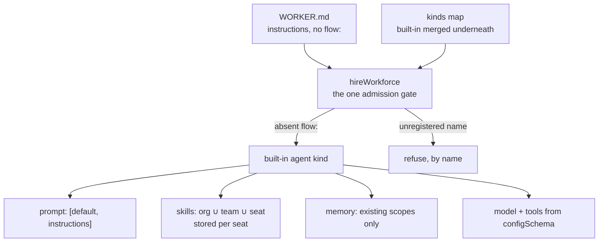

# FIX-1361: Default agent kind contract — Implementation Spec

## Part I — The Case *(for the human)*

### 1. Problem — why it matters, why now

We are about to promise something the product cannot currently do, in four places at once.

The epic's headline is that a team describes a worker in a file — a name, a description, and
some instructions — and gets a working agent that talks, remembers, and can use the skills
that team gave it. Four separate pieces of work build toward that: the agent itself, its
skills, its memory, and the teaching material. Each is a different author, in a different
checkout, working at the same time.

Two things make that promise false today, and neither is a detail.

**A worker file that only carries instructions is refused.** The hire step requires the file
to name which kind of worker it is, and refuses anything that doesn't. So the zero-config
seat the epic leads with is not a shortcut nobody has taken — it is a door that is currently
locked.

**A worker's skills are not actually that worker's.** Skills are filed in one shared
company-wide drawer. Two workers in the same company that each have a skill by the same name
are reaching into the same slot. The per-worker view we describe is real at the level of
*what each worker can see*, and not real at the level of *where the thing is stored* — which
is the level that matters the moment anyone edits one.

Nobody has written down the answers, so four authors would each invent one. The most likely
outcome is not that one of them is wrong; it is that all four are subtly different, and the
disagreement only surfaces when the pieces are put together at the end.

**Why now** — this is the head of the chain. Everything else in the epic waits on it, and
every day it is unwritten is a day the set is stopped.

### 2. Solution in plain terms

Write the contract down once, at an address the four authors already read, and make it
answer the questions that would otherwise be answered four different ways:

- **What the default worker is made of** — instructions, a model, tools, its skills, its
  memory — and that it is assembled from parts we already ship rather than being a new kind
  of thing in its own right.
- **How a worker file reaches it, and what happens when someone mistypes.** A file that names
  no kind gets the default. A file that names a kind nobody registered is refused, loudly, by
  name. Absent means default; wrong means error — never a silent substitution.
- **Where a worker's skills actually live**, so the privacy we describe is the privacy that
  is stored.
- **What memory it gets, and what it honestly cannot do yet** — named as a gap rather than
  papered over with something that looks durable and isn't.
- **How a team replaces it** with their own, in one line, without us having to anticipate
  what they wanted.

It also says what it deliberately does *not* decide, so the four authors know which calls are
still theirs.

**This is a contract, not a design.** It fixes what the pieces owe each other. It does not
build the worker, wire its skills, attach its memory, or write the teaching material — those
are the four issues that read it.

**Philosophy** — tenet 2 (*composition over features*): the default worker is a composition
of primitives we already ship, not a second agent type beside the one we are deleting.
Tenet 5 (*fix at the owning layer*): the rule about which worker file gets which kind has
exactly one gate — the hire step every seat passes through — rather than a check repeated per
caller. Tenet 3 (*earn every addition*): the contract's job is as much to name what must
**not** be invented as to name what ships.

### 6. Decisions & rules — the sign-off surface

1. **The default worker is called `agent`, it is already on the roster without anyone adding
   it, and a team that registers their own `agent` replaces ours outright.**
   *Rejected:* making every team name and register it themselves — that is the same small tax
   the old agent factory charged, and removing it is the point of the epic.
   *Locks in:* `agent` becomes a reserved word in every worker file anyone writes from now on.
   Renaming it later is a break we cannot fix for customers — the word is in files on their
   disks, not in our code — so this is the cheapest moment to be unhappy with it.

2. **The default worker ships from the package that already does hiring, and anything heavier
   than a plain talking worker arrives as a setting rather than as a second thing to install.**
   *Rejected:* a new package of its own — it would split the hire surface in two and make
   "install this to get a working worker" a two-step answer.
   *Locks in:* one install gets a working worker. In exchange we owe it that the default never
   forces memory machinery on a team that doesn't want any, which constrains how the memory
   work is allowed to attach.

3. **Each worker's skills are stored in that worker's own drawer, using the per-copy
   separation the storage layer already has — not a new mechanism built for this.**
   *Rejected:* keeping one shared drawer and filtering per worker, which is today's shape and
   is exactly the privacy-in-name-only problem in §1; also rejected: inventing a worker-scoped
   storage concept, when an existing flag already carries the worker's identity into the key.
   *Locks in:* a company-wide skill is **copied into** each worker when that worker first
   runs, not shared live. Editing the company copy afterwards does not reach into workers
   already running — refreshing them is a deliberate act, not something that happens quietly
   underneath a team.

**Non-goals** — building the worker, wiring its skills, attaching its memory, or rewriting
the teaching material; those are the four issues that consume this. Not re-opening whether a
file with no kind gets the default (the epic settled that). Not a persona builder. Not a new
way to keep one team's memory away from another's — where that is still missing, this
contract names it and stops.

**Size:** Small — 0 production files · 2 documentation surfaces · 6 acceptance criteria handed
to four issues · 1 PR.

---

### 3. Tradeoffs & alternatives

**Alternative: skip this and let the worker's own spec carry the contract.** Three reviewers
made that case at the epic gate, and the epic kept this issue with a named trigger for folding
it later. The research settles it in favour of keeping it: two of the three decisions above
are not the worker-builder's to make. Decision 1 changes the hire step's public behaviour,
which the worker consumes but does not own. Decision 3 belongs to the skills work, which is a
different issue again. A contract that lives inside one of the four consumers is a contract the
other three have to read a stranger's build plan to find.

**The simpler approach: write it as a comment on the epic.** Genuinely tempting — it is three
paragraphs of rules. Insufficient because the four authors work in separate checkouts and read
the repository, not the ticket thread; and because the drift audit that precedes this one
established the pattern that works here — one file, at a stable address, cited by everyone. A
rule that lives only in a comment is a rule that gets re-litigated.

**Where the complexity is:** not the writing. It is decision 3, which is the only place this
contract contradicts something the epic asserted. The epic assumed per-worker privacy would
need a new storage identity. It does not — the identity already exists and is already keyed
on the worker. Getting that wrong in either direction is expensive: inventing a primitive we
did not need, or shipping a privacy promise the storage does not keep.

### 4. Focus practices (1–5)

1. **Tenet 5 — one convergence point for the admission rule.** Every seat is minted through
   one function. The rule about which file gets which kind belongs there and nowhere else; a
   second check anywhere downstream is how "absent means default" and "wrong means error"
   drift apart.
2. **Tenet 3 — name the removals.** A contract that only lists what to build is the failure
   mode the drift audit already hit. Half of this document's value is the list of things that
   must not be invented.
3. **BP-030 (tolerate the old shape)** — worker files that already name a kind must behave
   byte for byte as they do today. This change adds a door; it does not move one.
4. **BP-003 (verification evidence)** — every behavioural claim in this contract names the
   file it was read from, and the one that decisions rest on was *run*, not read (§7).

### 5. What using it looks like (1–5 examples)

*What this spec proposes. Today the first example is refused — that is §1's first problem.*

**A worker with nothing but instructions:**

```
workforce/teams/support/workers/triage/WORKER.md
```

```md
---
description: First-line support triage.
---
You answer support questions. If you cannot resolve one in two replies, hand it to a human.
```

```ts
const seats = hireWorkforce(workers, { kinds: {} });
// before  throws: worker "support.triage" — declares no `flow:`, so there is no flow
//         kind to hire it into
// after   hires the built-in agent kind; the body arrives as its instructions
```

**Replacing it — one line in the file, or one key on the roster:**

```md
---
flow: myCustomAgent      # this worker only
---
```

```ts
hireWorkforce(workers, { kinds: { myCustomAgent: myFlow } })  // that worker's kind
hireWorkforce(workers, { kinds: { agent: myFlow } })          // replaces the default for everyone
```

**A typo is refused, never silently defaulted:**

```
---
flow: myCustomAgnet
---

hireWorkforce refused 1 of 3 workers; nothing was hired:
  - worker "support.triage" — names flow kind "myCustomAgnet", which was not passed to
    hireWorkforce. Kinds passed: "agent", "myCustomAgent"
```

---

## Part II — The Build Plan *(for the implementing agent)*

### 7. Technical design

The deliverable is one document. **Its content is the six clauses below** — they are the
contract, written here so the spec PR is where they get argued with, before four issues are
built against them.



**C1 — Composition, not a type.** The agent kind is a flow like any other. Its settings bag
(`configSchema`) declares `instructions`, `model`, `tools`, and the skills/memory switches.
`instructions` is the worker file's body, arriving as one setting — the hire step already
imposes that key (`packages/workforce/src/manifest.ts`, `INSTRUCTIONS_KEY`), and already
refuses `persona` by name. Generator slots stay `prompt` / `context` / `history` / `user`;
instructions compose as `prompt: [default, instructions]`. The shared `default` is owned and
shipped elsewhere (FIX-1344 part 2, not yet landed); until it does, the kind ships against
`instructions` alone with an explicit seam for `default` to drop into, and **defines no second
default-prompt configuration anywhere in this epic**.

**C1a — Settings are a default layer, not the only layer.** The drift audit found this
inverted in the reference app, so the contract states it: a worker file supplies *defaults*.
Model and thinking-style choices stay overridable per end user; per-turn feature switches stay
per-turn input. Folding all three into the settings bag would delete controls the reference app
has today (`docs/internal/design/kitchen-sink-agent-drift.md` §5.4).

**C2 — Admission has exactly one gate.** `hireWorkforce` is it (tenet 5). The complete rule:

| Worker file says | Result |
|---|---|
| no `flow:` | the built-in agent kind |
| `flow: agent` | the built-in agent kind — same kind, named explicitly |
| `flow: <registered>` | that kind, exactly as today |
| `flow: <not registered>` | **refused by name**, listing the kinds that were passed — today's wording, unchanged |
| roster passes `kinds: { agent: … }` | the app's flow wins; the built-in is merged *underneath* whatever the caller supplied |

The existing refusal for a flow filed under someone else's kind name
(`packages/workforce/src/hire.ts`, the `factory.kind !== kind` check) still applies to the
built-in: an app's replacement must declare `kind: "agent"`. Adding an implicit default must
not weaken any existing refusal — that is the loud-fail obligation the epic assigned here.

**C3 — A seat's skills are stored per seat.** The seat's *view* is
`org ∪ teams/<thatTeam> ∪ workers/<thatSeat>`, already shipped
(`packages/workforce/src/loader/read-seat-skills.ts`), and a name reaching one seat from two
levels is refused rather than shadowed (`duplicateSkillNameMessage`). The *storage* is the
gap: the skills library keys its collection at `"skills"`, org scope, with no isolation
(`packages/orchestration/src/skills/library.ts`), so two seats in one org share one bucket.

The contract's answer is that the kind declares its skills collection **isolated per flow
instance** — and a seat *is* a flow instance, minted with the worker's id
(`hire.ts` passes `{ id: manifest.id }`). The storage layer already keys isolated resources as
`${identityId}:${flowId}` on the **instance** id, not the kind (`scope-keys.ts`,
`resolveResourceScopeId`; FIX-1323). The named delta for the skills work is small and precise:
`defineSkillsCollection` / `createSkillsLibrary` accept `prefix`, `maxInstances` and `scope`
but do **not** forward `flowIsolation`, so one option field has to be threaded through. No new
primitive.

> **POC — ran, premise held.** `spec-poc/FIX-1361-seat-skill-isolation/seat-isolation.mts`
> on this branch:
> `node --experimental-strip-types spec-poc/FIX-1361-seat-skill-isolation/seat-isolation.mts`
> (no install needed). It reproduces today's gap — two seats both resolve to `["acme"]` — and
> the fix — `["acme:engineering.lead"]` vs `["acme:engineering.qa"]` — and confirms the
> coordinate is the seat's own id, not the flow kind. This is the premise decision 3 rests on,
> and it is also where this contract **refines** the epic: theme 7 assumed per-seat isolation
> would need a distinct collection key, prefix or scope. It does not.

**C4 — Memory attaches to existing scopes, and the gap is named.** `session`, `user`, `org`,
plus per-instance isolation where a resource wants it. Identity and durable per-member memory
are **not** on the seat object. The honest gap, verified in the reference app: user-scoped
memory is durable per *end user*, with no member or seat identity in it, so a multi-seat roster
serving one person shares one memory (drift note §3b). This contract states the gap; the memory
issue carries it onto the teaching surface and files a ticket. Nothing here invents a new
isolation primitive.

**C5 — Out of the box is the cheap path.** The default composition uses the light paths —
skills as library plus per-generator binding, and read-side memory. The model-classifier tier
for skill matching and the background capture pipeline for memory are **opt-in, one setting
each**. Inherited from the epic's sign-off on PR #1736 and restated here because this is where
it becomes a *default*, and because the asymmetry is what makes it safe: light to heavy is
additive, heavy to light is a breaking change for rosters already hired.

**C6 — What must not be invented.** No second Agent type at framework level. Do not grow
`AgentRegistry` into a product Agent. `defineAgent` / `materializeAgent` are not the teach
path and nothing here extends, imports or mirrors them — equally, nothing here waits on their
deletion. Seats are flow instances of a kind; there is no `worker.ts` seat door. No Channel or
MessageBoard types follow from this contract.

**Acceptance criteria — what the four consuming issues must satisfy.** These are the
contract's falsifiable half, and they are written as the assertions the epic's required proof
(FIX-1365) will make:

1. A worker file carrying only a description and a body hires, with no `kinds` entry supplied.
2. That seat answers a turn using its body as its instructions.
3. A worker file naming an unregistered kind refuses by name, listing the kinds that were
   passed, and nothing in the roster hires.
4. A roster passing its own `agent` gets its own flow, not ours.
5. Two seats in one org with a same-named skill resolve to different storage keys.
6. Nothing in the shipped kind imports `defineAgent`, `materializeAgent` or `AgentRegistry`.

### 8. Implementation sequence

1. **Write the contract** at `docs/architecture/workforce-agent-kind.md` — the six clauses and
   the acceptance criteria above, each behavioural claim naming the file it was read from.
   *Verify:* every cited path exists at the stated line meaning. *Depends on:* nothing.
2. **Add the locked-contract rows** to `docs/contributing/architecture-reference.md` — the kind
   id and the admission rule, which are the two a reader needs without opening the full doc.
   *Depends on:* 1.
3. **Mirror to Linear** and link the contract from FIX-1362, FIX-1363, FIX-1364 and FIX-1366,
   so each consuming spec cites it rather than re-deriving it. *Depends on:* 1.
4. **Removals: none, deliberately.** `definePersona` and the `defineAgent` cluster are live
   kill targets owned elsewhere (FIX-1344 / PR #1713). This contract names them as
   not-the-teach-path and does not delete them — deleting on this branch would put two issues
   on one symbol.

Single PR. Docs-only, so no changeset (BP-022) — nothing published changes.

### 9. Edge cases & error handling

| Case | Expected |
|---|---|
| Worker file names a kind that isn't registered | Refuse by name, list the kinds passed. Never fall back to the default — that is the typo risk the epic traded for this rule |
| App registers a flow under `agent` whose own kind is something else | Refuse, via the existing mismatched-kind check. The built-in's presence must not create an exemption |
| App registers `agent` *and* a worker says `flow: agent` | The app's flow. One resolution path, whether the name was implicit or written |
| Worker file carries a body **and** an `instructions:` key | Already refused today (two sources, no precedence rule). Unchanged |
| Worker file declares `persona:` | Already refused by name today. Unchanged; the contract records persona as a reserved later opinion, not a hire key |
| Empty/whitespace-only body, no `flow:` | Hires the default with no instructions setting. A seat with no instructions is a weak seat, not a failed hire — matching today's treatment of a blank body |
| Same skill name reaches one seat from two levels | Already refused with both paths named. Unchanged |
| Same skill name on two different teams | Fine, and now fine at the storage level too — different seats, different keys |

**Taxonomy:** every admission problem is a startup misconfiguration and therefore fatal and
collected — one run names every bad worker, and nothing hires partially. That is the existing
behaviour and the contract does not soften it.

### 10. Testing strategy

**No goal check of its own** — the deliverable is a document, and a goal check on prose would
be theatre. The contract instead states its acceptance criteria (§7) *as* the assertions the
epic's required proof will make, so the contract is falsified by that proof rather than by a
test of its own. That is deliberate: the epic already owns exactly one issue shaped to produce
a goal check (FIX-1365), and a second one here would be a check of the check.

**CI specs:** none. Nothing executable ships. The one empirical claim the contract rests on was
run rather than asserted — the POC in §7, which is throwaway and stays on this branch.

**What the consuming issues owe, in observable terms:** the six acceptance criteria in §7. Each
is written as something a caller can see happen, not as a shape to implement, so each becomes
one tracer-bullet behaviour in whichever issue owns it.

**Verification for this PR:** every file path and behavioural claim cited in the contract is
checked against the tree at author time, and the POC command above runs clean.

### 11. Documentation plan

- **CREATE** `docs/architecture/workforce-agent-kind.md` — the contract. Internal reference,
  not site-published. Placed in `docs/architecture/` rather than `docs/internal/design/`
  because it is a **locked contract** four issues build against, and the authority hierarchy
  in `CLAUDE.md` puts that folder above best practices. The drift note sits in
  `internal/design/` for the opposite reason: it is a point-in-time characterization that is
  explicitly not maintained. Cross-links: → `docs/internal/design/kitchen-sink-agent-drift.md`
  (the evidence it cites), → `packages/workforce/README.md` (the hire surface), ←
  `docs/contributing/architecture-reference.md`.
  *Voice risk:* this is internal reference prose, so the site voice rules do not apply — but
  the temptation to restate the epic is real. Cite the epic, do not paraphrase it.
- **EXTEND** `docs/contributing/architecture-reference.md` — two rows under "Locked Contracts
  (Phase 1)": the built-in kind id, and the absent-means-default / wrong-means-error admission
  rule. These are the two facts a reader needs without opening the full document.
- **No `apps/docs` change, and that is not a punt.** Nothing user-facing ships in this PR —
  there is no kind to teach yet. The published teaching surface is owned by FIX-1366, which is
  also where the current problem lives: the killed agent surface is still taught in published
  guides, package READMEs, one runnable example, and four rendered Atlas HTML pages. Teaching
  a contract before the thing exists would add a third documented way to build an agent.
- **No package README change.** `packages/workforce/README.md` documents the hire surface as it
  ships; it gets its update when the kind does (FIX-1363).

### 12. Dependencies, open questions & follow-ups

**Dependencies:** none blocking. FIX-1360 has landed and its drift note is live at
`docs/internal/design/kitchen-sink-agent-drift.md` — this contract cites it rather than
re-reading the app. Two soft deps, neither blocking: FIX-1344 part 2 (the shared default
prompt) is not shipped, which C1 handles with a named seam rather than a wait; FIX-1356's load
rules have landed (`read-seat-skills.ts` and the duplicate-name refusal are on `main`), so C3
builds on shipped behaviour rather than anticipated behaviour.

**Open questions:** none.

**Settled claims:**

- **Settled:** a resource marked isolated keys per flow *instance*, so two seats get separate
  skills storage with no new primitive — **CONFIRMED**: `["acme:engineering.lead"]` vs
  `["acme:engineering.qa"]`, against `["acme"]` for both under today's unset default. POC on
  this branch (§7). This refines epic theme 7, which assumed a distinct collection key, prefix
  or scope would be required.

**Follow-ups (flagged, not built):**

- **The epic's collapse trigger, checked and not fired.** The epic named a condition for
  folding this issue into FIX-1363: if this deliverable turns out to *be* that issue's spec,
  carrying no decisions of its own. It carries three, and two of them are not FIX-1363's to
  make — decision 1 changes the hire step's public behaviour, decision 3 belongs to FIX-1362.
  Recorded so a later reader does not re-open it as untidiness.
- **Two parallel skills entry points** (`createSkillsLibrary` + binding, and
  `createSkillsCapability`) overlap heavily and cross-reference each other, and the published
  guide teaches the one the epic did not pick. Reconciling them is FIX-1362's, flagged in the
  drift note §2a; out of scope here.
- **`defineSkillsCollection` does not forward `flowIsolation`** while `defineResourceCollection`
  accepts it. A one-field gap in an options passthrough, surfaced by C3 and owned by FIX-1362.

---

## Spec evolution

- **Spec drafted** — framed as "four authors are about to invent four contracts", and scoped to
  a contract document rather than any build. Three decisions: the kind's name and default
  registration, the package it ships from, and per-seat skill storage. The third began as the
  epic's assumption that per-seat isolation needs a new storage identity; a POC on this branch
  showed the identity already exists and is keyed on the seat, so the contract refines the epic
  rather than restating it.
