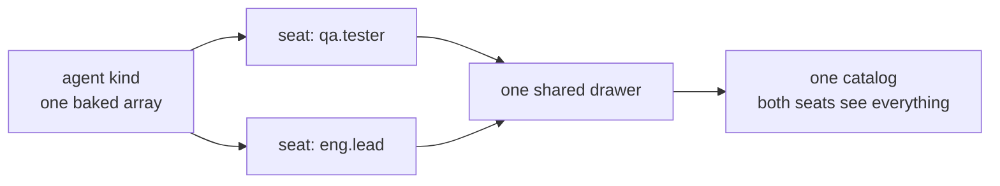
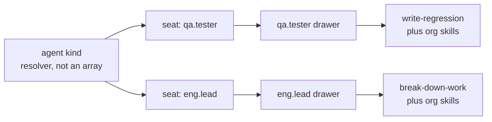
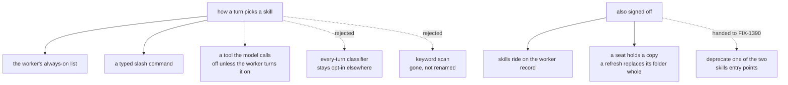

# FIX-1362 — Per-seat skills, explained

## 1. Today

Every seat of the kind reads the same bucket. A skills folder beside one worker reaches all
of them — or, since nothing fills a seat today, reaches none.

## 2. After (proposed)

Each seat gets its own drawer, filled from its own folders. This is the shape being gated:
storage keys on the seat, and a seat's skill set rides in on its worker record.

## 3. Where the decision fell

Three stock paths, none of them a model call on a turn that uses no skill. The dashed edges
are what the change refuses, and the one piece of its brief it hands to a follow-up.

---

*Left alone on purpose: memory (FIX-1364), the teaching surface (FIX-1366), and every
refusal `hireWorkforce` already makes.*
