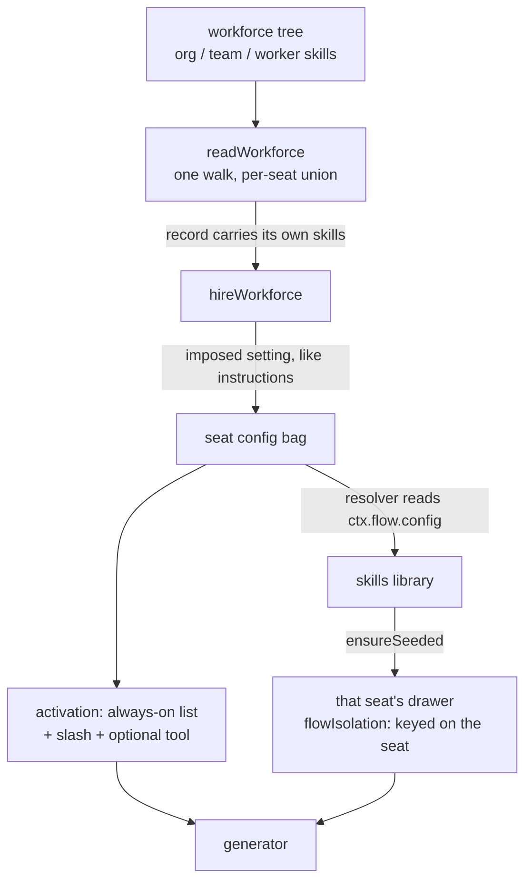
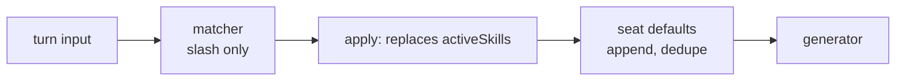

# FIX-1362: Per-seat skill register + activate in agent kind — Implementation Spec

## Part I — The Case *(for the human)*

### 1. Problem — why it matters, why now

Give two workers on one roster their own skills folders and they read each other's: every
worker holds every other worker's instructions, out of one org-wide bucket. The other half is
invisible — nothing fills a seat's catalog in the first place, so a folder of skills beside a
worker does nothing at all today.

FIX-1363 shipped the built-in `agent` worker kind days ago, so a worker file with a body hires
and answers. Skills are the next thing a roster reaches for, and the promise the contract
already makes in writing — *a seat's skills are that seat's* — is false until this lands.

### 2. Solution in plain terms

1. **Each seat gets its own drawer** — the isolation the storage layer already does, switched
   on for this collection.
2. **Each drawer is filled from that seat's own folders** — the org ∪ team ∪ worker union the
   loader already computes, arriving on the worker's record.
3. **A worker uses its skills in exactly three ways** — the ones it lists as always-on, a
   `/skill-name` someone types, and an opt-in mid-turn tool. A turn that uses no skill costs no
   extra model call and no extra tokens.

Drawn in [`FIX-1362.explainer.md`](./FIX-1362.explainer.md); the mechanism is §7. Leaning on
`docs/philosophy.md`: **tenet 2** (refine the substrate — no new primitive), **tenet 5** (one
seeding path, one place tools get registered), **tenet 3** (the keyword tier stays out rather
than being renamed).

### 3. Tradeoffs & alternatives

**Alternative: an option on `hireWorkforce`.** Rejected — FIX-1363 closed that door, and two
doors onto one setting is how "absent means default" and "wrong means error" drift apart.

**The simpler approach: one shared drawer, filtered on read.** A handful of lines, and
insufficient: the promise is about storage, not display. A filter is a convention a later
reader steps around, a seat's own edit still writes into everyone's bucket, and no test tells
it apart from the bug.

**Where the real complexity is: copy-in** — a seat holds a *copy*, so the company's later edit
never reaches it. Decision 3 signs that off rather than letting it be discovered.

### 4. Focus practices (1–5)

1. **One convergence point for tool registration** (tenet 5) — a seat's `tools:` is a hard
   fence, three paths pass near it, and exactly one may register a catalog tool (§7).
2. **BP-035 (second path)** — every switch here has an off state that is the common case.
3. **BP-003 (evidence)** — criterion 5's falsifier is sharp: two seats with distinct storage
   keys and *identical* catalogs is a fail. Assert contents, not keys.
4. **BP-030 (tolerate the old shape)** — a collection seeded before this change is shared.

### 5. What using it looks like (1–5 examples)

A worker with one private skill beside it and one always-on:

```md
---
description: Runs regression passes
tools: [runTests]
skills:
  active: [house-style]
  activateTool: true
---
You write regression tests for reported bugs.
```

`write-regression` sits in `teams/qa/workers/tester/skills/` and is listed nowhere. The seat
holds it plus the org's `house-style`; `house-style` is in every prompt, `write-regression`
answers to `/write-regression fix the FIX-9 flake` or to the activate tool. The QA lead's seat
never sees it.

A `WORKER.md` with a body and no `skills:` key hires, answers, and pays nothing for the skills
it holds.

### 6. Decisions & rules — the sign-off surface

**Decision 1 — a seat's skills travel on the worker's own record.** The worker record grows a
field for its resolved skill set, and hiring hands it to the flow as a setting, the same way a
worker's body already arrives as its instructions.
*Rejected:* an option on `hireWorkforce` (the door FIX-1363 closed), and looking the seat up
by id at run time (a running block deliberately cannot see which instance it is).
*Locks in:* a worker's skills are decided when the roster is read. Changing a seat's set means
re-hiring; they cannot be swapped under a live seat.

**Decision 2 — a skill beside a worker is *reachable*, not *always in context*.** Being
colocated puts a skill in that seat's catalog. Putting it in every prompt is a separate,
explicit choice the worker file makes, and the mid-turn activate tool is off unless the worker
turns it on.
*Rejected:* colocated skills being always-on automatically — the friendlier first impression,
which charges every turn for every skill in the folder.
*Locks in:* dropping a skill folder beside a worker changes nothing a user sees until someone
types `/name` or edits the worker file. We trade a moment of "why isn't it working" for a
promise that skills never slow a worker down.

**Decision 3 — the company's edits do not reach a seat that already has the skill, and a
refresh replaces that skill's folder whole.** A seat holds a copy from the moment it is first
seeded. Refreshing is a deliberate act with its own call; a skill a seat deleted stays deleted
even then, but a skill it still holds comes back matching the source exactly — including
losing supporting files the source has since dropped.
*Rejected:* live propagation, which makes the drawer a view again and undoes decision 1; and
refresh as a file-by-file overwrite, which reads safer and quietly leaves withdrawn
instructions reachable (§9).
*Locks in:* fixing a typo in a company skill does not fix it on the seats already running —
someone refreshes them, a real operational step rather than a background job. And a refresh is
all-or-nothing per skill: a seat's own additions inside that skill's folder do not survive it.

**Non-goals.** Deprecating either of the two overlapping skills entry points — filed as
FIX-1390; this issue pins which one the built-in uses and draws the docs boundary (§12).
Trigger phrases. Any classifier or keyword tier in this kind. Memory (FIX-1364). Teaching
surface (FIX-1366).

**Size:** Medium-large — nine steps across three packages plus docs. One PR or two; §8 carries
the split and leaves the call to the implementer.

---

## Part II — The Build Plan *(for the implementing agent)*

### 7. Technical design

Three packages, and the whole design is one question: how does a per-seat array reach code
that was built once for the kind. The answer is the settings bag, because a block's view of
its flow is `{ config }` and nothing else (`FlowContextView`, `packages/core/src/types/block.ts`)
— it cannot see its own instance id, by deliberate design. Config is therefore the only
per-seat channel, and every other route ends in a cast.



**Three names are pinned here, and only three.** Naming is normally the implementer's (see the
reviewer contract), but these three are one identifier wearing three hats across two packages —
the loader fills it, the hire step imposes it, and both must refuse the same spelling by name.
Two doors refusing two spellings is the failure this pin exists to prevent:

| Where | Name | What it is |
|---|---|---|
| `WorkerManifest` (`packages/workforce/src/manifest.ts`) | `skills` | the seat's resolved union, filled by the loader, absent on a hand-built record |
| the kind's settings bag | `seatSkills` | what the hire step imposes, exactly as it imposes `instructions` |
| `WORKER.md` frontmatter | `seatSkills` | **refused by name**, at the loader and the hire step both, like `persona` today |

`seatSkills` rather than `skills` for the imposed setting because the settings bag already has
an author-written `skills` object (`skills.active`, `skills.activateTool` in §5). One key that
is sometimes authored and sometimes imposed is the `instructions`-versus-body collision again,
and that one is already refused rather than resolved.

**The drawer (isolation).** `DefineSkillsCollectionOptions` forwards `flowIsolation` to the
`defineResourceCollection` it already wraps, and `SkillsLibraryOptions.collectionConfig`
widens to carry it. The storage layer keys an isolated resource as `identityId:flowId` on
the **instance** (`resolveResourceScopeId`, `packages/engine/src/stores/scope-keys.ts`), and
a seat is minted with the worker's id — so no new collection key, prefix or scope is needed.
*(This supersedes drift note §3a by name; see contract C3.)*

**The contents (population).** `initialSkills` becomes resolvable per execution: the library
and the activator accept either the array they take today or a function of the block context.
The built-in kind passes a resolver that reads the seat's own setting. Consequences the
implementer must handle:

- The build-time index (`indexInitialSkills`) is empty when a resolver is passed, so a
  `with({ active })` / `with({ allowed })` binding can no longer be validated at build time.
  **It must refuse loudly**, naming the resolver as the reason — silently skipping validation
  would widen the tool surface, which is the failure `assertKnownSkill` exists to prevent.
  The built-in kind binds neither, so it is unaffected.
- The resolver must be an **O(1) read of `ctx.flow.config.seatSkills`** — no walking, no
  parsing, no I/O. It runs on every render of every binding; anything else turns a per-turn
  path into a per-turn cost.
- `ensureSeeded` memoizes on the collection **ref**, so the implementer must **share one
  collection ref per request** across the binding reader, the load tool and the seed step. Resolve
  independently at each site and the memo misses, and a seat pays one `_meta` read per site per
  turn. Resolve the seat's array before calling, and return early on an empty one, so a seat
  with no skills does no storage read at all.
- The kind keeps its existing app-level `skills` option, for rosters built in code rather than
  read from files. What a seat holds is the **union** of that and its own set, and a bare name
  arriving from both is **refused at the mint, naming both sources** — the same rule
  `readSeatSkills` already applies across a seat's three levels, rather than a second
  precedence story sitting beside it.

**Considered and rejected: let the seeding sites read the setting directly.** The union is
already on the seat's config at hire, so the call sites could reach for
`ctx.flow.config.seatSkills` themselves and `initialSkills` would stay a plain array. Rejected
on layering: those call sites are in `@flow-state-dev/orchestration`, which knows nothing about
workers, seats or rosters — `@flow-state-dev/workforce` is built *on* it. Hard-coding a
worker-shaped config key into the skills runtime inverts that, and the next consumer wanting
per-instance skills has to either adopt the word `seatSkills` or add a second key beside it.
The resolver is exactly the seam that lets workforce say *where* its per-seat set lives without
orchestration learning what a seat is. Two smaller reasons: **seeding at hire is not available**
— hire is synchronous and runs before any storage, identity or request exists, and the collection
is only reachable inside a block execution; and a fixed-key read could not express the
**union** with the app-level `skills` option above. The cost is one union type on one existing
option, and the loud build-time refusal that comes with it is a guard worth having on its own
(a name bound against a catalog that is no longer static should never silently pass).

**The registration fence (an invariant this change must not loosen).** A seat may call exactly
the catalog keys its `tools:` names. **The single convergence point is the generator's own
`tools:` mapping** in `agent-worker-flow.ts`. Every other path near it must be checked, and
there are three:

| Writer | Today | Must stay |
|---|---|---|
| skills library `fullCatalog()` | off via `registerCatalogTools: false` | off |
| `createLoadSkillTool` | contributes only `loadSkill` itself | unchanged |
| delegation surface (`buildDelegationTools`) | installs when a bound skill declares `agents:`, and hands board workers catalog seats from the skill's `allowed-tools` | **closed** — see §9 |

The third is new exposure this change creates: a seat's *own* skill can now declare `agents:`,
which was impossible when the catalog was the kind's. A seat with `tools: []` must not reach
app tools through a delegated board worker.

**Activation.** The stamped model is three tiers and the pipeline reflects it exactly:



The always-on set is appended **after** the matcher's apply step, because that step *replaces*
`activeSkills` by design (per-turn semantics) and would otherwise wipe the defaults. Appending
is idempotent across turns and costs one array merge. The mid-turn activate tool is the
existing `dynamicActivation` preset plus its catalog listing, moved behind a per-seat switch
that defaults off — that listing is a per-turn token cost proportional to the catalog, which
is what "skills must not reduce response performance" forbids charging by default.

Two activators stay (the classifier flag is construction-time on `createSkillActivator`) but
both drop to slash-only; the classifier branch is FIX-1363's already-stamped opt-in and is
not touched here.

**Refresh, and why it replaces a folder rather than overwriting files.** One exported function
on the orchestration side that rewrites a seat's copies from a source set. Two rules, and the
second is the one an implementation gets wrong by default:

1. **It touches only names whose manifest still exists.** A skill the seat deleted stays
   deleted — the decision `needsResed` already preserves (`seeding.ts`, the missing-manifest
   early return).
2. **For a name it does touch, it replaces that skill's folder whole**: `list()` the
   `<name>/` prefix, `delete()` every key the new source does not carry, then write the source.
   `seedOne` today writes the manifest with `replace: true` and then `getOrCreate` +
   `writeContent` per *source* file — it never enumerates what is already there, so a supporting
   file the source has since dropped survives every refresh and stays reachable through
   `prompt-ref`. Withdrawn instructions that outlive the withdrawal are the same class of defect
   as the shared drawer: a promise the storage does not keep. `ResourceCollectionRef` already
   exposes `list(prefix)` and `delete(key)` (`packages/core/src/types/resource-collection.ts`),
   so this needs no new primitive.

**Full-folder replacement is the refresh path's rule only — `ensureSeeded` stays additive.**
A file inside a seat's skill folder that the source never had is the *seat's* edit, and deleting
it on the next ordinary seeding pass is precisely the propagation decision 3 forbids. Refresh is
the deliberate act where that loss is the point and is signed off in §6; seeding is not.

The FIX-918 migration reseed inside `ensureSeeded` stays as it is for seat copies: it repairs
records the renderer would otherwise skip, and narrowing it would leave a seat quietly holding a
skill that never renders. **That is not a hole in decision 3** — it fires on a *schema* mismatch
between the persisted record and the current parser, never on a body edit. Rewording an org
skill's markdown changes no schema field and reaches no seeded seat; only a refresh does.

**Where per-seat reading lives:** the workforce loader, not a new walker. `readSeatSkills`
and `readWorkforceDirectory` both exist and neither calls the other; the join is one new
loader-level entry point that walks the tree once and returns records already carrying their
skills. Adding a third directory walker is the outcome the epic flagged.

### 8. Implementation sequence

**One PR or two — the implementer's call, not a mandate.** If review gets heavy the seam is
step 4: **(a)** the substrate — `flowIsolation` passthrough, per-execution `initialSkills`, the
joined loader and the hire-imposed setting (steps 1–4) — is independently shippable and
testable without **(b)** the kind — wiring, activation, the delegation fence, refresh and docs
(steps 5–9). One PR is fine if it stays reviewable.

1. **Forward `flowIsolation`** through `defineSkillsCollection` and
   `SkillsLibraryOptions.collectionConfig`. *Test:* two instances of one flow resolve distinct
   storage keys for the collection; session scope still refuses it. *Depends on:* nothing.
2. **Make `initialSkills` resolvable per execution** in `createSkillsLibrary` and
   `createSkillActivator`, and at the four seeding call sites they reach — `binding-reader`,
   both sites in `load-tool` (the tool and the catalog context), and the activator's
   `seed-step`. `context-fn` and `run-skill-tool` belong to `createSkillsCapability` and stay
   as they are (§12). `ensureSeeded`'s own signature does not change: each call site already
   holds the block context, so it resolves the array before calling.
   Build-time name binding refuses loudly under a resolver.
   *Test:* a resolver returning different arrays for different configs seeds different
   catalogs; `with({ active })` under a resolver throws with a message naming why.
   *Depends on:* nothing.
3. **Join the loader.** One entry point that reads the tree once and returns records carrying
   their own resolved skill union, reusing `readSeatSkills` and `readWorkforceDirectory`
   unchanged. Grow `WorkerManifest` by the `skills` field (§7). *Test:* two seats on two teams
   get disjoint sets; a colocated skill needs no `skills:` list; loader errors still collect
   rather than throw. *Depends on:* nothing.
4. **Impose `seatSkills` at hire**, the way the body already becomes `instructions`, and refuse
   a `seatSkills:` frontmatter key **by name** in the loader and the hire step both — one
   constant, both doors, like `REFUSED_PERSONA_KEY` today (§7 pins all three names).
   *Test:* a hand-built record works; a file declaring `seatSkills:` is refused by name at each
   door; `HireOptions` gains nothing. *Depends on:* 3.
5. **Wire the kind**: declare the setting, pass the resolver to library and activator, turn on
   `flowIsolation`. *Test:* acceptance criterion 5 — two seats, different skills, each reads
   its own and not the other's, and each can use it. Assert catalog **contents**.
   *Depends on:* 1, 2, 4.
6. **Activation.** Add the always-on append step and the per-seat switches for it and the
   activate tool; keep both activators slash-only. *Test:* defaults render; a slash hit adds
   without clobbering them; both switches off means no catalog listing, no load tool and no
   extra model call in the trace. *Depends on:* 5.
7. **Close the delegation seat hole** (§9). *Test:* a seat with `tools: []` whose own skill
   declares `agents:` cannot reach an app tool. *Depends on:* 5.
8. **Refresh path** with full-folder replacement (§7), plus acceptance criterion 6.
   *Test:* editing an org skill's body changes nothing on a seeded seat until refresh; a deleted
   copy stays deleted through a refresh; **a supporting file dropped upstream is gone from the
   seat after a refresh and unreachable through `prompt-ref`**; and an ordinary `ensureSeeded`
   pass deletes nothing. *Depends on:* 5.
9. **Narrow the contract, and remove what this change makes false.** In
   `docs/architecture/workforce-agent-kind.md` — being renamed to
   `workforce-default-worker-kind.md` by FIX-1366, so find it by content, not path — rewrite C5
   and the Known-gaps entry that assign *reconciling* the two skills entry points to FIX-1362:
   this issue **pins the choice and draws the docs boundary**, and the deprecation is FIX-1390.
   Also drop C5's "no mechanism yet" line about refresh, the Known-gaps entry for the per-seat
   seeding path, and the unconditional `dynamicActivation: true` in the kind. The contract edit
   lands **in the implementation PR, not on this spec branch** (BP-037) — the route FIX-1363
   already used to amend this same file three times. *Depends on:* 6, 8.

### 9. Edge cases & error handling

| Case | Expected |
|---|---|
| Worker file declares `seatSkills:` in frontmatter | Refused by name, at the loader and the hire step, like `persona` — it is imposed, never authored |
| Seat has no skills at any level | Hires; empty array; no storage read, no seeding pass, no context |
| `skills.active` names a skill the seat does not hold | Refused at the mint, by name, listing what the seat does hold — same class as an unknown `tools:` key |
| Same bare name reaches one seat from two levels | Already refused with both paths named (`readSeatSkills`); the name is absent from the set |
| Same bare name on two different teams | Fine, and now fine at storage too — different seats, different keys |
| Same bare name from the app's `skills` option and the seat's own folders | Refused at the mint, both sources named. No precedence rule, for the reason `readSeatSkills` already has none |
| A seat's own skill declares `agents:`, seat has `tools: []` | Board workers get **no** catalog seats beyond the seat's own `tools:`. The fence is the seat's, not the skill's |
| Collection seeded before this change (shared bucket) | Isolation moves the read to a new key, so the seat re-seeds from its own set. Old rows are orphaned, not lost — no migration, but call it out in the PR (BP-030) |
| Slash token emitted by the model rather than typed by a person | Not a match. The matcher reads the turn's `message` input only; an activation path the model can drive through free text is a prompt-injection surface, and the activate tool is the sanctioned model-driven path |
| Refresh runs against a seat that deleted a skill | Stays deleted. Restoring it is a separate, explicit act |
| Upstream skill drops a supporting file, then a seat is refreshed | The file is deleted from the seat's folder. Refresh replaces a touched skill's folder whole (§7) — an overwrite-only refresh would leave withdrawn instructions live and `prompt-ref`-reachable |
| A seat added its own file inside a skill folder, then that skill is refreshed | The addition is lost — full-folder replacement is all-or-nothing per skill, and decision 3 signs that off. Ordinary `ensureSeeded` never deletes it |
| Activate tool on, catalog empty | No listing rendered, no tool installed — an empty catalog must not cost a tool slot |

**Taxonomy.** Everything above that refuses is a startup misconfiguration: fatal, collected,
one run names every bad worker. Nothing here is retryable, and nothing hires partially.

### 10. Testing strategy

**Discipline:** `tdd` — this is a feature. **Seam:** vitest in `packages/workforce/test/` and
`packages/orchestration/src/skills/` (both already have suites); the criterion-5 behaviour
belongs beside `agent-worker-flow.test.ts`, which already drives real `defineFlow` /
`hireWorkforce`.

**Goal & goal check.** Two seats on one roster, each with a different colocated skill, hired
and registered; run a turn on each through `fsdev run` and confirm the answer reflects that
seat's skill and shows no sign of the other's. The flat assertion — catalogs differ in
**contents**, not only in storage key — is what acceptance criterion 5 is written to fail
without.

**CI specs** (mocked, deterministic), in observable terms:

- Two seats resolve distinct collection keys **and** distinct catalog contents.
- A colocated skill is in its seat's catalog with no `skills:` list anywhere.
- A worker's always-on skill is in the prompt on every turn; a skill it merely holds is not.
- A `/name` turn activates that skill and leaves the always-on ones in place.
- With both switches off: no catalog listing in context, no load tool on the generator, and
  no classifier call in the trace.
- A seat with `tools: []` calls nothing, including through a delegated board worker.
- Editing an org skill's body leaves a seeded seat unchanged; refresh changes it; a deleted
  copy survives both.
- A supporting file removed from the upstream skill is gone from the seat after a refresh, and
  a `prompt-ref` to it no longer resolves. An ordinary `ensureSeeded` pass deletes nothing.
- `hireWorkforce` still refuses an unregistered kind, an empty `flow:`, and a mismatched
  kind — unchanged (the loud-fail obligation C2 assigns).

### 11. Documentation plan

- **EXTEND** `apps/docs/docs/workforce/workers-on-disk.md` — a section on a worker's skills:
  where the three folders sit, that a colocated one needs no list, and the `skills:` settings
  (always-on list, activate tool). Place it after the settings section, before channels.
  Cross-link to `skills/overview.md` and `skills/activation.md`. *Voice risk:* "isolation" and
  "seeding" are internal words — write it as "each worker keeps its own copy".
- **EXTEND** `apps/docs/docs/skills/activation.md` — **minimum scope, and the boundary matters
  because FIX-1366 also edits this page.** This issue owns exactly one thing here: the page's
  "A skill can become active in two ways" opener and the two-path list it introduces become
  *three* paths, with a sentence saying the built-in worker kind runs slash plus an always-on
  list and leaves the classifier opt-in. That list is factually wrong the moment this ships, so
  it cannot wait. **FIX-1366 owns the rest** — rewriting the page away from
  `createSkillsCapability` toward the library surface, and the `worker-agent` naming. Cross-link
  back to `workforce/workers-on-disk.md`.
- **EXTEND** `packages/workforce/README.md` — the joined loader entry point and the kind's
  skills settings, terse.
- **EXTEND** `docs/architecture/workforce-agent-kind.md` (§8 step 9) — C3's "no mechanism yet"
  line about refresh and the Known-gaps entry for the per-seat seeding path, both now built;
  **and C5 + the Known-gaps entry that assign *reconciling* the two entry points to FIX-1362**,
  narrowed to what this issue actually does. FIX-1366 is renaming this file to
  `workforce-default-worker-kind.md`, so find it by content, not path.
- **No new page.** Everything here extends a documented concept; a new page would fragment
  the skills sidebar for what is one worker-shaped section.
- **No changeset** is required for the `apps/docs` and architecture edits, but
  `@flow-state-dev/workforce` and `@flow-state-dev/orchestration` both change public surface
  — one `minor` fragment covering both (BP-022).

### 12. Dependencies, open questions & follow-ups

**Dependencies.** FIX-1363 (merged, PR #1754) — the built-in kind this wires into. FIX-1356
(done) — the file convention and `readSeatSkills`. Contract:
`docs/architecture/workforce-agent-kind.md`, clauses C1, C3, C5; acceptance criteria **5 and
6 are this issue's to prove**. Blocks FIX-1365.

**Open questions:** none. Two things the issue left open are decided here rather than asked,
because the answer does not turn on anything only the owner knows:

- *Slash from a person only, or also from agent-emitted text?* Person only — see §9. An
  activation path the model can drive by emitting a token is an injection surface, and the
  activate tool already covers the model-driven case properly.
- *Activate tool in v1, or later?* In v1, off by default. Building the switch later would
  mean shipping the tool always-on first, which is the token tax decision 2 refuses.

**Follow-ups, not in this spec:**

- **Reconcile `createSkillsLibrary` and `createSkillsCapability` → [FIX-1390](https://linear.app/fixpoint-labs/issue/FIX-1390), filed.**
  Deprecating a public surface is its own change with its own migration and docs; folding it in
  here would multiply the blast radius of a seat feature while delaying FIX-1365. Nothing in
  this spec makes it harder later.

  **This supersedes the contract, and §8 step 9 makes the contract say so.**
  `docs/architecture/workforce-agent-kind.md` currently assigns the reconciliation to FIX-1362
  in two places — C5's "*Two overlapping entry points exist and reconciling them is FIX-1362's*"
  and the Known-gaps entry "*reconciling the two surfaces is FIX-1362's*". Left alone, an
  implementer reading both the contract and this spec is stuck between two authorities. The
  narrowed reading, which step 9 writes into the contract itself: **FIX-1362 pins the choice
  (C5 already did) and draws the docs boundary (§11); FIX-1390 owns the deprecation.** The edit
  lands in the implementation PR, not on this spec branch (BP-037) — the route FIX-1363 used to
  amend this same file three times.
- **Per-seat cost is still unmeasured** (contract's own flag). This spec cuts the obvious part
  — a skill-less seat does no storage work — but a large roster × a large catalog has one
  bucket and one seed pass per seat and nobody has run it. Worth a measurement issue, not a
  reason to change the design.
- **`defineSkillsCollection`'s `scope` and `flowIsolation` can now contradict each other** in
  ways only the seat case exercises. Not a defect today; flag for
  `improve-codebase-architecture` if a third caller appears.

---

## Spec evolution

- **Spec drafted** — framed as two separable failures (a shared drawer, and nothing filling
  it); routed the per-seat handoff through the worker's record and the settings bag because a
  block deliberately cannot see its own instance id; held activation to the three stamped
  paths with the activate tool switched off by default; deferred the library/capability
  reconciliation to a follow-up.
- **After spec review** — decision 3 now makes a refresh replace a skill's folder **whole**,
  because a review found that the seeding path only overwrites files still present in the
  source, so a supporting file withdrawn upstream would stay live on every seat that had it.
  The deferred reconciliation became FIX-1390 and a contract-narrowing step, because the
  contract still assigned it here and two authorities is worse than either answer.
