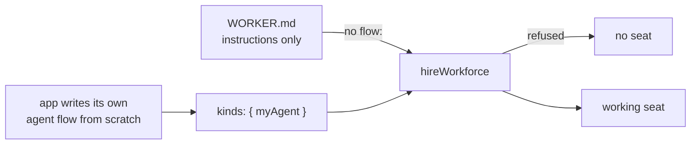
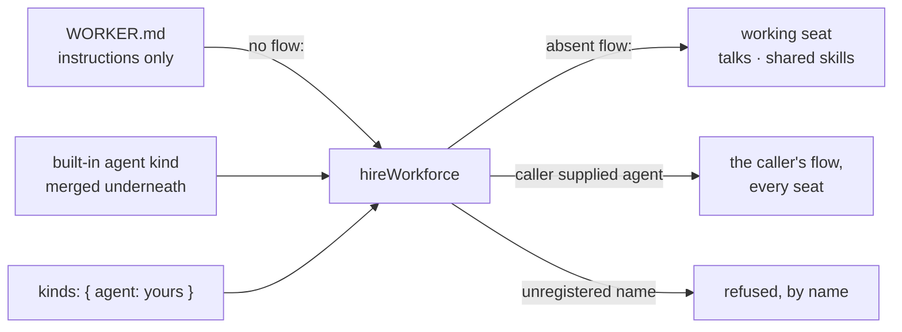
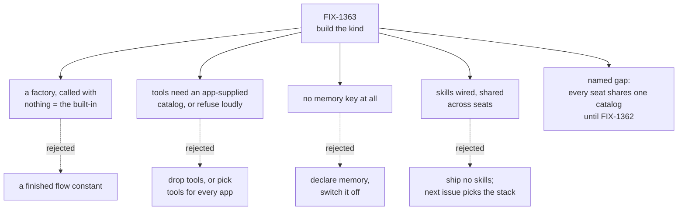

# FIX-1363 — Built-in agent flow kind · explainer

## 1. Today

The contract for the default worker is written and approved. Nothing implements it. A file that
carries only instructions is still refused, so the only way to get a working worker is to write
the whole flow yourself and register it.

## 2. After (proposed)

Absent means the built-in; a name nobody registered still fails loudly. The seat talks — its
body is its instructions — and can use skills the app handed over. It has no memory and no tools
unless the app supplies a tool catalog.

## 3. Where the decision fell

Four calls, each with its rejected alternative on a dashed edge. The gap node is the honesty
debt this issue takes on: the word "skills" is true at this step, but it is the app's skills,
not each worker's own. FIX-1362 closes it, and the docs say so in the meantime.

_Panel 4 lands once the implementation merges._
