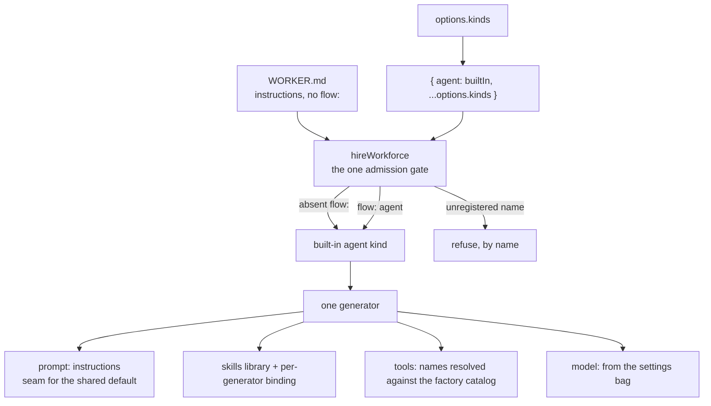

# FIX-1363: Built-in agent flow kind — Implementation Spec

## Part I — The Case *(for the human)*

### 1. Problem — why it matters, why now

The epic's headline is that a team writes a file with a name, a description and some
instructions, and gets a worker that works. Every other issue in the set is an attachment to
that worker: its skills, its memory, the teaching material, the proof that hiring one actually
works.

**The worker does not exist.** A file that carries only instructions is refused today, by name,
at the moment a team tries to hire it. The contract issue ahead of this one wrote down what the
worker owes and what it must not become; it deliberately built nothing. So the promise is fully
specified and entirely unimplemented, and the four issues behind this one have nothing to
attach to, nothing to teach, and nothing to prove.

**Why now** — the contract is approved and this is the next link. Nothing else in the epic can
start: the skills issue binds into this worker, the memory issue composes against it, the
teaching issue documents it, and the required proof hires it. Every day this is unwritten is a
day five issues are stopped on one missing piece.

### 2. Solution in plain terms

Ship one worker, written by us, already on every team's roster without anyone adding it.

- **A file that names no kind gets it.** No configuration lines, which is the epic's headline.
- **It talks.** The file's body is its instructions; a model setting picks what answers.
- **It can use skills the app gives it** — but the same set for every worker, for now.
  Giving each worker *its own* skills is the next issue, and this spec says so out loud rather
  than letting the word "skills" imply something it does not yet do.
- **It remembers nothing**, on purpose. Memory is something an app assembles into a worker of
  its own; there is not even an off switch here, because an off switch would still drag the
  memory machinery into every team's app.
- **A team replaces it with one line.** Name your own worker in the file, or register yours
  under our name and yours wins for everybody.
- **A tool a worker names has to come from a list the app hands over.** With no list, naming a
  tool is refused at startup, by name, rather than silently ignored — because a worker that
  quietly lacks the tool it was told to use is the failure that is hardest to see.

**Philosophy.** Tenet 2 (*composition over features*): this is a flow assembled from parts we
already ship, not a second kind of thing beside the agent factory we are deleting. Tenet 5
(*fix at the owning layer*): the rule about which file gets which worker stays in the one hire
step every worker passes through — nothing downstream re-decides it. Tenet 3 (*earn every
addition*): the settings bag gets no memory key, no user-preference store and no per-turn
overrides, because each of those is a promise a default cannot keep for every app.

### 6. Decisions & rules — the sign-off surface

1. **The built-in worker is a factory we export, and replacing it is the same call with your
   own arguments.** Hiring merges our worker underneath whatever the app passed, so an app that
   wants tools, a different model, or its own skills calls the same factory with those and
   registers the result under our name.
   *Rejected:* adding a second door on the hire step for "the built-in's options" — two ways to
   configure one worker, and the second one only ever configures ours.
   *Locks in:* the built-in's knobs are exactly the arguments that factory takes. Anything
   richer is a replacement, which is one line. We owe it that the replacement path stays one
   line, because it is the only escape hatch.

2. **A worker file's `tools:` names entries in a list the app supplies; with no list, naming a
   tool refuses at startup and says why.** A tool is a piece of running code, and a file on disk
   can only carry its name — so something has to hold the names-to-code map, and only the app
   has it. The zero-configuration worker therefore ships with an empty list and can use no tools
   at all.
   *Rejected:* dropping the setting entirely, which makes an author who writes `tools:` get told
   it is not a setting — reading as a typo when the real answer is "you have to hand me the
   list"; also rejected: shipping a fixed list of tools we choose, which decides for every app
   what its workers may reach.
   *Locks in:* out of the box the worker talks and can use skills, and that is all. Tools are a
   deliberate act by the app.

3. **The default worker carries no memory — not even a switch.** The contract issue's first
   draft listed a memory switch among the settings; the later ruling on it made memory something
   an app *composes in*, because memory's storage has to be declared when a worker is built and
   no runtime setting can conjure it. The later ruling wins, so there is no memory key and the
   hire package gains no dependency on the memory package.
   *Rejected:* declaring the memory storage and leaving it switched off — that is the shape the
   ruling refused, because it puts the machinery into every app's required graph regardless.
   *Locks in:* "remembers" is not something the stock worker does. The teaching issue has to say
   so, and the memory issue owns the seam.

4. **Skills are wired in now, shared across every worker, and named as shared.** The contract
   pinned *which* skills stack the worker is built from precisely so this issue and the skills
   issue do not ship two different ones under one name. So it is built here — and out of this
   issue every worker of the built-in reads the same catalog. Per-worker skills is the next
   issue.
   *Rejected:* shipping no skills here and letting the next issue choose the stack too — the
   pin exists because that is how two defaults get built.
   *Locks in:* until the next issue lands, a team's workers can use the app's skills but cannot
   have skills of their own. We state that in the docs rather than let "skills" imply otherwise.

5. **Only the settings layer ships. Per-end-user and per-turn overrides do not.** The contract
   warns against folding everything into the settings bag, which would delete controls a real
   app has. The built-in supplies the *default* layer and stops there: it has no store of user
   preferences to read, and inventing one would be the second agent type the contract forbids.
   *Locks in:* an app that wants a per-user model picker writes its own worker. That is the
   replacement path, used as designed.

6. **The placeholder name in our examples and tests is renamed away from the built-in, not into
   it.** The tree teaches a made-up kind called `worker-agent` in fixtures, goal files and
   tests. Renaming it to the built-in's name would make every example look like the default
   when it is actually a custom worker.
   *Locks in:* examples that demonstrate a *custom* worker keep looking custom; the built-in
   gets its own coverage instead of inheriting a placeholder's.

**Non-goals** — per-worker skills (next issue), memory of any kind, the teaching material, the
required end-to-end proof, a persona builder, a second agent type, growing the agent registry,
and anything that waits on the old agent factory being deleted.

**Size:** Medium — ~4 new production files in one package · 1 hire-step behaviour change ·
2 documentation corrections · 1 goal check · 1 PR.

---

### 3. Tradeoffs & alternatives

**The simpler approach: ship a finished flow constant instead of a factory.** Genuinely
tempting — "the built-in worker" as one exported value reads simpler than a function you call.
It fails on decision 2: a constant cannot take the app's tool list or its skills, so either
those settings are undeliverable or a second configuration door appears on the hire step. A
factory called with no arguments *is* the constant, and the same call with arguments is the
replacement path we already promised.

**The alternative we rejected on skills: ship nothing.** A worker that only talks is a smaller,
cleaner change, and it would leave the entire skills stack to the issue that owns skills. We
kept skills because the contract explicitly pinned the stack at this level to stop two issues
building two defaults — and the cost of the pin being prose only is exactly that outcome. The
price we pay is one honest sentence in the docs: workers share a catalog until the next issue
lands.

**Where the complexity is:** not the worker. It is the hire step. Adding an implicit default
means a file that used to be refused now succeeds, and the risk is that the same change
weakens a refusal that should stand — a mistyped worker name must still fail loudly rather
than quietly get the default. That is one branch of code and it is the branch this change is
most likely to get wrong.

### 4. Focus practices (1–5)

1. **Tenet 5 — one gate.** The absent-means-default rule belongs in the hire step and nowhere
   else. A second check anywhere downstream is how "absent means default" and "wrong means
   error" drift apart.
2. **Tenet 3 — name the removals.** This change *removes* a refusal. Decision 3 and decision 5
   are both removals of surface the contract's first draft implied. Say what is not being built.
3. **BP-030 (tolerate the old shape)** — every worker file that names a kind today must behave
   byte for byte as it does now. This adds a door; it moves none.
4. **BP-003 (verification evidence)** — the load-bearing claim is that a caller's own worker
   wins for every seat *and those seats register*. Registration is where the plausible failure
   lives, so the proof runs a registry, not a mint.
5. **BP-035 (second-path checklist)** — the new branch has an off state (a file that names a
   kind) and an on state (a file that names none). Both get covered, and so does the
   caller-replaced case, which is a third path neither of the first two exercises.

### 5. What using it looks like (1–5 examples)

*What this spec proposes. The first example is refused today — that is §1.*

**A worker with nothing but instructions, hired with no worker kinds at all:**

```
workforce/teams/support/workers/triage/WORKER.md
```

```md
---
description: First-line support triage.
---
You answer support questions. If you cannot resolve one in two replies, hand it to a human.
```

```ts
const seats = hireWorkforce(workers, { kinds: {} });
// before  throws: worker "support.triage" — declares no `flow:`, so there is no flow
//         kind to hire it into
// after   hires the built-in agent kind; the body arrives as its instructions
```

**Giving the built-in tools and skills — the same factory, with arguments:**

```ts
hireWorkforce(workers, {
  kinds: { agent: defineAgentKind({ catalog: { search, fetch }, skills: teamSkills }) },
});
```

```md
---
description: Researches competitor pricing.
tools: [search, fetch]
---
```

**Replacing it outright — one line in the file, or one key on the roster:**

```md
---
flow: myCustomAgent
---
```

```ts
hireWorkforce(workers, { kinds: { myCustomAgent: myFlow } }); // that worker only
hireWorkforce(workers, { kinds: { agent: myFlow } });         // everyone's default
```

**A typo is still refused, never quietly defaulted:**

```
hireWorkforce refused 1 of 3 workers; nothing was hired:
  - worker "support.triage" — names flow kind "myCustomAgnet", which was not passed to
    hireWorkforce. Kinds passed: "agent", "myCustomAgent"
```

**A tool named with no catalog behind it is refused at startup, not ignored:**

```
hireWorkforce refused 1 of 3 workers; nothing was hired:
  - worker "support.triage" — names tool "search", which the agent kind has no catalog
    entry for. Pass a catalog: defineAgentKind({ catalog: { search } })
```

---

## Part II — The Build Plan *(for the implementing agent)*

### 7. Technical design

**Read [`docs/architecture/workforce-agent-kind.md`](../docs/architecture/workforce-agent-kind.md)
first** — FIX-1361's contract. This section implements C1, C1a, C2, C5 and C6 and does not
re-decide any of them; where it departs (the memory key, the per-user layer) §6's decisions 3
and 5 say why and cite the clause that governs.



**The kind is a factory, and the built-in is that factory called with nothing.** A new module in
`packages/workforce/src` exports `defineAgentKind(options?)` returning an ordinary
`defineFlow(...)` result — `kind: "agent"`, `cardinality: "collection"` (C2 requires it; a
plain singleton's seats mint and are then refused at registration, which FIX-1361's POC part 2
ran and confirmed). The built-in is the same call with no arguments, created once at module
scope so a roster does not mint a fresh definition per hire.

The factory's options are the three things only the app can supply — a tool catalog, the skills
to seed, and a default model — plus nothing else. Every knob that is *not* one of those belongs
to a replacement kind.

**The settings bag (`configSchema`)** declares `instructions` (optional — a bodyless worker is a
weak seat, not a failed hire), `model` (defaulted by the factory), and `tools` (a list of names,
default empty). **No memory key** — §6 decision 3. A name in `tools` that the factory's catalog
does not carry is refused *at the mint*, by the flow's own validation, so it arrives inside the
hire step's collected refusal with the worker's id in front of it and no second gatekeeper is
added (the existing `try`/`catch` in `hire.ts` already does this).

**The prompt seam.** The shared default worker system prompt is FIX-1344 part 2 and is not
shipped. Per C1 the kind consumes it and defines no second one, so the generator's `prompt` slot
composes from a single named constant in this module that is documented as the seam and today
resolves to the worker's `instructions` alone. When part 2 lands, that constant becomes
`[default, instructions]` and nothing else moves.

**Skills.** `createSkillsLibrary(...)` from `@flow-state-dev/orchestration` (already a
dependency — no new package edge), bound to the generator with `.with(...)`, per C5's pin.
The factory forwards its `skills` option as the library's `initialSkills` and its `catalog` as
the library's catalog. **Per-seat isolation and per-seat seeding are deliberately not here** —
they are FIX-1362's, and out of this issue every seat reads the same catalog (§6 decision 4).
Do not thread the isolation flag "while you are in there": FIX-1361 §12 records that the flag
alone separates the drawers without filling them, so a half-landing here produces N empty
drawers, which is worse than N identical ones.

**Admission — the only change to `hire.ts`.** Three edits, all in one place:

1. The kinds the step resolves against become the built-in merged *underneath* the caller's, so
   a caller-supplied `agent` wins (C2's last row).
2. The absent-`flow:` refusal at `packages/workforce/src/hire.ts:167` becomes a resolution to
   `"agent"`.
3. The refusal message's list of available kinds is computed from the merged map, so `"agent"`
   appears in it.

Nothing else moves. The `factory.kind !== kind` refusal, the duplicate-id refusal, the
`persona` refusal, the body-and-`instructions` refusal and the collect-then-throw shape all
stand unchanged — and the third bullet is what keeps the typo case honest: an unregistered name
still refuses, and now truthfully says `agent` was available.

**Sketch — the shape, not the end state.** Names here are roles; the real ones are the
implementer's.

```ts
// packages/workforce/src/agent-kind.ts
export function defineAgentKind(options = {}) {
  const skills = createSkillsLibrary({ catalog: options.catalog, initialSkills: options.skills });
  const settings = theSettingsBag({
    instructions: optional string,
    model: string defaulting to options.model ?? a small current model,
    tools: list of names, default empty,
            refined so every name is in options.catalog — name the missing one and the fix,
  });
  const answer = generator({
    uses: [skills.with(thePinnedBinding)],
    prompt: composeWorkerPrompt,        // the seam: instructions today, [default, instructions] later
    tools: (_input, ctx) => ctx.flow.config.tools.map(lookUpInCatalog),
    model: (_input, ctx) => ctx.flow.config.model,
    user: (input) => input.message,
  });
  return defineFlow({ kind: AGENT_KIND, cardinality: "collection", configSchema: settings,
                      actions: { run: { inputSchema, block: answer } } });
}

// packages/workforce/src/hire.ts — the whole admission change
const kinds = { [AGENT_KIND]: builtInAgentKind, ...options.kinds };
const kind = theRecordNamesAKind(manifest) ? manifest.declared.flow : AGENT_KIND;
```

**POC — none built, deliberately, and the premises are not unchecked.** Both premises this
design rests on were *run* on FIX-1361's branch and are recorded as settled claims there: a
replacement declared the plain way is a singleton whose seats are refused at **registration**
(which is why `cardinality: "collection"` is stated in C2 and asserted in §10), and an isolated
skills collection keys per flow instance but is seeded from one shared array (which is why §6
decision 4 stops at shared and does not thread the flag). Rebuilding either here would re-prove
someone else's POC. Nothing else in this change is a premise — it is composition of surfaces
that already ship.

### 8. Implementation sequence

1. **The kind.** New module in `packages/workforce/src` — the factory, the settings schema, the
   generator, the prompt-seam constant, the `AGENT_KIND` constant. Export from `index.ts`.
   *Verify:* `defineAgentKind()` builds; a hand-built roster mints a seat from it.
   *Depends on:* nothing.
2. **Admission.** The three edits in `hire.ts` above.
   *Verify:* `packages/workforce` tests — the absent-`flow:` record hires, a mistyped name still
   refuses and now lists `agent`, and every existing refusal still refuses.
   *Depends on:* 1.
3. **Tools resolution.** The catalog lookup and its refusal wording.
   *Verify:* a worker naming a tool with no catalog refuses at the hire, naming the tool and the
   fix; with a catalog, the tool reaches the generator.
   *Depends on:* 1.
4. **The proof (criterion 4).** A goal check beside `goals/workforce-seats/`: a roster that
   passes its own `agent` gets *its own* flow for **every** seat, and those seats **register**.
   *Verify:* the goal runs green, and its control run — the same roster with the replacement
   declared as a singleton — fails at registration.
   *Depends on:* 2.
5. **The placeholder migration (executable surface only).** Rename `worker-agent` /
   `workerAgentFlow` in `goals/workforce-conventions/files-alone-produce-the-roster/fixtures/`,
   `goals/workforce-seats/two-seats-run-their-own-configuration/` (fixtures, `flows.ts`,
   `goal.md`), `packages/workforce/test/hire.test.ts` and
   `packages/workforce/test/read-workforce-directory.test.ts` to a name that cannot be mistaken
   for the built-in. Teaching surface is **not** touched — that is FIX-1366's (C6's split).
   *Verify:* `grep -rn "worker-agent\|workerAgentFlow"` returns only teaching-surface files.
   *Depends on:* 2.
6. **The two documentation corrections** in §11.
   *Depends on:* 2.
7. **Removals: one, and it is a refusal.** `hire.ts`'s absent-`flow:` refusal is deleted, not
   deprecated. No symbol is removed: `definePersona` and the `defineAgent` cluster are live kill
   targets owned by FIX-1344 / PR #1713, and this change neither imports nor deletes them
   (criterion 7 — a grep on the new module).

Single PR. `@flow-state-dev/workforce` is published and its hire behaviour changes, so this
needs a changeset (BP-022) — `minor`.

### 9. Edge cases & error handling

| Case | Expected |
|---|---|
| File carries only a body, no `flow:` | Hires the built-in; body arrives as `instructions` |
| File carries neither body nor `flow:` | Hires the built-in with no instructions. A weak seat, not a failed hire — matching today's treatment of a blank body |
| `flow:` present but empty / whitespace | Treated as absent → the built-in. Today it is refused; the absent rule is written on the same `trim()` check so the two cannot drift |
| `flow: agent` written explicitly | The built-in. Same kind, named |
| `flow:` names an unregistered kind | Refused by name, listing the kinds passed — now including `agent`. **Never** falls back |
| Caller passes `kinds: { agent: theirFlow }` | Theirs wins, for every seat. Ours is merged underneath |
| Caller's `agent` is declared `kind: "somethingElse"` | Refused by the existing mismatched-kind check. The built-in's presence creates no exemption |
| Caller's `agent` is a singleton | Seats mint, then registration refuses each by name. Loud, at boot — a C2 violation, not a refusal we build |
| `tools:` names something the catalog lacks | Refused at the mint, inside the hire's collected refusal, naming the tool and the fix |
| `tools:` present with no catalog supplied | Same refusal. The empty catalog is not a special case |
| File declares `instructions:` **and** a body | Already refused today. Unchanged |
| File declares `persona:` | Already refused today. Unchanged |
| Two records share an id | Already refused today. Unchanged |

**Taxonomy:** every one of these is a startup misconfiguration — fatal, collected, one run names
them all, nothing hires partially. That is the existing shape and this change does not soften it.

### 10. Testing strategy

**Goal check (the tracer bullet, and acceptance criterion 4).** New goal beside
`goals/workforce-seats/`: *a caller's own `agent` wins for every seat, and those seats register.*
It must (a) hire a multi-seat roster where the caller passed their own `agent` declared
`cardinality: "collection"`, (b) assert **every** seat resolved to the caller's flow — not the
first one, since one-seat-right-and-the-rest-ours is the failure a single assertion misses —
(c) **register** the seats through the real registry, because FIX-1361's POC showed the mint is
not the gate, and (d) run one seat to completion and read back through the route that its own
record's instructions reached a block. **Anti-game:** asserting the hire returned N instances
passes even when every one of them is ours, so the check must read the flow's identity per seat;
and a control run with the replacement declared as a singleton must FAIL at registration, which
is what proves the check reaches registration at all.

**CI specs** (`packages/workforce/test/`):

- A record with no `flow:` and a body hires, and its instructions reach the settings bag.
- A record with no `flow:` and no body hires, carrying no instructions.
- A record naming an unregistered kind still refuses, and the message now lists `agent`.
- A record naming a tool with no catalog entry refuses, naming the tool.
- Every existing refusal in `hire.test.ts` still refuses, unchanged.
- Criterion 7: the new module imports none of `defineAgent` / `materializeAgent` /
  `AgentRegistry` — a grep assertion, cheap and durable.

**Not tested here, deliberately:** per-seat skill isolation and seeding (criteria 5 and 6 are
FIX-1362's), the end-to-end thin hire (criteria 1–3 are FIX-1365's), anything about memory
(there is none).

**Model:** the goal check grades *which flow answered and which settings reached it*, not model
output, so its seats run on handlers where they can. The one leg that runs a generator uses a
small model and grades structure, not prose.

### 11. Documentation plan

- **EXTEND** `apps/docs/docs/workforce/workers-on-disk.md` — line 248 teaches, as current
  behaviour, that a record is refused when it *"declares no `flow`, so there is no kind to hire
  it into"*. That is the exact door this change opens, so the line is factually wrong the moment
  this ships. FIX-1361 §11 assigns it here by name, because it matches no other issue's scoping
  grep. Replace it with the new rule (absent means the built-in; a name nobody registered is
  still refused) and add the built-in to the page's "When a worker needs more than settings"
  framing. *Voice risk:* this page is published — no issue numbers, no "used to".
- **EXTEND** `packages/workforce/README.md` — only where this change makes a hire-surface
  statement wrong (the refusal list, and the `kinds` requirement). The file's `worker-agent`
  prose is **teaching surface and migrates with FIX-1366** — do not rename it here; C6 splits
  this file by artifact type and an earlier draft of FIX-1361's plan collided over exactly this.
- **No new reference page.** The built-in worker is a new concept users will search for, which
  normally earns one — but the teaching surface for it is FIX-1366's whole issue, and writing a
  page here would put two documented introductions to the same thing in the tree. The two edits
  above are corrections of statements this change falsifies, which is a different obligation
  (same-change-set) from teaching.
- **CHANGESET** — `minor`. `hireWorkforce`'s published behaviour changes and a new export
  appears; a consumer needs to know.

### 12. Dependencies, open questions & follow-ups

**Dependencies:** none blocking. FIX-1361's contract is approved (spec PR #1750) and is the
input to this spec. Two soft deps, neither blocking: FIX-1344 part 2 (the shared default worker
system prompt) is not shipped — §7's named seam is how this ships without it, per C1; FIX-1344
part 3 (the `defineAgent` deletion) is an open draft and nothing here waits on it, per epic
theme 3.

**Open questions:** none.

**Settled claims** *(from FIX-1361's two-part POC — recorded here so this spec does not re-open
them):*

- A replacement declared the plain way is a **singleton**, and its seats are refused at
  **registration**, not at the mint — CONFIRMED. This is why C2 requires
  `cardinality: "collection"` and why §10's goal check reaches registration.
- An isolated skills collection keys per flow **instance**, but is seeded from the kind's single
  static array — CONFIRMED. This is why §6 decision 4 stops at a shared catalog rather than
  threading the isolation flag: the flag alone would give every seat an *empty* drawer.

**Follow-ups (flagged, not built):**

- **Per-seat skills is FIX-1362 and is the honesty debt this issue takes on.** Between this
  landing and that landing, the built-in's skills are shared. If FIX-1362 slips materially, the
  docs line in §11 is the thing that has to stay true.
- **A default model has to be chosen and it is a cost decision nobody has priced.** The factory
  needs *some* default when an app supplies none. Picking a large model makes every
  zero-configuration worker expensive; picking a small one makes the out-of-the-box experience
  weak. Flagged for the implementer to pick a small, current model and for FIX-1366 to teach
  overriding it — not a reason to hold this spec.
- **`defineSkillsCollection` does not forward `flowIsolation`** while `defineResourceCollection`
  accepts it. Recorded in FIX-1361 §12 as FIX-1362's; named again here only so an implementer
  who reads the library and wonders why the flag is missing does not add it in passing.

### 13. Review notes for the implementer

*(Populated at spec review with feedback that was below the direction bar. Empty at draft.)*

---

## Spec evolution

- **Spec drafted** — framed as "the contract is written and nothing implements it", and scoped
  to the kind plus the one hire-step change. Four things this spec decided that the contract
  left to it: a factory rather than a constant (the only shape that can carry the app's tool
  catalog without a second hire option); a tool catalog that must come from the app, with a loud
  refusal when it does not; **no memory key at all**, resolving C1's "skills/memory switches"
  against C5's later composition-seam ruling in C5's favour; and skills wired now but shared,
  taking on an honesty debt the docs carry until FIX-1362 lands. No POC was built — both
  premises this design rests on were run on FIX-1361's branch and are cited in §12 rather than
  re-proved.
