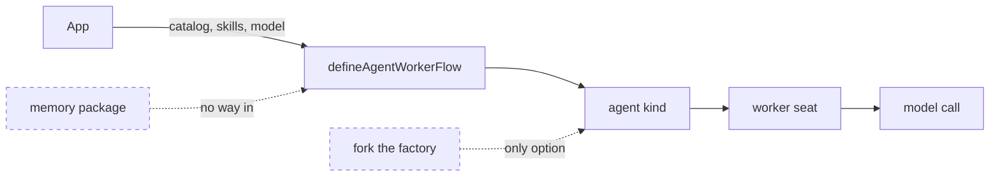
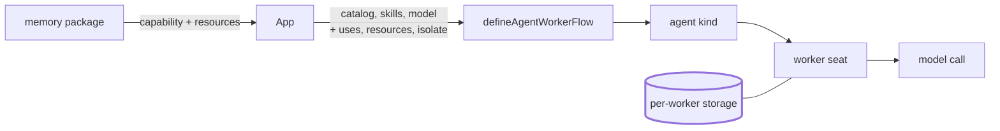
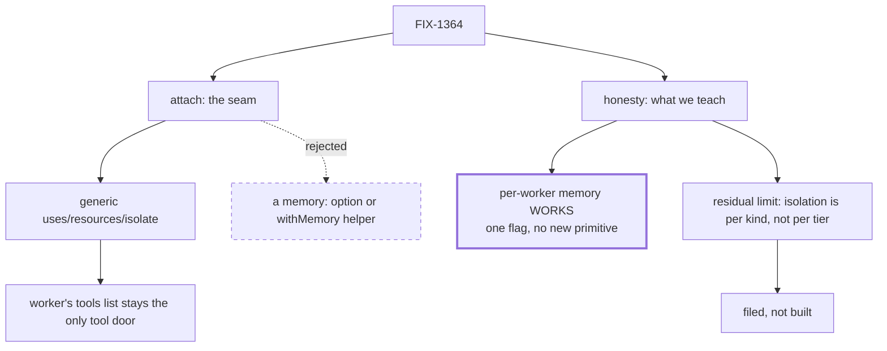

# FIX-1364 — Memory attach + gap honesty for the agent kind

Visual companion to [`spec/FIX-1364.md`](./FIX-1364.md). Decides nothing.

## 1. Today

An app can hand the factory a tool catalog, skills and a model. There is no door for
memory, so an app that wants a worker who remembers must copy the factory and edit it.

## 2. After (proposed)

Three generic doors: capabilities to attach, storage to declare, and whether each worker's
storage is its own. Memory passes through them like anything else. Called with no
arguments, the factory still produces a worker with no memory.

*This is the shape being gated, not built yet.*

## 3. Where the decision fell

A memory-shaped option was rejected: it would make workforce depend on the memory package.
A POC on this branch overturned the contract's assumption that per-worker memory was an
unproved gap. What remains is narrower and gets filed.

## What this leaves alone

The memory package's API, the default worker (still no memory), and per-worker memory
settings in worker files — there are none, by design.
