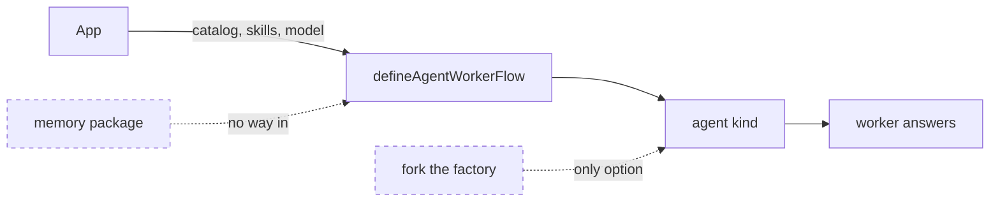
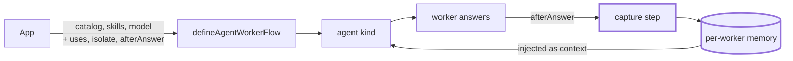
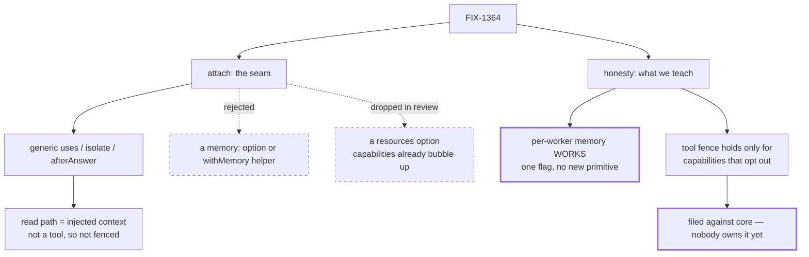

# FIX-1364 — Memory attach + gap honesty for the agent kind

Visual companion to [`spec/FIX-1364.md`](./FIX-1364.md). Decides nothing.

## 1. Today

An app can hand the factory a tool catalog, skills and a model. There is no door for memory,
so an app that wants a worker who remembers must copy the factory and edit it.

## 2. After (proposed)

Three generic doors. The loop is what matters: a capture step after the answer writes, and
prior knowledge comes back as injected context on the next turn. Called with no arguments,
the factory still produces a worker with no memory.

*This is the shape being gated, not built yet.*

## 3. Where the decision fell

A memory-shaped option was rejected; a `resources` option was dropped after review showed
capability resources already reach the flow. Review also found the honest limit: capability
tools are unioned onto a worker's list, not checked against it, so the fence holds only for
capabilities that opt out. That one is filed, not fixed here.

## What this leaves alone

The memory package's API, `@flow-state-dev/core`, the default worker (still no memory), and
per-worker memory settings in worker files — there are none, by design.
