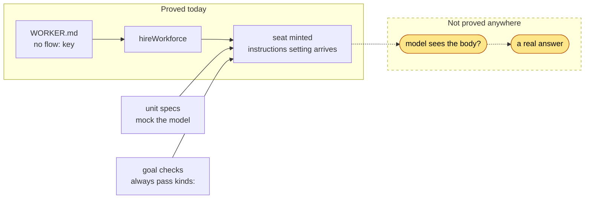
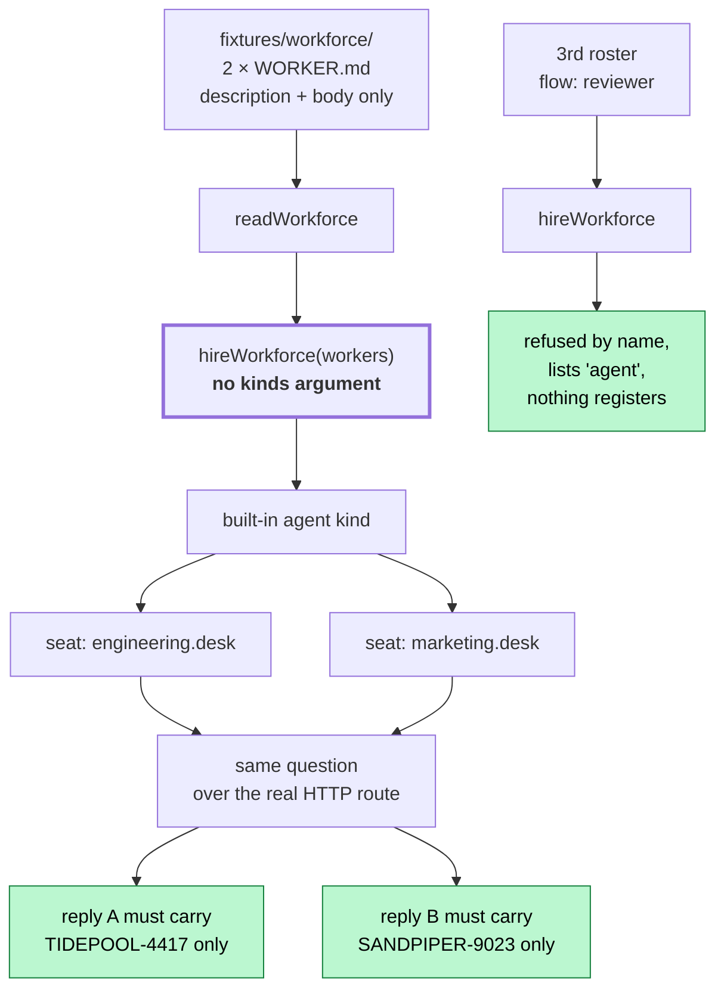
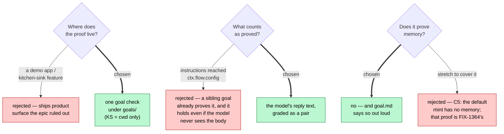

# FIX-1365 — Thin Proof: hire the OOTB `agent` kind

## 1. Today

The epic built the whole path. Every check stops one step before the answer.

Re-derived by script, not asserted — `spec-poc/FIX-1365-evidence/check.mjs`:

| Claim | Result |
|---|---|
| `defineAgentWorkerFlow` in any goal file | **0** of 177 files |
| `hireWorkforce` call sites in `goals/` passing `kinds:` | **4** of 4 |
| Workforce goals that run a model | **0** of 3 |

## 2. After (proposed)

One goal check closes the dashed arrow — and grades the **answer**, not the settings bag.

Two negative controls must be run and logged red: **bodies swapped** (each reply carries the
other's token) and **bodies emptied** (neither token appears).

## 3. Where the decision fell

**Scope, per the locked contract** (`docs/architecture/workforce-default-worker-kind.md`):
this issue owns acceptance criteria **1–3** only. Criterion 4 is FIX-1363's, 5 and 6 are
FIX-1362's, and memory is FIX-1364's — all built and merged.
