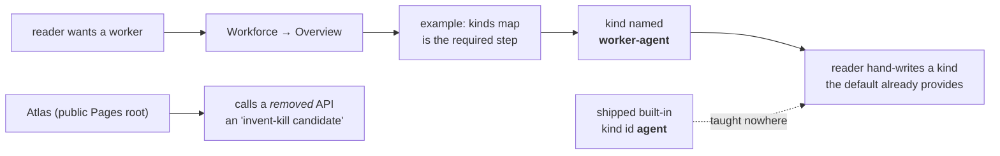
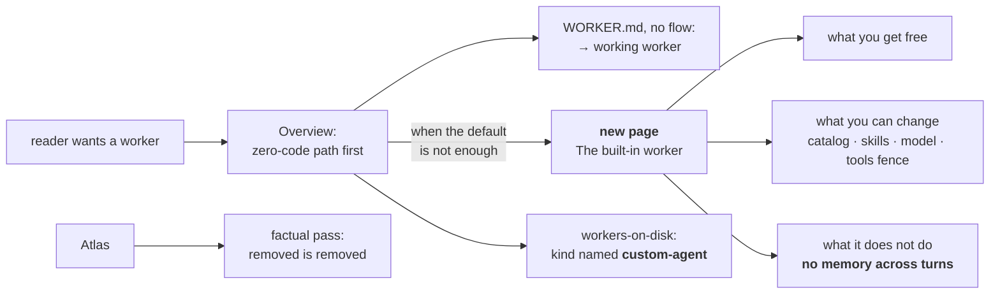
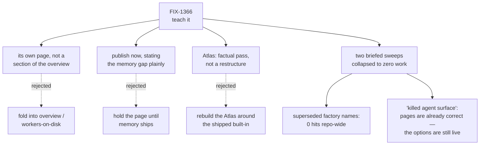

# FIX-1366 — Teach the built-in worker kind · explainer

## 1. Today

The built-in worker is on `main`. Every published page still teaches the world before it: a
`kinds` map is mandatory, and the kind you must write is called `worker-agent` — a placeholder
that reads like something we ship. The executable surface renamed it to `custom-agent` so the
two could not be confused; prose did not follow, so the confusion survives only where users read.

## 2. After (proposed)

One new page carries the concept. The overview leads with the promise and demotes `kinds` to
the door you open when you need your own. The placeholder renames everywhere prose teaches it.

## 3. Where the decision fell

Three calls. The research finding worth carrying is the bottom branch: two of the four sweeps
the brief listed were already done or were never broken, which moved this issue's centre from
cleanup to the thing nobody had done — teaching the built-in at all.

_Panel 4 lands once the documentation merges._
