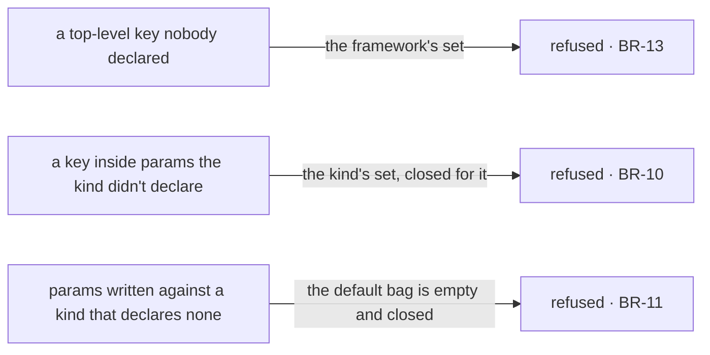

# FIX-1367 · Business rules

[Spec](SPEC.md) · [Decisions](DECISIONS.md) · **Rules** · [Plan](PLAN.md)

The cases, written as rules. Each says what a person or the system does and what happens. The
*proved by* column is the check the plan runs. A human reviews this page; the plan turns it into
work.

## Admission — who gets the bag

| # | When | Then | Proved by |
|---|---|---|---|
| BR-1 | A kind composes the contract and a seat is hired | A block running inside that seat's action reads its own skills at `ctx.flow.config.seatSkills`, in level order — org, then team, then its own | Goal check, real route, no model |
| BR-2 | A kind on the roster has **not** composed the contract | The whole roster refuses at hire and nothing is hired. The message always names the worker and the kind, and names the fix whenever hire can read the kind's default bag. Where it cannot — a kind an empty bag cannot satisfy — it states both possibilities rather than picking one ([D1](DECISIONS.md#d1)) | CI · goal-check control |
| BR-3 | A kind composes the contract and reads `seatSkills` nowhere | It mints and runs exactly as before. Ignoring the bag is not an error | Goal check, same run as BR-1 |
| BR-4 | Two seats on one roster read a shared `org/skills/` folder | Each is handed that folder's skills. Neither is handed the other's team-level or own-folder ones | CI |
| BR-5 | The loader read for a seat and found no skills | `seatSkills` is present and empty. Present-and-empty is the answer for *nothing to give*, and the bag is handed over all the same | CI |
| BR-6 | A record was hand-built and never read for, declares no settings and carries no body | `seatSkills` is present and empty too, and a bag still goes. **Every** record is hired through the kind's schema — no record is thin enough to mint without meeting it — so a kind that never composed the contract refuses here exactly as in BR-2. The bag still cannot distinguish *never read* from *read and empty*; that lives on the record and stays there | CI, on the thinnest record |
| BR-7 | A `WORKER.md` declares `seatSkills:` itself | Refused by name, at the loader and at hire, unchanged from today | Existing suite |
| BR-8 | A skill name reaches a seat from both the app's own skills and its folders | Refused at the mint, unchanged from today | Existing suite |

## The kind's own bag

| # | When | Then | Proved by |
|---|---|---|---|
| BR-9 | A kind declares a `params` schema and a worker file writes a key it declared | The value reaches `ctx.flow.config.params`, parsed against the kind's schema | CI |
| BR-10 | A worker file writes a key **inside** `params` the kind did not declare | Refused at the mint, by name. The framework closes the kind's bag as well as the outer set, since closing only the outer one lets an undeclared nested key through — and it refuses a `params` schema it *cannot* close, meaning one carrying a catchall. That is `defineFlow`'s existing catchall refusal, at the nested door | CI, with a planted key as the red state and a second case against a catchall |
| BR-11 | A kind declares no `params` schema and a worker file writes a key inside `params:` anyway | Refused by name. The default placeholder is an empty closed bag, so there is nothing to put in it. A bare `params: {}` is not refused — it declares nothing and reads exactly as omitting the key | CI |
| BR-12 | Nobody writes `params:` at all | Present and empty, when the kind's own bag is satisfiable empty. When the kind declared a setting it *requires*, the hire refuses and names the missing key: omitting the bag is not a way around the schema. That is the rule the outer bag already applies, not a second one | CI, both arms |
| BR-13 | A worker file writes a top-level key the kind did not declare | Refused at the mint, unchanged from today | Existing suite |

Two sets, not one — which is what BR-10 and BR-13 are each testing. The kind names the keys in its
own set; the framework closes both, since closing only the outer one lets a nested typo through.
The mermaid below is the same two boundaries by name, for a reader who wants them listed.

## The built-in kind, unchanged

| # | When | Then | Proved by |
|---|---|---|---|
| BR-14 | A worker file for the built-in kind declares `model:`, `tools:` or `skills:` | Identical behaviour to today, at the same top-level spelling. No file changes, no deprecation | Existing suite, unchanged |
| BR-15 | A worker file names no `flow:` | Hired into the built-in kind, as today. The absent-key rule and its whitespace and non-string refusals are untouched | Existing suite, unchanged |

## Failure taxonomy

Every failure here is a **startup misconfiguration and every one is fatal**, which is the
factory's existing posture: problems are collected so one run names all of them, and nothing is
returned partially. A kind that has not composed the contract (BR-2) joins that collection
rather than throwing on its own. Nothing degrades, nothing retries, and no failure here is
reachable from a request — by the time a seat can be addressed, admission already held.

The one non-failure worth stating: a kind that **ignores** the bag is not a failure of any kind
(BR-3). Empty or unused is fine; the absent door is not.

## Acceptance criteria this issue owns

A **non-agent** hireable kind — no model, no generator — is hired from a roster whose files
declare skills, and a block nested inside its action reads that seat's skills off
`ctx.flow.config`, over the real HTTP route. Graded from inside the running block, never from
the returned instance. Its control is the same kind with the contract removed: the hire must
refuse, name the fix, and register nothing.

That is the epic's contract gate for *a seat works* ([ER-7, ER-21](https://github.com/fixpoint-labs/flow-state-dev/pull/1718)), and it is also
what discharges the epic's rule that every convention earns a non-lab consumer before the lab
lands (ER-15) — for skills, this issue is that consumer.
