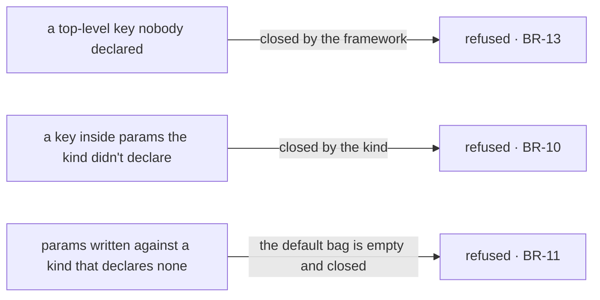

# FIX-1367 · Business rules

[Spec](SPEC.md) · [Decisions](DECISIONS.md) · **Rules** · [Plan](PLAN.md)

The cases, written as rules. Each says what a person or the system does and what happens. The
*proved by* column is the check the plan runs. A human reviews this page; the plan turns it into
work.

## Admission — who gets the bag

| # | When | Then | Proved by |
|---|---|---|---|
| BR-1 | A kind composes the contract and a seat is hired | A block running inside that seat's action reads its own skills at `ctx.flow.config.seatSkills`, in level order — org, then team, then its own | Goal check, real route, no model |
| BR-2 | A kind on the roster has **not** composed the contract | The whole roster refuses at hire. The message names the worker, names the kind, and names the fix. Nothing is hired | CI · goal-check control |
| BR-3 | A kind composes the contract and reads `seatSkills` nowhere | It mints and runs exactly as before. Ignoring the bag is not an error | Goal check, same run as BR-1 |
| BR-4 | Two seats on one roster read a shared `org/skills/` folder | Each is handed that folder's skills. Neither is handed the other's team-level or own-folder ones | CI |
| BR-5 | The loader read for a seat and found no skills | `seatSkills` is present and empty. Present-and-empty is the answer for *nothing to give* | CI |
| BR-6 | A record was hand-built and never read for | `seatSkills` is present and empty too. The bag cannot distinguish *never read* from *read and empty*; that distinction lives on the record and stays there | CI |
| BR-7 | A `WORKER.md` declares `seatSkills:` itself | Refused by name, at the loader and at hire, unchanged from today | Existing suite |
| BR-8 | A skill name reaches a seat from both the app's own skills and its folders | Refused at the mint, unchanged from today | Existing suite |

## The kind's own bag

| # | When | Then | Proved by |
|---|---|---|---|
| BR-9 | A kind declares a `params` schema and a worker file writes a key it declared | The value reaches `ctx.flow.config.params`, parsed against the kind's schema | CI |
| BR-10 | A worker file writes a key **inside** `params` the kind did not declare | Refused at the mint, by name. The kind's schema closes its own bag; the framework closes only the outer set | CI, with a planted key as the red state |
| BR-11 | A kind declares no `params` schema and a worker file writes `params:` anyway | Refused. The default placeholder is an empty closed bag, so there is nothing to put in it | CI |
| BR-12 | Nobody writes `params:` at all | It is present and empty in the parsed bag. Always present, empty is fine | CI |
| BR-13 | A worker file writes a top-level key the kind did not declare | Refused at the mint, unchanged from today | Existing suite |

Two closures, not one — which is what BR-10 and BR-13 are each testing. The mermaid below is the
same two boundaries by name, for a reader who wants them listed.

## The built-in kind, unchanged

| # | When | Then | Proved by |
|---|---|---|---|
| BR-14 | A worker file for the built-in kind declares `model:`, `tools:` or `skills:` | Identical behaviour to today, at the same top-level spelling. No file changes, no deprecation | Existing suite, unchanged |
| BR-15 | A worker file names no `flow:` | Hired into the built-in kind, as today. The absent-key rule and its whitespace and non-string refusals are untouched | Existing suite, unchanged |

## Failure taxonomy

Every failure here is a **startup misconfiguration and every one is fatal**, which is the
factory's existing posture: problems are collected so one run names all of them, and nothing is
returned partially. A kind that has not composed the contract (BR-2) joins that collection
rather than throwing on its own. Nothing degrades, nothing retries, and no failure here is
reachable from a request — by the time a seat can be addressed, admission already held.

The one non-failure worth stating: a kind that **ignores** the bag is not a failure of any kind
(BR-3). Empty or unused is fine; the absent door is not.

## Acceptance criteria this issue owns

A **non-agent** hireable kind — no model, no generator — is hired from a roster whose files
declare skills, and a block nested inside its action reads that seat's skills off
`ctx.flow.config`, over the real HTTP route. Graded from inside the running block, never from
the returned instance. Its control is the same kind with the contract removed: the hire must
refuse, name the fix, and register nothing.

That is the epic's contract gate for *a seat works* ([ER-7, ER-21](https://github.com/fixpoint-labs/flow-state-dev/pull/1718)), and it is also
what discharges the epic's rule that every convention earns a non-lab consumer before the lab
lands (ER-15) — for skills, this issue is that consumer.
