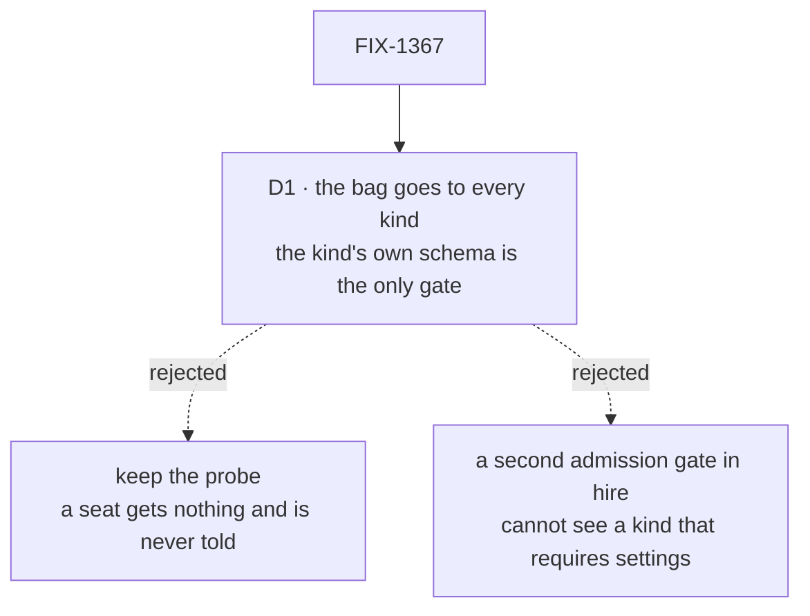

# FIX-1367 · Decisions

[Spec](SPEC.md) · **Decisions** · [Rules](BUSINESS-RULES.md) · [Plan](PLAN.md)

What was considered, what was chosen, why, and what each locks in. One decision is the sign-off
surface; the second was cut in review. Everything below them is context.

## The tree

Solid edges are what you're signing. Dashed edges lost, and the label says why.

## D1 · Hire hands the bag to every hireable kind, and the kind's own closed schema is the only thing that decides admission

| | |
|---|---|
| **Instead of** | Today's probe — read the kind's default settings, hand the skills over only if it already declared a matching key, say nothing otherwise. Or a second admission gate inside hire |
| **Because** | The probe's quiet arm is the defect: a seat whose folders declared skills mints, runs, and holds none, with no message anywhere. A hire-side gate is no better — it would be a second and *partial* authority over one rule, for the reason spelt out below. The closed schema every mint already passes is one enforcement point (tenet 5) |
| **Locks in** | A worker kind written before this must compose the contract or stop hiring, and it fails for the **whole roster** at boot rather than for one seat at run time — one declaring no settings schema at all included, since the bag goes to it too and a flow declaring none refuses a bag. That is the upgrade cost, paid once per kind. It also settles that *hireable* is something a kind declares, not something hire infers |

**What would change my mind:** a consumer outside this repo running custom worker kinds. The blast
radius is three real-path goal checks, this package's tests and its docs — nothing else in the tree
calls the seat factory (evidence F1). At pre-1.0 a loud break beats a quiet wrong answer; with real
consumers it would be worth a release window.

**The pre-check hire keeps is a message, not a gate**, and it is partial in one named case. It
reads the kind's probed default bag — the only shape a blueprint exposes. A kind whose settings an
empty bag cannot satisfy publishes an empty bag and `requiresConfig`, so hire cannot tell *never
composed the contract* from *composed it and requires a setting*. There it states both: accusing
the wrong fault would mislead worse than the silence this replaces.

## D2 · Cut in review · a kind's own settings stay at the top level, declared and closed

| | |
|---|---|
| **Instead of** | A `params` bag holding a kind's own settings, nested inside the contract so a kind could never spend a name the framework might take later. Specified, reviewed, and cut before any of it was built |
| **Because** | `params` is for **open-ended dictionary items** — the case where a kind knows it holds a dictionary whose keys it cannot name in advance. A kind's *known* settings are the other sort of thing, and they belong at the top level, where the framework closes them and an undeclared key refuses by name. Nesting them bought collision safety against a collision nobody has had, and paid for it by moving known keys out of the closed set. Nothing in the tree has open-ended data today — no kind, no app, no filed issue — so the slot is not earned yet |
| **Locks in** | The contract is `instructions?` and `seatSkills`, and that is the whole bag. A kind extends it with its own keys at the top level, exactly as the built-in `agent` kind already does — so the one shipped example teaches the rule rather than standing outside it. When a kind genuinely does hold open-ended data, it gets one declared key whose own schema is a record, which is what `closeConfigSchema`'s own refusal already tells an author to do. The pattern is prescribed before the first case arrives, and the error message teaches it |

**What would change my mind:** a kind that genuinely holds a dictionary of keys it cannot name in
advance. That is the case `params` was for, and it earns the slot on arrival — as a record, not as
a nested object of declared keys.

## Decided, not asked

- **The bag keeps the name `seatSkills`.** The epic calls it the *skills* bag, but `skills` is
  already an author-written switch object on the built-in kind, and `seatSkills` is published
  across source, tests, the README, two site pages and an architecture doc (evidence F3).
  Renaming is a breaking change to author files for a word; the docs bridge it.
- **The contract's shape is the register's shape.** No second skills type, per the epic.
- **Hire imposes `seatSkills` on every record** — loaded, hand-built, or declaring nothing at all.
  The non-empty guard existed only to protect the probe, and a record handed no bag would mint
  without ever meeting the schema (BR-6).
- **The Proof is a goal check, not a unit test**, graded from a block inside the action: a bag
  asserted on the returned instance proves the mint, not the claim (tenet 7).
- **`instructions` is unchanged** — already imposed unconditionally; the contract writes down what
  the built-in kind already declared.

## Considered and dropped

| Alternative | Why not |
|---|---|
| Keep the probe and document it | Documenting a quiet branch makes it a promise instead of a bug |
| Put the contract's keys on `FlowType` so hire can read any kind's shape | A core type change for one caller. It is also what the partial diagnostic above would cost, and the diagnostic is a message |
| Let hire strip keys a kind did not declare | Quietly dropping a worker's setting is the probe's silence again |

## How it got here

- **Draft** — *the door is conditional, and its quiet arm misleads*. One published contract,
  enforcement left at the closed schema every mint already passes, and a nested placeholder for the
  kind's own settings. One package, one PR.
- **Review round 1** — three places the door did not close: a record with no settings minted with
  no bag at all; a required-settings kind's diagnostic could accuse the wrong fault; an omitted
  nested bag was promised empty for a kind that requires one. The direction held, the rules now
  match the mechanism.
- **Review — the nested placeholder is cut (D2).** A kind's known settings are declared at the top
  level, and `params` is reserved for open-ended data, which nothing has yet. BR-9..BR-11 went with
  it; BR-12 stayed, rewritten against the top level, because its rule was never about the bag.
- **Approved as amended (Sep 17, cross-spec pass)** — Docs gains this issue's own atlas tag flip,
  per FIX-1358's D2. No decision reopened.

**Open: none.**
