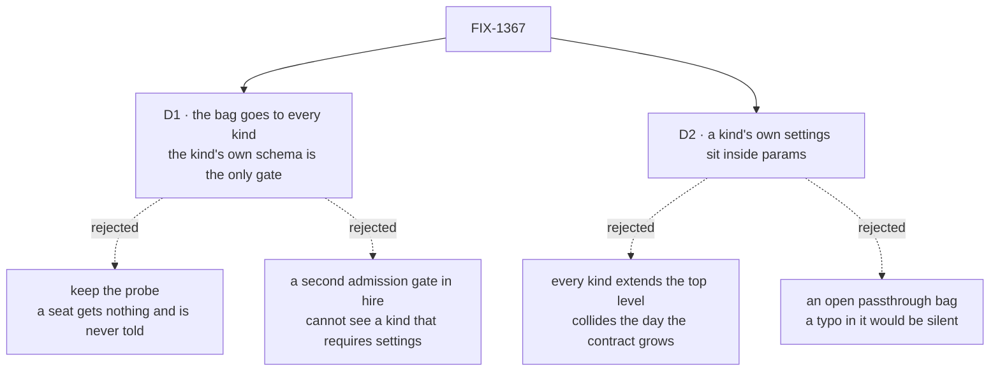

# FIX-1367 · Decisions

[Spec](SPEC.md) · **Decisions** · [Rules](BUSINESS-RULES.md) · [Plan](PLAN.md)

What was considered, what was chosen, why, and what each locks in. Two decisions are the
sign-off surface. Everything below them is context for those two.

## The tree

Solid edges are what you're signing. Dashed edges lost, and the label says why.

## D1 · Hire hands the bag to every hireable kind, and the kind's own closed schema is the only thing that decides admission

| | |
|---|---|
| **Instead of** | Today's probe — read the kind's default settings, hand the skills over only if it already declared a matching key, say nothing otherwise. Or a second admission gate inside hire, checking each kind before minting it |
| **Because** | The probe's quiet arm is the defect: a seat whose folders declared skills mints, runs, and holds none, with no message anywhere. A hire-side gate is no better — a kind whose settings cannot be satisfied by an empty bag exposes no readable shape, so the gate would be a second and *partial* authority over one rule. The closed schema every mint already passes through is one enforcement point (tenet 5) |
| **Locks in** | A worker kind written before this must compose the contract or stop hiring, and it fails for the **whole roster** at boot rather than for one seat at run time. That is the upgrade cost, paid once per kind. It also settles that *hireable* is something a kind declares, not something hire infers |

**What would change my mind:** a consumer outside this repo running custom worker kinds. The
blast radius is three real-path goal checks, this package's tests and its docs — nothing else in
the tree calls the seat factory, re-derived rather than remembered
(`spec-poc/FIX-1367-admission/evidence.mjs`, F1). At pre-1.0 with that radius a loud break beats
a quiet wrong answer; with real consumers it would be worth a release window.

**The pre-check hire keeps is a message, not a gate.** It turns an unrecognised-key refusal into
one naming the fix. It may be partial: where it cannot see the kind's shape, the mint's own
refusal reaches the caller with the worker's id in front of it, as today.

## D2 · A kind's own settings live inside one `params` bag the kind closes, not at the top level beside the contract's

| | |
|---|---|
| **Instead of** | Every kind extending the thin contract with its own top-level keys — which is what the built-in kind does today. Or one open passthrough bag that accepts anything |
| **Because** | The contract is expected to grow — a seat resource allowlist is already filed ([FIX-1381](https://linear.app/fixpoint-labs/issue/FIX-1381)) — and a kind that put `resources` at the top level collides the day it lands. A nested bag cannot, and it is not open: the framework closes the outer set, the kind closes its own, and a typo inside `params` still refuses. `defineFlow`'s catchall refusal already names this shape, telling authors to *move the open-ended data into one declared key whose own schema is a record* |
| **Locks in** | `params` is always present and may be empty, forever — a kind may ignore it but cannot remove it. And the built-in kind keeps its top-level keys, so the one shipped example teaches the top level rather than the placeholder, and the placeholder ships with no framework consumer |

Read the containment. The kind's settings sit *inside* the contract's third key, not beside its
first two — which is the whole property being bought, since only the left half can grow.

**What would change my mind:** a decision that the contract is finished. Then the nesting buys
nothing and every kind should extend the top level.

## Decided, not asked

- **The bag keeps the name `seatSkills`.** The epic calls it the *skills* bag, but `skills` is
  already an author-written switch object on the built-in kind, and `seatSkills` is merged and
  published across source, tests, the README, two site pages and an architecture doc (evidence
  F3). Renaming is a breaking change to author files for a word; the docs bridge it.
- **The contract's shape is the register's shape.** No second skills type, per the epic.
- **Hire imposes the key whenever the record carries a set, empty included.** The non-empty guard
  existed only to protect the probe.
- **The Proof is a goal check, not a unit test**, graded from a block running inside the action.
  A bag asserted on the returned instance proves the mint, not the claim (tenet 7).
- **`instructions` is unchanged** — already imposed unconditionally; the contract writes down
  what the built-in kind already declared.

## Considered and dropped

| Alternative | Why not |
|---|---|
| Keep the probe and document it | The silence is the issue. Documenting a quiet branch makes it a promise instead of a bug |
| Put the contract's keys on `FlowType` so hire can read any kind's shape | A core type change for one caller, and it still would not tell a kind's author what to do |
| Ship the door without the `params` placeholder | Smaller, and genuinely tempting — no framework consumer on day one. Rejected because it is owner-locked (ER-7), and because adding a namespace *after* kinds have taken the top level is the migration this avoids |
| Move the built-in kind's `model` / `tools` / `skills` under `params` | Breaks every worker file and docs example to make one example match a rule about where a *new* kind puts its settings |
| Let hire strip keys a kind did not declare | Declared-or-refused is the framework's rule, and quietly dropping a worker's setting is the probe's silence again |

## How it got here

- **Draft** — framed as *the door is conditional, and its quiet arm misleads*. One published
  contract every hireable kind composes, enforcement left at the single closed schema every mint
  already passes, a nested placeholder for the kind's own settings. One package, one PR.

**Open: none.**
