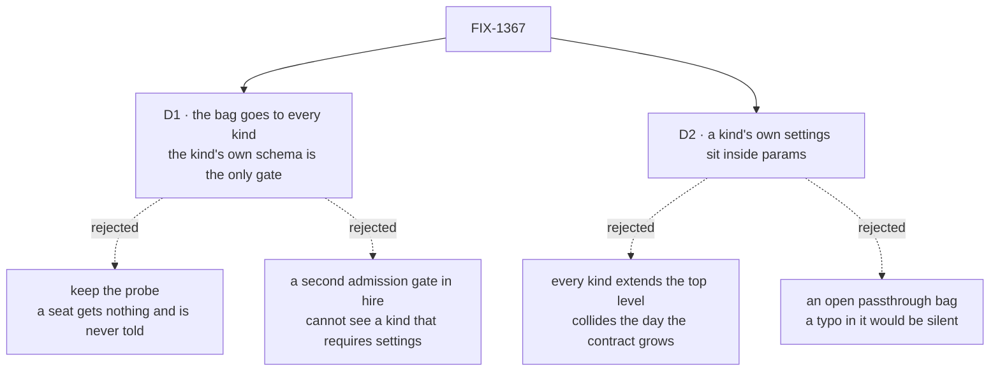

# FIX-1367 · Decisions

[Spec](SPEC.md) · **Decisions** · [Rules](BUSINESS-RULES.md) · [Plan](PLAN.md)

What was considered, chosen, and locked in. The two numbered decisions are the sign-off surface;
everything else is context for them.

## The tree

Solid edges are what you're signing; dashed edges lost, and the label says why.

## D1 · Hire hands the bag to every hireable kind, and the kind's own closed schema is the only thing that decides admission

| | |
|---|---|
| **Instead of** | Today's probe — read the kind's default settings, hand the skills over only if it already declared a matching key, say nothing otherwise. Or a second admission gate inside hire |
| **Because** | The probe's quiet arm is the defect: a seat whose folders declared skills mints, runs, and holds none, with no message anywhere. A hire-side gate is no better — it would be a second and *partial* authority over one rule, for the reason spelt out below. The closed schema every mint already passes is one enforcement point (tenet 5) |
| **Locks in** | A worker kind written before this must compose the contract or stop hiring, and it fails for the **whole roster** at boot rather than for one seat at run time — one declaring no settings schema at all included, since the bag goes to it too and a flow declaring none refuses a bag. That is the upgrade cost, paid once per kind. It also settles that *hireable* is something a kind declares, not something hire infers |

**What would change my mind:** a consumer outside this repo running custom worker kinds. The blast
radius is three real-path goal checks, this package's tests and its docs — nothing else in the tree
calls the seat factory (evidence F1). At pre-1.0 a loud break beats a quiet wrong answer; with real
consumers it would be worth a release window.

**The pre-check hire keeps is a message, not a gate**, and it is partial in one named case. It
reads the kind's probed default bag — the only shape a blueprint exposes. A kind whose settings an
empty bag cannot satisfy publishes an empty bag and `requiresConfig`, so hire cannot tell *never
composed the contract* from *composed it and requires a setting*. There it states both: accusing
the wrong fault would mislead worse than the silence this replaces.

## D2 · A kind's own settings live inside one `params` bag the kind closes, not at the top level beside the contract's

| | |
|---|---|
| **Instead of** | Every kind extending the thin contract with its own top-level keys — which is what the built-in kind does today. Or one open passthrough bag that accepts anything |
| **Because** | The left half is ours and may take another key; a kind that spent a top-level name first collides the day it does, and the likeliest collisions are with kinds we never see — a third party's. A nested bag cannot collide, and it is not open: the framework closes the outer set and the kind's own, so a typo inside `params` still refuses. `defineFlow`'s catchall refusal already names this shape — *move the open-ended data into one declared key whose own schema is a record*. **No filed issue is that next key**: the seat resource allowlist is a separate seat/kind surface and does not land in this bag (D-11) |
| **Locks in** | `params` is always present and may be empty, forever — a kind may ignore it but cannot remove it. The built-in kind keeps its top-level keys, so the one shipped example teaches the top level rather than the placeholder, which ships with no framework consumer |

Read the containment: the kind's settings sit *inside* the contract's third key, not beside its
first two. Only the left half grows, which is the property being bought.

**What would change my mind:** a decision that the contract is finished. Then the nesting buys
nothing and every kind should extend the top level.

## Decided, not asked

- **The bag keeps the name `seatSkills`.** The epic calls it the *skills* bag, but `skills` is
  already an author-written switch object on the built-in kind, and `seatSkills` is published
  across source, tests, the README, two site pages and an architecture doc (evidence F3).
  Renaming is a breaking change to author files for a word; the docs bridge it.
- **The contract's shape is the register's shape.** No second skills type, per the epic.
- **Hire imposes `seatSkills` on every record** — loaded, hand-built, or declaring nothing at all.
  The non-empty guard existed only to protect the probe, and a record handed no bag would mint
  without ever meeting the schema (BR-6).
- **The Proof is a goal check, not a unit test**, graded from a block inside the action: a bag
  asserted on the returned instance proves the mint, not the claim (tenet 7).
- **`instructions` is unchanged** — already imposed unconditionally; the contract writes down what
  the built-in kind already declared.

## Considered and dropped

| Alternative | Why not |
|---|---|
| Keep the probe and document it | Documenting a quiet branch makes it a promise instead of a bug |
| Put the contract's keys on `FlowType` so hire can read any kind's shape | A core type change for one caller. It is also what the partial diagnostic above would cost, and the diagnostic is a message |
| Ship the door without the `params` placeholder | Smaller, and genuinely tempting — no framework consumer on day one. Rejected because it is owner-locked (ER-7), and because adding a namespace *after* kinds have taken the top level is the migration this avoids |
| Move the built-in kind's `model` / `tools` / `skills` under `params` | Breaks every worker file and docs example so one example matches a rule about where a *new* kind puts its settings |
| Let hire strip keys a kind did not declare | Quietly dropping a worker's setting is the probe's silence again |

## How it got here

- **Draft** — *the door is conditional, and its quiet arm misleads*. One published contract,
  enforcement left at the closed schema every mint already passes. One package, one PR.
- **Review round 1** — three places the door did not close: a record with no settings minted with
  no bag at all; a required-settings kind's diagnostic could accuse the wrong fault; an omitted
  `params` was promised empty for a kind that requires one. The direction held, the rules now
  match the mechanism.

## Open

- **Does `params` ship here, or wait for a kind that needs it?** D2 is with the product owner. D1
  holds either way; if `params` is cut, BR-9..BR-12 and the plan's `params` rows go with it.
