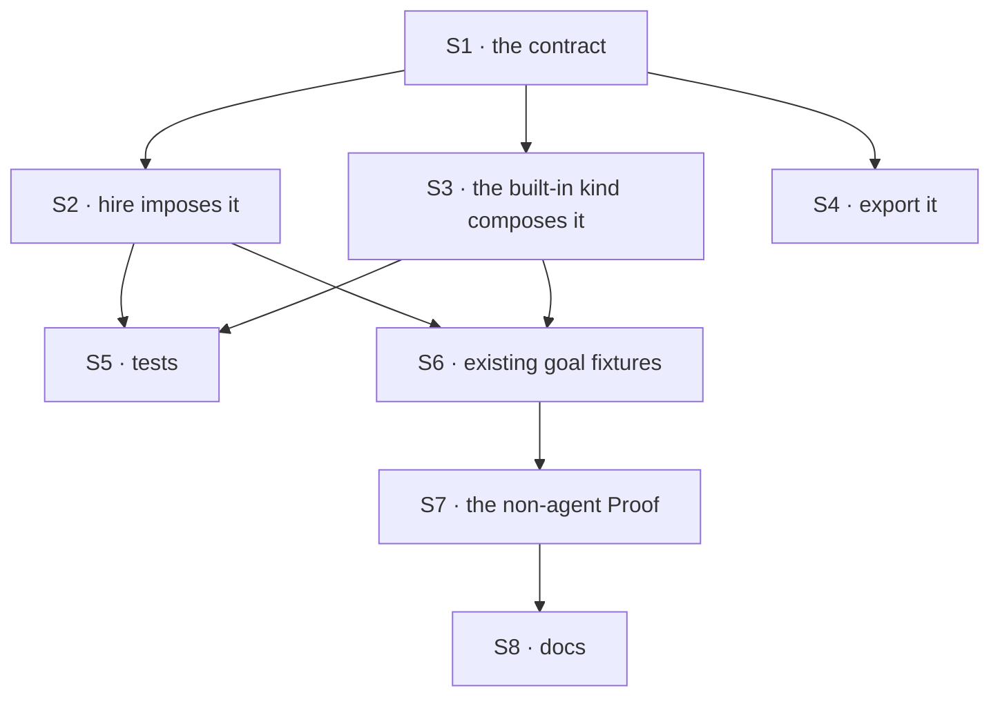

# FIX-1367 · Plan

[Spec](SPEC.md) · [Decisions](DECISIONS.md) · [Rules](BUSINESS-RULES.md) · **Plan**

Written for the implementing agent. IDs cross-reference [BUSINESS-RULES.md](BUSINESS-RULES.md)
(BR-n) and [DECISIONS.md](DECISIONS.md) (D-n). `tdd`. One PR.

## Surfaces

| ID | Package · role | Change | Rules |
|---|---|---|---|
| S1 | `workforce` · the contract module beside `WorkerManifest` | Declare `workerConfigSchema(params?)` and `WorkerConfig` — `instructions?`, `seatSkills` (default empty), `params` (default empty and **closed**; the kind's object when it passes one). The factory closes the kind's object itself and refuses one carrying a catchall, which `.strict()` cannot close (BR-10). The skill-record shape the built-in kind holds privately **moves here**, provenance comment included (BP-034) | BR-1 BR-5 BR-9..BR-12 |
| S2 | `workforce` · the seat factory | Impose `seatSkills` on **every** record (`?? []`), so a bag always reaches the kind's schema. **Remove** the probe, the non-empty guard *and* the bagless-mint branch — a record with no settings mints with no bag today, which is admission skipped entirely (D1, BR-6). Add the best-effort pre-check that rewrites an unrecognised-key refusal to name the contract, and names both possibilities where the kind's bag is unreadable | BR-1 BR-2 BR-5 BR-6 |
| S3 | `workforce` · the built-in `agent` kind | Build its settings schema **from** S1's factory, extending it with `model`, `tools` and the `skills` switches where they already sit | BR-14 BR-15 |
| S4 | `workforce` · package root exports | Export the factory and the type. Node-free, so root rather than `./loader` | — |
| S5 | `workforce` · tests | Invert the case pinning today's quiet arm (*"hires a custom kind that does not declare the key"*) into a refusal. Compose the contract into the hire-test fixtures, keeping **one** uncomposed as BR-2's | BR-1..BR-13 |
| S6 | `goals/workforce-seats/` · the three existing checks | Their fixture kinds compose the contract; their graded outcomes do not change | BR-14 BR-15 |
| S7 | `goals/workforce-seats/` · **new** goal | The non-agent Proof, as a sibling in that family | BR-1 BR-2 BR-3 |
| S8 | Docs | Package README, two site pages, one architecture doc, one `minor` changeset | — |

## Sequence



## Checks

| ID | Runs after | Passes when |
|---|---|---|
| V1 | S1 | `{}` parses into an empty `seatSkills` and an empty `params` (BR-5, BR-12); an undeclared key inside `params` refuses (BR-10, BR-11); a required field inside `params` refuses when nobody wrote one, naming the key (BR-12, second arm). **Two red states, not one**: the undeclared key against a plain non-closed `params`, *and* against one carrying a catchall — `.strict()` does not close a catchall in this Zod version, so the first check goes green while the second hole is open. Watch each go red first |
| V2 | S2 | BR-1 on a composed kind; BR-2's refusal names the worker, the kind and the fix, and arrives **collected** with any other roster problem rather than thrown alone. The **thinnest record** — hand-built, no body, no settings, no skills — hires into a composed kind and *refuses* on one that never composed (BR-6); the refusal half is what fails today. Where the kind's bag is unreadable, the message accuses neither fault |
| V3 | S3 | The built-in kind's suite is green **unchanged**, and a worker file's `model:` / `tools:` / `skills:` behave byte for byte as today (BR-14, BR-15, BP-030) |
| V4 | S6 | All three existing goal checks reach their recorded outcomes, and each one's controls still fail at the leg they controlled |
| VG | S7 | Goal, real HTTP route, **no model**: a non-agent kind hired from a tree with an `org/skills/` folder, a block nested inside its action reporting the seat's skill names. Graded on what the running block saw, never on the returned instance. Controls: strip the contract — the hire refuses and registers nothing; hand the seat its sibling's folder — the names must not match |
| V5 | S8 | `node spec-poc/FIX-1367-admission/evidence.mjs` still passes, with F2/F2b either describing the new shape or deleted deliberately |

## Pinned names

| Where | Name | Why pinned |
|---|---|---|
| The bag | `seatSkills` | Public and already shipped |
| The bag | `params` | Public — an author types it in a `WORKER.md` |
| The export | `workerConfigSchema` · `WorkerConfig` | Public; the refusal message names it |

Everything else is yours — the module the contract lands in, the pre-check's shape, every test name.

## Guardrails

| Rule | Because |
|---|---|
| **Do not remove the duplicated absent-`flow:` rule** in the seat factory and the channel binder | Three edits to that file are in flight; the epic holds the duplicate until all three land |
| One bag, one construction site: hire composes, the kind's schema admits, nothing else builds a seat's settings (tenet 5) | Admission has a single enforcement point. A second assembler is a second answer to *what did this seat get* |
| The pre-check never decides whether to hire — only how to word a refusal (D1) | The moment it can refuse on its own it is the second gate D1 rejected, and a partial one |
| The built-in kind's author-facing frontmatter does not change (BP-030) | Every shipped worker file and docs example is written against it, and none is what this issue fixes |
| Grade the Proof from a block **inside** the action, never from the returned instance (tenet 7) | The claim is that a hired seat *receives* the config. A read off the instance is green for a bag that never reaches a running block |
| Nothing here loads application TypeScript in a tool process | The constraint that bit a sibling spec — the published CLI runs compiled JavaScript under plain Node — does not reach this change, and must not start to |

## Docs

- **EXTEND** `packages/workforce/README.md` — under *Hiring a workforce*: what a hireable kind must
  admit, the factory, the `params` bag. *Voice risk:* "seamless" and "first-class" want in. Don't.
- **EXTEND** `apps/docs/docs/workforce/workers-on-disk.md` — *The flow decides what a worker may
  declare* gains the contract; *When a worker needs more than settings* gains the `params`
  example. *Voice risk:* introduce `kind` in plain terms in the new prose.
- **EXTEND** `apps/docs/docs/workforce/built-in-worker.md` — *Custom worker kinds* points at the
  contract rather than describing the shape twice.
- **EXTEND** `docs/architecture/workforce-default-worker-kind.md` — internal: C1 gains the rule.
- **No new page.** The Workforce sidebar moved recently; fragmenting it again costs more than it
  buys (ER-18).
- **One changeset**, `minor`, `@flow-state-dev/workforce`: it changes what a published package
  requires of a consumer's own kind (BP-022).

## Sketch · pseudocode, illustrative, react to the shape

```
the contract (S1):
    workerConfigSchema(paramsSchema?) →
        instructions   optional text
        seatSkills     list of skill records, defaults to empty
        params         paramsSchema CLOSED, or an empty closed bag; a catchall refuses here

the built-in kind (S3):
    settings = workerConfigSchema().extend({ model, tools, skills-switches })

hire, per record (S2):
    settings ← the record's declared keys, minus the two reserved ones
    if the record has a body  → settings.instructions = body
    settings.seatSkills = the record's skills ?? []          ← EVERY record
    mint the kind with settings                              ← always a bag, so always admitted
    on refusal:
        kind's default bag readable, missing our keys → name the factory      ← message only
        kind requires settings, bag unreadable        → name both possibilities
        otherwise → the kind's own refusal, with the worker's id in front
```

**POC: none built, and why is stated rather than left silent.** This worktree has no installed
dependencies and a cold package store, so a runnable POC was not affordable in one dispatch. The
premise it would have checked — *a kind that never declared the key refuses when hire imposes it*
— is not unchecked: the merged test pinning today's quiet arm says so in its own comment, *"its
config schema is closed, so imposing the key on one would refuse the hire."*

**What was executed:** `spec-poc/FIX-1367-admission/evidence.mjs`, re-deriving this spec's counted
facts from the tracked tree (9/9 hold). Its totality assertion found what the author missed —
three real-path goal checks hire a roster, which is why S6 and S7 exist. Its negative control
plants an unclassified caller, was run, turned both totality checks red, and removed it.

## At implement time

- **Re-read the seat factory before editing.** The `TEAM.md` work and the out-of-epic agent-kind
  edit both touch it. Rebase first; never resolve a conflict by deleting the absent-`flow:` rule.
- **The boot scan may have landed.** If kinds arrive from a scan rather than a hand-passed map, the
  contract is unaffected but the fixtures moved.
- **Check whether the skill-record shape already moved**; if a sibling extracted it, consume it.

## Notes from review

Below the spec-review bar (BP-040) — weigh these against real code; they are not design changes.

| From | Note |
|---|---|
| cursor | "POC: none built" reads as a contradiction sitting directly above "What was executed: `evidence.mjs`". Retitle it *"Behavioral POC (hire refusal in a runnable app): not built"* and file the script under *"Tree evidence script (characterization)"*, so nobody reads the 9/9 run as disclaimed |
| cursor | `BUSINESS-RULES.md` states the bag three times — SVG, paragraph, mermaid. Keep the figure and one of the other two |

Two further `cursor` notes on `evidence.mjs` itself are **dropped, not recorded**: line-level POC
feedback, which this PR says it drops, since none of that file ships.

## Follow-ups

- **The absent-`flow:` extraction** is filed and this issue blocks it; it runs once this, the
  `TEAM.md` work and the out-of-epic edit have all merged.
- **`params` has no framework consumer on day one** ([D2](DECISIONS.md#d2)) — and D2 is with the
  product owner. If it ships and no kind has used it by the time the pentest lab lands, that is
  the signal to re-open whether it earned its place.
