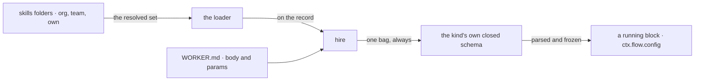

# FIX-1367 · A hired seat is handed the skills its files declared

**Spec** · [Decisions](DECISIONS.md) · [Rules](BUSINESS-RULES.md) · [Plan](PLAN.md)

Feature · `workforce` · small · 1 PR · epic [FIX-1351](https://github.com/fixpoint-labs/flow-state-dev/pull/1718)

## Four people, before and after

| Someone who… | Today | After |
|---|---|---|
| **drops a skill folder in `org/skills/` and hires a team of custom seats** | Every custom seat silently gets nothing. The folder loaded, the seat minted, and no message says the two never met | Every seat is handed the folder's skills. A kind that can't take them says so at boot, by name |
| **writes their own worker kind** | Has to know an undocumented key name to receive anything, and gets no error for guessing wrong | Composes one published contract and receives the seat's skills, its instructions and its own settings |
| **wants their kind to take a setting of its own** | Adds a top-level key, and collides the day the framework adds one with that name | Declares it inside the kind's own bag, where nothing the framework adds later can reach it |
| **runs the built-in `agent` kind** | Works | Works. Every worker file keeps its current spelling, byte for byte |

**Why now.** The skills convention shipped: a folder tree resolves per seat, and the record carries it. What hire does with it is hand it over *only to a kind that already happened to declare a matching key*, and to say nothing to any other. So "the seat works" is true and "the seat got what its files declared" is not, and there is no way for an author to find out which. The epic's rule is that a seat that mints and is handed nothing it declared is what makes *a seat works* dishonest ([ER-7](https://github.com/fixpoint-labs/flow-state-dev/pull/1718)).

## What changes


The top row is today: a question in the middle of the path, and one of its two answers is silence. The bottom row removes the question. The bag goes to every kind, and the only remaining answer is loud.

**Writing a hireable kind, as its author writes it:**

```diff
  const triage = defineFlow({
    kind: "request-triage",
-   configSchema: z.object({ desk: z.string().default("front") }),
+   // Admits the seat's skills and its instructions; `desk` is this kind's own.
+   configSchema: workerConfigSchema(z.object({ desk: z.string().default("front") })),
    actions: { run: { inputSchema, block: triageWork } }
  })
```

**And the worker file that configures it:**

```diff
  ---
  description: The front door.
  flow: request-triage
+ params:
+   desk: back
  ---
```

Nothing names the seat's skills in either file. They come from the folders the seat can see, and hire puts them in the bag whether or not this kind reads them.

## How it reaches the seat



Hire composes one bag and hands it over. The kind's schema is the only thing that decides whether it is admitted — which is what makes a refusal a single, loud event rather than a silent branch ([D1](DECISIONS.md#d1)).

## What stays as it is

- **The skills register.** Which folders a seat reads, and the duplicate-name refusal, are the shipped convention's and are untouched.
- **The built-in `agent` kind's worker files.** `model:`, `tools:` and `skills:` stay top-level and keep their meaning.
- **The `seatSkills:` refusal.** A worker file still may not declare its own skill set at either door.
- **The duplicated absent-`flow:` rule** in `hire.ts` and `mintChannels`, which three in-flight edits share.

## Sign off

1. **[D1](DECISIONS.md#d1) · Hire hands the bag to every kind, and a kind that has not composed the contract stops hiring — the whole roster refuses, at boot.** If wrong: anyone running a custom worker kind has a startup failure on upgrade and an edit to make. The alternative is keeping a silence we already know misleads.
2. **[D2](DECISIONS.md#d2) · A kind's own settings live inside one `params` bag the kind closes, not at the top level beside ours.** If wrong: we ship a door nothing walks through yet, and authors learn the nesting for a collision that hasn't happened.

**Open: number 2.** A restraint review argues `params` should wait for the first kind that actually
needs it, and no filed issue is the contract's next key — so the placeholder would ship with
nothing using it. Number 1 is the line that costs anybody an edit, and the alternative to it is a
silence we already know misleads. What lost and why: [DECISIONS.md](DECISIONS.md). The cases:
[BUSINESS-RULES.md](BUSINESS-RULES.md).
