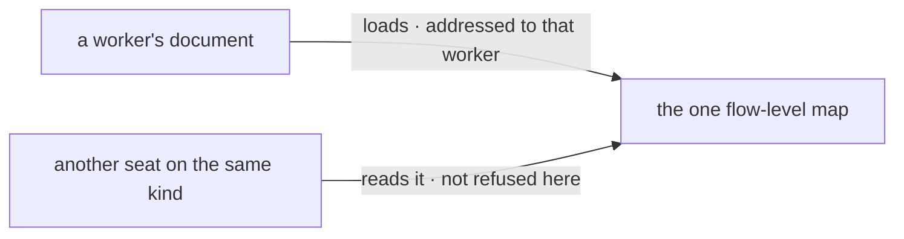

# FIX-1368 · Business rules

[Spec](SPEC.md) · [Decisions](DECISIONS.md) · **Rules** · [Plan](PLAN.md)

The cases, as rules: what a person or the tree does, and what happens. *Proved by* is the check
the plan runs. Every rule is about the **worker root only** — the org and team document roots keep
every rule they shipped with, and BR-14 is the check that says so.

Worker documents are read under two parents and every rule applies to both: a team's worker mints
`teams/<t>/workers/<w>/<name>`, an org worker mints `workers/<w>/<name>`, dropping `org/` as an
org document already does ([D4](DECISIONS.md#d4)).

## Reading the worker root

| # | When | Then | Proved by |
|---|---|---|---|
| BR-1 | A `<name>.md` sits in a worker's `resources/`, under either parent | One document, ref `teams/<t>/workers/<w>/<name>` or `workers/<w>/<name>`, frontmatter and body read exactly as at the other two levels | CI |
| BR-2 | A worker folder has no `resources/` folder | Silent. Not an error — most seats have no documents | CI |
| BR-3 | A team has no `workers/` folder at all | Silent, and the team's own `resources/` still reads | CI |
| BR-4 | The same bare name exists at org, team, and worker level | Three documents, three refs, none shadowing another. There is no precedence rule because there is no collision | CI |
| BR-5 | A worker folder holds a `resources/` folder and no `WORKER.md` | The documents load ([D3](DECISIONS.md#d3)). The roster read reports the missing seat, unchanged and separately | CI |
| BR-6 | A `resources/` folder sits directly in a `workers/` level — beside the worker folders, not inside one | Not a slot this convention claims. Passed over in silence. **`resources` is never a worker id**: no ref is minted from it and the walk never descends to `…/workers/resources/resources/` | CI |
| BR-17 | An org worker folder is a symlink, or `org/workers/` is there and cannot be listed | Reported once under its own path, `kind: "unreadable-slot"`, in the shared wording. `org/resources/` still loads | CI |

## When the tree is wrong

| # | When | Then | Proved by |
|---|---|---|---|
| BR-7 | A directory sits where a document file belongs in a worker's `resources/` | Reported, `kind: "folder-where-file-belongs"`, keyed by its path, in the team level's exact wording | CI |
| BR-8 | A worker's `resources/` folder is a symlink | Refused, `kind: "unreadable-slot"`, in the shared symlink wording. Never followed | CI |
| BR-9 | A worker *folder* is a symlink | Refused once, under the worker folder's path. Nothing beneath it is read | CI |
| BR-10 | A team's `workers/` folder is there and cannot be listed | Reported once under `teams/<t>/workers`. That team's worker documents are all missing; its team-level documents still load | CI |
| BR-11 | A worker folder name breaks the segment rules | Reported, `kind: "document-load-failed"`, naming the rule. The file is not read — an address that cannot be minted has nothing to key a record under | CI |
| BR-12 | A worker's document declares a derived setting, or `prefetchMode: "lazy"` | Refused, `kind: "refused-declaration"`, the same set and the same wording as the other two levels ([ER-4](https://github.com/fixpoint-labs/flow-state-dev/pull/1718)) | CI · the shared derived-key table |
| BR-13 | `.DS_Store` or a non-`.md` file sits in a worker's `resources/` | Passed over in silence | CI |

The roots before and after are one figure, canonical in [SPEC.md](SPEC.md). Its bottom strip is
the fence these rules stop at: every rule above is about which documents **load** and under which
address, none about which seat may **read** one.

## What must not move

| # | When | Then | Proved by |
|---|---|---|---|
| BR-14 | A tree with no worker-level `resources/` folder anywhere, **whose `workers/` levels and worker folders are readable and unsymlinked** | Byte-for-byte today: the same documents, the same order, the same errors | CI · the shipped reader suite, unmodified |
| BR-14a | That same tree, but a `workers/` level or a worker folder is symlinked or unlistable | One **new** report (BR-9, BR-10, BR-17) where today there is none. The documents and their order are still byte-for-byte | CI |
| BR-15 | A roster is hired from a tree that has worker documents | `hireWorkforce` behaves identically — no new key, no new option, no document in a seat's settings bag | CI |
| BR-16 | Documents are turned into a resource map | `resourcesFromDocs` is unchanged, and a worker document becomes an ordinary org-scoped entry keyed by its ref | CI |

## Failure taxonomy

Nothing here is fatal to a read. Every condition lands in the existing `errors` array under an
existing `kind` — no new kind, because there is no new *condition*, only new places the existing
five occur. `readResourcesDirectory` still throws for one reason only: the root itself is a
symlink or cannot be read. Why BR-14 is narrowed and BR-14a is its remainder:
[DECISIONS](DECISIONS.md).

## Acceptance criteria this issue owns

A tree with a `handbook` at the org level, a `handbook` in a team, a `runbook` in one worker of
that team and one in an org worker loads four documents under four refs with an empty `errors` —
and the same tree with the two worker documents deleted loads exactly what `main` loads today. No
goal check on a real model applies: nothing here reaches one, and the behaviour a model would
exercise (which seat may read which document) is the half this issue does not ship
([D2](DECISIONS.md#d2)).
