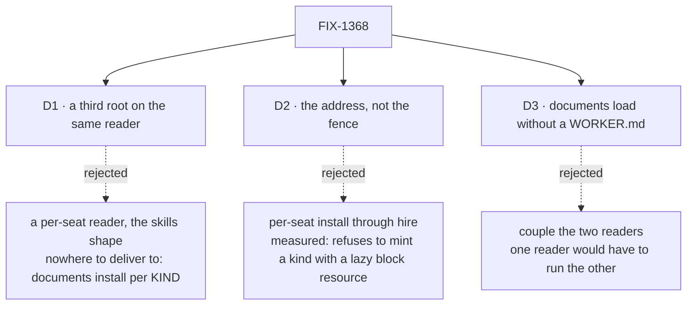

# FIX-1368 · Decisions

[Spec](SPEC.md) · **Decisions** · [Rules](BUSINESS-RULES.md) · [Plan](PLAN.md)

Three decisions. Two are settled and cheap; one is a live fork and is why this spec is worth ten
minutes.

## The tree

Solid edges are what you're signing. Dashed edges lost, and the label says why.

## D2 · This ships the address, not the fence — **live fork, not a ratified decision**

**The fork.** Does *worker-level resources* mean *this document is named as that worker's*, or
*this document is that worker's alone*?

**In plain terms.** An author drops a file in a worker's folder. Either it gets an address saying
whose it is, and a teammate seat on the same worker kind can still read it — or the framework
also stops anyone else reading it. Only the first is in this issue as written.

**The trade-off.** Naming is a day on one reader and closes a gap the tree already advertises.
Fencing means each seat gets its own document map at hire — and the probe on this branch shows
the obvious version of that **refuses to mint** any worker kind holding a block-declared lazy
resource, because a per-instance map *replaces* the flow's own and promotes block declarations to
flow level. Doing it safely means the hire step rebuilding the kind's own map from two pieces of
blueprint metadata: real machinery for a convention that today has **no consumer at all**, which
is what [ER-15](https://github.com/fixpoint-labs/flow-state-dev/pull/1718) already flags resources
for.

**My recommendation: ship the address, and say so out loud.** The architect guidance fences access
control to a later decision, the shipped docs teach the same thing one level up (*"the team folder
is a namespace, not a visibility boundary"*), and building enforcement before anything consumes
the convention is how this epic grew its tail. The honesty cost is paid in the docs.

**What would change my mind:** an author, or the pentest lab, putting something in a worker's
folder *because* they read it as private. That makes this a live defect, not an unfinished half.

**If wrong:** someone trusts a folder name and shares what they meant to keep to one seat. Small
blast radius today, growing every week a consumer exists. Reversible — but the reversal changes
how seats are minted, not one line.

| | |
|---|---|
| **Instead of** | Per-seat install: each seat's own documents merged into that seat's flow copy at hire |
| **Locks in** | "Worker-level" means *addressed as*, not *restricted to*, until access control ships. Every doc line about the folder has to say so, or the name lies |

## D1 · The shipped reader grows a third root; the ref is `teams/<team>/workers/<worker>/<name>`

| | |
|---|---|
| **Instead of** | A fourth reader keyed per seat — caller supplies a team and a worker, the way the skills reader does |
| **Because** | A per-seat read needs somewhere per-seat to deliver to, and there is none: documents install on a **flow definition**, and every seat hired into one kind is a copy of it. Skills have that landing place, a record field the mint reads; documents do not |
| **Locks in** | The ref is a storage-key namespace, public the moment an app has rows under it; renaming a worker folder moves those rows, as renaming a team already does. And the reader now walks two levels deeper than any other convention ([below](#the-extract)) |

**What would change my mind:** choosing the fence in [D2](#d2), which creates the landing place.

## D3 · A worker folder's documents load whether or not it holds a `WORKER.md`

| | |
|---|---|
| **Instead of** | Skipping, or reporting, a `resources/` folder in a worker slot with no seat file |
| **Because** | The readers here are deliberately independent — the channels reader does not consult the worker reader either. Coupling them makes the documents reader run the roster reader to answer a question about a file, and the missing seat is already reported by the reader whose job that is |
| **Locks in** | A typo'd worker folder yields documents under an address no seat is hired at. Harmless, and visible to any app checking both error channels |

## Decided, not asked

- **A directory inside a worker's `resources/`** is reported in the team level's exact wording.
- **Segment validation reuses the `Worker` and `Document` labels.** No new `SegmentLabel`.
- **The `org/` root is untouched** — there is no org-level worker to have documents.
- **Nothing above a `patch` changeset.**

## Where this sits relative to the loader extract (FIX-1389)

Recorded because [FIX-1389](https://github.com/fixpoint-labs/flow-state-dev/pull/1810)'s D1 rests
on it. **Its reading is right and its decision stands.** `workers/<name>/resources/` sits at
`teams/<teamId>/workers/<workerName>/resources/`, two levels below a team slot: a team-level
parameterised slot reader cannot express that, while a **team enumerator composes with it**,
because this reader walks all teams and all workers ([D1](#d1)).

Two riders. The enumerator covers the top two of a five-level walk here: the `workers/` slot open
and the worker-slot classify are this issue's own, already exist once in
`read-workforce-directory.ts`, and become a second copy the extract as scoped does not cover. And
its supporting sentence is contingent on [D2](#d2) — under the fence this becomes a per-seat
reader that never enumerates teams, joining the skills column of its figure rather than giving
the enumerator a caller. **The conclusion holds either way.**

## Considered and dropped

| Alternative | Why not |
|---|---|
| A fourth `member/` root | The atlas's "member resources" gap **is** this path. A second spelling of one level |
| Declare the document on `WORKER.md` or `WorkerConfig` | The epic's fence: `WorkerConfig` is hire admission; a document is declared by its file |
| A flat app-wide unique-name table | Isolation is the path everywhere in this tree, and the shipped ref form already answered it |
| A worker-scoped `ResourceScope` | Three scopes exist and none is a folder level. The team level proved the ref carries this |
| Wait for the pentest lab to ask | It is the first consumer of *any* of this; waiting argues against the two roots that shipped |

## Open

**1. Does *worker-level* mean named, or restricted?** *(Decides: the owner, with the Architect.
Blocks: the docs wording, and whether this issue stays small.)* In full: [D2](#d2).

## How it got here

- **Draft (Sep 17)** — measured before designing. The POC showed the third root is read by
  nothing *and reported by nothing*, that bare-name coexistence already works through the ref form
  alone, and that the obvious per-seat install refuses to mint a kind with a block-declared lazy
  resource. The last turned D2 from an assumption into a priced fork.
