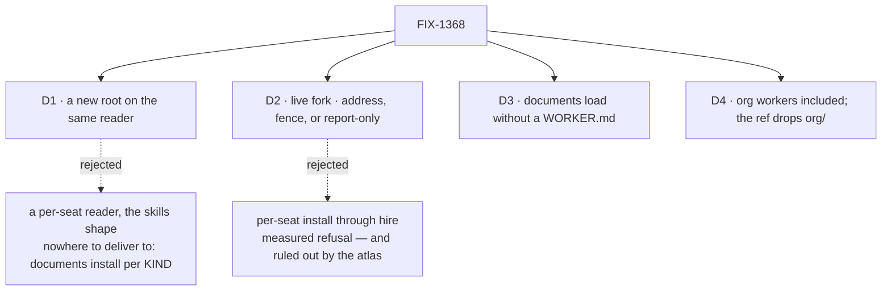

# FIX-1368 · Decisions

[Spec](SPEC.md) · **Decisions** · [Rules](BUSINESS-RULES.md) · [Plan](PLAN.md)

Four decisions. Three are settled and cheap; one is a live fork and is why this spec is worth ten
minutes.

## The tree

Solid edges are what you're signing. Dashed edges lost, and the label says why.

## D2 · Address, fence, or report-only — **a live fork, not a ratified decision**

**The fork.** Does *worker-level resources* mean *named as that worker's*, *that worker's alone*,
or neither — does this issue only end the silence?

**In plain terms.** An author drops a file in a worker's folder. Today it loads nowhere and is
reported nowhere. Three ways out:

| Arm | What ships | Cost |
|---|---|---|
| **Address** | The ref, the reader, one honesty line in the docs | A day on one reader. Closes the gap the tree advertises |
| **Fence** | Isolation as well — a sibling seat cannot read it | **Unpriced.** See the correction below |
| **Report-only** | An error naming the unread folder. No ref, no document | Near nothing. Ends the silence, spends none of the gap |

**A correction to this spec's own evidence.** The POC measured that per-seat install *refuses to
mint* a worker kind holding a block-declared lazy resource. That stands — but it prices an arm the
architecture had already killed: `docs/atlas/workforce.html` stamps this exact folder **PER KIND,
NOT PER SEAT**. The fence still live is flowIsolation over a per-kind install, which this spec has
**not priced**. The probe shows one wrong way to build the fence is costly, not that the fence is.

**The reviewers do not converge.**

| Who | Position |
|---|---|
| FSD Architect | Address. The access allowlist is fenced to [FIX-1381](https://linear.app/fixpoint-labs/issue/FIX-1381) / [D-11](https://github.com/fixpoint-labs/flow-state-dev/issues/1757) |
| Cursor | Address — smallest shape that solves it |
| Codex | **Keep the named gap** until an isolated landing path exists, or re-ratify the architecture out loud: the atlas stamps this folder NAMED GAP · PROVE flowIsolation FIRST |

The first two and the third answer different questions. The Architect fenced *access control*;
Codex disputes the *status of the gap* — that an address turns a stamped gap into a naming
convention while the tree still advertises worker-level ownership. That is unresolved.

**My recommendation: ship the address, and say so out loud.** The shipped docs teach this one
level up (*"the team folder is a namespace, not a visibility boundary"*), and building enforcement
before anything consumes the convention is how this epic grew its tail. **Report-only is the
honest second** if the atlas stamp binds literally: near-zero cost, and it spends nothing.

**Changes my mind:** an author or the pentest lab putting something in a worker's folder *because*
they read it as private — or a ruling that the atlas stamp binds until flowIsolation ships. The
second is Codex's point and the owner's call, not mine.

**If wrong:** someone trusts a folder name and shares what they meant to keep to one seat. Small
blast radius today, growing every week a consumer exists. Reversible — but the reversal changes
how seats are minted, not one line.

**Locks in (address arm):** "worker-level" means *addressed as*, not *restricted to*, until access
control ships, and every doc line must say so or the name lies.

## D1 · The shipped reader grows a worker root; the ref is `teams/<t>/workers/<w>/<name>`

| | |
|---|---|
| **Instead of** | A fourth reader keyed per seat, the way the skills reader is |
| **Because** | A per-seat read needs somewhere per-seat to deliver to, and there is none: documents install on a **flow definition**, and every seat of a kind is a copy of it. Skills have that landing place; documents do not |
| **Locks in** | The ref is a storage-key namespace, public once an app has rows under it. Renaming a worker folder moves those rows, as renaming a team already does |

**Changes my mind:** the fence in [D2](#d2), which creates the landing place.

## D3 · A worker folder's documents load whether or not it holds a `WORKER.md`

| | |
|---|---|
| **Instead of** | Skipping, or reporting, a `resources/` folder in a worker slot with no seat file |
| **Because** | These readers are deliberately independent — the channels reader does not consult the worker reader either. Coupling them makes the documents reader run the roster reader to answer a question about a file, and the missing seat is already reported by the reader whose job it is |
| **Locks in** | A typo'd folder yields documents at an address no seat is hired at. Harmless, and visible to any app checking both error channels |

## D4 · Org workers are in, and their ref drops `org/`

`workforce/org/{resources,skills,channels,workers}/` is the locked W3 tree, so org workers exist —
rare shared-infra seats. Their `resources/` join this walk, ref `workers/<w>/<name>`.

**The collision test does not fire.** Against shipped code: `mintResourceRef` returns a bare
`<name>` at org level and `teams/<t>/<name>` for a team, and `SEGMENT_PATTERN`
(`/^[a-z0-9]+(?:-[a-z0-9]+)*$/`) admits neither `/` nor `.`. A `workers/` first segment cannot be
confused with a `teams/` one or with a single-segment org name.

**Locks in — the uncomfortable half.** `readWorkforceDirectory` passes over an org-level
`workers/` *in silence*, and `mintWorkerId` requires a team (`<teamId>.<workerName>`). An org
worker has **no seat and no id today**, so its documents load at an address nothing can be hired
at: [D3](#d3)'s consequence one level up, and a larger gap than this issue closes. Follow-up in
[PLAN.md](PLAN.md), not fixed here.

## Decided, not asked

- **A directory inside a worker's `resources/`** is reported in the team level's exact wording.
- **Segment validation reuses the `Worker` and `Document` labels.** No new `SegmentLabel`.
- **[BR-14](BUSINESS-RULES.md) is narrowed, not the error contract.** A refused folder is refused
  *unopened*, so the reader cannot know whether it held documents; reporting a broken `workers/`
  level must be unconditional. The byte-for-byte promise covers trees whose new levels are healthy
  or absent, at both parents.
- **Nothing above a `patch` changeset.**

## Where this sits relative to the loader extract (FIX-1389)

[FIX-1389](https://github.com/fixpoint-labs/flow-state-dev/pull/1810)'s D1 rests on this path:
**its reading is right and its decision stands.** Two riders — its enumerator covers only the top
two of five levels here, so the `workers/` open and classify stay this issue's own; and under
[D2](#d2)'s fence this becomes a per-seat reader that never enumerates teams. Conclusion holds
either way.

## Considered and dropped

| Alternative | Why not |
|---|---|
| A fourth `member/` root | The atlas's "member resources" gap **is** this path |
| Declare it on `WORKER.md` or `WorkerConfig` | The epic's fence: `WorkerConfig` is hire admission; a document is declared by its file |
| A flat app-wide unique-name table, or a worker-scoped `ResourceScope` | The shipped ref form already answered naming, and no scope is a folder level |
| Wait for the pentest lab to ask | It is the first consumer of *any* of this; waiting argues against the two roots that shipped |

## Open

**1. Address, fence, or report-only?** *(Decides: the owner, with the Architect. Blocks: the docs
wording, and whether this issue stays small.)* Reviewers split two-to-one for the address; the
atlas conflict Codex raises is not answered by the Architect's deferral. In full: [D2](#d2).

## How it got here

- **Draft (Sep 17)** — measured before designing; the POC's findings are in [D2](#d2).
- **Review round 1** — the atlas's **PER KIND, NOT PER SEAT** stamp corroborated the probe's last
  finding independently, and in the same stroke showed it had priced an already-dead arm. D2 gained
  a third arm and an honest split of positions; the org-worker premise became [D4](#d4).
