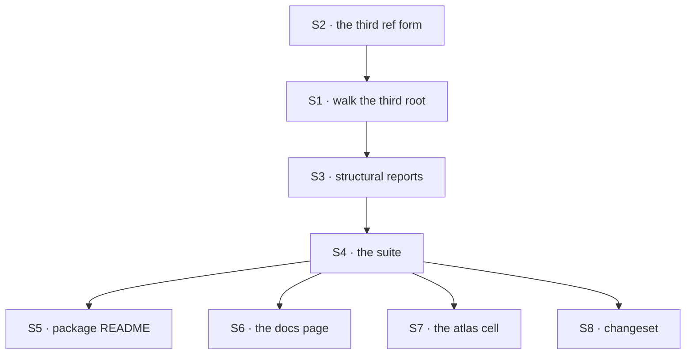

# FIX-1368 · Plan

[Spec](SPEC.md) · [Decisions](DECISIONS.md) · [Rules](BUSINESS-RULES.md) · **Plan**

Written for the implementing agent. IDs cross-reference [BUSINESS-RULES.md](BUSINESS-RULES.md)
(BR-n) and [DECISIONS.md](DECISIONS.md) (D-n). `tdd`. One PR.

## Surfaces

| ID | Package · role | Change | Rules |
|---|---|---|---|
| S1 | `workforce` · the resources reader | One worker walk — open a `workers/` slot, classify each entry, read a `resources/` slot inside each — called under `org/` and under every team (D4). Calls the slot reader already there; the leaf loop does not change | BR-1 BR-2 BR-3 BR-6 BR-7 BR-8 BR-12 BR-13 |
| S2 | `workforce` · the reader's ref helper | Two more forms in the one existing helper, with `Worker` validated alongside `Team` and `Document` (D1, D4) | BR-4 BR-11 |
| S3 | `workforce` · the reader's structural reports | Each new level reports under its own path with the existing `unreadable-slot` kind and shared wordings, under both parents. **No new error kind** | BR-9 BR-10 BR-17 |
| S4 | `workforce` · the reader's suite | Every rule above, each bad case planted in a tree that also holds a healthy worker and team document | all |
| S5 | Docs · `packages/workforce/README.md` | The new roots in the tree, the new ref forms, and the *namespace, not a visibility boundary* paragraph extended one level deeper (D2) | BR-14 BR-16 |
| S6 | Docs · `apps/docs/docs/workforce/documents-on-disk.md` | The same edits, plus the closing list — *"it does not read a team's `workers/` folder"* is now wrong | — |
| S7 | Docs · `docs/atlas/workforce.html` | The `workers/<name>/resources/` cell stops reading NAMED GAP | — |
| S8 | `.changeset/*.md` | One `patch` for `@flow-state-dev/workforce` | — |

**S2 takes a third parameter, not an overload:** `mintResourceRef(teamId, workerName, name)`, both
optional — the four combinations are exactly the four refs, so no call site picks between shapes.

Nothing is removed, and nothing in `src/` outside `read-resources-directory.ts` is edited. A diff
touching `hire.ts`, `manifest.ts` or `resources-from-docs.ts` has left the plan (BR-15, BR-16).

## Sequence



## Checks

| ID | Runs after | Passes when |
|---|---|---|
| V1 | S2 | BR-4, BR-11 — a `handbook` at all four levels coexists; a worker folder breaking the segment rules reports without its file being read |
| V2 | S1 | BR-1, BR-2, BR-3, BR-13 — the happy path under both parents, and the silences |
| V3 | S1 | **BR-6 · the trap.** `workers/resources/` mints nothing and is not descended into, under both parents |
| V4 | S1 | BR-7, BR-8, BR-12 — leaf conditions read identically at the new levels, asserted against the **same wording constants**, never re-typed strings |
| V5 | S3 | BR-9, BR-10, BR-17 — each reported once under its own path, a healthy sibling document surviving |
| V6 | S1 | BR-5 — documents load from a `WORKER.md`-less folder; the roster report is unchanged (D3) |
| V7 | — | BR-14, BR-15, BR-16 — **the second path.** The shipped reader suite, `hire.test.ts` and `resources-from-docs.test.ts` pass unmodified; a healthy tree with no worker documents is byte-identical |
| V8 | S3 | **BR-14a** — that tree with a symlinked worker folder gains exactly one report, loses no document |
| V9 | S5 S6 | Every code block in the two docs pages runs as written |

**No goal check on a real model**, stated rather than skipped: nothing here reaches one, and the
behaviour a model would exercise is [D2](DECISIONS.md#d2)'s deferred half.

## Pinned names · the only one

**The two ref forms**, `teams/<t>/workers/<w>/<name>` and `workers/<w>/<name>` — public storage-key
namespaces and accessor keys, path-joined for the reason the team form is. Everything else is
yours, including whether the worker walk is a helper or an inline loop.

## Guardrails

| Rule | Because |
|---|---|
| Every wording at the new levels comes from the constant the other levels use (tenet 5) | Copies of one refusal are the drift the loader extract exists to end, and this reader is where they would land |
| No new `ResourceDocErrorKind` | New *places* the five conditions occur, not a sixth condition. A new kind makes callers branch on where a document sat |
| The org and team **document** slots keep their code path (BP-030) | BR-14 is a byte-for-byte promise |
| One worker walk, called twice — not two copies | `org/` and `teams/<t>/` differ only in the team id passed to the minter (D4) |
| A worker folder is classified before it is listed, and a symlink refused at every new level (BP-031) | Each new level is a place a link could take the read outside the configured root |
| The reader still does not read `WORKER.md` | D3. The moment it does, one reader runs another's job |

## Docs

Which files and which sections: S5–S7 above. **No new page.** The risks those edits carry:

- **Never write "private to that worker"** in either README or docs page. It is not, under the
  address arm — that sentence is the one [D2](DECISIONS.md#d2) makes a lie.
- **`documents-on-disk.md` is user-facing** — no issue ids, no history of the gap.
- **The atlas cell is internal** and may say what changed. Under the address arm it stops reading
  NAMED GAP; under report-only it does not move at all.

## Sketch · pseudocode, illustrative, react to the shape

```
readResourcesDirectory(root):
    read org/resources slot                   ← unchanged
    walkWorkers(org, teamId = undefined)      ← new (D4)
    for each team folder (unchanged loop):
        read the team's resources slot        ← unchanged
        walkWorkers(teamDir, teamId)          ← new

walkWorkers(parentDir, teamId):
    open parentDir/workers                    ← structural, may be absent
    for each entry in it:
        classify it; a file is not a worker slot, so skip in silence
        SKIP the name "resources" here — BR-6: it is a sibling of the worker
            folders, never a worker id. Descending would read
            .../workers/resources/resources/ and mint a ref from it
        read that worker folder's resources slot, minting refs via
            mintResourceRef(teamId, workerName, name)
```

**The BR-6 guard is the line an implementer will miss.** The workforce reader classifies every
directory under `workers/` as a worker folder; this one must not.

The leaf — what a document file is, what a directory in the slot means, which keys are refused —
is the helper that already exists, called with a new ref minter. That is the whole shape.

**POC:** `pnpm tsx spec-poc/FIX-1368-third-root/probe.mts` — four probes against shipped code on
this branch. What it showed, and the correction round 1 made to what P4 proves, are in
[DECISIONS · D2](DECISIONS.md#d2); not restated here.

## At implement time

- **Re-read [D2](DECISIONS.md#d2)'s answer first.** Under the fence this plan is wrong at S1 — the
  reader becomes per-seat and the surfaces move into `readWorkforce`/`hireWorkforce`. Under
  report-only, S2 and the ref disappear entirely and only S3 survives.
- **[FIX-1389](https://github.com/fixpoint-labs/flow-state-dev/pull/1810) may have landed.** If
  its `openRoot` and `forEachTeam` exist, S1 consumes them for the top two levels. If not, extract
  nothing ([ER-10](https://github.com/fixpoint-labs/flow-state-dev/pull/1718)).
- **The `workers/` open and worker classify already exist verbatim** in
  `read-workforce-directory.ts` — copy the behaviour, share the wordings, file the follow-up below.
- **[FIX-1357](https://github.com/fixpoint-labs/flow-state-dev/pull/1804)** may have republished
  the loader primitives from a new subpath.

## Notes from review · round 1

Below the bar to fold, kept for the implementer:

- **Boot may walk `teams/` → `workers/` twice** when the resource and roster readers both run
  (Cursor). Inherent until a shared enumerator exists; FIX-1389's business, not this issue's.
- **P4's `as unknown as` casts re-prove what `prefetch-mode.test.ts` covers** (Cursor). Left as
  is deliberately: the probe already ran and produced D2's pricing, and editing a throwaway after
  it has given its evidence buys nothing.

## Follow-ups

- **The worker-slot walk will exist twice** once this lands, and FIX-1389's extract stops at the
  team folder. Flag it there rather than filing a new issue — same duplication, one level down.
- **Access control for documents**, if [D2](DECISIONS.md#d2) defers it: a ticket of its own the
  moment a consumer exists.
- **Org workers cannot be hired at all.** `readWorkforceDirectory` skips `org/workers/` in silence
  and `mintWorkerId` requires a team, so [D4](DECISIONS.md#d4) gives org workers documents at an
  address no seat answers to. File it: the roster half of the same gap, and larger than this issue.
